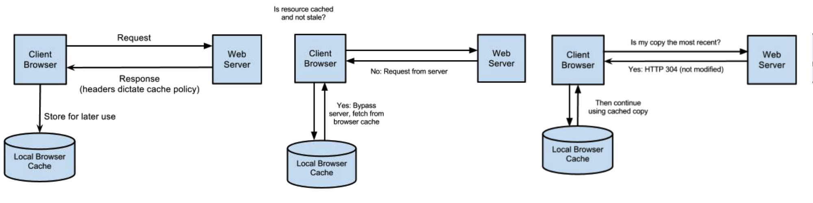
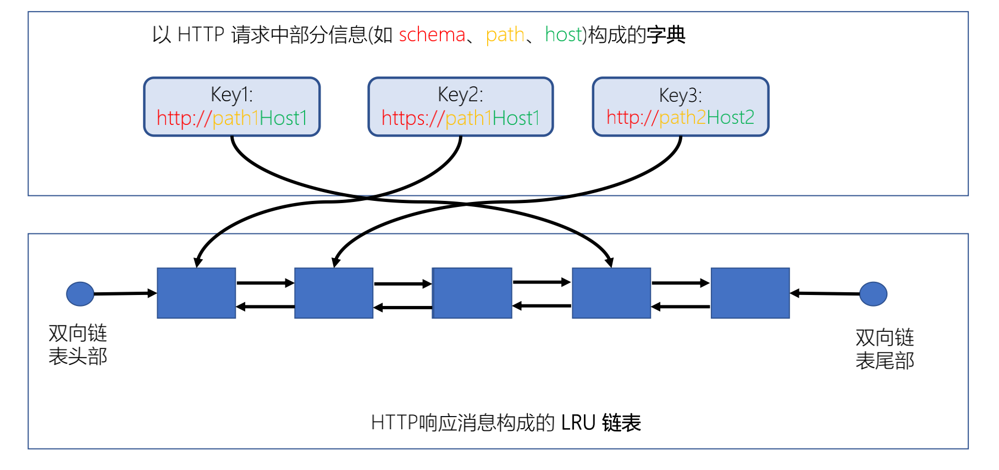
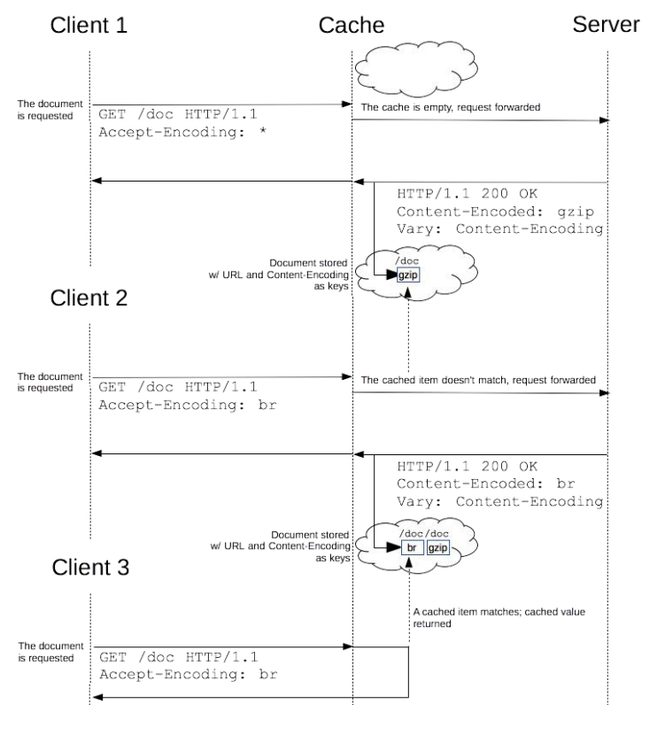
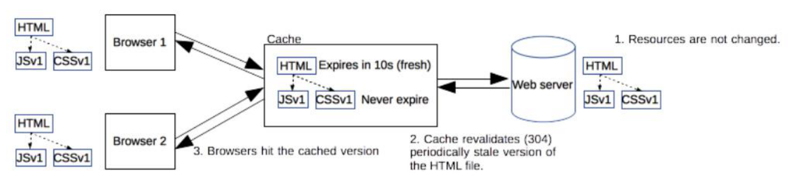

## 缓存

-----

`Web`缓存是指一个`Web`资源（如`html`页面，图片，`js`，数据等）存在于`Web`服务器和客户端（浏览器）之间的副本。缓存会根据进来的请求保存输出内容的副本；当下一个请求来到的时候，如果是相同的`URL`，缓存会根据缓存机制决定是直接使用副本响应访问请求，还是向源服务器再次发送请求。比较常见的就是浏览器会缓存访问过网站的网页，当再次访问这个`URL`地址的时候，如果网页没有更新，就不会再次下载网页，而是直接使用本地缓存的网页。只有当网站明确标识资源已经更新，浏览器才会再次下载网页。

如上图所示，当对某资源进行缓存之后，再次发起请求，那么会先校验缓存资源是否过期。如果没过期则继续使用缓存，如果缓存已经过期，那就从 `web server` 验证内容是否改变，如果 `304` 没更新则继续使用。

#### 缓存的作用

+ 减少网络带宽消耗（当 `Web` 缓存副本被使用时，只会产生极小的网络流量，可以有效的降低运营成本。）
+ 降低服务器压力（给网络资源设定有效期之后，用户可以重复使用本地的缓存，减少对源服务器的请求，间接降低服务器的压力。）
+ 减少网络延迟，加开页面打开速度。

#### 缓存的分类

`web` 缓存一般分为私有缓存与共享缓存：

+ 私有缓存：仅供一个用户使用的缓存，通常只存在于如浏览器这样的客户端上。
+ 共享缓存：可以供多个用户的缓存，存在于网络中负责转发消息的代理服务器（对热点资源常使用共享缓存，以减轻源服务器的压力，并提升网络效率） ，代理又分为正向代理和反向代理。
  - `Authentication` 响应不可被代理服务器缓存。

**私有缓存**

私有缓存包含浏览器缓存和应用层缓存两种：

+ 浏览器缓存：`Browser Caching` 是浏览器端保存数据用于快速读取或避免重复资源请求的优化机制，有效的缓存使用可以避免重复的网络请求和浏览器快速地读取本地数据，整体上加速网页展示给用户。
+ 应用层缓存：指的是从代码层面上，通过代码逻辑和缓存策略，实现对数据，页面，图片等资源的缓存，可以根据实际情况选择将数据存在文件系统或者内存中，减少数据库查询或者读写瓶颈，提高响应效率。

**共享缓存**

+ 代理服务器缓存：代理服务器是浏览器和源服务器之间的中间服务器，浏览器先向这个中间服务器发起`Web`请求，经过处理后（比如权限验证，缓存匹配等），再将请求转发到源服务器。代理服务器缓存的运作原理跟浏览器的运作原理差不多，只是规模更大。可以把它理解为一个共享缓存，不只为一个用户服务，一般为大量用户提供服务，因此在减少相应时间和带宽使用方面很有效，同一个副本会被重用多次。常见代理服务器缓存解决方案有`Squid`等，这里不再详述。
+ `CDN`缓存：`CDN(Content delivery networks)`缓存，也叫网关缓存、反向代理缓存。`CDN` 缓存一般是由网站管理员自己部署，为了让他们的网站更容易扩展并获得更好的性能。浏览器先向 `CDN` 网关发起`Web` 请求，网关服务器后面对应着一台或多台负载均衡源服务器，会根据它们的负载请求，动态将请求转发到合适的源服务器上。虽然这种架构负载均衡源服务器之间的缓存没法共享，但却拥有更好的处扩展性。从浏览器角度来看，整个 `CDN` 就是一个源服务器。

## 缓存的实现

--------

`http` 缓存一般由两个数据结构组成，一个是由 `http` 请求中部分信息作为索引组成的字典，有多重实现方式。比如 `nginx` 的实现方式是一个 `map` + 红黑树，同时每个索引指向一个 `lru` 双向链表的节点，节点中存储的就是完整的 `http` 响应消息。当缓存空间满时，新的缓存内容会淘汰掉最近没有访问的内容。

## 缓存条件

------

#### 资源缓存条件

一个资源想要被共享服务器或者浏览器缓存，首先请求方法要可以被缓存理解（不只于 `GET` 方法） ，同时响应码也要可以被缓存理解（`404`、`206` 也可以被缓存）。

对于头部，响应与请求的头部必须没有指明 `no-store`，同时响应中至少应含有以下头部中的 1 个或者多个： `Expires、max-age、s-maxage、public`，当响应中没有明确指示过期时间的头部时，如果响应码非常明确，也可以缓存。

如果缓存在共享服务器上还需要遵循这两个条件：

+ 不含有 `private`
+ 不含有 `Authorization`

#### 缓存响应条件

共享缓存或者本地缓存想要作为响应的时候，需要判断的条件有很多：

+ 首先 `URI` 要是匹配的，URI 作为主要的缓存关键字，当一个 `URI` 同时对应多份缓存时，选择日期最近的缓存。

+ 缓存中的响应允许当前请求的方法使用缓存。

+ 缓存中的响应 `Vary` 头部指定的头部必须与请求中的头部相匹配：

  

  > `Vary = “*” / 1#field-name` (`Vary: *` 意味着一定匹配失败)

+ 当前请求以及缓存中的响应都不包含 `no-cache` 头部（`Pragma: no-cache` 或者 `Cache-Control: no-cache`）

+ 缓存中的响应必须是以下三者之一： 

  - 新鲜的（时间上未过期） 
  - 缓存中的响应头部明确告知可以使用过期的响应（如 `Cache-Control: max-stale=60`） 
  - 使用条件请求去服务器端验证请求是否过期，得到 `304` 响应 

## 缓存新鲜度计算

------

当缓存过期的时候浏览器就需要再去服务器拉取内容，判断缓存是否过期需要通过这个公式 `response_is_fresh = (freshness_lifetime > current_age) `

#### freshness_lifetime

`freshness_lifetime` 指的就是缓存的保质期，可以从四个地方取到，按以下优先级排列 `s-maxage` > `max-age` > `Expires` > `预估过期时间 `：

+ `s-maxage`：`Cache-Control: s-maxage=3600`
+ `maxage`：`Cache-Control: max-age=86400`
+ `Expires`：`Expires = HTTP-date` 指明缓存的绝对过期时间，例如 `Expires: Fri, 03 May 2019 03:15:20 GMT`

**预估缓存时间**

由于服务器缺陷，上面三个值有很大概率不被服务器设置，这样就有可能取到错误的缓存内容。预估缓存时间由浏览器自己计算，如果上面三个值都没有被设置，那么就使用预估过期时间，下面是 `RFC7234` 推荐的预估缓存时间，几乎所有主流浏览器都遵循了这个规定：

+ `(DownloadTime– LastModified)*10`

#### current_age

`current_age` 指的是缓存的实际存储时间，其计算方式十分复杂：`current_age = corrected_initial_age + resident_time;`：

+ `resident_time`：`resident_time = now - response_time`(接收到响应的时间)，浏览器开始处理资源的时间 - 共享服务器返回资源请求的时间
+ `corrected_initial_age = max(apparent_age, corrected_age_value)`; 
  - `corrected_age_value = age_value + response_delay`：指的就是共享服务器设置的 `age` 头部值 + 请求到达共享服务器并且返回到浏览器花费的时间。
    - `response_delay = response_time - request_time(发起请求的时间)`
  - `apparent_age = max(0, response_time - date_value)`：指的是请求返回浏览器的时间点 - 服务器接收到请求的时间点，由于二者时钟可能不同，所以要取最大值。

**age头**

`Age` 表示自源服务器发出响应（或者验证过期缓存），到使用缓存的响应发出时经过的秒数，对于代理服务器管理的共享缓存，客户端可以根据 `Age` 头部判断缓存时间。

+ `Age = delta-seconds`

## Cache-Control 头部

-------

`Cache-Control` 用于告知缓存保质期，表达式如下：

+ `Cache-Control = 1#cache-directive`：由一个或多个 `cache-directive` 组成。
  - `cache-directive` = `token` *[ "=" ( token / quoted-string ) ]*，对于设置的时间戳 `RFC` 规范中的要求是，至少能支持到 `2147483648 (2^31) `。

`Cache-Control` 头部的使用非常复杂，在请求和响应中有很多不同的值。

#### 请求 `Cache-Control`

请求中的头部有：`max-age`、`max-stale`、`min-fresh`、`no-cache`、`no-store`、`no-transform`、`only-if-cached` ：

+ `max-age=digit`：告诉服务器，客户端不会接受 `Age` 超出 `max-age` 秒的缓存，超出的时间的缓存代理就直接去源服务器取值。
+ `max-stale=digit`：告诉服务器，即使缓存不再新鲜，但陈旧秒数没有超出 `max-stale` 时，客户端仍 打算使用。若 `max-stale` 后没有值，则表示无论过期多久客户端都可使用。
+ `min-fresh=digit`：告诉服务器，`Age` 至少经过 `min-fresh` 秒后缓存才可使用。
+ `no-cache`：告诉服务器，不能直接使用已有缓存作为响应返回，除非带着缓存条件到上游服务端得到 `304` 验证返回码才可使用现有缓存 。
+ `no-store`：告诉各代理服务器不要对该请求的响应缓存（实际有不少不遵守该规定的代理服务器） 。
+ `no-transform`：告诉代理服务器不要修改消息包体的内容 。
+ `only-if-cached`：告诉服务器仅能返回缓存的响应，否则若没有缓存则返回 `504` 错误码

#### 响应 `Cache-Control`

响应中的头部： `max-age`、`s-maxage` 、 `must-revalidate` 、`proxy-revalidate` 、`no-cache`、`no-store`、`no-transform`、`public`、`private`:

+ `max-age=digit`：告诉客户端缓存 `Age` 超出 `max-age` 秒后则缓存过期
+ `s-maxage=digit`：与 `max-age` 相似，但仅针对共享缓存，且优先级高于 `max-age` 和 `Expires`

+ `must-revalidate`：告诉客户端一旦缓存过期，必须向服务器验证后才可使用 
+ `proxy-revalidate`：与 `must-revalidate` 类似，但它仅对代理服务器的共享缓存有效
+ `no-cache`：告诉客户端不能直接使用缓存的响应，使用前必须在源服务器验证得到 `304` 返回码。如果 `no-cache` 后指定头部，则若客户端的后续请求及响应中不含有这些头则可直接使用缓存 
+ `public`：表示无论私有缓存或者共享缓存，皆可将该响应缓存 `private`：表示该响应不能被代理服务器作为共享缓存使用。若 `private` 后指定头部，则在告诉代理服务器不能缓存指定的头部，但可缓存其他部分 
+ `no-store`：告诉所有下游节点不能对响应进行缓存 
+ `no-transform`：告诉代理服务器不能修改消息包体的内容

## 常见缓存策略

------

现在主流的缓存策略就是将 `HTML` 文件的过期时间设置的非常短，频繁的去服务器进行 `304` 验证和重新拉取。而 `html` 中包含的静态资源在打包的时候以文件指纹的方式命名，一旦资源发生更新，`html` 中引用的连接的会发生更新，然后浏览器请求的就是不同的资源 `uri`，就不会命中缓存。