## 条件请求

------

条件请求 `Preconditon` 指的是由客户端携带条件判断信息，而服务器预执行条件验证过程成功后，再返回资源的表述。

**常见应用场景**

+ 使缓存的更新更有效率，过期但是没有改变的内容返回 `304` 响应码使服务器不用传递包体；
+ 断点续传时对之前内容的验证；
+ 当多个客户端并行修改同一资源时，防止某一客户端的更新被错误丢弃；

#### 条件请求头部

**`If-Match` 请求头部**

`If-Match` 表示如果 `Etag` 标签匹配了就继续请求获取资源，格式为：`If-Match = "*" / 1#entity-tag`

**`If-None-Match` 请求头部**

`If-None-Match` 表示如果 `Etag` 标签不匹配就继续请求获取资源，格式为：`If-None-Match = "*" / 1#entity-tag`

**`If-Modified-Since` 请求头部**

`If-Modified-Since` 表示如果对应资源更新时间晚于上次返回的 `Last-Modified`(从缓存中取出)就继续请求获取资源，格式为 `If-Modified-Since = HTTP-date`

**`If-Unmodified-Since` 请求头部**

`If-Unmodified-Since` 表示如果对应资源更新时间不晚于上次返回的 `Last-Modified`就继续请求获取资源，格式为 `If-Unmodified-Since = HTTP-date`

**`If-Range` 请求头部**

当字段值中的条件得到满足时，**`Range`** 头字段才会起作用，同时服务器回复[`206`]部分内容状态码，以及**`Range`** 头字段请求的相应部分；如果字段值中的条件没有得到满足，服务器将会返回 [`200`] `OK` 状态码，并返回完整的请求资源。格式为 `If-Range = entity-tag / HTTP-date`。

## 校验器

-------

验证器 `validator`：服务端校验器根据客户端请求中携带的相关头部，以及服务器资源的信息，执行两端的资源验证。

+ 强验证器：服务器上的资源表述只要有变动（例如版本更新或者元数据更新），那么以旧的验证头部访问一定会导致验证不过；
+ 弱验证器：服务器上资源变动时，允许一定程度上仍然可以验证通过（例如一小段时间内仍然允许缓存有效）；

#### 验证器响应头部

**`Etag` 响应头部**

`Etag` 头部给出当前资源表述的标签，格式为：`ETag = entity-tag `:

+ `entity-tag` = *[ weak ]* `opaque-tag`
  - `weak` = `%x57.2F`  (W/)
  - `opaque-tag` = `DQUOTE *etagc DQUOTE` ("etage")
    + `etagc = %x21 / %x23-7E / obs-text `
+ 强验证器 `ETag:"xyzzy"`
+ 弱验证器 `ETag:W/"xyzzy"`

**`Last-Modified` 响应头部** 

`Last-Modified` 表示对应资源表述的上次修改时间，定义为：`Last-Modified = HTTP-date`：

+ `HTTP-data`：表示响应包体生成的时间。

## 应用场景

-----

#### 缓存更新

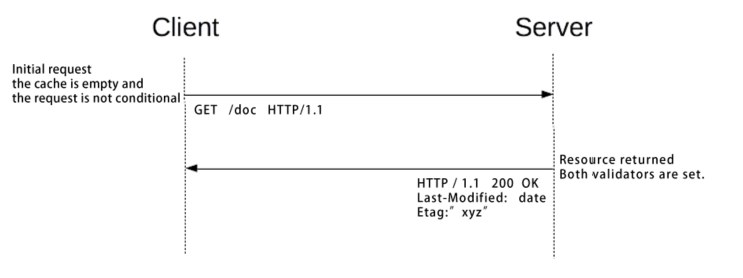

客户端首次请求资源的时候，资源服务器会返回资源的 `Etag` 和最后更新时间。

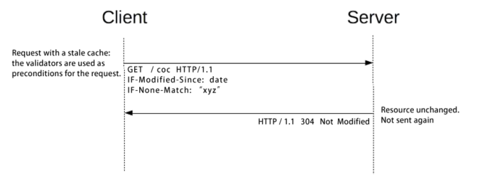

客户端再次请求资源的时候，如果条件请求不满足，服务端就会返回 `304` 表示资源没有更改。

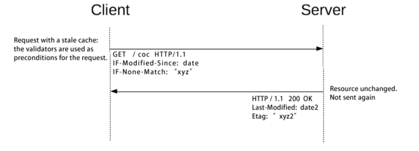

客户端再次请求资源的时候，如果条件请求满足，服务端就会返回新的资源以及其校验器。

#### 断点续传

断点续传的时候如果资源更新了，这个时候就需要返回新的资源，其流程如下：

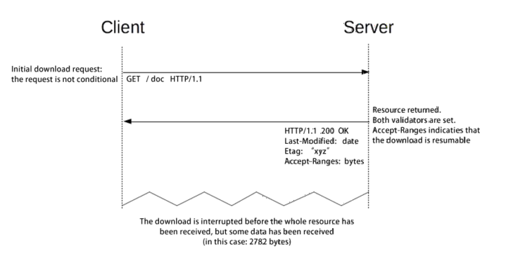

当服务器支持 `Range` 服务时，连接意外中断时已接收到部分数据。

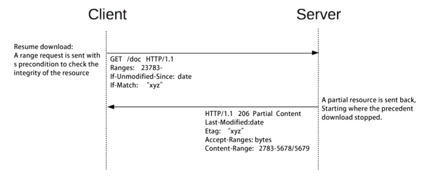

通过 `Range` 请求下载其他包体时，加入验证器防止两次下载间资源已发生了变更。

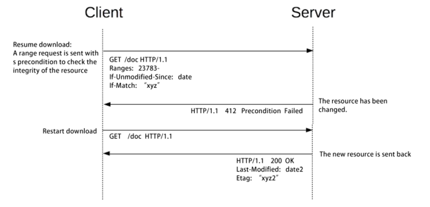

如果两次下载操作中，资源已经更改，则服务器用 `412` 通知客户端，而客户端重新下载完整包体。

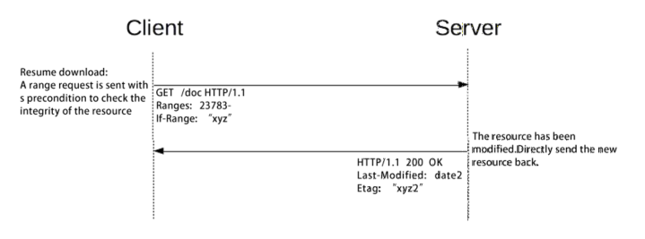

通过 `If-Range` 头部可以避免 `2` 次请求交互带来的损耗。

#### 更新丢失

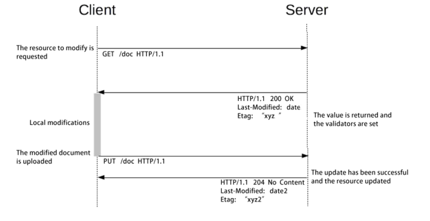

更新资源意味着 `2` 步操作：先获取资源，再把本地修改后的资源提交。

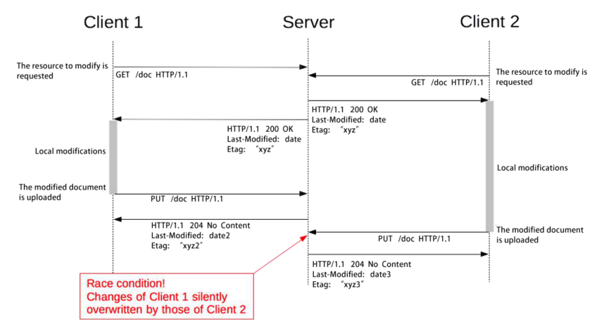

`2` 个客户端并发修改同一资源会导致更新丢失。

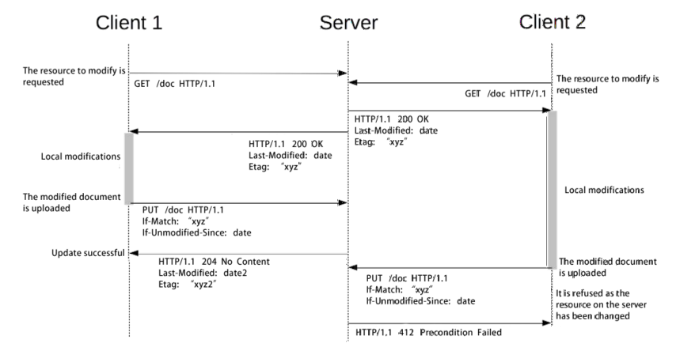

只允许第 `1` 个提交更新的客户端更新资源，第二个不匹配将返回 `412`。

#### Nginx

`nginx` 条件请求策略：

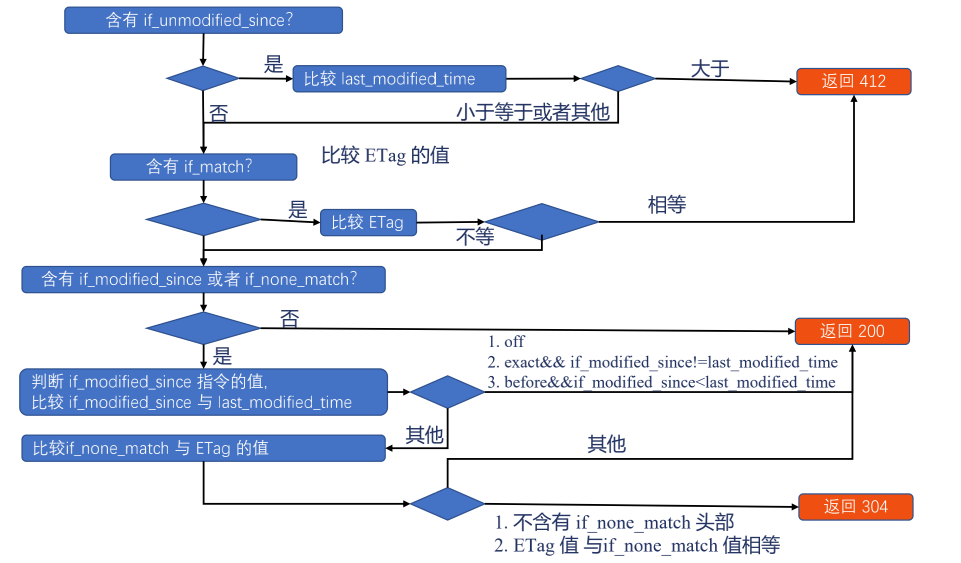

