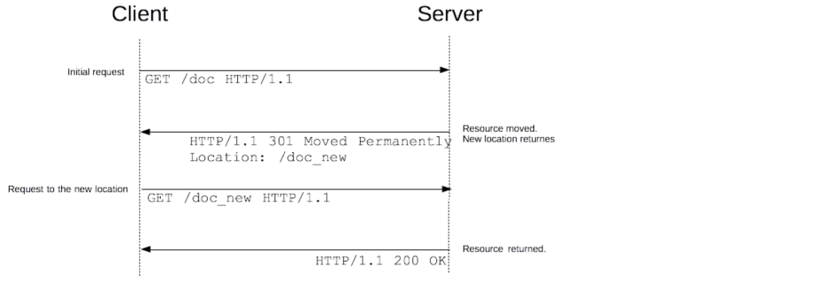

## URI 重定向

-----

当浏览器接收到重定向响应码时，需要读取响应头部 `Location` 头部的值，获取到新的 `URI` 再跳转访问该页面。

#### 重定向场景

+ 提交 `FORM` 表单成功后需要显示内容页，但是不想由前端控制。
+ 站点从 `HTTP` 迁移到 `HTTPS`，访问老旧站点想主动跳转到新站点。
+ 站点部分 `URI` 发生了变化，但搜索引擎或者流量入口站点只收录了老的 `URI`。
+ 站点正在维护中，需要给用户展示不一样的内容。
+ 站点更换了新域名。

#### Location 头

`Location` 指定重定向之后跳转的新网站，该头部格式为 `Location = URI-reference`

+ `URI-reference` = `URI / relative-ref`
  - `relative-ref` = `relative-part [ "?" query ] [ "#" fragment ]`

#### 重定向响应码 

接收到重定向响应码的请求这里称为原请求，浏览器接收到重定向响应码后，会根据 `Location` 发起新的重定向请求，重定向会分为临时重定向和永久重定向。

**永久重定向**：

表示资源永久性变更到新的 `URI`。

+ `301 (HTTP/1.0)`：重定向请求*通常*（由于历史原因一些浏览器会把 `POST` 改为 `GET`）会使用 `GET` 方法，而不管原请求究竟采用的是什么方法。
+ `308 (HTTP/1.1)`：重定向请求必须使用原请求的方法和包体发起访问。

**临时重定向**

表示资源只是临时的变更 `URI`

+ `302 (HTTP/1.0)`：重定向请求**通常**会使用 `GET` 方法，而不管原请求究竟采用的是什么方法。
+ `303 (HTTP/1.1)`：它并不表示资源变迁，而是用新 `URI` 的响应表述而为原请求服务，重定向请求会使用 GET 方法。
  - 例如表单提交后向用户返回新内容（亦可防止重复提交） 

+ `307 (HTTP/1.1)`：重定向请求必须使用原请求的方法和包体发起访问。

**特殊重定向** 

+ `300`：响应式内容协商中，告知客户端有多种资源表述，要求客户端选择一种自认为合适的表述。
+ `304`：服务器端验证过期缓存有效后，要求客户端使用该缓存。

#### 重定向循环

服务器端在生成 `Location` 重定向 `URI` 时，在同一条路径上使用了之前的 `URI`，导致无限循环出现。

- `Chrome` 浏览器会提示：`ERR_TOO_MANY_REDIRECTS`