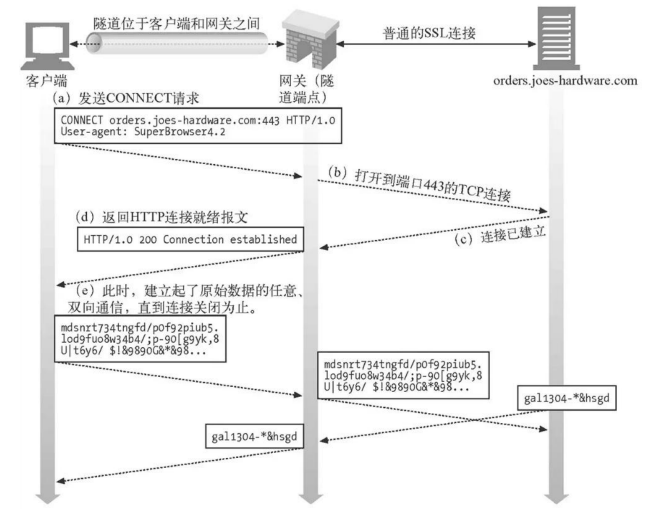
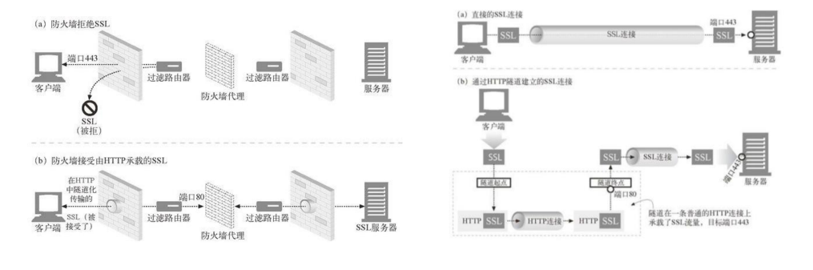
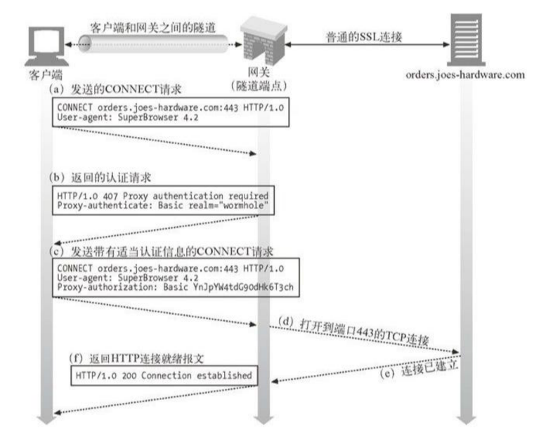

## Http Tunnel 隧道

-----

用于通过 `HTTP` 连接传输非 `HTTP` 协议格式的消息，常用于穿越防火墙，建立隧道后，由于传输的并非 `HTTP` 消息，因此不再遵循请求/响应模式，已变为双向传输。

#### connect 请求行

先来回顾一下请求行 `request-line = method SP request-target SP HTTP-version CRLF`，其中 `request-target = origin-form / absolute-form / authority-form / asterisk-form ` 使用 `connect` 时使用的是 `authority-form = authority`。

+ `authority = [ userinfo “@” ] host [ “:” port ]`，指定源服务器，例如 `CONNECT www.example.com:80 HTTP/1.1`。

## 常见用途

------

#### 传递 SSL 消息

如果防火墙拒绝 `SSL` 流量，或者代理服务器没有证书：

#### 基于隧道认证

