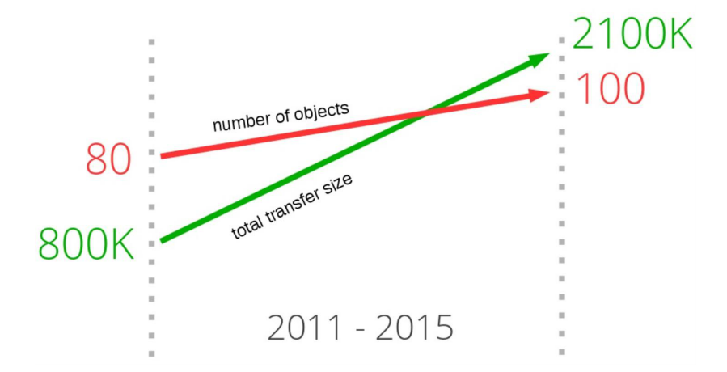
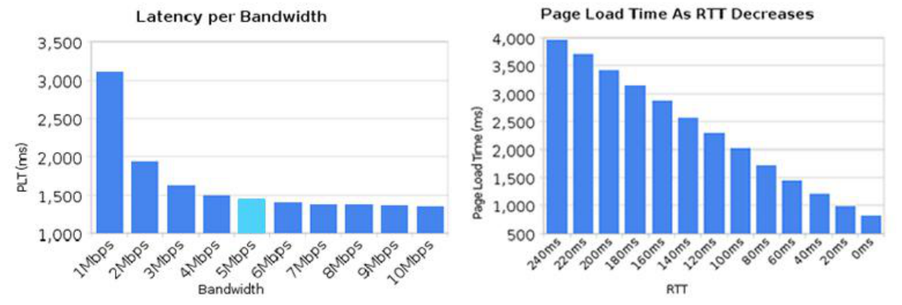
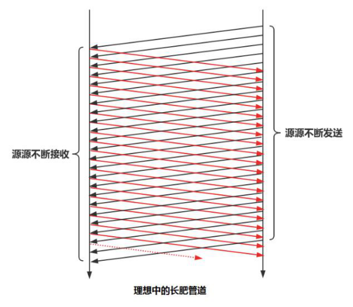
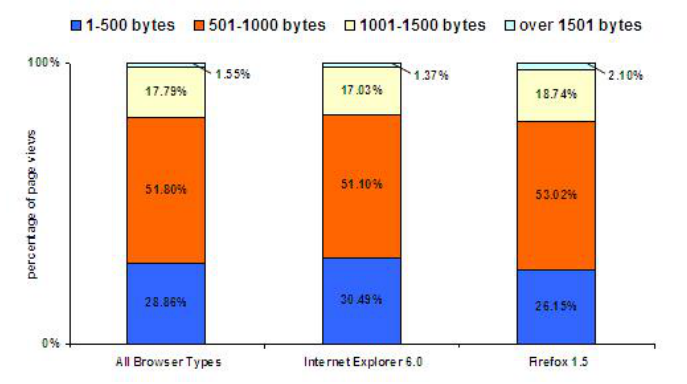
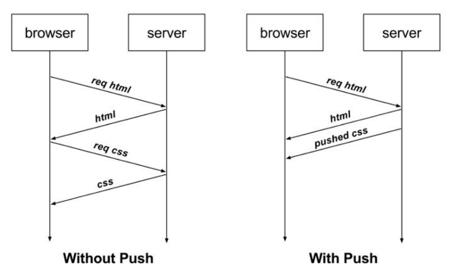
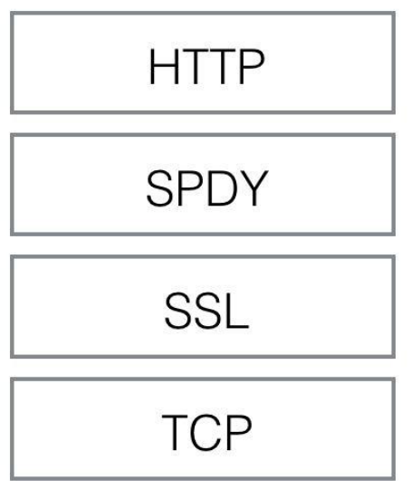
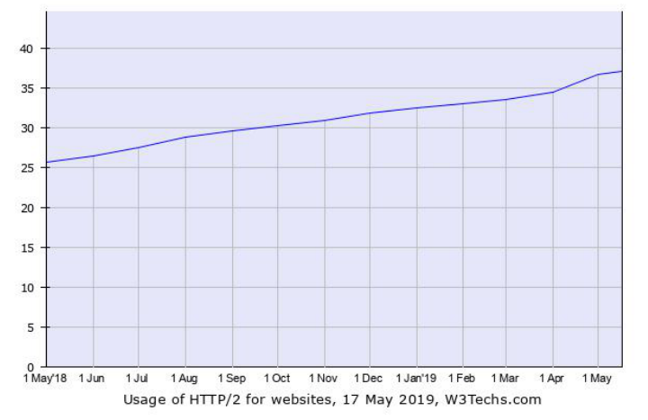

## HTTP/1.1 发展中遇到的问题

-------

随着互联网技术的不断发展，每个请求从几 `KB` 大小的消息，到几 `MB` 大小的消息，每个页面小于 `10` 个资源，到每页面 `100` 多个资源，从文本为主的内容，到富媒体（如图片、声音、视频）为主的内容。对页面内容实时性高要求的应用越来越多。而就在这样的环境下 `http1` 的问题逐渐暴露：

#### 高延迟问题

随着带宽的增加，`http1` 的延迟并没有显著下降:

同时 `http1` 协议支持的并发连接有限，并且同一连接同时只能在完成一个 `HTTP` 事务（请求/响应）才能处理下一个事务，这和理想中的长肥管道相差甚远，因为在长肥管道中消息应该是连续多次的发送和接收。

#### 巨大的http头部

`http1` 无状态导致的高传输量（低网络效率），每次传输都重复传输的体积巨大的 `HTTP` 头部(比如 `cookie` 头)。

#### 不支持服务器推送消息

`http1` 不支持服务器消息推送，只能以一问一答的形式拉取消息：

#### `HTTP/1.1` 为了解决性能问题做过的努力

**Spriting 合并** 合并多张小图为一张大图供浏览器 `JS` 切割使用(也称精灵图)。

**Inlining 内联** 将图片嵌入到 `CSS` 或者 `HTML` 文件中，减少网络请求次数。

**Concatenation 拼接** 将多个体积较小的 `JavaScript` 使用 `webpack` 等工具打包成 `1` 个体积更大的 `JavaScript` 文件。

+ 1 个文件的改动导致用户重新下载多个文件。

**Sharding 分片** 将同一页面的资源分散到不同域名下，提升连接上限。

## HTTP2 简介

------

`http2` 协议来源于谷歌的 `SPDY（2012-2016）`协议，在 `(RFC7540，2015.5)` 中提出，本身在只在应用层上修改，基于并充分挖掘 `TCP` 协议性能。

新版本的 `http` 协议具有以下兼容性设计：

+ 客户端向 `server` 发送 `request` 这种基本模型不会变；

+ 老的 `scheme` 不会变，没有 `http2://`；
+ 使用 `http/1.x` 的客户端和服务器可以无缝的通过代理方式 转接到 `http/2` 上；
+ 不识别 `http/2` 的代理服务器可以将请求降级到 `http/1.x`；

> 体验 `http2`: https://http2.akamai.com/demo

#### 协议特性

**传输数据量的大幅减少**

+ 以二进制方式传输 

+ 标头压缩 

**多路复用及相关功能** 

+ 消息优先级 

**服务器消息推送** 

+ 并行推送

#### 应用状况 

截止 `2019.5.17` 号，互联网上使用 `HTTP/2` 协议的站点已经达到 `37.2%`，由于其未改变 `HTTP/1.1` 的语义，所以做到了应用内的兼容。同时其基于 `tcp` 协议，仅在应用层变动。

