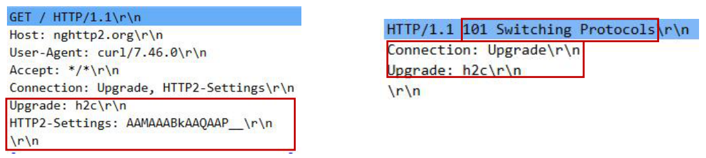
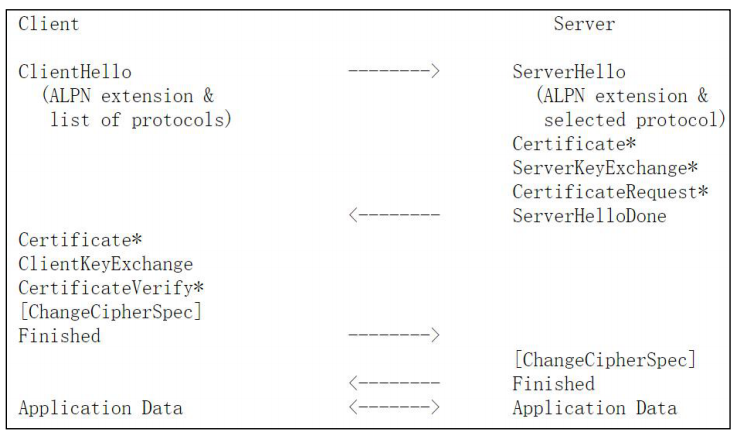
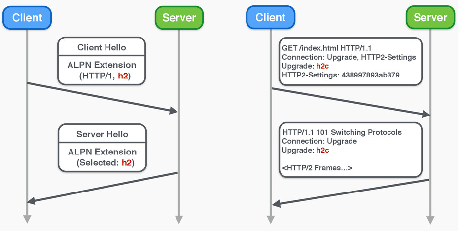
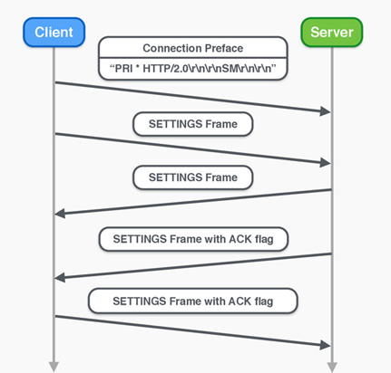
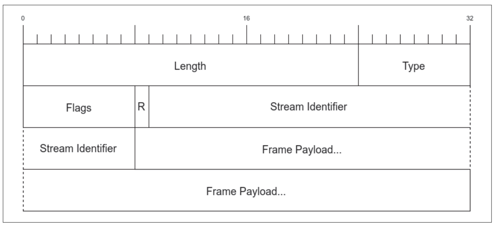
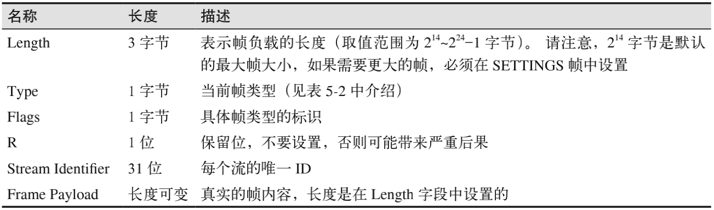
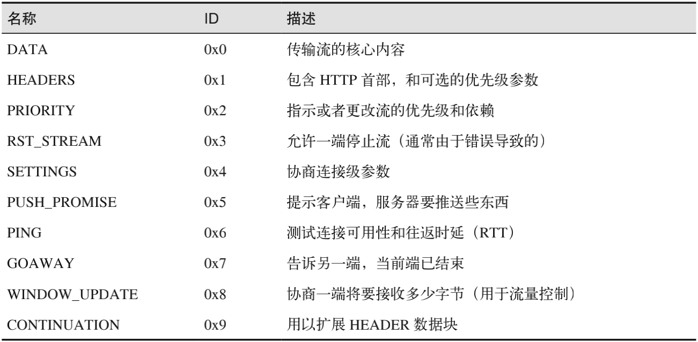
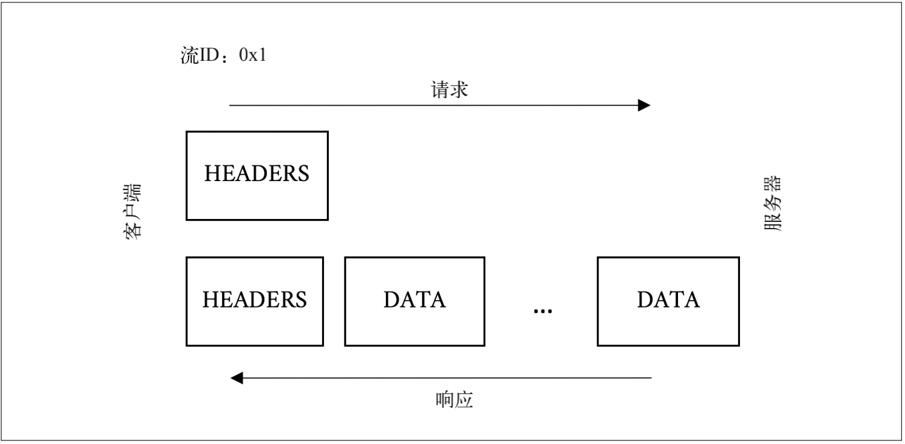
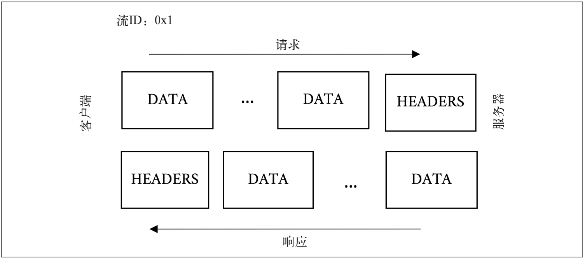

## HTTP/2分层

-----

`HTTP/2` 大致可以分为两部分：分帧层，即 `h2` 多路复用能力的核心部分；数据或 `http` 层，其中包含传统上被认为是 `HTTP` 及其关联数据的部分。

> *注意*  `shema`：`http`://和 `https`:// 默认基于 `80` 和 `443` 端口

**二进制协议**

`h2` 的分帧层是基于帧的二进制协议。这方便了机器解析，但是肉眼识别起来比较困难。

**首部压缩**

仅仅使用二进制协议似乎还不够，`h2` 的首部还会被深度压缩。这将显著减少传输中的冗余字节。

**多路复用**

在你喜爱的调试工具里查看基于 `h2` 传输的连接的时候，你会发现请求和响应交织在一起。

**加密传输**

最重要的是，线上传输的绝大部分数据是加密过的，所以在中途读取会更加困难。

#### HTTP/2 是不是必须基于 TLS/SSL 协议？

首先 `IETF` 标准不要求必须基于`TLS/SSL`协议，但是浏览器要求必须基于`TLS/SSL`协议，所以我们所看到的基本都是基于`TLS/SSL`协议的。基于 `TLS` 协议运行的 `HTTP/2` 被称为 `h2`，直接在 `TCP` 协议之上运行的 `HTTP/2` 被称为 `h2c`。

## 连接(协议升级)

----

连接是所有 `HTTP/2` 会话的基础元素，其定义是客户端初始化的一个 `TCP/IP socket`，客户端是指发送 `HTTP` 请求的实体。这和 `h1` 是一样的，不过与完全无状态的 `h1` 不同的是，`h2` 把它所承载的帧（`frame`）和流（`stream`）共同依赖的连接层元素捆绑在一起，其中既包含连接层设置也包含首部表（稍后有对两者更详细的描述）。也就是说，与之前的 `HTTP` 版本不同，每个 `h2` 连接都有一定的开销。之所以这么设计，是考虑到收益远远超过其开销。

#### H2C 协议升级

`H2C` 协议升级的过程是基于 `http/1.1` 的，在连接不加密的情况下，客户端会利用 `Upgrade` 首部来表明期望使用 `h2`。如果服务器也可以支持 `h2`，它会返回一个“`101 Switching Protocols`”（协议转换）响应。这增加了一轮完整的请求－响应通信。



#### TLS 协议升级

基于 `TLS` 协议的 `h2` 升级是通过 `TLS` 协议的 `APLN(Application-Layer Protocol Negotiation Extension)` 拓展实现的， 客户端 在 `ClientHello` 消息中设置 `ALPN`（`Application-Layer Protocol Negotiation`，应用层协议协商）扩展来表明期望使用 `h2` 协议，服务器用同样的方式回复。如果使用这种方式，那么 `h2` 在创建 `TLS` 握手的过程中完成协商，不需要多余的网络通信。



#### 双重认证

第一次协议升级完成了之后，为了向服务器双重确认客户端支持 `h2`，客户端会发送一个叫作 `connection preface`（连接前奏）的魔法字节流，作为连接的第一份数据。这主要是为了应对客户端通过纯文本的`HTTP/1.1` 升级上来的情况。该字节流用十六进制表示如下：

```go
0x505249202a20485454502f322e300d0a0d0a534d0d0a0d0a
```

解码为 `ASCII` 是：

```go
PRI * HTTP/2.0\r\n\r\nSM\r\n\r\n
```

这个字符串的用处是，如果服务器（或者中间网络设备）不支持 `h2`，就会产生一个显式错误。这个消息特意设计成 `h1` 消息的样式。如果运行良好的 `h1` 服务器收到这个字符串，它会阻塞这个方法（`PRI`）或者版本（`HTTP/2.0`），并返回错误，可以让 `h2` 客户端明确地知道发生了什么错误。

这个魔法字符串会有一个 `SETTINGS` 帧紧随其后。服务器为了确认它可以支持 `h2`，会声明收到客户端的 `SETTINGS` 帧，并返回一个它自己的 `SETTINGS` 帧（反过来也需要确认），然后确认环境正常，可以开始使用 `h2`。大家做了很多工作，保证这个流程尽可能高效。虽然表面上看起来有点啰嗦，但客户端可以立即开始发送帧，并假设服务器的 `SETTINGS` 帧已经到了。 如果在偶然情况下，过份乐观的客户端在 `SETTINGS` 帧之前收到一些数据，那么协商会失败，客户端和服务端都会收到 `GOAWAY` 帧。

#### 握手

现在我们就得到了一个完整的 `http2` 连接过程，首先是协议升级的初步协商，这部分可能发生在 `TLS` 握手之中，也有可能需要额外的 `http1.1` 的 `RTT`，总之协议升级成功之后就可以进行进一步的确认：



双重确认的过程需要进行一个魔数的发送，两次 `SETTING` 帧的传输，以及两次确认帧的传输，这些过程一定是顺序执行的，不能并行操作。所以如果把连接过程比作握手，则 `h2` 的一次连接需要 `7` 次握手。



## 帧

------

`HTTP/2` 是基于帧（`frame`）的协议。采用分帧是为了将重要信息都封装起来，让协议的解析方可以轻松阅读、解析并还原信息。 相比之下，`h1` 不是基于帧的，而是以文本分隔。 看看下面的简单例子：

```http
GET / HTTP/1.1
Host: www.example.com <crlf> 
Connection: keep-alive <crlf> 
Accept: text/html,application/xhtml+xml,application/xml;q=0.9... <crlf> 
User-Agent: Mozilla/5.0 (Macintosh; Intel Mac OS X 10_11_4)... <crlf> 
Accept-Encoding: gzip, deflate, sdch <crlf> 
Accept-Language: en-US,en;q=0.8 <crlf> 
Cookie: pfy_cbc_lb=p-browse-w; customerZipCode=99912|N; ltc=%20;...<crlf> 
<crlf>
```

解析这种数据用不着什么高科技，但往往速度慢且容易出错。你需要不断读入字节，直到遇到分隔符为止（这里是指 <crlf>），同时还要考虑一些不太守规矩的客户端，它们会只发送 <lf>。于是大概需要这样一台状态机：

```shell
loop 
 while( ! CRLF ) 
 read bytes 
 end while 
 if first line 
 parse line as the Request-Line 
 else if line is empty 
 break out of the loop # 完成
 else if line starts with non-whitespace 
 parse the header line into a key/value pair 
 else if line starts with space 
 add the continuation header to the previous header 
 end if 
end loop 
# 好了，准备根据Transfer-encoding首部的值处理请求和响应，还有各种浏览器bug吧
```

这样写程序是可行的，并且这事已经做过无数次了。解析 `h1` 的请求或响应可能出现下列问题。

+ 一次只能处理一个请求或响应，完成之前不能停止解析。

+ 无法预判解析需要多少内存。这会带来一系列问题：你要把一行读到多大的缓冲区里；如果行太长会发生什么；应该增加并重新分配内存，还是返回 `400` 错误。为了解决这些问题，保持内存处理的效率和速度可不简单。

从另一方面来说，有了帧，处理协议的程序就能预先知道会收到什么。基于帧的协议，特别是 `h2`，开始有固定长度的字节，其中包含表示整帧长度的字段。下图是一个 `HTTP/2`帧的结构。



前 `9` 个字节对于每个帧是一致的。解析时只需要读取这些字节，就可以准确地知道在整个帧中期望的字节数。其中每个字段的说明，参见下表。 



> **Length**
>
> + `0` 至 `2^14(16,384)  -1`：所有实现必须可以支持 `16KB` 以下的帧 
> + `2^14 (16,384)` 至 `2^24-1 (16,777,215)`：传递 `16KB` 到 `16MB` 的帧时，必须接收端首先公布自己可以处理此大小 
>   - 通过 `SETTINGS_MAX_FRAME_SIZE` 帧（`Identifier=5`）告知。

因为规范严格明确，所以解析逻辑大概是这样：

```powershell
loop 
 Read 9 bytes off the wire # 读前9字节
 Length = the first three bytes # 长度值为前3字节
 Read the payload based on the length. # 基于长度读负载
 Take the appropriate action based on the frame type. # 根据帧类型采取对应操作
end loop
```

这样一来，实现和维护都会简单很多。相比依靠分隔符的 `h1`，`h2` 还有另一大优势：如果使用 `h1` 的话，你需要发送完上一个请求或者响应，才能发送下一个；由于 `h2` 是分帧的，请求和响应可以交错甚至多路复用。多路复用有助于解决类似队头阻塞的问题。

`h2` 协议中有 10 种不同的帧类型。概览见下表：



## 设置帧 (0x4)

-----

`SETTINGS` 帧(类型 = `0x4`)传递影响端点通信方式的配置参数，设置帧并不是“协商”，而是发送方向接收方通知其特性、能力。一般用于定义通信双方的能力、配置。`SETTINGS` 帧必须由两个端点在连接开始时发送，并且可以在任何其他时间由任一端点在连接的生命周期内发送。

`SETTINGS` 帧始终适用于连接，而不是作用于单个流。`SETTINGS` 帧的流标识符必须为零`(0x0)`。如果端点收到其流标识符字段不是 `0x0` 的 `SETTINGS` 帧，则端点必须响应 `PROTOCOL`_`ERROR` 类型的连接错误。`SETTINGS` 帧影响连接状态。一个格式错误或不完整的 `SETTINGS` 帧必须被视为 `PROTOCOL`_`ERROR` 类型的连接错误。

#### 设置确认

`SETTINGS` 参数由接收对端确认。要启用此功能，`SETTINGS` 帧将定义要在 `FLAG` 字段以下标志：

+ `ACK (0x1)`: 设置这个字段的时候，位 `0` 表示该帧已经被对等的 `SETTINGS` 帧的接收和应用。设置此位后，`SETTINGS` 帧的有效负载必须为空。收到设置了 `ACK` 标志且长度字段值不为 `0` 的 `SETTINGS` 帧必须被视为 `FRAME`_`SIZE`_`ERROR` 类型的连接错误。

#### 帧定义

一个设置帧可以使用下面的格式同时设置多个对象，`SETTINGS` 帧的有效负载由零个或多个参数组成，每个参数由无符号 `16` 位设置标识符和无符号 `32` 位值组成。：

```go
+-------------------------------+
|       Identifier (16)         |
+-------------------------------+-------------------------------+
|                        Value (32)                             |
+---------------------------------------------------------------+
```

`setting` 帧支持如下的设置类型：

+ `SETTINGS_HEADER_TABLE_SIZE(0x1)`: 通知对端索引表的最大尺寸（单位字节，初始 `4096` 字节）。
+ `SETTINGS_ENABLE_PUSH(0x2)`: `Value` 设置为 `0` 时可禁用服务器推送功能，`1` 表示启用推送功能。
+ `SETTINGS_MAX_CONCURRENT_STREAMS(0x3)`: 表示发送方允许的最大并发流数。此限制是有方向性的：它适用于发送方允许接收方创建的流的数量。初始化的时候，此值没有限制。建议此值不小于 `100`，以免不必要地限制并行性。当 SETTINGS_MAX_CONCURRENT_STREAMS 的值 0 不应被端点视为特殊值。零值确实会阻止创建新流；但是，另外它也适用于被激活的流用尽的任何限制。服务器应该只为短连接设置零值；如果服务器不希望接受请求，则关闭连接更合适。
+ `SETTINGS_INITIAL_WINDOW_SIZE (0x4)`: 声明发送端的窗口大小，用于 `Stream` 级别流控，初始值 `2^16-1 (65,535)` 字节。
+ `SETTINGS_MAX_FRAME_SIZE (0x5)`: 设置帧的最大大小，初始值 `2^14 (16,384)` 字节。
+ `SETTINGS_MAX_HEADER_LIST_SIZE (0x6)`: 知会对端头部索引表的最大尺寸，单位字节，基于未压缩前的头部。

## 流

-----

`HTTP/2` 规范对流（`stream`）的定义是：“`HTTP/2` 连接上独立的、双向的帧序列交换。你可以将流看作在连接上的一系列帧，它们构成了单独的 `HTTP` 请求和响应。如果客户端想要发出请求，它会开启一个新的流。然后，服务器将在这个流上回复。这与 `h1` 的请求 / 响应流程类似，重要的区别在于，因为有分帧，所以多个请求和响应可以交错，而不会互相阻塞。流 `ID`（帧首部的第 `6~9` 字节）用来标识帧所属的流。

客户端到服务器的 `h2` 连接建立之后，通过发送 `HEADERS` 帧来启动新的流，如果首部需要跨多个帧，可能还发会送 `CONTINUATION` 帧。该 `HEADERS` 帧可能来自 `HTTP` 请求，也可能来自响应，具体取决于发送方。后续流启动的时候，会发送一个带有递增流 `ID` 的新 `HEADERS` 帧。

> **CONTINUATION帧**
>
> `HEADERS`帧通过在帧的`Flags`字段中设置`END`_`HEADERS`标识位来标识首部的结束。在单个`HEADERS`帧装不下所有`HTTP`首部的情况下（例如，帧可能比当前最大长度还长），不会设置`END`_`HEADERS`标识位，而是在之后跟随一个或多个`CONTINUATION`帧。我们可以把`CONTINUATION`帧当作特殊的`HEADERS` 帧。那么，为什么要使用特殊的帧，而不是再次使用`HEADERS`帧？如果重复使用`HEADERS`，那么后续的`HEADERS`帧的负载就得经过特殊处理才能和之前的拼接起来。这些帧首部是否需要重复？这样的话，如果帧之间存在分歧该怎么办？协议开发者不喜欢这类模棱两可的情况，因为它可能在未来引起麻烦。考虑到这一点，工作组决定增加一个明确的帧类型，以避免实现混淆。

#### 消息

`HTTP` 消息泛指 `HTTP` 请求或响应。上一节已经讲过，流是用来传输一对请求 / 响应消息的。一个消息至少由 `HEADERS` 帧（它初始化流）组成，并且可以另外包含`CONTINUATION` 和 `DATA` 帧，以及其他的 `HEADERS` 帧。



下图展示了某个 `POST` 消息对应的各帧可能的样子。请注意，`POST` 和 `GET` 的主要差别之一就是 `POST` 请求通常包含客户端发出的大量数据。



## h1和h2

----

`h1` 的请求和响应都分成消息首部和消息体两部分；与之类似，`h2` 的请求和响应分成`HEADERS` 帧和 `DATA` 帧。而 `HTTP/1` 和 `HTTP/2` 消息的下列差别是需要注意的。

#### 一切都是header 

`h1` 把消息分成两部分：请求 / 状态行；首部。`h2` 取消了这种区分，并把这些行变成了魔法伪首部。举个例子，`HTTP/1.1` 的请求和响应可能是这样的：

```http
GET / HTTP/1.1
Host: www.example.com 
User-agent: Next-Great-h2-browser-1.0.0 
Accept-Encoding: compress, gzip 
```

在 `HTTP/2` 中，它等价于：

```http2
:scheme: https 
:method: GET 
:path: / 
:authority: www.example.com 
User-agent: Next-Great-h2-browser-1.0.0 
Accept-Encoding: compress, gzip
```

请注意，请求和状态行在这里拆分成了多个首部，即 :`scheme`、:`method`、:`path` 和 :`status`。同时要注意的是，`h2` 的这种表示方式跟数据传输时不同。