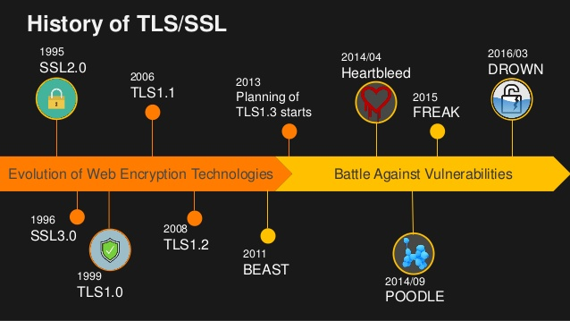
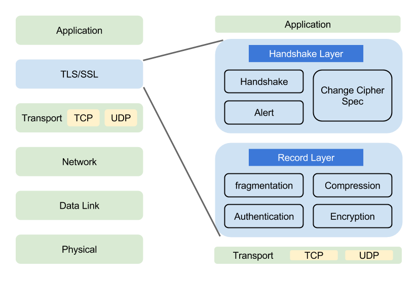

## SSL/TLS

--------

`SSL/TLS`是一种密码通信框架，他是世界上使用最广泛的密码通信方法。`SSL/TLS`综合运用了密码学中的对称密码，消息认证码，公钥密码，数字签名，伪随机数生成器等，可以说是密码学中的集大成者。

+ `SSL(Secure Socket Layer)`安全套接层，是`1994`年由`Netscape`公司设计的一套协议，并与`1995`年发布了`3.0`版本。
+ `TLS(Transport Layer Security)`传输层安全是`IETF`在`SSL3.0`基础上设计的协议，实际上相当于`SSL`的后续版本。

#### 协议历史

`SSL`协议由`Netscape`公司开发，历史可以追溯到`Netscape Navigator`浏览器统治互联网的时代。协议的第一个版本从未发布过，第二版则于`1994`年`11`月发布。第一次部署在`Netscape Navigator 1.1`浏览器上，发行于`1995`年`3`月。

`SSL 2`的开发基本上没有与`Netscape`以外的安全专家进行过商讨，所以有严重的弱点，被认为是失败的协议，最终退出了历史的舞台。这次失败使`Netscape`专注于`SSL 3`，并于`1995`年年底发布。虽然名称与早先的协议版本相同，但`SSL 3`是完全重新设计的协议。该设计一直沿用到今天。

`1996`年`5`月，`TLS`工作组成立，开始将`SSL`从`Netscape`迁移至`IETF`。由于`Microsoft`和`Netscape` 当时正在为`Web`的统治权争得不可开交，整个迁移过程进行得非常缓慢、艰难。最终，`TLS 1.0`于`1999`年`1`月问世，见`RFC 2246`。尽管与`SSL 3`相比，版本修改并不大，但是为了取悦`Microsoft`，协议还是进行了更名。

直到`2006`年`4`月，下一个版本`TLS 1.1`才问世，仅仅修复了一些关键的安全问题。然而，协议的重要更改是作为`TLS`扩展于`2003`年`6`月发布的，并被集成到了协议中，这比大家的预期早了好几年。

`2008`年`8`月，`TLS 1.2`发布。该版本添加了对已验证加密的支持，并且基本上删除了协议说明中所有硬编码的安全基元，使协议完全弹性化。

#### SSL/TLS架构

`SSL/TLS`是一个安全通信框架，上面可以承载`HTTP`协议或者`SMTP/POP3`协议等。

而 `TLS` 协议本身主要分为两层，底层的是 `TLS` 记录协议，主要负责使用对称密码对消息进行加密。上层的是 `TLS` 握手协议，主要分为握手协议，密码规格变更协议和应用数据协议 `4`个部分。

+ 握手协议负责在客户端和服务器端商定密码算法和共享密钥，包括证书认证，是4个协议中最最复杂的部分。
+ 密码规格变更协议负责向通信对象传达变更密码方式的信号
+ 警告协议负责在发生错误的时候将错误传达给对方
+ 应用数据协议负责将TLS承载的应用数据传达给通信对象的协议。

下图简要的概括了整个 `TLS` 的传输过程：

