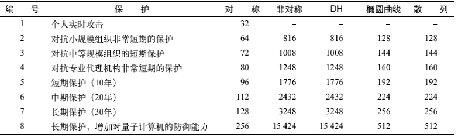

## 密码学

-----

密码学是一门通信安全的科学，同时也是一门艺术。虽然我们总是将密码学与现代联系在一起，但在上千年以前，人们事实上就已经开始利用它的力量了。考古发现，加密工具密码棒。首次被提及是在公元前7世纪。我们今天所知的密码学诞生于20世纪，用于军事领域；而它现在已经成为了我们日常生活的一部分。

部署正确的密码能解决安全的三个核心需求：保持秘密（机密性）、验证身份（真实性），以及保证传输安全（完整性）。

## 构建基块

------

在最底层，使用密码加密依赖于各种加密基元（`cryptographic primitive`）。每种基元都着眼于某个特定功能而设计。比如，我们会使用某个基元加密，使用另外一个基元进行完整性检查。单个基元本身的作用并不大，但是我们可以将它们组合成方案（`scheme`）和协议（`protocol`），从而提供可靠的安全性。

#### 对称加密

见 `4-03`；

#### 非对称加密

见 `4-04`；

#### 散列函数

散列函数（`hash function`）是将任意长度的输入转化为定长输出的算法。散列函数的结果经常被简称为散列（`hash`）。编程中普遍使用散列函数，但并非所有散列函数都适用于密码学。密码学散列函数有以下几个额外特性。

**抗原像性（单向性）**

给定一个散列，计算上无法找到或者构造出生成它的消息。

**抗第二原像性（弱抗碰撞性）**

给定一条消息和它的散列，计算上无法找到一条不同的消息具有相同的散列。

**强抗碰撞性**

计算上无法找到两条散列相同的消息。

散列函数最常用的使用场合是以紧凑的方式表示并比较大量数据。比如，为了避免直接比较两个文件（可能很难，比方说，它们存放于世界上不同的位置），你可以比较它们的散列。散列函数经常被称为指纹、消息摘要，或者简单称为摘要。

现在使用最为广泛的散列函数是`SHA1`，它的输出是`160`位。因为`SHA1`已经变弱，所以建议升级为`SHA256`的变种。与密码不同，散列函数的强度并不与散列长度对等。因为生日悖论（概率论中的常见问题），散列函数的强度最多只是散列长度的一半。

#### 消息验证代码

散列函数可以用于验证数据完整性，但仅在数据的散列与数据本身分开传输的条件下如此。否则攻击者可以同时修改数据和散列，从而轻易地避开检测。消息验证代码（`message authentication code`，`MAC`）或者使用密钥的散列（`keyed-hash`）是以身份验证扩展了散列函数的密码学函数。`MAC` 算法要求接受者和发送者同时拥有散列密匙。只有拥有散列密钥，才能生成合法的 `MAC`。

在使用 `MAC` 做文件指纹时，发送者使用一个共同的秘钥对消息进行加密生成 `MAC` 指纹，之后接受者同样对消息进行加密散列，并且将将算出的指纹和发送过来的 `MAC` 指纹进行对比，校验数据完整性。

`MAC` 通常与加密一起使用。如果没有`MAC`，即使`Mallory`无法解码密文，她也能修改传输中的数据；加密提供了机密性但无法确保完整性。如果`Mallory`聪明到可以修改密文，她就可以诱使`Bob`接受并相信伪造的消息。当`MAC`和密文一起发送时，（和`Alice`共享散列密钥的）`Bob`就能确认消息并未遭到篡改。

任何散列函数都能用作`MAC`的基础，另一个基础是基于散列的消息验证代码（`hash-based message authentication code`，`HMAC`）。`HMAC`本质就是将散列密钥和消息以一种安全的方式交织在一起。

#### 数字签名

数字签名（`digital signature`）是一个密码学方案。它使得验证一条电子消息或者一篇电子文档的真实性成为可能。前面描述的`MAC`就是一种电子签名，它可以利用事先安全交换的散列密钥验证真实性。虽然这种校验非常有用，但仍有不足，因为它仍然依赖于一个私有密钥。

借助公钥密码，数字签名可以与现实生活中的手写签名类似。我们可以利用公钥密码的非对称性设计出一种算法，使用私钥对消息进行签名，并使用对应的公钥验证它。

实际的方式依照选择的公钥密码体系而有所不同。下面以`RSA`为例。`RSA`可以用于加密，也可以用于解密。如果使用`RSA`私钥加密，那么仅能通过对应的公钥解密。我们可以利用这个性质，并且结合散列函数，实现数字签名。

1. 计算希望签名的文档的散列。不论输入文档的长度如何，输出长度总是固定的。比如，使用 `SHA256` 就是 `256` 位。
2. 对结果散列和一些额外的元数据进行编码。比如，接收方需要知道你使用的散列算法，否则不能处理签名。
3. 使用私钥加密编码过的数据，其结果就是签名，可以追加到文档中作为身份验证的依据。

为了验证签名，接收方接收文档并使用相同的散列算法独立计算文档散列。接着，她使用公钥对消息进行解密，将散列解码出来，再确认使用的散列算法是否正确，解密出的散列是否与本地计算的相同。这个方案的强度取决于加密、散列以及编码组件各自的强度。

#### 随机数生成

在密码学中，所有的安全性都依赖于生成随机数的质量。在本章中，你已经看到，安全性构建于已知的算法和未知的密钥之上；而密钥最简单的形式就是非常长的随机数。之所以说随机数不易生成，是因为计算机是十分善于预测的，它们会严格按照指令执行。如果告诉它生成一个随机数，它很可能做不好这项工作。真正的随机数只能通过观测特定的物理处理器才能得到。没有的话，计算机将关注于收集少量的熵（`entropy`）。这通常意味着监视按键状态、鼠标移动，以及各种外设（比如硬盘）的交互情况。

通过这种方式收集熵是一种真随机数生成器（`true random number generator`，`TRNG`），但是直接使用这种方式并不足够可靠。打个比方，你可能需要生成一个`4096`位的密钥，但是系统可能只有数百位的熵可用。如果没有可靠的外部事件可以收集到足够的熵，系统就可能会停止。

基于上面的原因，我们在实际使用中依靠的是伪随机数生成器（`pseudorandom number generator`，`PRNG`）。当然，`PRNG`也要利用少量真正的随机数使系统运转起来。这个过程被称为种子设定（`seeding`）。利用种子，`PRNG`根据需要构造出无限数量的伪随机数。普通用途的`PRNG`被常常用于编程，但它们并不适用于密码学，尽管其输出看起来就是随机的。加密安全伪随机数生成器（`cryptographically secure pseudorandom number generator`，`CPRNG`）是不可预测的`PRNG`。这个性质对安全来说非常关键，一定不能让攻击者对观察到的`CPRNG`输出进行内部状态的逆向工程。

## 协议

-----

加密基元本身其实没什么用，诸如加密和散列算法。我们只有将这些元素组合成方案和协议，才能满足复杂的安全需求。为了说明我们需要怎么做，先来看一个简化的密码协议，这个协议可以使`Alice`和`Bob`安全地通信。我们的目标是全部三个重要需求：机密性、完整性和真实性。

我们假设协议允许交换任意数量的消息。因为对称加密擅长对大量数据进行加密，所以选取我们最喜欢的`AES`算法来进行数据加密。使用`AES`，`Alice`和`Bob`可以安全地交换消息，`Mallory`看不到他们通信的内容。但是这还不够，因为`Mallory`还可以干其他事情，比如，神不知鬼不觉地修改消息。为了解决这个问题，我们使用只有`Alice`和`Bob`知道的散列密钥计算每个消息的`MAC`。在发送消息的同时，也发送消息的`MAC`。

现在，`Mallory`再也不能修改消息了。然而，她仍然可以丢弃或者重发任意消息。为了解决这个问题，我们扩展协议，为每条消息指定序号。最为重要的是，我们将序号作为`MAC`计算数据的一部分。如果发现序号出现空缺，就能知道消息丢了。如果我们发现序号出现重复，就检测重放攻击。为了得到最佳结果，我们应使用某个特殊消息来标记会话结束。如果没有这个消息，`Mallory`能够悄悄地结束（截断）会话。

如果所有措施都已到位，`Mallory`最多只能做到阻止`Alice`和`Bob`与其他人进行通信。我们对此无能为力。

到目前为止，一切都好，但是我们仍然有一大块缺失：`Alice`和`Bob`如何协商得到需要的两个密钥（一个用于加密，一个用于完整性验证），同时还要当心`Mallory`？我们通过为协议增加两个额外的步骤来解决这个问题。

首先，在会话的开始，我们使用公钥密码对会话双方进行身份验证。举个例子，`Alice`生成一个随机数，并要求`Bob`对其签名以证明真的是他。`Bob`也要求`Alice`做相同的事情。

除了身份验证之外，我们还可以使用密钥交换方案对加密密钥进行秘密协商。继续举例，`Alice`可以生成所有密钥，用`Bob`的公钥加密，再发送给`Bob`，这就是`RSA`密钥交换的工作方式。我们也可以使用`Diffie-Hellman`（`DH`）密钥交换协议作为替代。后者相对速度更慢，但提供了更多的安全特性。

最后，我们的协议完工时的状态是：`(1)` 以握手阶段开始，包括身份验证和密钥交换；`(2)` 接下来是数据交换阶段，保证机密性和完整性；`(3)` 以关闭序列结束。站在宏观的角度来看，我们的协议与`SSL`和`TLS`完成的工作相似。

#### 攻击密码

复杂系统往往会受到多种方式的攻击，密码系统也不例外。首先，你可以攻击加密基元本身。如果密钥很短，攻击者可以暴力破解。这种攻击通常需要相当多的运算能力和时间。对攻击者来说，如果系统使用的基元存在已知缺陷，他就可以使用解析攻击，从而更简单、更快地达成攻击目标。人们一般都能很好地理解加密基元，因为它们相对直接，并且只完成一件工作。整体方案往往更容易遭受攻击，因为它们引入了额外的复杂性。在某些场景下，即使是密码学家也会争论执行特定操作的正确方法；但不论是基元还是方案，都比协议更安全。因为协议引入了更多的复杂性，并且攻击界面也大得多。

此外，也存在针对协议实现（`implementation`）的攻击；换言之，就是利用软件的`bug`。比如，绝大多数密码库都使用`C`甚至汇编这样的低级语言编写（出于性能的原因），非常容易引入灾难性的编程错误。即便没有这些`bug`，要实现基元、方案和协议，保证它们不被滥用，也需要很高的技巧。举个例子，某些算法的本地实现可以被计时攻击（`timing attack`）所利用，攻击者可以通过观察特定操作执行的时间破解加密。

有一种现象也非常普遍，那就是没有密码经验的程序员企图实现（甚至设计）加密协议和方案，理所应当地造成了不安全的结果。所以，我们通常会说加密被绕过，而不是被攻击。这句话意味着使用的基元都很坚实，但软件体系不牢固。再进一步说，密钥是非常诱人的攻击目标：如果我们可以更轻松地闯进服务器拿到密钥，为什么还要花费数月时间暴力破解它？许多失败的加密案例都可以参照下面的简单规则避免：`(1)` 使用完善的协议，不要自己设计；`(2)` 使用高级库，避免直接操作加密；`(3)` 使用完备的基元，辅以足够强壮的密钥长度。

#### 衡量强度

我们使用攻破某个基元所需执行的操作数量衡量密码系统的强度，以安全位数来表示。最容易做到的符合正确部署的行为就是部署长度足够强的密码，而且规则很简单：大部分系统部署`128`位（`2^128`次操作）就足够了；如果需要长期的安全或者较大的安全宽限期，则使用`256`位。

> **注意** 对称密码系统的强度按位数增加以几何基数增长，这意味着密码增加1位，强度翻一倍。

实际使用的情况更复杂一些，因为并非所有操作的安全性都能同等度量。所以，对于对称加密的操作、非对称加密的操作、椭圆曲线加密算法以及其他操作，我们使用不同的位数。你可以使用表`1-2`中的信息将一种大小转换为另一种大小。

