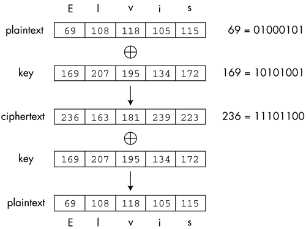
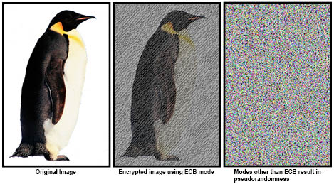
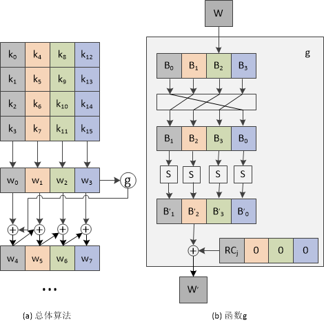
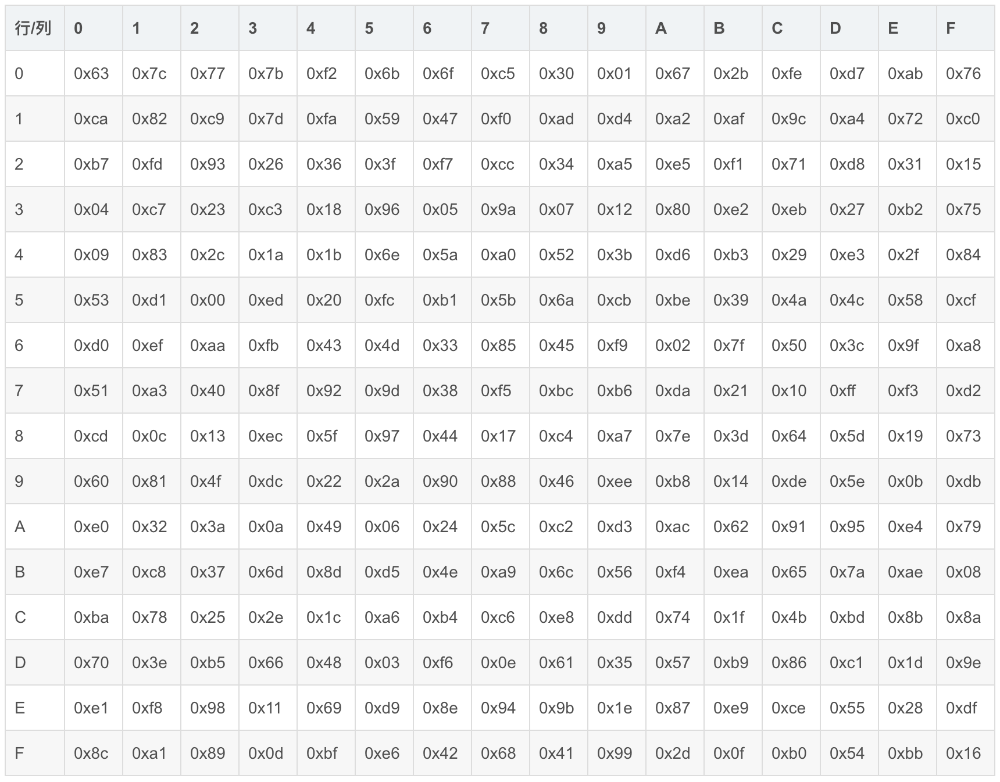

## 对称加密工作原理

------

对称加密是最快速、最简单的一种加密方式，加密（`encryption`）与解密（`decryption`）用的是同样的密钥（`secret key`）。对称加密有很多种算法，由于它效率很高，所以被广泛使用在很多加密协议的核心当中。对称加密通常使用的是相对较小的密钥，一般小于`256 bit`。因为密钥越大，加密越强，但加密与解密的过程越慢。

.png)

#### XOR 异或运算

对称加密可以做到使用同一把密匙对明文和密文进行加密和解密，其背后最基本的原理就是异或运算，我们都知道异或运算有如下特性：
$$
a⊕0=a
$$

$$
a⊕a=0
$$

$$
a⊕b⊕a=b⊕(a⊕a)=b⊕0=b
$$

而对称加密正是运用了特性 `3`，对于一个明文使用秘钥进行一次异或就是加密，进行两次异或就是解密，其原理图如下：

#### 填充

仅仅使用异或运算当然是不够用的，因为这样就要求秘钥和明文长度相同，而现实中秘钥往往是很短于明文的，通常几个字节，这个时候就需要对传输报文进行分块，`Block cipher` 分组加密：将明文分成多个等长的 `Block` 模块，对每个模块分别加解密。

而明文的长度是随机的，块的长度通常等于秘钥长度，并且为整字节，所以明文长度可能不是块长度的整倍数，这个时候我们就需要在明文末尾进行填充，而填充分为两种方式：

+ 位填充：以 `bit` 位为单位来填充
  - ... | 1011 1001 1101 0100 0010 011**1 0000 0000** |
+ 字节填充：以字节为单位为填充
  - 全补零：... | DD DD DD DD DD DD DD DD | DD DD DD DD **00 00 00 00** | 
  - 补 `0004` (`ANSI X9.23`)：... | DD DD DD DD DD DD DD DD | DD DD DD DD **00 00 00 04** | 
  - 补随机字节 (`ISO 10126`)：... | DD DD DD DD DD DD DD DD | DD DD DD DD **81 A6 23 04** | 
  - **补 `04` (`RFC5652`)** ：... | DD DD DD DD DD DD DD DD | DD DD DD DD **04 04 04 04** |

由于加密内容通常为整字节数据串，所以一般采用字节填充的方式，同时 `RFC5652` 的方式比较流行。

#### 分组工作模式

上面说了使用`Block cipher` 分组加密：将明文分成多个等长的 `Block` 模块，对每个模块分别加解密，而不同的分组模式也有不同的优缺点：

**`ECB（Electronic codebook）`模式** 

直接将明文分解为多个块，对每个块独立加密：

这种加密模式相对来说比较简单，但是带来的问题很严重，无可避免的无法隐藏数据特征：

**`CBC（Cipher-block chaining）`模式**

这种分组加密策略模式下，每个明文块先与前一个密文块进行异或后，再进行秘钥加密：

同样也有弊端，由于后一个明文加密需要前一个明文的密文块，所以加密过程串行化，在多核 `cpu` 上加密效率会下降，对服务器来说是致命的。

**`CTR（Counter）`模式**

`CTR` 模式下，通过递增一个加密计数器以产生连续的密钥流(剩余位会补一些随机字串)，先使用计数器生成的秘钥进行加密，再使用真正的秘钥进行加密：

#### 完整性校验

在密文传输的过程中，由于网络噪声、消息被篡改可能会导致密文残缺或者损坏，所以我们在接受到密文的时候有必要校验密文的完整性，这个时候通常被使用的技术就是文件指纹，而文件指纹有 `hash` 函数生成。对于 `hash` 函数就不多做赘述，而对称加密中我们通常采用的就是 `MAC（Message Authentication Code）` 作为完整性校验策略：

因为单纯的使用 `hash` 生成文件指纹做完整性校验，数据和指纹可能同时在传输途中被篡改。所以在使用 `MAC` 做文件指纹时，发送者使用一个共同的秘钥对消息进行加密生成指纹，之后接受者同样对消息进行加密散列，并且将将算出的指纹和发送过来的指纹进行对比，校验数据完整性。

#### 加密模式

通过上面的讲解，我们最后得出结论对称加密通常采用 `MAC + CTR` 的工作模式，也称 `Galois/Counter Mode`

## AES加密算法

-----

生产环境中的对称加密算法要复杂的多，而 `AES（Advanced Encryption Standard）`加密算法就是一个典型的生产环境对称加密算法，为比利时密码学家 `Joan Daemen` 和 `Vincent Rijmen` 所设计，又称 `Rijndael` 加密算法，其采用上面所述的 `PKCS7(RFC5652)` 填充算法，使用 `GCM` 分组工作模式。

#### 秘钥

`AES` 有三种不同的秘钥长度，单 `AES` 分组长度恒为 `128` 位 (`16` 字节)：

| AES     | 密钥长度(字节) | 分组长度(字节) | 加密轮数 |
| ------- | -------------- | -------------- | -------- |
| AES-128 | 16             | 16             | 10       |
| AES-192 | 24             | 16             | 12       |
| AES-256 | 32             | 16             | 14       |

#### 加密流程

首先 `AES` 把明文按照 `128bit`（`16` 字节）拆分成若干个明文块，每个明文块是 `4*4` 矩阵，并且按照选择的填充方式来填充最后一个明文块，**每一个明文块利用 AES 加密器和密钥，加密成密文块**，最后拼接所有的密文块，成为最终的密文结果。

`AES`加密过程是在一个`4`×`4`的字节矩阵上运作，这个矩阵又称为“体（`state`）”，其初值就是一个明文区块（矩阵中一个元素大小就是明文区块中的一个`Byte`）。（`Rijndael`加密法因支持更大的区块，其矩阵的“列数（`Row number`）”可视情况增加）加密时，各轮`AES`加密循环（除最后一轮和第一轮外）均包含`4`个步骤：

1. `AddRoundKey`—矩阵中的每一个字节都与该次回合密钥（`round key`）做`XOR`运算；每个子密钥由密钥生成方案产生。
2. `SubBytes`—透过一个非线性的替换函数，用查找表的方式把每个字节替换成对应的字节。
3. `ShiftRows`—将矩阵中的每个横列进行循环式移位。
4. `MixColumns`—为了充分混合矩阵中各个直行的操作。这个步骤使用线性转换来混合每内联的四个字节。最后一个加密循环中省略`MixColumns`步骤，而以另一个`AddRoundKey`取代。

第一轮值进行 `AddRoundKey` 也称初始轮，而最后一轮依次进行 `SubBytes`、`ShiftRows`、`AddRoundKey`三个步骤。

**AddRoundKey**

矩阵中的每一个字节都与该次回合密钥 `round key` 做 `XOR` 运算；这里的回合秘钥指的不是初始秘钥，每个子密钥由密钥生成方案产生。

*密钥扩展*

子秘钥是由初始秘钥进行秘钥拓展得出，秘钥拓展的过程如下，首先将上一轮秘钥的每一个列压缩成一个 `32` 位的字，之后对于第一个字进行 `g` 函数处理，`g` 函数的处理过程包括：

1. 字节位移，第一个字节挪到最后一位，其他字节依次前移；
2. `S` 盒替换;
3. 同轮常量 `RC[j]` 进行异或，其中 `j` 表示轮数;

> `RC = {0x01, 0x02, 0x04, 0x08, 0x10, 0x20, 0x40, 0x80, 0x1B, 0x36}`

之后得到新的 `w1`，之后将前一个字和后一个字依次进行异或，最后拓展开来就得到了新的秘钥：

**SubBytes**

在`SubBytes`步骤中，矩阵中的各字节透过一个 `8` 位的 `S-box` 进行转换。这个步骤提供了加密法非线性的变换能力。`S-box`与乘法反元素有关，已知具有良好的非线性特性。为了避免简单代数性质的攻击，`S-box`结合了乘法反元素及一个可逆的仿射变换矩阵建构而成。此外在建构`S-box`时，刻意避开了固定点与反固定点，即以`S-box`替换字节的结果会相当于错排的结果。

**ShiftRows**

`ShiftRows`描述矩阵的列操作。在此步骤中，每一列都向左循环位移某个偏移量。在`AES`中（区块大小`128`位），第一列维持不变，第二列里的每个字节都向左循环移动一格。同理，第三列及第四列向左循环位移的偏移量就分别是`2`和`3`。`128`位和`192`比特的区块在此步骤的循环位移的模式相同。经过`ShiftRows`之后，矩阵中每一竖行，都是由输入矩阵中的每个不同行中的元素组成。

**MixColumns**

在 `MixColumns`步骤，每一行的四个字节透过线性变换互相结合。`MixColumns`函数接受`4`个字节的输入，输出`4`个字节，每一个输入的字节都会对输出的四个字节造成影响。因此`ShiftRows`和`MixColumns`两步骤为这个密码系统提供了扩散性。

#### 附录

> **S盒**

