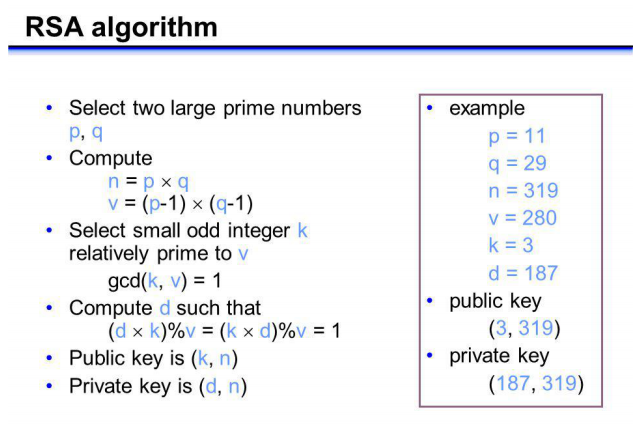

## 非对称加密

------

非对称加密（`asymmetric encryption`）又称为公钥加密（`public key cryptography`），它是另一种方法，使用两个密钥，而不是一个；其中一个密钥是私密的，另一个是公开的。

由于对信息进行加密和解密的运算量是可控制的，所以对称加密十分有用。但是它也有一个缺陷：发送者与接受者必须同时拥有密钥。他们甚至必须有物理上的接触，才能传递密钥。为了解决这个矛盾，人们引入了公钥加密技术（`1976`年由`Diffie`和`Hellman`提出）。这一体系的特点是加密密钥和解密密钥是不同的，并且当给出了一个筛选过的加密密钥后不可能推出对应的解密密钥。在这种特性下，加密密钥可被公开而只有解密密钥处于秘密状态。

为了让大家感受一下公钥密码体制，请看下面两个问题：

```go
问题1：314159265358979×314159265358979等于多少？
问题2：3912571506419387090594828508241的平方根是多少？
```

虽然平方和求平方根互为逆运算，但是它们在计算的复杂性上却有很大差异。这种不对称性构成了非对称加密的基础。在非对称密码体系中，加密运算比较简单，而没有密钥的解密运算却十分繁琐。

一种叫做`RSA`的公钥机制表明：对计算机来说，大数乘法比对大数进行因式分解要容易得多，特别是在使用取模算法进行运算且每个数字都有上百位时。这种机制广泛应用于密码领域。其他广泛使用的还有离散对数。公钥机制的主要问题在于运算速度要比对称密钥机制慢数千倍

## RSA

------

`RSA`（得名于三个人的姓氏首字母：`Ron Rivest`、`Adi Shamir`和`Leonard Adleman`）是目前最普遍部署的非对称加密算法。现在推荐的`RSA`强度是`2048`位，强度等同于`112`位的对称密钥。`RSA` 算法是一种非对称密码算法;这意味着它使用一个公钥和一个私钥(即两个不同的、数学上链接的密钥)。正如它们的名字所暗示的，公钥是公开共享的，而私钥是秘密的，不能与任何人共享。


`RSA`算法是以`1978`年发明它的`Ron Rivest`、`Adi Shamir`和`Leonard Adleman`的名字命名的。

#### 公私匙生成

公私钥生成步骤：

1. 1. 随机选择两个不相等的质数 `p` 和 `q`
2. 计算 `p` 和 `q` 的乘积 `n`（明文小于 `n`）
3. 计算 `n` 的欧拉函数 `v=φ(n)`
4. 随机选择一个整数 `k(1<k<v)`，且 `k` 与 `v` 互质
5. 计算 `k` 对于 `v` 的模反元素 `d`
6. 公钥：`(k,n)`，私钥 `(d,n)`


#### 加解密

`RSA` 加解密的过程非常简单：

1. 加密：`c ≡ m^k (mod n)`

2. 解密：`m ≡ c^d (mod n)`

3. 举例：对明文数字 `123` 加解密 

   公钥`（3,319）`加密：`123^3mod319=140`

对 `140` 密文用私钥`（187,319）`解密：`140^187mod319=123`


#### 数字签名

数字签名（`digital signature`）是一个密码学方案。它使得验证一条电子消息或者一篇电子文档的真实性成为可能。前面描述的`MAC`就是一种电子签名，它可以利用事先安全交换的散列密钥验证真实性。虽然这种校验非常有用，但仍有不足，因为它仍然依赖于一个私有密钥。借助公钥密码，数字签名可以与现实生活中的手写签名类似。我们可以利用公钥密码的非对称性设计出一种算法，使用私钥对消息进行签名，并使用对应的公钥验证它。

实际的方式依照选择的公钥密码体系而有所不同。下面以`RSA`为例。`RSA`可以用于加密，也可以用于解密。如果使用`RSA`私钥加密，那么仅能通过对应的公钥解密。我们可以利用这个性质，并且结合散列函数，实现数字签名：

1. 计算希望签名的文档的散列。不论输入文档的长度如何，输出长度总是固定的。比如，使用`SHA256`就是`256`位。
2. 对结果散列和一些额外的元数据进行编码。比如，接收方需要知道你使用的散列算法，否则不能处理签名。
3. 使用私钥加密编码过的数据，其结果就是签名，可以追加到文档中作为身份验证的依据。

为了验证签名，接收方接收文档并使用相同的散列算法独立计算文档散列。接着，她使用公钥对消息进行解密，将散列解码出来，再确认使用的散列算法是否正确，解密出的散列是否与本地计算的相同。这个方案的强度取决于加密、散列以及编码组件各自的强度。

