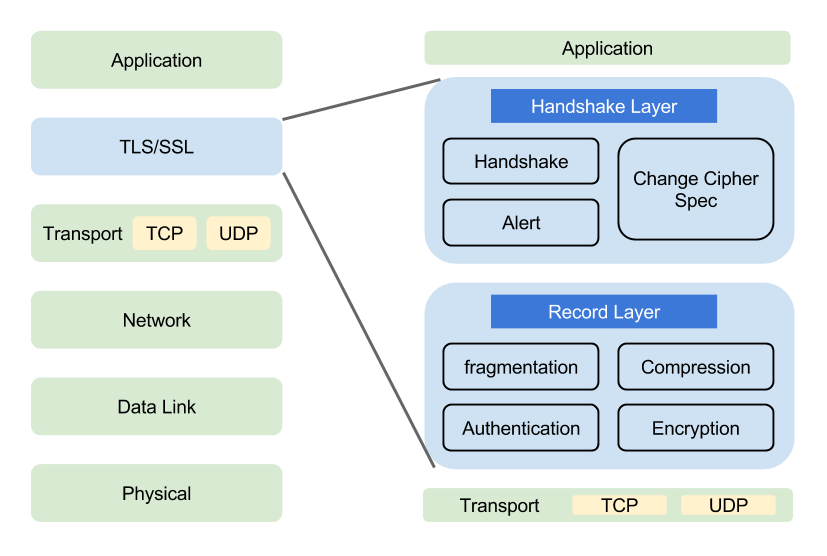

## TLS 协 议

-----

`TLS`是一种密码学协议，用于保证两个团体之间的会话安全。会话是由任意数量的消息组成的。本章将讨论最新的协议版本`TLS 1.2`，也会在合适的时候对之前的协议版本进行简要说明。我的目标是进行宏观概述，让你能够理解其工作原理，而不会因具体的实现细节分心。

#### 协议架构

`SSL/TLS`是一个安全通信框架，上面可以承载`HTTP`协议或者`SMTP/POP3`协议等。



而 `TLS` 协议本身主要分为两层，底层的是 `TLS` 记录协议，主要负责使用对称密码对消息进行加密。上层的是 `TLS` 握手协议，主要分为握手协议，密码规格变更协议和应用数据协议 `4`个部分。

+ 握手协议负责在客户端和服务器端商定密码算法和共享密钥，包括证书认证，是 `4` 个协议中最最复杂的部分。
+ 密码规格变更协议负责向通信对象传达变更密码方式的信号
+ 警告协议负责在发生错误的时候将错误传达给对方
+ 应用数据协议负责将TLS承载的应用数据传达给通信对象的协议。

## 记录协议

------

宏观上，`TLS`以记录协议（`record protocol`）实现。记录协议负责在传输连接上交换的所有底层消息，并可以配置加密。每一条`TLS`记录以一个短标头起始。标头包含记录内容的类型（或子协议）、协议版本和长度。消息数据紧跟在标头之后，如图所示。


可以更为正式地将 `TLS` 记录的字段定义为如下所示：

```c++
struct { 
 uint8 major; 
 uint8 minor; 
} ProtocolVersion; 	// 版本号，主版本和分版本

enum { 
 change_cipher_spec (20), 
 alert (21), 
 handshake (22), 
 application_data (23) 
} ContentType; // 协议类型，比如 23 表示握手协议

struct { 
 ContentType type; 
 ProtocolVersion version; 
 uint16 length; /* 最大长度为2^14（16 384）字节 */ 
 opaque fragment[TLSPlaintext.length]; 
} TLSPlaintext;
```

除了这些可见字段，还会给每一个`TLS`记录指定唯一的`64`位序列号，但不会在线路上传输。任一端都有自身的序列号并跟踪来自另一端记录的数量。这些值是对抗重放攻击的一部分。稍后你可以看到它的工作原理。

记录协议从多个重要的宏观角度对通信进行考量，是一个很有用的协议抽象。

**消息传输**

记录协议传输由其他协议层提交给它的不透明数据缓冲区。如果缓冲区超过记录的长度限制（`16 384`字节），记录协议会将其切分成更小的片段。反过来也是可能的，属于同一个子协议的小缓冲区也可以组合成一个单独的记录。

**加密以及完整性验证**

在一个刚建立起来的连接上，最初的消息传输没有受到任何保护（从技术上讲，就是使用了`TLS_NULL_WITH_NULL_NULL`密码套件）。这是必需的，否则第一次协商就无法进行。但是，一旦握手完成，记录层就开始按照协商取得的连接参数进行加密和完整性验证。

**压缩**

理论上，在加密之前透明地对数据进行压缩非常好，可是实践中几乎没有人这样做。这主要是因为每个应用在`HTTP`层就已经对它们的出口流量进行过压缩。这个特性在`2012`年遭受过一次严重打击，当时`CRIME`攻击使压缩成为不安全的特性，所以现在也不会再被使用。

**扩展性**

记录协议只关注数据传输和加密，而将所有其他特性转交给子协议。这个方法使TLS可以扩展，因为可以很方便地添加子协议。伴随着记录协议而被加密，所有子协议都会以协商取得的连接参数自动得到保护。

`TLS`的主规格说明书定义了四个核心子协议：握手协议（`handshake protocol`）、密钥规格变更协议（`change cipher spec protocol`）、应用数据协议（`application data protocol`）和警报协议（`alert protocol`）。这些核心子协议都是通过记录协议进行信息传输。

子协议报文存储于记录报文的数据部分，拿下面的握手协议报文举例，握手协议部分包含在记录报文的数据部分：


## 握手协议

-------

握手是`TLS`协议中最精密复杂的部分。在这个过程中，通信双方协商连接参数，并且完成身份验证。根据使用的功能的不同，整个过程通常需要交换`6~10`条消息。根据配置和支持的协议扩展的不同，交换过程可能有许多变种。

在使用中经常可以观察到以下三种流程：

1. 完整的握手，对服务器进行身份验证；
2. 恢复之前的会话采用的简短握手；
3. 对客户端和服务器都进行身份验证的握手。

握手协议消息的标头信息包含消息类型（`1`字节）和长度（`3`字节），余下的信息则取决于消息类型：

```c
struct { 
 HandshakeType msg_type; 
 uint24 length; 
 HandshakeMessage message; 
} Handshake;
```

#### 完整的握手

每一个`TLS`连接都会以握手开始。如果客户端此前并未与服务器建立会话，那么双方会执行一次完整的握手流程来协商`TLS`会话。握手过程中，客户端和服务器将进行以下四个主要步骤：

1. 交换各自支持的功能，对需要的连接参数达成一致。
2. 验证出示的证书，或使用其他方式进行身份验证。
3. 对将用于保护会话的共享主密钥达成一致。
4. 验证握手消息并未被第三方团体修改。

本节会讨论最常见的 `TLS` 握手流程，就是一种在不需要身份验证的客户端与需要身份验证的服务器之间的握手，如图所示。后面几节将介绍其他的流程：客户端身份验证和会话恢复。

(1) 客户端开始新的握手，并将自身支持的 `TLS` 功能提交给服务器，*此时服务端拿到一个客户端随机数*。

(2) 服务器选择连接参数。

(3) 服务器发送其证书链（仅当需要服务器身份验证时），*公钥被发送到客户端。*

(4) 根据选择的密钥交换方式，服务器发送生成主密钥的额外信息，*此时客户端将拿到一个随机数*。

(5) 服务器通知自己完成了协商过程。

(6) 客户端发送生成主密钥所需的额外信息。客户端已经拿到足够信息，*生成预主密钥*。

(7) 客户端切换加密方式并通知服务器，客户端生成主密钥，*一个预主秘钥，两个随机数，客户端生成主密钥*。

(8) 客户端计算发送和接收到的握手消息的 `MAC` 并发送 *预主密钥加密发送给服务端(rsa)*。

(9) 服务器切换加密方式并通知客户端 *服务端计算出了主密钥*。

(10) 服务器计算发送和接收到的握手消息的 `MAC` 并发送 *开始加密通信*。


假设没有出现错误，到这一步，连接就建立起来了，可以开始发送应用数据。现在让我们了解一下这些握手消息的更多细节。

**1.ClientHello**

在一次新的握手流程中，`ClientHello`消息总是第一条消息。这条消息将客户端的功能和首选项传送给服务器。客户端会在新建连接后，希望重新协商或者响应服务器发起的重新协商请求（由`HelloRequest`消息指示）时，发送这条消息。

在下面的例子中，你可以观察到`ClientHello`消息。为了更简洁，我减少了一些信息展示，但是包含了所有的关键元素。

```yaml
Handshake protocol: ClientHello 
 Version: TLS 1.2 
 Random 
   Client time: May 22, 2030 02:43:46 GMT 
   Random bytes: b76b0e61829557eb4c611adfd2d36eb232dc1332fe29802e321ee871 
   Session ID: (empty) 
 Cipher Suites 
   Suite: TLS_ECDHE_RSA_WITH_AES_128_GCM_SHA256 
   Suite: TLS_DHE_RSA_WITH_AES_128_GCM_SHA256 
   Suite: TLS_RSA_WITH_AES_128_GCM_SHA256 
   Suite: TLS_ECDHE_RSA_WITH_AES_128_CBC_SHA 
   Suite: TLS_DHE_RSA_WITH_AES_128_CBC_SHA 
   Suite: TLS_RSA_WITH_AES_128_CBC_SHA 
   Suite: TLS_RSA_WITH_3DES_EDE_CBC_SHA 
   Suite: TLS_RSA_WITH_RC4_128_SHA 
 Compression methods 
   Method: null 
 Extensions 
   Extension: server_name 
   Hostname: www.feistyduck.com 
   Extension: renegotiation_info 
   Extension: elliptic_curves 
   Named curve: secp256r1 
   Named curve: secp384r1 
   Extension: signature_algorithms 
   Algorithm: sha1/rsa 
   Algorithm: sha256/rsa 
   Algorithm: sha1/ecdsa 
   Algorithm: sha256/ecdsa
```

可以看到，绝大多数消息字段光看名称就很容易理解，而且消息的结构也很容易理解。

+ *Version*  

  协议版本（`protocol version`）指示客户端支持的最佳协议版本。

+ *Random*  

  随机数（`random`）字段包含`32`字节的数据。当然，只有`28`字节是随机生成的；剩余的`4`字节包含额外的信息，受客户端时钟的影响。准确来说，客户端时间与协议不相关，而且协议规格文档中言及此事时也很清楚（“基本的`TLS`协议不需要正确设置时钟，更高层或应用协议可以定义额外的需求项。”）；该字段是`1994`年在`Netscape Navigator`中发现了一个严重故障之后，为了防御弱随机数生成器而引入的。尽管这个字段曾经一直含有精确时间的部分，但现在仍然有人担心客户端时间可能被用于大规模浏览器指纹采集，所以一些浏览器会给它们的时间添加时钟扭曲（正如你在示例中所看到的那样），或者简单地发送随机的`4`字节。在握手时，客户端和服务器都会提供随机数。这种随机性对每次握手都是独一无二的，在身份验证中起着举足轻重的作用。它可以防止重放攻击，并确认初始数据交换的完整性。

+ *Session ID* 

  在第一次连接时，会话ID（session ID）字段是空的，这表示客户端并不希望恢复某个已存在的会话。在后续的连接中，这个字段可以保存会话的唯一标识。服务器可以借助会话ID在自己的缓存中找到对应的会话状态。典型的会话ID包含32字节随机生成的数据，这些数据本身并没有什么价值。

+ *Cipher Suites* 

  密码套件（`cipher suite`）块是由客户端支持的所有密码套件组成的列表，该列表是按优先级顺序排列的。

+ *Compression* 

  客户端可以提交一个或多个支持压缩的方法。默认的压缩方法是`null`，代表没有压缩。

+ *Extensions* 

  扩展（`extension`）块由任意数量的扩展组成。这些扩展会携带额外数据。我会在本章后面对最常见的扩展进行讨论。

**2.ServerHello**

`ServerHello`消息的意义是将服务器选择的连接参数传送回客户端。这个消息的结构与`ClientHello`类似，只是每个字段只包含一个选项。

```yaml
Handshake protocol: ServerHello 
 Version: TLS 1.2 
 Random 
   Server time: Mar 10, 2059 02:35:57 GMT 
   Random bytes: 8469b09b480c1978182ce1b59290487609f41132312ca22aacaf5012 
 Session ID: 4cae75c91cf5adf55f93c9fb5dd36d19903b1182029af3d527b7a42ef1c32c80 
 Cipher Suite: TLS_ECDHE_RSA_WITH_AES_128_GCM_SHA256 
 Compression method: null 
 Extensions
   Extension: server_name 
   Extension: renegotiation_info
```

服务器无需支持客户端支持的最佳版本。如果服务器不支持与客户端相同的版本，可以提供某个其他版本以期待客户端能够接受。

**3.Certificate**

典型的`Certificate`消息用于携带服务器`X.509`证书链。证书链是以`ASN.1 DER`编码的一系列证书，一个接着一个组合而成。主证书必须第一个发送，中间证书按照正确的顺序跟在主证书之后。根证书可以并且应该省略掉，因为在这个场景中它没有用处。

服务器必须保证它发送的证书与选择的算法套件一致。比方说，公钥算法与套件中使用的必须匹配。除此以外，一些密钥交换算法依赖嵌入证书的特定数据，而且要求证书必须以客户端支持的算法签名。所有这些都表明*服务器需要配置多个证书*（每个证书可能会配备不同的证书链）。

`Certificate`消息是可选的，因为并非所有套件都使用身份验证，也并非所有身份验证方法都需要证书。更进一步说，虽然消息默认使用`X.509`证书，但是也可以携带其他形式的标志；一些套件就依赖`PGP`密钥。

**4.ServerKeyExchange**

`ServerKeyExchange`消息的目的是携带密钥交换的额外数据。消息内容对于不同的协商算法套件都会存在差异。在某些场景中，服务器不需要发送任何内容，这意味着在这些场景中根本不会发送`ServerKeyExchange`消息。

**5. ServerHelloDone**

`ServerHelloDone` 消息表明服务器已经将所有预计的握手消息发送完毕。在此之后，服务器会等待客户端发送消息。

**6. ClientKeyExchange**

`ClientKeyExchange` 消息携带客户端为密钥交换提供的所有信息。这个消息受协商的密码套件的影响，内容随着不同的协商密码套件而不同。

**7. ChangeCipherSpec**

`ChangeCipherSpec` 消息表明发送端已取得用以生成连接参数的足够信息，已生成加密密钥，并且将切换到加密模式。客户端和服务器在条件成熟时都会发送这个消息。

**8. Finished**

`Finished`消息意味着握手已经完成。消息内容将加密，以便双方可以安全地交换验证整个握手完整性所需的数据。这个消息包含`verify`_`data`字段，它的值是握手过程中所有消息的散列值。这些消息在连接两端都按照各自所见的顺序排列，并以协商新得到的主密钥计算散列。这个过程是通过一个伪随机函数（`pseudorandom function`，`PRF`）来完成的，这个函数可以生成任意数量的伪随机数据。我将在本章的后续部分中对其进行介绍。散列函数与`PRF`一致，除非协商的套件指定使用其他算法。两端的计算方法一致，但会使用不同的标签：客户端使用`client finished`，而服务器则使用`server finished`。

```go
verify_data = PRF(master_secret, finished_label, Hash(handshake_messages)) 
```

因为`Finished`消息是加密的，并且它们的完整性由协商`MAC`算法保证，所以主动网络攻击者不能改变握手消息并对`vertify`_`data`的值造假。理论上攻击者也可以尝试找到一组伪造的握手消息，得到的值与真正消息计算出的`verity`_`data`的值完全一致。这种攻击本身就非常不容易，而且因为散列中混入了主密钥（攻击者不知道主密钥），所以攻击者根本不会尝试。

在`TLS 1.2`版本中，`Finished`消息的长度默认是`12`字节（`96`位），并且允许密码套件使用更长的长度。在此之前的版本，除了`SSL 3`使用`36`字节的定长消息，其他版本都使用`12`字节的定长消息。

#### 客户端身份验证

//TODO

#### 会话恢复

完整的握手协议非常复杂，需要很多握手消息和两次网络往返才能开始发送客户端应用数据。此外，握手执行的密钥学操作通常需要密集的`CPU`处理。身份验证通常以客户端和服务器证书验证（以及证书吊销检查）的形式完成，需要更多的工作。这其中的许多消耗都可以通过简短握手的方式节约下来。

最初的会话恢复机制是，在一次完整协商的连接断开时，客户端和服务器都会将会话的安全参数保存一段时间。希望使用会话恢复的服务器为会话指定唯一的标识，称为会话`ID`。服务器在

`ServerHello`消息中将会话`ID`发回客户端。

希望恢复早先会话的客户端将适当的会话`ID`放入`ClientHello`消息，然后提交。服务器如果愿意恢复会话，就将相同的会话`ID`放入`ServerHello`消息返回，接着使用之前协商的主密钥生成一套新的密钥，再切换到加密模式，发送`Finished`消息。客户端收到会话已恢复的消息以后，也进行相同的操作。这样的结果是握手只需要一次网络往返。简短握手如图所示。


用来替代服务器会话缓存和恢复的方案是使用会话票证（`sesession ticket`）。它是`2006`年引入的（参见`RFC 4507`），随后在`2008`年进行了更新（参见`RFC 5077`）。使用这种方式，除了所有的状态都保持在客户端（与`HTTP Cookie`的原理类似）之外，其消息流与服务器会话缓存是一样的。

#### TLS 1.3 中的握手协议

`TLS 1.3` 使用 `ECDH` 非对称加密协议实现秘钥共享，将 `TLS1.2` 中的两个 `RTT` 优化成了一个 `RTT`，具体流程如下所示：


客户端先生成 `DH` 协议中的客户端私钥，之后计算公钥发给服务器，因为服务器可能使用多种密码套件，所以客户端会一次性发出多个密码套件对应的公钥。服务端计算完成之后直接生成服务端私钥，并且返回给客户端一个服务端公钥，并且进行证书校验，之后两端就可以进行加密传输了。

#### 重启会话

基于 `session id` 的重启策略如下所示，首先客户端储存对话的 `session id` 和 `session key`，服务端同样对二者进行缓存，再次请求的时候一旦 `session id` 不为空且命中缓存，则使用上次的 `session key` 继续会话。


但是这样的策略同样会产生问题，首先分布式的负载均衡的服务器 `session id` 不是共享的，命中率低，同时缓存会占用服务器大量内存。

于是衍生出了由 `session ticket` 实现的会话重启，首先 `session ticket` 和 `session key` 都是存储在客户端的，但是 `session ticket` 包含 `session key` 以及会话信息并且由服务端进行过加密。客户端再次访问的时候会发送 `session ticket` 给服务端，服务端进行解码之后能解密出 `session key` 则证明 `session ticket` 合法，则双方使用 `session key` 继续会话，


## 身份验证

------

在`TLS`中，为了避免重复执行密码操作造成巨大开销，身份验证与密钥交换紧紧捆绑在一起。大多数场景中，身份验证的基础是证书支持的公钥密码（最常见的是`RSA`，有时也用`ECDSA`）。一旦证书验证通过，客户端就知道了使用的公钥。在此之后，客户端将公钥交给指定的密钥交换算法，并由它负责以某种方式使用公钥验证另一端。

在`RSA`密钥交换的过程中，客户端生成一个随机值作为预主密钥，并以服务器公钥加密后发送出去。拥有对应私钥的服务器解码消息得到预主密钥。身份验证原理很清楚：只有拥有对应私钥的服务器才能取得预主密钥，构造正确的会话密钥，并生成正确的`Finished`消息。

在`DHE`和`ECDHE`的交换过程中，服务器为密钥交换提供自己的参数，并使用自己的私钥签名。客户端持有对应的公钥（从已验证的证书中获得），可以验证参数是否真正出自期望的服务器。

## 秘钥交换

----

密钥交换是握手过程中最引人入胜的部分。在`TLS`中，会话安全性取决于称为主密钥（`master secret`）的`48`字节共享密钥。密钥交换的目的是计算另一个值，即预主密钥（`premaster secret`）。这个值是组成主密钥的来源。

`TLS`支持许多密钥交换算法，能够支持各种证书类型、公钥算法和密钥生成协议。它们之中有一些在`TLS`协议主规格书中定义，但更多的则是在其他规格说明中定义。你可以在表中找到最常用的算法。


使用哪一种密钥交换由*协商的套件*所决定。一旦套件决定下来，两端都能了解按照哪种算法继续操作。实际使用的密钥交换算法主要有以下 `4` 种。

**RSA** 

`RSA`是一种事实上的标准密钥交换算法，它得到了广泛的支持。但它受到一个问题的严重威胁：它的设计使被动攻击者可以解码所有加密数据，只要她能够访问服务器的私钥。因此，`RSA`密钥交换正慢慢被其他支持前向保密（`forward secrecy`）的算法所替代。`RSA`密钥交换是一种密钥传输（`key transport`）算法，这种算法由客户端生成预主密钥，并以服务器公钥加密传送给服务器。

**DHE_RSA** 

临时`Diffie-Hellman`（`ephemeral Diffie-Hellman`，`DHE`）密钥交换是一种构造完备的算法。它的优点是支持前向保密，缺点是执行缓慢。`DHE`是一种密钥协定算法，进行协商的团体都对密钥生成产生作用，并对公共密钥达成一致。在`TLS`中，`DHE`通常与`RSA`身份验证联合使用。

**ECDHE_RSA和ECDHE_ECDSA** 

临时椭圆曲线`Diffie-Hellman`（`ephemeral elliptic curve Diffie-Hellman`，`ECDHE`）密钥交换建立在椭圆曲线加密的基础之上。椭圆曲线算法是相对较新的算法。大家认可它执行很快而且提供了前向保密。但是只有较新的客户端才能较好地支持。`ECDHE`也是一种密钥协定算法，其理论原理与`DHE`类似。在`TLS`中，`ECDHE`可以与`RSA`或者`ECDSA`身份验证一起使用。

不论使用哪一种密钥交换，服务器都有机会发送 `ServerKeyExchange` 消息率先发话：

```go
struct { 
 select (KeyExchangeAlgorithm) { 
 case dh_anon: 
 	ServerDHParams params; 
 case dhe_rsa: 
 	ServerDHParams params; 
 	Signature params_signature; 
 case ecdh_anon: 
 	ServerECDHParams params; 
 case ecdhe_rsa: 
 case ecdhe_ecdsa: 
 	ServerECDHParams params; 
 	Signature params_signature; 
 case rsa: 
 case dh_rsa: 
 	/* 无消息 */ 
 }; 
} ServerKeyExchange;
```

你可以在上面的消息定义中发现，在某些算法内，服务器不发送任何信息。原因是在这些情况下，所有需要的信息已经通过其他消息得到；不然，服务器就会在此发送其密钥交换的参数。关键的是，服务器也会发送参数的签名用于身份验证。使用签名，客户端得以确认它正在与持有私钥对应证书中的公钥的团体进行通信。

客户端会发送 `ClientKeyExchange` 消息传送它的密钥交换参数，这个消息总是必需的：

```go
struct { 
 select (KeyExchangeAlgorithm) { 
 case rsa: 
 	EncryptedPreMasterSecret; 
 case dhe_dss: 
 case dhe_rsa: 
 case dh_dss: 
 case dh_rsa: 
 case dh_anon: 
	ClientDiffieHellmanPublic; 
 case ecdhe: 
 	ClientECDiffieHellmanPublic; 
 } exchange_keys; 
} ClientKeyExchange;
```

#### RSA 密钥交换

`RSA`密钥交换的过程十分直截了当。客户端生成预主密钥（`46`字节随机数），使用服务器公钥对其加密，将其包含在`ClientKeyExchange`消息中，最后发送出去。服务器只需要解密这条消息就能取出预主密钥。

`RSA`密钥交换的简单性也是它最大的弱点。用于加密预主密钥的服务器公钥，一般会保持多年不变。任何能够接触到对应私钥的人都可以恢复预主密钥，并构建相同的主密钥，从而危害到会话安全性。

对目标的攻击并不需要实时进行，强大的对手可以制定长期行动。攻击者会记录所有加密的流量，耐心等待有朝一日可以得到密钥。比如，计算机能力的进步使暴力破解成为可能；也可以通过法律强制力、政治高压、贿赂或强行进入使用该密钥的服务器来取得密钥。只要密钥泄露，就可以解密之前记录的所有流量了。

`TLS`中其他常见的密钥交换方式都不受这个问题的影响，被称为支持前向保密。使用那些密钥交换时，每个连接使用的主密钥相互独立。泄露的服务器密钥可以用于冒充服务器，但不能用于追溯解密任何流量。

#### Diffie-Hellman 密钥交换

`Diffie-Hellman`（`DH`）密钥交换是一种密钥协定的协议，它使两个团体在不安全的信道上生成共享密钥成为可能。


>  **注意** 以这种方式协商共享密钥时不会受到被动攻击的威胁，但主动攻击者却可以劫持通信信道，冒充对端。这就是 `DH` 密钥交换通常与身份验证联合使用的原因。

抛开算法的细节，`DH` 的诀窍是使用了一种正向计算简单、逆向计算困难的数学函数，即使交换中某些因子已被知晓，情况也是一样。最恰当的类比示例是混色：如果有两种颜色，那么很容易将其混在一起得到第三种颜色；但是如果只有第三种颜色的话，就很难确定究竟它是由哪两种颜色混合而成的。

`DH`密钥交换需要`6`个参数：其中两个（`dh_p`和`dh_g`）称为域参数，由服务器选取。协商过程中，客户端和服务器各自生成另外两个参数，相互发送其中一个参数（`dh_Ys`和`dh_Yc`）到对端，再经过计算，最终得到共享密钥。

计算过程大概如下：

(1) 首先协定使用 *p*=23 以及 *g*=5；

(2) 爱丽丝选择一个秘密整数 , 计算并发送给鲍伯，`A` 即爱丽斯的公钥，`a` 为爱丽斯的私钥。

(3) 鲍伯选择一个秘密整数 , 计算并发送给爱丽丝，`B` 即鲍勃的公钥，`b` 为鲍勃的私钥。

(4) 爱丽丝计算 。

(5) 鲍伯计算 。

#### 椭圆曲线 Diffie-Hellman 密钥交换

临时椭圆曲线`Diffie-Hellman`（`elliptic curve Diffie-Hellman`，`ECDH`）密钥交换原理与`DH`相似，但它的核心使用了不同的数学基础。正如名称所示，`ECDHE`基于椭圆曲线（`elliptic curve`，`EC`）加密。

## 密码操作

-----

本节会对协议中一些重要的方面进行简单讨论：伪随机函数、构建主密钥和生成连接密钥。

#### 伪随机函数

在`TLS`中，伪随机函数（`pseudorandom function`，`PRF`）用于生成任意数量的伪随机数据。`PRF`使用一条秘密、一颗种子和一个唯一标签。从`TLS 1.2`起，所有的算法套件都需要明确指定它们的`PRF`。所有`TLS 1.2`套件都使用基于`HMAC`和`SHA256`的`PRF`。以`TLS 1.2`协商的过往老套件也会使用与此相同的`PRF`。

`TLS 1.2`定义的`PRF`基于数据扩展函数`P_hash`，这个函数使用了`HMAC`和一个任意散列函数：

```go
P_hash(secret, seed) = HMAC_hash(secret, A(1) + seed) + 
 HMAC_hash(secret, A(2) + seed) + 
 HMAC_hash(secret, A(3) + seed) + ...
```

`A(i)` 函数定义如下：

```go
A(1) = HMAC_hash(secret, seed) 
A(2) = HMAC_hash(secret, A(1)) 
... 
A(i) = HMAC_hash(secret, A(i-1))
```

`PRF` 则是结合标签和种子对 `P_hash` 的封装：

```go
PRF(secret, label, seed) = P_hash(secret, label + seed)
```

引入种子和标签允许在不同的环境中重用相同的秘密，而且能够生成不同的输出（因为标签和种子不同）。

#### 主密钥

前面大家已经看到，密钥交换过程的输出是预主密钥。对这个值进行进一步加工，就是使用`PRF`生成`48`字节（`384`位）主密钥：

```go
master_secret = PRF(pre_master_secret, "master secret", 
 ClientHello.random + ServerHello.random)
```

因为使用不同的密钥交换方法，得到的预主密钥长度可能不同，所以需要执行这个步骤。同时，因为客户端和服务器的随机字段被用作种子，所以主密钥实际上也是随机的，且与协商握手绑定。

秘钥交换的过程中服务端和客户端最后都能拿到预主秘钥，之后就使用其生成的主密钥进行加密传输。

#### 密钥生成

连接所需的密钥材料是用单一的 `PRF` 调用基于主密钥和客户端、服务器的随机数生成的：

```go
key_block = PRF(master_secret, "key expansion", 
 server_random + client_random)
```

密钥块的长度根据协商的参数而有所不同。密钥块分为六个密钥：两个`MAC`密钥、两个加密密钥和两个初始向量（只在必要时生成；序列密码不会使用`IV`）。`AEAD`套件不使用`MAC`密钥。不同的密钥用于不同的操作，这样可以预防当共享相同密钥时，密钥学基元之间出现不可预见的交互。同样，因为客户端和服务器都拥有各自的一组密钥，由其中一方产生的消息不会被解释成是由另一方产生的。这个设计决策使协议更加可靠。

> **注意** 当恢复会话时，在生成密钥块时使用相同的主密钥，但 `PRF` 以当前握手时客户端和服务器的随机值进行种子设定。因为每次握手时的随机值都不同，所以密钥每次也不同。

## 密码套件

------

`TLS`为实现所需的安全属性提供了非常大的灵活性。它是一个创造实际密码协议的框架。虽然以往版本将某些加密基元硬编码到了协议中，但`TLS 1.2`是完全可配置的。密码套件是一组选定的加密基元和其他参数，它可以精确定义如何实现安全。套件大致由以下这些属性定义。

+ 身份验证方法

+ 密钥交换方法

+ 加密算法

+ 加密蜜钥大小

+ 密码模式（可应用时）

+ `MAC`算法（可应用时）

+ `PRF`（只有`TLS 1.2`一定使用，其他版本取决于各自协议）

+ 用于`Finished`消息的散列函数（`TLS 1.2`） 

+ `verify`_`data`结构的长度（`TLS 1.2`）

密码套件都倾向于使用较长的描述性名称，并且相当一致：它们都由密钥交换方法、身份验证方法、密码定义以及可选的`MAC`或`PRF`算法组合而成，如图所示。


虽然套件名称传达所有安全性参数时并不充分，但借其可以轻松推断出最重要的那些参数。此外，其他参数则可以在`RFC`上通过套件定义找到。

对于身份验证，其强度主要依靠证书，更确切地说是证书中的密钥长度和签名算法。`RSA`密钥交换的强度也依赖证书。可以为`DHE`和`ECDHE`密钥交换配置不同的强度，这通常是在服务器级别的配置中完成的。某些服务器将这些配置暴露给最终用户，而另一些不会。

## 加密

------

经过上面的握手协议的协商以及秘钥交换，服务端和客户端都拿到了他们的主密钥，并且商定好了对称加密算法，之后就可以进行加密通信了。**这一部分其实应该算作是记录协议的部分**。

`TLS`可以使用各种方法加密数据，比如使用`3DES`、`AES`、`ARIA`、`CAMELLIA`、`RC4`或者`SEED` 等算法。目前使用最为广泛的加密算法是`AES`。`TLS`支持三种加密类型：序列密码、分组密码和已验证的加密。在`TLS`中，完整性验证是加密处理的一部分；它要么在协议级中显式处理，要么由协商的密码隐式处理。

#### 序列加密

使用序列密码时，加密由两步组成。第一步，计算`MAC`值，范围包含记录*序列号、标头、明文*。`MAC`包含标头能确保未进行加密的标头不会遭受篡改。`MAC`包括序列号，能确保消息不被重放。第二步，加密明文和`MAC`，生成密文。整个过程如图所示。


#### 分组加密

使用分组密码时，加密会涉及更多内容，因为需要为分组加密的特性准备解决方案。具体来说，需要以下几个步骤，如图所示：

(1) 计算序列号、标头和明文的 `MAC`。

(2) 构造填充，确认加密前的数据长度是分组大小（通常 `16` 字节）的整数倍。

(3) 生成一个长度与分组大小一致的不可预期的初始向量（`initialization vector，IV`）。`IV` 能保证加密是不确定的。

(4) 使用 `CBC` 分组模式加密明文、`MAC` 和填充。

(5) 将 `IV` 和密文一起发送。


另一种处理安排方式的提案称为先加密，再计算`MAC`（`encrypt-then-MAC`），最近才被公开提出。在这种替代方案中，首先对明文和填充进行加密，再将结果交给`MAC`算法。这可以保证主动网络攻击者不能操纵任何加密数据。

#### 已验证的加密

已验证的密码将加密和完整性验证合二为一，全名是使用关联数据的已验证加密（`authenticated encryption with associated data`，`AEAD`）。表面上，它看起来是序列密码和分组密码的交叉。它不用填充，也不用初始向量，而是使用一个特殊的值，称为`nonce`（在加密通信中仅使用一次的密钥）。这个值必须唯一。加密过程比使用分组密码要简单一些，如图所示：

(1) 生成一个唯一的 `64` 位 `nonce`。

(2) 使用已验证加密算法加密明文；同时也将序列号和记录标头作为完整性验证依据的额外数据交给算法。

(3) 将 `nonce` 和密文一起发送。


已验证加密被认为是当前`TLS`中可用的加密模式中最好的一种，因为它可以避免`MAC-then``encrypt`方式带来的问题。虽然`TLS`当前定义基于`GCM`和`CCM`块模式的已验证套件，实际上仅支持`GCM`套件。基于`ChaCha20`流密码的全新已验证套件当前正在进行标准化。

## 重新协商

-----

大部分 `TLS` 连接都以握手作为起点，经过应用数据的交换，最后关闭会话。但如果请求重新协商，就会发起一次新的握手，对新的连接安全参数达成一致。这个功能在以下这些情形下很有用。

**客户端证书**

客户端证书并不常用，但因为它可以提供双因素身份验证，所以还是有一些网站在使用它。部署客户端证书有两种方法。你可以要求连接到网站的所有连接都需要客户端证书，但是这种方式对那些（还）没有证书的使用者并不友好；在连接成功以前，你无法向它们发送任何信息和说明。处理错误的情况同样不可能。因此，许多操作员会选择允许连接到网站根路径的连接不携带证书，并设计一个需要提供客户端证书的子区域。当用户打算浏览子区域时，服务器发起重新协商请求，要求客户端提供证书。

**隐藏消息**

上述的双步控制方式使客户端证书具备了一个额外的优势：因为第二次握手是加密的，这意味着被动攻击者无法监视协商，而且最关键的是攻击者根本无法观察到客户端证书。这解决了非常重要的潜在隐私问题，因为客户端证书通常包含身份识别信息。比如，`Tor`协议就是用这种方式进行重新协商的。 

**改变加密强度**

以前，当网站加密刚刚出现（而且是CPU密集的）的时候，经常可以发现网站将加密配置分成两个级别。你可以默认使用比较弱的加密，而在特定区域使用强加密。如果要使用客户端证书，则通过重新协商实现这个功能。当你尝试进入网站中更安全的子区域时，服务器将请求更强的安全性。

此外，在以下两种情况下协议需要使用重新协商，不过这两种情况在实际工作中都不大可能发生。

**服务网关密码**

`20`世纪`90`年代，美国还未允许出口强密码算法，一个称为服务网关密码（`Server-Gated Crypto`，`SGC`）的功能使美国供应商能够将强密码算法输出到世界范围，但仅对选定的（主要是金融业的）美国网站有效。浏览器默认使用的是弱加密，遇到特定证书以后升级至强证书。整个升级过程由客户端控制，通过重新协商实现。只有少数选定的`CA`获得允许签发这种特定证书。密码输出限制于`2000`年解除，`SGC`随之废弃。

**TLS记录的计数器溢出**

`TLS`内部将数据包装成记录，并为每个记录指定唯一的`64`位序列号。每当发生记录交换时，序列号就随之增长。一旦序列号接近溢出，协议就会强制执行重新协商。然而，因为这个计数器本身的数字就非常大，所以实践中不太可能出现溢出。

协议允许客户端在任意时间简单地发送新的`ClientHello`消息请求重新协商，就如同建立一个全新的连接一样，这被称为客户端发起的重新协商（`client-initiated renegotiation`）。如果服务器希望重新协商，它会发送`HelloRequest`协议消息给客户端。这个消息通知客户端停止发送应用数据，并开始新的握手，这被称为服务器发起的重新协商（`server-initiated renegotiation`）。

正如原本设计的那样，重新协商并不安全，并且可被主动网络攻击者以很多方式滥用。它的弱点于`2009`年被发现，然后通过引进`renegotiation`_`info`扩展得以修正。我将在本章后面对这个扩展进行讨论。

## 应用数据协议

------

应用数据协议携带着应用消息，只以 `TLS` 的角度考虑的话，这些就是数据缓冲区。记录层使用当前连接安全参数对这些消息进行打包、碎片整理和加密。

## 警报协议

------

警报的目的是以简单的通知机制告知对端通信出现异常状况。它通常会携带 `close_notify` 异常，在连接关闭时使用，报告错误。警报非常简单，只有两个字段：

```c
struct { 
 AlertLevel level; 
 AlertDescription description; 
} Alert;
```

`AlertLevel`字段表示警报的严重程度，可取值`warning`或者`fatal`。`AlertDescription`直接表示警报代码。不论这种设计是好是坏，警报都没有表达任意信息的能力，比如实际的错误提示。

严重程度为`fatal`的消息会立即终止当前连接并使会话失效（相同会话的其他正在进行的连接会继续，但会话绝不可能恢复了）。发送警告通知的一端不会主动终止连接，而是交由接收端通过发送它自己的严重警报对该警告自行作出反应。

#### 关闭连接

关闭连接警报（`closure alert`）用于以有序的方式关闭`TLS`连接。一旦一端决定关闭连接，就会发送一个`close_notify` 警报。另一端收到这个警报以后，会丢弃任何还未写出的数据，并发送自己的`close`_`notify`警报。在警报之后到来的任何消息都将被忽略。

这个关闭协议虽然简单，但它可以避免截断攻击，也就是主动攻击者打断通信过程，阻断所有后续消息的攻击，因而是必需的。如果没有关闭协议，通信双方就无法确认是遭到攻击还是通信真正结束。

