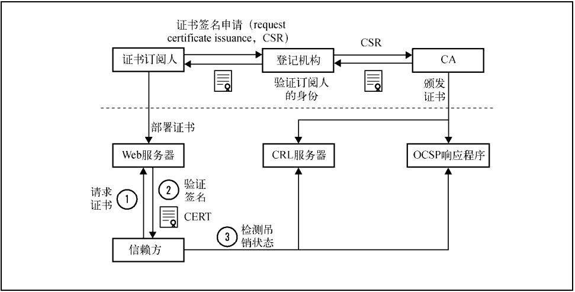
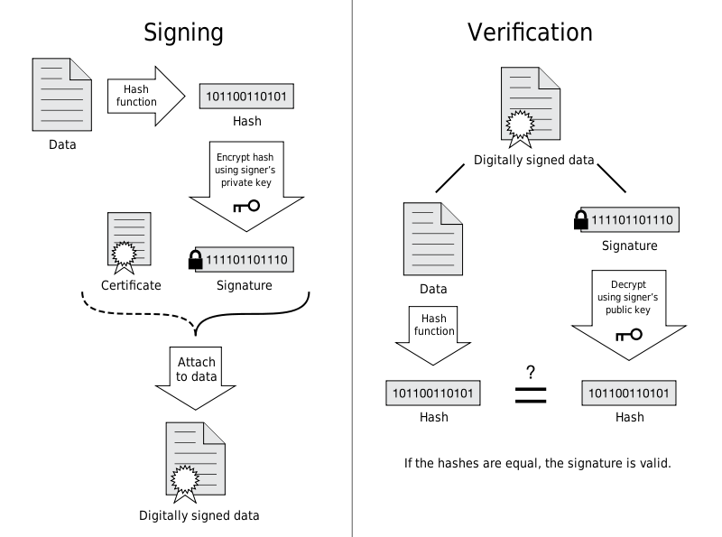
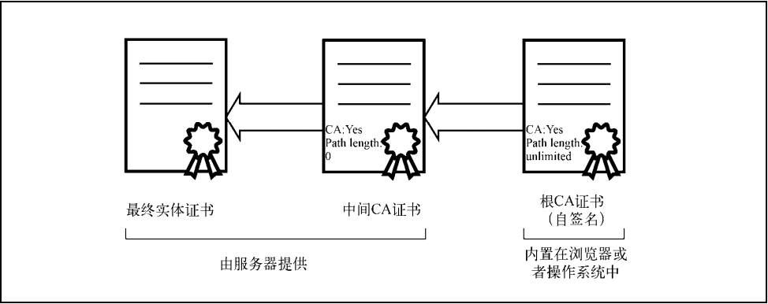
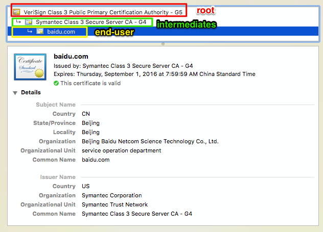
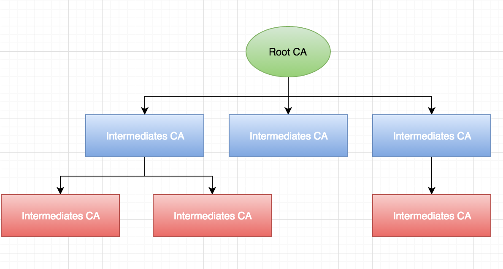
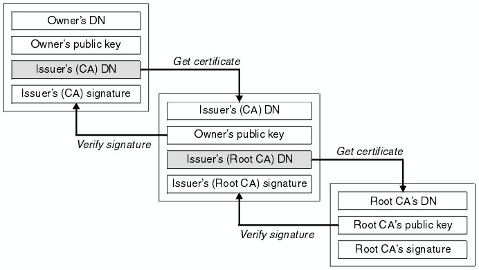

## 公钥基础设施

------

公钥基础设施（`public key infrastructure`，`PKI`），对大多数人来说，`PKI`就是互联网公钥基础设施。实际上`PKI`的含义更宽泛，因为其原本是为了别的用途而开发的。因此更准确的说法是，由`PKIX`工作组为适应`PKI`在互联网上的使用而提出的互联网公钥基础设施（`Internet PKI`）；另外一个最近常被用到的词是`Web PKI`，主要关注在浏览器上如何使用和验证证书。

`PKI`的目标就是实现不同成员在不见面的情况下进行安全通信，我们当前采用的模型是基于可信的第三方机构，也就是证书颁发机构（`certification authority`或`certificate authority`，`CA`）签发的证书。互联网`PKI`证书生命周期如图所示。

*订阅人*

订阅人（或者说最终实体）是指那些需要证书来提供安全服务的团体。

*登记机构*

登记机构（`registration authority`，`RA`）主要是完成一些证书签发的相关管理工作。例如，`RA`会首先对用户进行必要的身份验证，然后才会去找`CA`签发证书。在某些情况下，当`CA`希望在用户附近建立一个分支机构时（例如在不同的国家建立当地登记中心），我们也称`RA`为本地登记机构（`local registrationauthority`，`LRA`）。实际上，很多`CA`也执行`RA`的职责。

*证书颁发机构*

证书颁发机构（`certification authority`，`CA`）是指我们都信任的证书颁发机构，它会在确认申请用户的身份之后签发证书。同时`CA`会在线提供其所签发证书的最新吊销信息，这样信赖方就可以验证证书是否仍然有效。

*信赖方*

信赖方（`relying party`）是指那些证书使用者。技术上来说，一般是指那些**执行证书验证的网页浏览器、其他程序以及操作系统**。他们是通过维护根可信证书库来执行验证的，这些证书库包含某些`CA`的最终可信证书（信任密钥，`trust anchor`）。更广泛地说，信赖方是指那些需要通过证书在互联网上进行安全通信的最终用户。

#### 标准

互联网公钥基础设施可以追溯到`X.509`，它是一种公钥基础设施的国际标准，最初是为了支持`X.500`而设计的。`X.500`是电子目录服务的标准，但是从来没有被广泛使用过；`X.509`经`PKIX`工作组的改造，适合在互联网上使用。

`CA/Browser`论坛（`CAB`论坛）是由证书颁发机构、浏览器厂商以及其他有相关权益的团体自发形成的组织，目标是建立和推行证书颁发和处理的标准。一开始，`CAB`论坛是为了确定增强型证书（`EV`证书）的颁发标准而创建的，在`2007`年`EV`证书诞生了。`CAB`论坛最开始只是一些松散的组织，但是随后他们改变了关注的焦点并且在`2012`年改组。同年，`CAB`论坛发布了*Baseline* *Requirements for the Issuance and Management of Publicly-Trusted Certificates*（《公共可信证书的颁发和管理基本要求》），简称为*Baseline Requirements*。

`CAB`论坛虽然只列了大约`40`个证书颁发机构，但是`Baseline Requirements`适用于所有的证书颁发机构；这份文件被纳入到针对证书颁发机构的`WebTrust`审计程序中，而有些根证书库运营商（比如`Mozilla`）就明确要求`CA`必须符合这份标准。

## 证书

-----

证书是一个包含公钥、订阅人相关信息以及证书颁发者数字签名的数字文件，也就是一个让我们可以交换、存储和使用公钥的壳。因此，证书成为了整个 `PKI` 体系的基础组成元素。

#### 证书字段

证书由一些字段组成，在版本 `3` 里还包括一些扩展。从表面上来看，证书的结构是扁平而线性的，但是一些字段还包括了别的结构。

**版本**

证书一共有3个版本号，分别用0、1、2编码表示版本1、版本2和版本3。版本1只支持简单的字段，版本2增加了两个标识符（新增的字段），而版本3则增加了扩展功能。现在大部分的证书都采用版本3的格式。

**序列号**

在一开始，序列号只要是正整数即可，是每个CA用来唯一标识其所签发的证书。但是在出现了针对证书签名的预选前缀攻击之后，序列号增加了更多的要求来防止此类攻击（在4.5节中有更详细的介绍）；现在序列号需要是无序的（无法被预测）而且至少包括20位的熵。

**签名算法**

这个字段指明证书签名所用的算法，需要放到证书里面，这样才能被证书签名保护。

**颁发者**

颁发者（`issuer`）字段包括了证书颁发者的可分辨名称（`distinguished name`，`DN`），这个字段比较复杂，根据不同的实体会包含许多部分。举例来说，`Verisign`根证书的可分辨名称是/`C=US/O=VeriSign, Inc./OU=Class 3 Public Primary Certification Authority`；它包括了国家、组织和组织单位三个部分。

**有效期**

证书的有效期包括开始日期和结束日期，在这段时间内证书是有效的。

**使用者**

使用者是实体的可分辨名称，和公钥一起用于证书的签发。在自签名证书里，使用者（subject）和颁发者（issuer）字段的可分辨名称是一样的。在最开始，可分辨名称里面的公用名（common name，CN）主要用于服务器主机名（例如/CN=www.example.com用于www.example.com域名的证书），但是如何为一个证书匹配多个主机名就变得比较麻烦了。如今，使用者字段已经废弃，转而使用使用者可选名称扩展。

**公钥**

这个字段包含了公钥，以使用者公钥信息（`subject public-key info`）结构呈现（主要是算法`ID`，可选参数以及公钥本身）。公钥算法在`RFC 3279`里面有具体说明。

> **注意**
>
> 在版本2里面新增了两个字段，分别是**颁发者唯一ID**（issuer unique ID）和**使用者唯一ID**（`subject unique ID`）。在版本3里面使用**授权密钥标识符**（authority key identifier） 和**使用者密钥标识符**（subject key identifier）扩展代替了版本2的颁发者唯一ID和使用者唯一ID。

#### 证书扩展

为了让原本死板的证书格式变得更加灵活，版本`3`引入了证书扩展。每一个扩展都包括唯一的对象标识符（`object identifier`，`OID`）、关键扩展标识器以及`ASN.1`格式的值。如果将某个扩展设置为关键扩展，那么客户端必须能够解析和处理这个扩展，否则就应该拒绝整张证书。

**使用者可选名称**

原本使用者证书字段（更准确地说是其中的通用名部分）是用来将身份信息和公钥绑定在一起的。而在实际使用的时候发现使用者字段不够灵活，只能支持与一个主机名进行绑定，无法同时处理多个身份信息。使用者可选名称扩展就是为了替换使用者字段，它支持通过`DNS`名称、`IP`地址和`URI`来将多个身份绑定在一起。

**名称约束**

名称约束扩展可以限制`CA`签发证书的对象，这样命名空间就在可控范围内。这个功能非常有用，例如，它允许一个组织可以拥有一个二级`CA`，而这个`CA`只能签发这个公司所拥有的那些域名下的证书。有了这个限制，这类`CA`就不会影响整个生态系统了（例如，`CA`不能签发任意网站的证书）。 `RFC 5280`要求将这个扩展设置为关键扩展，但是实际情况是，大部分`CA`都将其设置为非关键扩展，而`Baseline Requirements`也明确表示允许这么处理。主要原因是有一些产品无法解析名称限制这个扩展，如果标记为关键扩展，就会导致这些产品拒绝此类证书。

**基础约束**

基础约束扩展用来表明证书是否为`CA`证书，同时通过路径长度（`path length`）约束字段，来限制二级`CA`证书路径的深度（例如限制`CA`证书是否可以签发更深一层的`CA`证书以及能签发多少层）。理论上，所有的`CA`证书都必须包含这个扩展；而实际情况是，有一些使用版本`1`协议的根证书还在使用中，它们是没有任何扩展功能的。

**密钥用法**

该扩展定义了证书中密钥可以使用的场景，这些场景已经定义好了，可以通过设置来让证书支持某个场景。例如`CA`证书一般都设置了证书签名者（`certificate signer`）和`CRL`签名者（`CRL signer`）。

**扩展密钥用法**

为了更加灵活地支持和限制公钥的使用场景，该扩展可以通过`OID`支持更多的场景。例如最终实体证书一般都拥有`id-kp-serverAuth`和`id-kp-clientAuth`两个`OID`，代码签名证书使用`id-kp-codeSigning OID`等。虽然`RFC 5280`表明扩展密钥用法（`extended key usage`，`EKU`）只能用在最终实体证书上，但在实际中我们会看到中间`CA`也会带上这个扩展，从而让它签发出来的证书也带上这个限制。`Baseline Requirements`还特别要求在使用`EKU`限制中间`CA`的同时还应当考虑使用名称限制。

**证书策略**

该扩展包含了一个或多个策略，每个策略都包括一个`OID`和可选限定符（`qualifier`）。限定符一般包括一个`URI`，从这个`URI`可以获得完整的策略说明。`Baseline Requirements`要求每一张最终实体证书需要包括至少一条策略信息，来表明该证书是在何种条款下签发的。另外这个扩展还能表明证书的验证类型。

**CRL分发点** *重要*

该扩展用来确定证书吊销列表（`certificate revocation list`，`CRL`）的`LDAP`或者`HTTP URI`地址。按照`Baseline Requirements`，每一张证书都至少需要包括`CRL`或者`OCSP`吊销信息。

**颁发机构信息访问** *重要*

颁发机构信息访问扩展表明如何访问签发`CA`提供的额外信息和服务，其中之一就是`OCSP`响应程序的`HTTP URI`地址。信赖方可以使用这个服务来实时检测证书的吊销信息。另外还有一些证书包含了签发`CA`的`URI`地址，有了这个地址，即便服务器返回的证书链中缺少了签发`CA`的证书，客户端也可以通过下载签发`CA`重新构建证书链。

**使用者密钥标识符**

该扩展包含了唯一的值，可以用来识别包含特别公钥的证书，一般建议使用公钥本身来建立这个标识符（例如通过散列）。所有的`CA`证书都必须包含这个扩展，并且它的值要与`CA`所签发出来的证书上的授权密钥标识符的值一样。

**授权密钥标识符**

这个扩展的内容是签发此证书的`CA`的唯一标识符，通常用于在构建证书链时找到颁发者的证书。

#### 验证和签发

证书的签发`(Signing)`和认证`(Verification)`的过程：

这两个过程也是基于公钥与私钥的，签发和认证的过程跟传输信息过程中的加密解密过程非常类似。签名密文(`Signature`)是一个重要凭证，`Signature` 与签发人的公钥一同传输，可以避免中间人在获取证书时对证书内容的篡改。签发证书的过程由 `CA` 完成，而验证的过程由内置了根证书的用户代理完成。

*签发证书的步骤：*

1. 首先撰写证书的元信息：签发人`(Issuer)`、地址、签发时间、过期失效等；当然，这些信息中还包含证书持有者`(owner)`的基本信息，例如`owner`的`DN(DNS Name)`，即证书生效的域名)，`owner`的公钥等基本信息。
2. 通过通用的 `Hash` 算法将信息摘要提取出来；
3. `Hash` 摘要通过 `Issuer(CA)` 私钥进行非对称加密，生成一个签名密文；
4. 将签名密文 `attach` 到文件证书上，使之变成一个签名过的证书。

*验证证书的步骤：*

1. `Verification`阶段，浏览器获得之前签发的证书；
2. 将其解压后分别获得“元数据”和“签名密文”；
3. 将同样的Hash算法应用到“元数据”获取摘要 `hash`；
4. 将密文通过`Issuer(CA)`的公钥（非对称算法，私钥加密，公钥解密）解密获得同样的摘要值 `hash`。
5. 比对两个摘要，如果匹配，则说明这个证书是被 `CA` 验证过合法证书，里面的公钥等信息是可信的。

在`Verification`阶段，解密`Signature`获得摘要需要通过签发者`(Issuer)`的公钥，又该如何获得这个公钥，同时确保这个公钥是有效的呢？就是下面的证书链的内容：

## 证书链

------

在大多数情况下，仅仅有最终实体证书是无法进行有效性验证的，所以在实践中，服务器需要提供证书链才能一步步地最终验证到可信根证书，如图所示。证书链的使用可能出于安全、技术和管理等方面的原因。

首先我们需要明确的就是最终实体证书和中间 `CA` 证书又服务器提供，而根 `CA` 证书内置在浏览器或者操作系统中。如果根和实体中间出现了中间证书缺失则可以通过 **颁发机构信息访问** 字段来获得中间证书。

#### 引入

在`Chrome`上任意打开一个支持`HTTPS`的网站，例如 `https://www.baidu.com/` ，我们会发现在地址栏的左侧有个绿色的小锁，点击小锁，然后就可以查看这个网站的证书信息。打开`baidu`，查看证书信息如下：

我们继续探究`baidu`使用的`HTTPS`证书，除了`HTTPS`使用的 `baidu.com` 证书，向上还有两级证书，证书有`3`类：

1. `end-user` ：`baidu.com` 包含用来加密传输数据的公钥的证书，是`HTTPS`中使用的证书
2. `intermediates`：`CA`用来认证公钥持有者身份的证书，即确认`HTTPS`使用的`end-user`证书是属于`baidu.com`的证书。这类`intermediates`证书甚至可以有很多级。
3. `root`：用来认证`intermediates`证书是合法证书的证书。

简单来说，`end-user`证书上面几级证书都是为了保证`end-user`证书未被篡改，保证是`CA`签发的合法证书，进而保证`end-user`证书中的公钥未被篡改。

#### CA结构

除了`end-user`之外，证书被分为`root Certificates`和`intermediates Certificates`。相应地，`CA`也分了两种类型：`root CAs` 和 `intermediates CAs`。首先，`CA`的组织结构是一个树结构，一个`root CAs`下面包含多个`intermediates CAs`，而`intermediates`又可以包含多个`intermediates CAs`。`root CAs` 和 `intermediates CAs`都可以颁发证书给用户，颁发的证书分别是`root Certificates`和`intermediates Certificates`，最终用户用来认证公钥的证书则被称为`end-user Certificates`。

我们使用`end-user certificates`来确保加密传输数据的公钥`(public key)`不被篡改，而又如何确保`end-user certificates`的合法性呢？这个认证过程跟公钥的认证过程类似，首先获取颁布`end-user certificates`的`CA`的证书，然后验证`end-user certificates`的`signature`。一般来说，`root CAs`不会直接颁布`end-user certificates`的，而是授权给多个二级`CA`，而二级`CA`又可以授权给多个三级`CA`，这些中间的`CA`就是`intermediates CAs`，它们才会颁布`end-user certificates`。

但是`intermediates certificates`的可靠性又如何保证呢？这就是涉及到证书链，`Certificate Chain` ，链式向上验证证书，直到`Root Certificates`，如下图：

#### 根证书安全

根`CA`不仅对拥有它的组织很重要，对整个生态来说同样至关重要。首先是它有巨大的经济价值，因为很多根证书库已经不再更新了，所以以前那些已经被广泛使用的根`CA`是不可替代的。再者，如果根`CA`的私钥被泄露，那么就可以签发任意域名的虚假证书。另外如果根`CA`会被吊销掉，所有使用这个`CA`签发出来的证书的网站都会无法访问。现在仍然还有很多`CA`直接使用他们的根证书直接签发最终实体证书，这其实是非常危险的。`Baseline Requirements`限制所有的根证书密钥只能由人手动执行命令（自动化是不允许的），也就是说根证书密钥必须离线保存。虽然还有很多依旧在使用的旧系统有这个漏洞，但是直接由根证书签发最终实体证书是不允许的。

#### 交叉证书

交叉证书是可以让新的根`CA`立即投入运营的唯一方式。因为想要在短期内让新的根证书部署得足够广泛是不可能的，所以新的`CA`都会找已经进行广泛内置的`CA`对他们的根密钥进行签名。随着时间的流逝，那些老的设备会逐渐淘汰掉，新的`CA`才能最终独立使用。

#### 二级 `CA` 的风险

`CA`在将它的操作分散给很多二级`CA`的同时有可能会带来更多的风险。例如不同的二级`CA`用于签发不同的证书类型，或者由不同的业务部门使用。与根证书不同的是，二级`CA`一般都是在线的，而且使用自动化系统签发证书。

#### 委派

还有一些情况是`CA`希望给外部其他组织签发一个二级`CA`。例如一家大的公司可能希望可以自己签发它所拥有的那些域名的证书（这种方式通常比去维护私有`CA`，并确保所有设备都内置这个`CA`来说成本更低）。有时候一些组织希望能够完全保管这个二级`CA`，这时候`CA`就会从技术上限制这个二级`CA`只能签发某些域名；其他情况下`CA`依旧可以控制二级`CA`签发出来的证书。

服务器一次只能提供一条证书链，而实际上可能存在多条可信路径。以交叉证书为例，一条可信路径可以一直到`CA`的主要根证书，另外一条则是到可选根证书上。`CA`有时候会为同样的密钥签发多张证书，例如现在最常使用的签名算法是`SHA1`，因为安全原因正在逐步迁移到`SHA256`，`CA`可以使用同样的密钥签发出不同签名的新证书。如果信赖方恰好有两张这样的证书，那么就可以构建出两条不同的可信路径。

路径的建立让整个事情变复杂了，而且导致了很多问题。服务器必须提供完整并且有效的证书链，但是因为人员的疏忽或者各种各样的配置问题，导致证书链的配置总是有问题（例如需要在不同的地方配置服务器证书和证书链剩余的部分）。根据`SSL Pulse`的数据，大概有`5.9%`的服务器配置的证书链是不完整的。

另外，因为标准的模糊、不完整以及相互矛盾，客户端在建立和验证路径上不可避免地出现了很多安全问题。历史上有很多验证库在验证签发`CA`属于哪个根`CA`这类简单问题上都出现过问题。如今最常使用的那些库并不是从一开始就安全的，也是经历过各种问题，打上了各种补丁后才慢慢经受住了实践的考验。

## 信赖方

----

信赖方为了能够验证证书，必须收集信任的所有根`CA`证书。大多数的操作系统都提供一个根证书库，从而在一开始启动的时候就能够建立信任。几乎所有的软件开发者都重用了底层操作系统提供的根证书库，唯一的例外是`Mozilla`，为了保证不同平台的兼容性，它维护了自己的根证书库。

*Chrome* 

在`Linux`上，`Chrome`使用`Mozilla`的根证书库（通过`NSS`网络库），除此之外`Chrome`都是依赖操作系统提供的证书库。即便如此，`Chrome`在底层设施的基础上还额外增加了很多策略。

举例来说：

+ `Chrome` 增加了根证书黑名单；
+ 增加了能够签发 `EV` 证书的 `CA` 列表；
+ 要求所有 `EV` 证书从 `2015` 年 `2` 月开始，必须支持证书透明度。 

*Microsoft* 

`Microsoft` 维护的根证书库主要是给 `Windows` 桌面版、服务器版以及移动手机平台使用。同样，如果要加入，需要至少一年的审计并且提供一份能够为 `Microsoft` 的用户群带来商业价值的说明。

*Mozilla* 

`Mozilla` 为自己的产品维护了一个公开透明的根证书库并且大部分`Linux`版本都使用`Mozilla`的根证书库。在`mozilla.dev.security.policy`列表和`Mozilla`的`bug`跟踪系统上经常会有一些针对制定策略的热门讨论话题。

所有的根证书库都要求 `CA` 通过专门为证书颁发机构设计的独立审计。要签发 `DV` 和 `OV` 证书，必须通过下面至少一项审计。

+ 针对证书颁发机构的 `WebTrust` 审计
+ `ETSI TS 101 456`
+ `ETSI TS 102 042`
+ `ISO 21188:2006`

要想签发 `EV` 证书，还必须通过由 `WebTrust` 运营的 `EV` 证书审计程序。

## 证书颁发机构

-----

证书颁发机构（`certification authority`，`CA`）是当前互联网信任模型最重要的部分，他们可以签发任何域名的证书，所以是非常权威的。表面上看来似乎是一门稳赚的生意，前提是你的根证书要内置到尽可能多的设备中。那么具体需要做什么才能成为一个公开的`CA`？

1. 建立CA组织。
   + a. 在PKI和CA的运营上非常专业。
   + b. 需要设计一个健壮、安全、隔离的网络，以便在支持商业运作的同时，能够保护根证书以及二级证书密钥的安全。
   + c. 支持证书生命周期管理流程。
   + d. 符合*Baseline Requirements*的规定。
   + e. 符合EV SSL证书指导规范。
   + f. 提供全球化的CRL和OCSP基础服务。
2. 符合当地法律，这意味着可能需要按照当地的法规要求获取相应许可证。
3. 通过根证书库认可的那些审计。
4. 将你的根证书内置到尽可能多的设备、软件中。
5. 找个已经内置的 `CA` 完成交叉证书，之后就可以开始运作了。

在很长一段时间里，那些很早就进入这个市场的证书机构可以非常容易地出售证书。但是因为竞争越来越激烈，`DV`证书的价格下降得非常多，所以仅靠卖`DV`证书已经越来越难挣钱了。此外，如果`DNSSEC`和`DANE`得到广泛使用，`DV`证书的日子也就到头了。因此现在`CA`正在转向更小众、但可能更有赚头的`EV`证书市场和相关服务。

## 证书生命周期

-----

证书的生命周期在订阅人准备证书签名申请（`certificate signing request`，`CSR`）文件，并将它提交给所选`CA`的时候就开始了。`CSR`文件的主要目的是携带公钥信息，并且证明订阅人拥有对应的私钥（通过签名来证明）。`CSR`还设计携带额外的元数据，但实际中并非所有的都用到了。`CA`一般都会覆盖`CSR`文件的一些内容并且将其他信息内置到证书里面。

`CA`会根据不同类型的证书申请，执行不同的验证流程。

#### 域名验证

域名验证（`domain validated`，`DV`）证书需要`CA`验证订阅人对域名的所有权之后才能进行签发。大多数情况下`CA`会发送一封确认邮件给域名的管理邮箱，管理员通过之后（按照邮件里面的步骤和链接）`CA`就会签发证书。如果无法通过邮件确认，那么`CA`通过别的通信手段（例如电话或者邮寄信件）或者合理的方式证明订阅人对域名的所有权之后就可以签发证书。签发`IP`地址证书的步骤也是类似的。

#### 组织验证

组织验证（`organization validated`，`OV`）证书会对身份和真实性进行验证。直到采用了`Baseline Requirements`之后，`OV`证书的验证流程才标准化起来，但是在如何签发`OV`证书以及如何将这些信息编码到证书中等方面，依旧存在很多前后不一致的情况。

#### 扩展验证

扩展验证（`extended validation`，`EV`）证书以更加严格的要求验证身份和真实性。它是为了解决`OV`证书缺乏的前后一致性而引入的，所以`EV`证书的验证流程非常详细，几乎不会出现前后不一致的情况。`DV`证书的签发是全自动的，所以非常快，它的签发时间主要取决于`DNS`管理员确认邮件所需的时间；而`EV`证书则相反，可能需要几天甚至几周才能拿到。

`CA`在验证成功之后就会签发证书。除了证书本身，`CA`还会提供所有的中间证书，从而构建证书链到对应的根证书上，当然对一些主流的平台也会介绍如何进行配置。

在证书有效期范围内，申请者可以在他们的生产环境中使用该证书。如果证书对应的私钥泄露了，那么就需要吊销证书。这个过程和证书的签发有点类似。有一种说法叫作补签证书，不过从技术角度看，不存在补签证书一说：如果一张证书被吊销了，那么就需要按照证书申请签发流程换一张新证书。

## 吊销

------

当出现私钥泄露或者不再需要使用的时候，我们就需要吊销证书。但是这里存在误用的风险。吊销协议和流程的设计是为了确保证书是有效的，否则就需要将吊销情况通知信赖方。现在有下面两种证书吊销标准。

#### 证书吊销列表

证书吊销列表（`certificate revocation list`，`CRL`）是一组未过期、但是却已经被吊销的证书序列号列表，`CA`维护了一个或多个这样的列表。每一张证书都需要在`CRL`分发点（`CRL distribution point`）扩展中包含对应的`CRL`地址。`CRL`最大的问题在于它越来越大，实时查询起来会非常慢。

#### 在线证书状态协议

在线证书状态协议（`online certificate status protocol`，`OCSP`）允许信赖方获得一张证书的吊销信息。`OCSP`服务器通常称为`OCSP`响应程序，`OCSP`响应程序的地址编码在颁发机构信息访问（`authority information access`，`AIA`）证书扩展中。`OCSP`支持实时查询并且解决了`CRL`最大的缺点，但是并没有解决所有的吊销问题：因为`OCSP`的使用带来了性能、隐私方面的问题和新的漏洞。其中一部分问题可以通过`OCSP stapling`技术来解决，它允许服务器在`TLS`握手的过程中直接嵌入`OCSP`响应。

## 根密钥泄露

-----

攻击`PKI`最好的方法之一是直接对根证书下手。如果是政府部门，可以直接要求该国的`CA`交出他们的私钥。如果觉得这种行为存在争议或者非常危险，那么只要有一些预算（比如一百万美元左右）就可以自己创建一个新的`CA`品牌，并且将其根证书内置到所有的证书库里面。他们甚至可能觉得没有必要去好好运作一个`CA`以便进行掩饰，因为有很多根证书从来没有签发过最终实体证书。

这种攻击互联网`PKI`的手段在之前的很多年都是行之有效的，但是从近两年开始，人们对整个生态系统发生的事情越来越关注。浏览器建立了证书跟踪的插件，它们会在新证书出问题的时候警告用户。`Google`在非常流行的`Chrome`里面实现了公钥钉扎（`public key pinning`）。电子前线基金会对他们的`HTTPS Everywhere`插件进行了扩展，增加了对根证书使用的监控。

另外一种（在过去和现在都）不这么复杂的方式是打破现存的根证书和中间证书。如果你有权限访问中间证书对应的私钥，那么就可以签发任意的证书。为了最好的效果（尽可能不被发现），签发伪造证书的`CA`最好与真正的`CA`一样。很多站点，特别是那些大型站点，同一时间可能会运营着多张证书。如果签发`CA`是一样的，那么要如何区分伪造证书和真实证书呢？`2003`年（已经是`10`多年前的事了），`Shamir`和`Tromer`估计花费`1000`万美元特别建造的机器可以在`1`年内破解`1024`位的密钥（还需要额外的`2000`万美元的设计和开发费用）。

按照那些可能已经公开的伪造证书来计算，这对国家机构来说其实是非常廉价的。这些机构通常会花费几十亿美元在有兴趣的项目上。`2013`年，`Tromer`估计成本下降到只要`100`万美元。从`Tromer`的估计来看，有理由相信所有`1024`位长度的密钥已经被不同国家的多个政府机构破解了。

奇怪的是，既然知道了攻击弱证书的成本很低，但我们还在使用弱根证书。`Mozilla`计划在`2013`年底移除这类根证书，但是因为可能会造成很大的影响，所以他们延期了。如果要跟踪他们的进展，可以查看`bug #881553`。在写这本书的时候，也就是`2015`年`7`月份，`Mozilla`计划在`2015`年末移除剩余的弱根证书。

