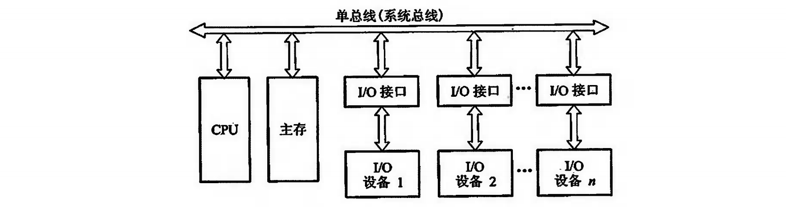
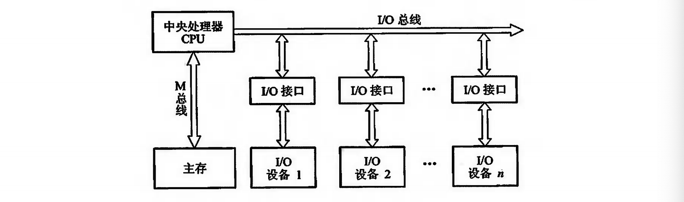
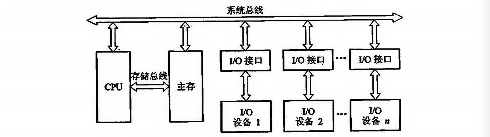
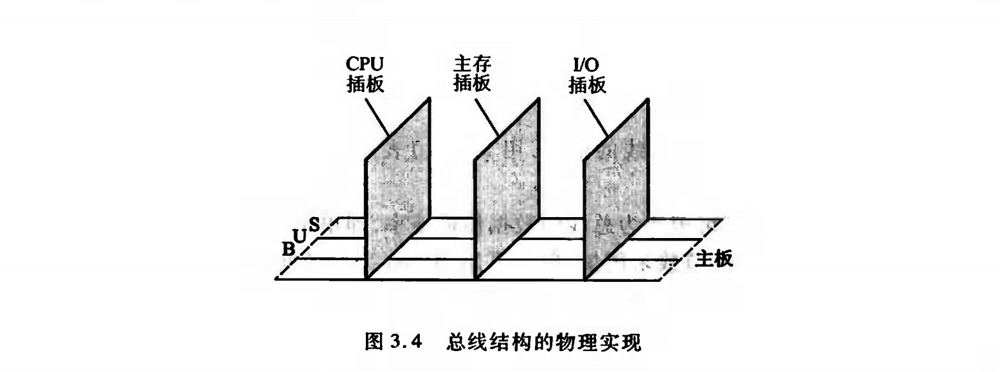

## 总线的基本概念

总线是连接各个部件的信息传输线，是**各个部件共享的传输介质**。

总线是多个部件的信息传输线，同一时间如果有多个设备在主线上传输信号必然会引起信号冲突，所以在同意时间我们只允许一个部件向主线发送信息，而多个部件可以同时在主线上接收同一信息。

总线实际上是由很多条传输线所组成，每条线可以一位一位地传输二进制代码，多条传输线可以同时传输多位二进制代码。

## 总线的结构

#### 单总线结构框图

当我们把CPU，I/O谁被都挂到一组总线上的时候，便形成了单总线的结构，单总线的结构在I/O设备与主存交换信息的时候与CPU产生冲突不能同时工作。

#### 双总线结构框图

所以说我们采用双总线的方式，让IO设备和主存交换信息的时候不影响CPU的工作，CPU仍然可以继续处理不访问主存和IO设备的工作。但是问题就是如果CPU在处理主存中的数据，起他的IO接口就不能访问主存，反之亦然。

####  以存储器为中心的双总线结构框图

为了设计总线的优先逻辑，在单总线的基础上开辟一条CPU和主存中的主线，成为储存总线，只提供主存和CPU之间的传输信息，这样提高了传输效率减轻总线压力，同时IO设备和和主存之间交换信息不经过CPU。

## 总线的分类

总线其实有很多不同的分类方法，按照数据传输的方式可以分为并行总线和串行总线，在并行总线中又可以按照数据宽度来进行定位。接下来按照连接的部件不同来介绍三类总线。

#### 片内总线

芯片内部的总线，比如CPU内部：寄存器与寄存器之间，寄存器与算数逻辑单元之间都是由片内总线相连。

#### 系统总线

指的是CPU、主存、IO设备大部件之间的数据传输总线，根据传输信息不同可分成三类：

1. **数据总线：**数据总线是双向传输总线，其总线宽度与机器字长有关，一般为8位，16位，32位。如果总线宽度8位，指令字长16位，CPU在取指阶段必须两次访问主存。
2. **地址总线：**地址总线是单向传输总线，主要用来指出数据总线源数据的主存单元地址或者IO设备地址。地址总线上的代码是用来指明CPU域访问的存储单元或者IO端口的地址。例如，要从存储器中读取出来一个数据，则CPU要将此数据的存储单元放到地址总线上，地址总线的位数和存储单元的个数有关一般是地址空间大小。
3. **控制总线：**对于数据总线和地址总线都是被挂在总线上的所有部件共享的，如何使用部件能使同一时刻总线只被一个部件占用，需要依靠控制总线来完成，因此控制总线是用来发出各种信号的传输线。对任意单一控制来说他的传输是单向的。比如说：储存器的读写命令、IO的读写命令都是由CPU发出。但是对于控制总线总体来说它又是双向的。比如设备准备就绪的时候向CPU发出总线请求，获取总线的使用权。

#### 通信总线

计算机之间或者计算机与其他系统之间的通信，按照传输方式可以划分成串行通行和并行通信：

1. 串行通信：单条一位宽度的传输线上，一位一位按照顺序传输，串行通信距离较远。
2. 并行通信：多条并行1位宽度的传输线，从源送达目的地。

## 总线的特性以及性能指标

#### 总线的特性

从物理的角度来看总线有许多的导线直接印刷在电路板上，并且延伸到各个部件。

CPU，主存，IO设备这些插卡通过插头与水平方向的总线插槽连接，保持机械上的可靠连接，需要规定机械特性。保持电气上的正确连接，需要规定电气特性。保证正确的连接不同的部件，还需要规定时间特性和功能特性。

1. **机械特性：**总线的机械连接方式，比如插头和插槽的尺寸、形状、引脚的个数以及排列的顺序、接头可靠接触。
2. **电气特性：**电气特性指总线上每一个传输线的信号的传递方向和有效电平范围。通常规定从CPU发出的信号叫做输出信号，反之则是输出信号。大多数规定低电平表示“0”，高电平表示“1”。

3. **功能特性：**每根传输线的功能对应上面的几个分类。
4. **时间特性：**指总线中的任意一根线在什么时间有效。每条总线上的信号是存在时序关系的。

#### 总线的性能指标

性能指标如下：

1. 总线宽度：一般是指数据总线的根数，用bit表示，如8位，16位，32位，64位（即8根、16根、、）
2. 总线带宽：总线上的数据传输速率，单位时间传输的字节数即MBps = 工作频率 * 宽度 / 8
3. 时钟同步/异步：总线上的数据与时钟同步工作的总线成为同步总线，不同步则成为异步。
4. 总线复用：比如说地址总线和数据总线在物理上是分开的两种、但是为了提高总线的效率让地址总线和数据总线共用一组物理线路，在这组物理线路上分时传输两种信号，即总线的多路复用。
5. 信号线数：就是系统总线的和。
6. 总线控制方式：突发工作、自动配置、仲裁方式、逻辑方式、、、
7. 其他：负载能力、电源电压、总线宽度、、、

