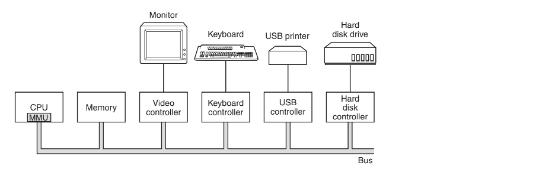
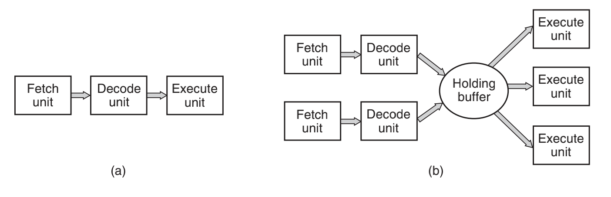
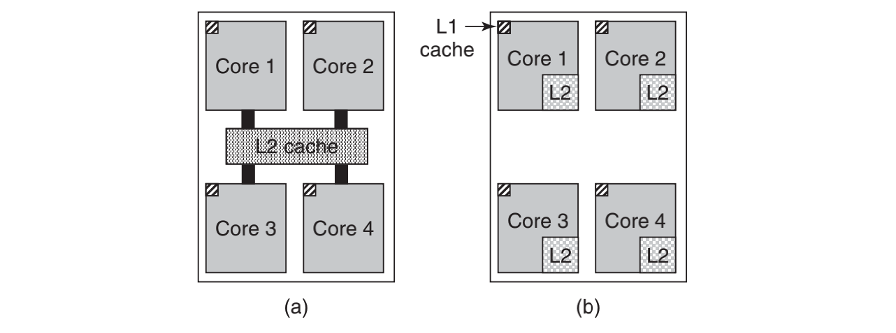
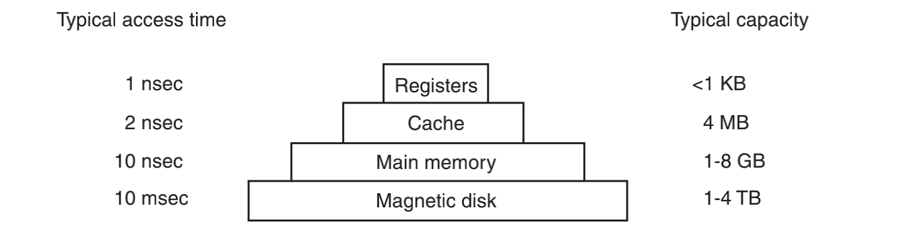
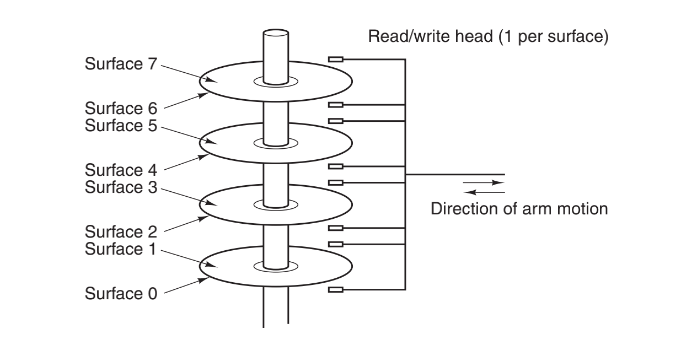
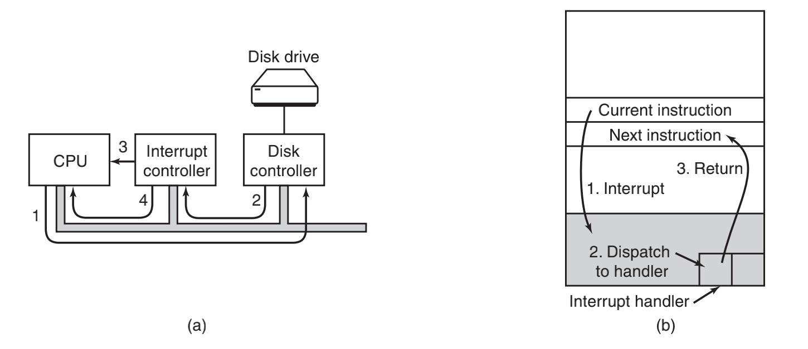
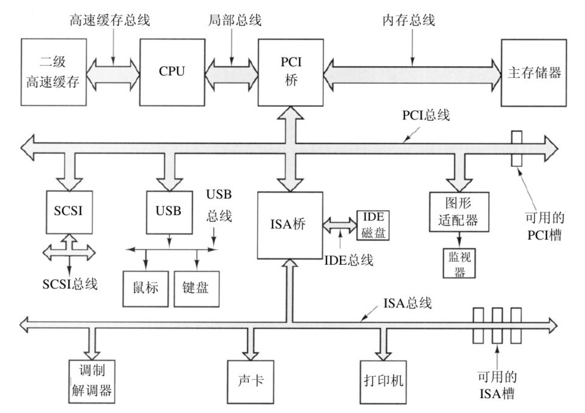
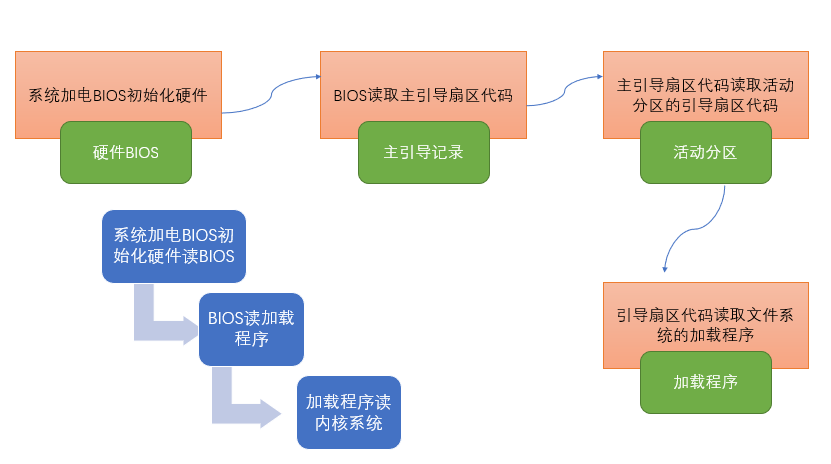

## 计算机硬件

--------

操作系统与运行该操作系统的计算机硬件联系密切。操作系统扩展了计算机指令集并管理计算机的资源。为了能够工作，操作系统必须了解大量的硬件。

从概念上讲，一台简单的个人计算机可以抽象为类似于图中的模型。CPU、内存以及I/O设备都由一条系统总线连接起来并通过总线与其他设备通信。

#### 处理器

计算机的“大脑”是 `CPU`，它从内存中取出指令并执行之。在每个CPU基本周期中，首先从内存中取出“指令，解码以确定其类型和操作数，接着执行之，然后取指、解码并执行下一条指令。按照这一方式，程序被执行完成。

**寄存器**

由于用来访问内存以得到指令或数据的时间要比执行指令花费的时间长得多，因此，所有的 `CPU` 内都有一些用来保存关键变量和临时数据的寄存器。这样，通常在指令集中提供一些指令，用以将一个字从内存调入寄存器，以及将一个字从寄存器存入内存。其他的指令可以把来自寄存器、内存的操作数组合，或者用两者产生一个结果，诸如将两个字相加并把结果存在寄存器或内存中。

多数计算机还有一些对程序员可见的专门寄存器。其中之一是程序计数器，它保存了将要取出的下一条指令的内存地址。另一个寄存器是堆栈指针，它指向内存中当前栈的顶端。

当然还有程序状态字 `Program Status Word，PSW` 寄存器。这个寄存器包含了条件码位（由比较指令设置）、`CPU` 优先级、模式（用户态或内核态），以及各种其他控制位。用户程序通常读入整个 `PSW`，但是，只对其中的少量字段写入。在系统调用和 `I/O` 中，`PSW` 的作用很重要。

**多路复用**

操作系统必须知晓所有的寄存器。在时间多路复用`（time multiplexing）CPU` 中，操作系统经常会中止正在运行的某个程序并启动（或再启动）另一个程序。每次停止一个运行着的程序时，操作系统必须保存所有的寄存器，这样在稍后该程序被再次运行时，可以把这些寄存器重新装入。

**流水和超标量**

为了改善性能，`CPU` 设计师早就放弃了同时读取、解码和执行一条指令的简单模型。许多现代 `CPU` 具有同时取出多条指令的机制。例如，一个 `CPU` 可以有分开的取指单元、解码单元和执行单元，于是当它执行指令n时，它还可以对指令 `n+1` 解码，并且读取指令 `n+2`。这样一种机制称为流水线 `pipeline`，

比流水线更先进的设计是一种超标量 `CPU`，如图 `b` 所示。在这种设计中，有多个执行单元，例如，一个 `CPU` 用于整数算术运算，一个 `CPU` 用于浮点算术运算，而另一个用于布尔运算。两个或更多的指令被同时取出、解码并装入一个保持缓冲区中，直至它们执行完毕。只要有一个执行单元空闲，就检查保持缓冲区中是否还有可处理的指令，如果有，就把指令 `s` 从缓冲区中移出并执行之。这种设计存在一种隐含的作用，即程序的指令经常不按顺序执行。

**用户态和内核态**

多数 `CPU` 都有两种模式，即前面已经提及的内核态和用户态。通常，在 `PSW` 中有一个二进制位控制这两种模式。当在内核态运行时，`CPU` 可以执行指令集中的每一条指令，并且使用硬件的每种功能。操作系统在内核态下运行，从而可以访问整个硬件。

相反，用户程序在用户态下运行，仅允许执行整个指令集的一个子集和访问所有功能的一个子集。一般而言，在用户态中有关I/O和内存保护的所有指令是禁止的。当然，将 `PSW` 中的模式位设置成内核态也是禁止的。

为了从操作系统中获得服务，用户程序必须使用系统调用 `system call` 系统调用陷入内核并调用操作系统。`TRAP` 指令把用户态切换成内核态，并启用操作系统。当有关工作完成之后，在系统调用后面的指令把控制权返回给用户程序。

计算机使用陷阱而不是一条指令来执行系统调用。其他的多数陷阱是由硬件引起的，用于警告有异常情况发生，诸如试图被零除或浮点下溢等。在所有的情况下，操作系统都得到控制权并决定如何处理异常情况。有时，由于出错的原因程序不得不停止。在其他情况下可以忽略出错（如下溢数可以被置为零）。最后，若程序已经提前宣布它希望处理某类条件时，那么控制权还必须返回给该程序，让其处理相关的问题。

#### 多线程和多核芯片

下一步不仅是有多个功能部件，某些控制逻辑也会出现多个。`Pentium 4` 和其他一些 `CPU` 芯片就是这样做的，称为多线程 `multithreading` 或超线程 `hyperthreading`。近似地说，多线程允许 `CPU` 保持两个不同的线程状态，然后在纳秒级的时间尺度内来回切换。

如果某个进程需要从内存中读出一个字（需要花费多个时钟周期），多线程 `CPU` 则可以切换至另一个线程。多线程不提供真正的并行处理。在一个时刻只有一个进程在运行，但是线程的切换时间则减少到纳秒数量级。

除了多线程，还出现了包含 `2` 个或 `4` 个完整处理器或内核的 `CPU` 芯片。图中的多核芯片上有效地装有 `4`个小芯片，每个小芯片都是一个独立的CPU。（后面将解释缓存。）要使用这类多核芯片肯定需要多处理器操作系统。

现代的图像处理器 `GPU` 上集成了成千上万的微核，可以处理大量的简单并行计算，但是不太能胜任串行任务所以很难编程，但是很适合图像渲染，解密加密以及网络传输。

#### 存储器

在理想情形下，存储器应该极为迅速（快于执行一条指令，这样 `CPU` 不会受到存储器的限制），充分大，并且非常便宜。但是目前的技术无法同时满足这三个目标，于是出现了不同的处理方式。存储器系统采用一种分层次的结构，如图1-9所示。顶层的存储器速度较高，容量较小，与底层的存储器相比每位成本较高，其差别往往是十亿数量级。

存储器系统的顶层是 `CPU` 中的寄存器。它们用与 `CPU` 相同的材料制成，所以和 `CPU` 一样快。访问它们是没有时延的。其典型的存储容量是，在 `32` 位 `CPU`中为 `32×32`位，而在`64`位 `CPU` 中为 `64×64` 位。在这两种情形下，其存储容量都小于 `1KB`。程序必须在软件中自行管理这些寄存器（即决定如何使用它们）。

#### 磁盘

下一个层次是磁盘（硬盘）。磁盘同 `RAM` 相比，每个二进制位的成本低了两个数量级，而且经常也有两个数量级大的容量。磁盘惟一的问题是随机访问数据时间大约慢了三个数量级。其低速的原因是因为磁盘是一种机械装置，如图所示。

在一个磁盘中有一个或多个金属盘片，它们以 `5400`，`7200` 或 `10 800rpm` 的速度旋转。从边缘开始有一个机械臂悬横在盘面上，这类似于老式播放塑料唱片 `33` 转唱机上的拾音臂。信息写在磁盘上的一系列同心圆上。在任意一个给定臂的位置，每个磁头可以读取一段环形区域，称为磁道 `track`。把一个给定臂的位置上的所有磁道合并起来，组成了一个柱面`cylinder`。

每个磁道划分为若干扇区，扇区的典型值是 `512` 字节。机械臂从一个柱面移到相邻的柱面大约需要 `1ms`。而随机移到一个柱面的典型时间为 `5ms` 至 `10ms`，一旦磁臂到达正确的磁道上，驱动器必须等待所需的扇区旋转到磁头之下，这就增加了 `5ms` 至 `10ms` 的时延，速。一旦所需要的扇区移到磁头之下，就开始读写，低端硬盘的速率是 `5MB/s`，而高速磁盘的速率是 `160 MB/s`。

#### I/O 设备

`I/O` 设备一般包括两个部分：设备控制器和设备本身。控制器是插在电路板上的一块芯片或一组芯片，这块电路板物理地控制设备。在许多情形下，对这些设备的控制是非常复杂和具体的，所以，控制器的任务是为操作系统提供一个简单的接口。控制器的工作是十分复杂的，为了要完成这些工作，在控制器中经常安装一个小的嵌入式计算机，该嵌入式计算机运行为执行这些工作而专门编好的程序。

`I/O` 设备的另一个部分是实际设备的自身。设备本身有个相对简单的接口，这是因为接口既不能做很多工作，又已经被标准化了。标准化是有必要的，这样任何一个 `IDE` 磁盘控制器就可以适应任一种 `IDE` 磁盘，例如，`IDE` 表示集成驱动器电子设备 `Integrated Drive Electronics）`，是许多计算机的磁盘标准。由于实际的设备接口隐藏在控制器中，所以，操作系统看到的是对控制器的接口，这个接口可能和设备接口有很大的差别。

每类设备控制器都是不同的，所以，需要不同的软件进行控制。专门与控制器对话，发出命令并接收响应的软件，称为设备驱动程序 `device driver`，每个控制器厂家必须为所支持的操作系统提供相应的设备驱动程序。

**驱动装入**

为了能够使用设备驱动程序，必须把设备驱动程序装入到操作系统中，这样它可在核心态中运行。理论上，设备驱动程序可以在内核外运行，但是几乎没有系统支持这种可能的方式，因为它要求允许在用户空间的设备驱动程序能够以控制的方式访问设备。

要将设备驱动程序装入操作系统，有三个途径。第一个途径是将内核与设备驱动程序重新链接，然后重启动系统。许多 `UNIX` 系统以这种方式工作。第二个途径是在一个操作系统文件中设置一个入口，并通知该文件需要一个设备驱动程序，然后重启动系统。在系统启动时，操作系统去找寻所需的设备驱动程序并装载之。`Windows` 就是以这种方式工作。第三种途径是，操作系统能够在运行时接受新的设备驱动程序并且立即将其安装好，无须重启动系统。这种方式采用的较少，但是这种方式正在变得普及起来。热插拔设备，比如 `USB` 需要动态可装载设备驱动程序。

每个设备控制器都有少量的用于通信的寄存器。例如，一个最小的磁盘控制器也会有用于指定磁盘地址、内存地址、扇区计数和方向（读或写）的寄存器。要激活控制器，设备驱动程序从操作系统获得一条命令，然后翻译成对应的值，并写进设备寄存器中。所有设备寄存器的集合构成了 `I/O` 端口空间。

在有些计算机中，设备寄存器被映射到操作系统的地址空间（操作系统可使用的地址），这样，它们就可以像普通存储字一样读出和写入。

**中断**

实现输入和输出的方式有三种。在最简单的方式中，用户程序发出一个系统调用，内核将其翻译成一个对应设备驱动程序的过程调用。然后设备驱动程序启动 `I/O` 并在一个连续不断的循环中检查该设备，看该设备是否完成了工作。当 `I/O` 结束后，设备驱动程序把数据送到指定的地方（若有此需要），并返回。然后操作系统将控制返回给调用者。这种方式称为忙等待`（busy waiting）`，其缺点是要占据 `CPU`，`CPU` 一直轮询设备直到对应的 `I/O` 操作完成。

第二种方式是设备驱动程序启动设备并且让该设备在操作完成时发出一个中断。设备驱动程序在这个时刻返回。操作系统接着在需要时阻塞调用者并安排其他工作进行。当设备驱动程序检测到该设备的操作完毕时，它发出一个中断通知操作完成。

来看看 `I/O` 的三步过程。第 `1` 步，设备驱动程序通过写设备寄存器通知设备控制器做什么。然后，设备控制器启动该设备。当设备控制器传送完毕被告知的要进行读写的字节数量后，它在第 `2` 步中使用特定的总线发信号给中断控制器芯片。如果中断控制器已经准备接收中断（如果正忙于一个更高级的中断，也可能不接收），它会在 `CPU` 芯片的一个管脚上声明，这就是第 `3` 步。在第 `4` 步中，中断控制器把该设备的编号放到总线上，这样 `CPU` 可以读总线，并且知道哪个设备刚刚完成了操作（可能同时有许多设备在运行）。

一旦 `CPU` 决定取中断，通常程序计数器和 `PSW` 就被压入当前堆栈中，并且 `CPU` 被切换到用户态。设备编号可以成为部分内存的一个引用，用于寻找该设备中断处理程序的地址。这部分内存称为中断向量 `interrupt vector` 。当中断处理程序（中断设备的设备驱动程序的一部分）开始后，它取走已入栈的程序计数器和 `PSW`，并保存之，然后查询设备的状态。在中断处理程序全部完成之后，它返回到先前运行的用户程序中尚未执行的头一条指令。这些步骤如图 `b` 所示。

**DMA**

第三种方式是，为 `I/O` s使用一种特殊的直接存储器访问 `Direct Memory Access，DMA` 芯片，它可以控制在内存和某些控制器之间的位流，而无须持续的 `CPU` 干预。`CPU` 对 `DMA` 芯片进行设置，说明需要传送的字节数、有关的设备和内存地址以及操作方向，接着启动 `DMA` 。当 `DMA` 芯片完成时，它引发一个中断，其处理方式如前所述。

中断经常会在非常不合适的时刻发生，比如，在另一个中断程序正在运行时发生。正由于此，`CPU` 有办法关闭中断并在稍后再开启中断。在中断关闭时，任何已经发出中断的设备，可以继续保持其中断信号，但是 `CPU` 不会被中断，直至中断再次启用为止。如果在中断关闭时，已有多个设备发出了中断，中断控制器将决定先处理哪个中断，通常这取决于事先赋予每个设备的静态优先级。最高优先级的设备赢得竞争。

#### 总线

图中的系统有`8`个总线（高速缓存、局部、内存、`PCI`、`SCSI`、`USB`、`IDE` 和 `ISA`），每个总线传输速度和功能都不同。操作系统必须了解所有总线的配置和管理。有两个主要的总线，即早期的IBM PC `ISA（Industry Standard Architecture）`总线和它的后继者`PCI（Peripheral Component Interconnect）`总线。

**ISA 和 PCI**

`ISA`总线就是原先的 `IBM PC/AT` 总线，以 `8.33MHz` 频率运行，可并行传送 `2` 字节，最大速率为 `16.67MB/s`。它还可与老式的慢速 `I/O` 卡向后兼容。`PCI` 总线作为 `ISA`总线的后继者由 `Intel` 公司发布。它可在 `66MHz` 频率运行，可并行传送`8` 字节，数据速率为 `528MB/s`。

在这种配置中，`CPU`通过局部总线与 `PCI` 桥芯片对话，而 `PCI` 桥芯片通过专门的存储总线与存储器对话，一般速率为 `100MHz`。`Pentium` 系统在芯片上有 `1` 级高速缓存，在芯片外有一个非常大的 `2` 级高速缓存，它通过高速缓存总线与 `CPU` 连接。

**IDE、USB和SCSI**

另外，在这个系统中有三个专门的总线：`IDE`、`USB` 和 `SCSI`。通用串行总线`（Universal Serial Bus，USB）`是用来将所有慢速 `I/O` 设备，诸如键盘和鼠标，与计算机连接。它采用一种小型四针连接器，其中两针为 `USB` 设备提供电源。`USB` 是一种集中式总线，其根设备每 `1ms` 轮询一次 `I/O` 设备，看是否有信息收发。`USB1.0` 可以处理总计为`1.5MB/s` 的负载，而较新的 `USB2.0` 总线可以有 `60MB/s` 的速率。所有的 `USB` 设备共享一个 `USB`设备驱动器，于是就不需要为新的USB设备安装新设备驱动器了。

`SCSI（Small Computer System Interface）`总线是一种高速总线，用在高速硬盘、扫描仪和其他需要较大带宽的设备上。它最高可达320MB/s。

**即插即用**

要在如图中展示的环境下工作，操作系统必须了解有些什么外部设备连接到计算机上，并对它们进行配置。这种需求导致微软设计了一种名为即插即用 `（plug and play）` 的 `I/O` 系统。在即插即用之前，每块I/O卡有一个固定的中断请求级别和用于其 `I/O` 寄存器的固定地址，例如，键盘的中断级别是 `1` ，并使用 `0x60` 至 `0x64` 的 `I/O` 地址，软盘控制器是中断 `6` 级并使用 `0x3F0` 至 `0x3F7` 的 `I/O` 地址。。

即插即用所做的工作是，系统自动地收集有关 `I/O` 设备的信息，集中赋予中断级别和 `I/O` 地址，然后通知每块卡所使用的数值。这项工作与计算机的启动密切相关，所以下面我们开始讨论计算机的启动。不过这不是件轻松的工作。

## 启动计算机

------

平时我们进行开机，操作系统是怎么加载到内存里面的呢，接下来我们就那`Pentium`举例来研究一下操作系统是如何一步一步加载的内存中的简单细节。

`Pentium`的简要启动过程如下。在每个`Pentium`上有一块双亲板。在双亲板上有一个称为基本输入输出系统`（Basic Input Output System，BIOS）`的程序。在`BIOS`内有底层`I/O`软件，包括读键盘、写屏幕、进行磁盘`I/O`以及其他过程。现在这个程序存放在一块闪速RAM中，它是非可易失性的，但是在发现`BIOS`中有错时可以通过操作系统对它进行更新。

计算机从加电开始就开始`BIOS`的初始化，这一部分是有硬件`BIOS`所做的工作。它首先检查所安装的`RAM`数量，键盘和其他基本设备是否已安装并正常响应。接着，它开始扫描`ISA`和`PCI`总线并找出连在上面的所有设备。其中有些设备是典型的遗留设备（即在即插即用发明之前设计的），并且有固定的中断级别和I/O地址。这些设备被记录下来。即插即用设备也被记录下来。如果现有的设备和系统上一次启动时的设备不同，则配置新的设备。

`BIOS`通过尝试存储在`CMOS`存储器中的设备清单决定启动设备。用户可以在系统刚启动之后进入一个`BIOS`配置程序，对设备清单进行修改。典型地，如果存在软盘，则系统试图从软盘启动。如果失败则试用`CD-ROM`，看看是否有可启动`CD-ROM`存在。如果软盘和`CD-ROM`都没有，系统从硬盘启动 (操作系统装入内存)。

然后，从该分区读入第二个启动装载模块。来自活动分区的这个装载模块被读入操作系统，并启动之。然后，操作系统询问`BIOS`，以获得配置信息。对于每种设备，系统检查对应的设备驱动程序是否存在。如果没有，系统要求用户插入含有该设备驱动程序的`CD-ROM`（由设备供应商提供）。一旦有了全部的设备驱动程序，操作系统就将它们调入内核。然后初始化有关表格，创建需要的任何背景进程，并在每个终端上启动登录程序或`GUI`。

接下来再看看`BIOS`初始化过程中包括哪些内容：

1. `CPU`初始化：`CPU`加电稳定后从`0xfff0`读第一条指令 `CS:IP = 0xf000:fff0`。

2. `CPU`初始化状态为`16`位实模式，指令指针`PC=16*CS + IP` 最大地址空间`1MB（2^20）`。

3. `BIOS`初始化：

   - 检测内存中的显卡等关键设备或者部件的存在和工作状态，查找并执行显卡等接口卡`BIOS`进行设备初始化确认无误执行系统`BIOS`进行系统检测，检查系统中安装的即插即用的设备，更新`CMOS`中的扩展系统的配置数据`ESCD`，按照指定启动顺序从软盘，硬盘或者光驱启动。

4. 下图是引导扇区`（512字节）`的内容及在内存中分配的地址：

   

5. `BIOS`中的加载程序`（Bootloader）`识别硬盘文件系统：

   1. 将操作系统的代码和数据从硬盘加载到内存中。
   2. 跳转到操作系统的起始地址。

6. 加载程序进行操作系统的加载将控制权交给操作系统（指令指针指到了操作系统内核中）。

