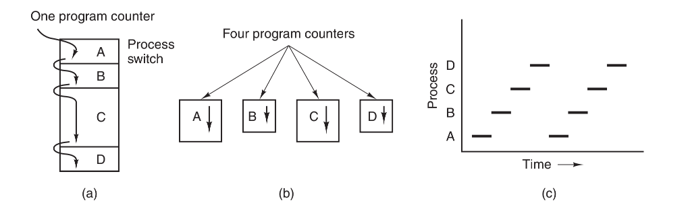
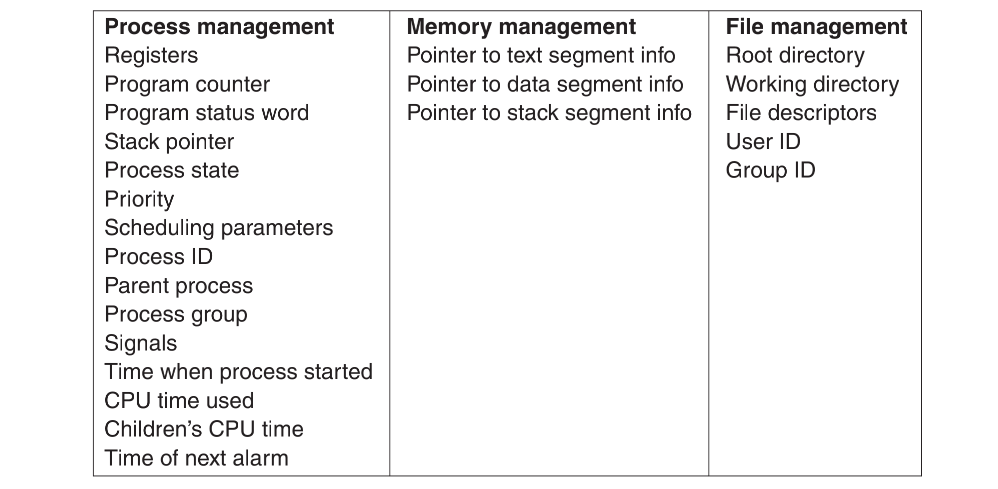
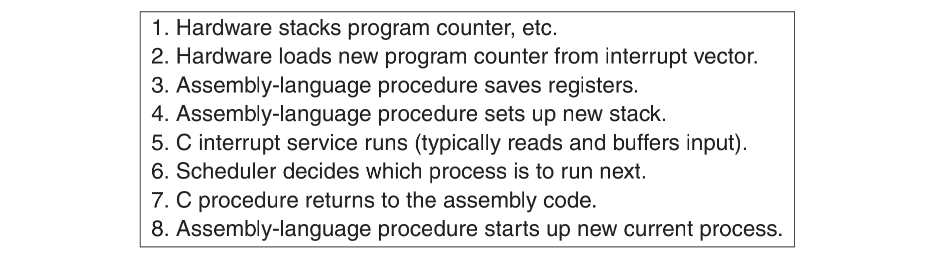
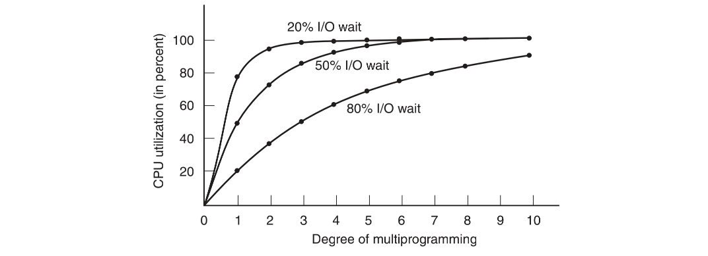

## 进程概念模型

-------

在进程模型中，计算机上所有可运行的软件，通常也包括操作系统，被组织成若干顺序进程`（sequential process）`，简称进程`（process）`。一个进程就是一个正在执行程序的实例，包括程序计数器、寄存器和变量的当前值。从概念上说，每个进程拥有它自己的虚拟CPU。

当然，实际上真正的CPU在各进程之间来回切换。在某一个瞬间，CPU只能运行一个进程。但在1秒钟期间，它可能运行多个进程，这样就产生并行的错觉。有时人们所说的伪并行就是指这种情形，以此来区分多处理器系统（该系统有两个或多个CPU共享同一个物理内存）的真正硬件并行。



一个进程是某种类型的一个活动，它有程序、输入、输出以及状态。单个处理器可以被若干进程共享，它使用某种调度算法决定何时停止一个进程的工作，并转而为另一个进程提供服务。如果一个程序被运行了两遍，那它属于两个进程。

## 进程的创建和终止

#### 创建

操作系统需要有一种方式来创建进程，有4种主要事件导致进程的创建：

1. 系统初始化。
2. 执行了正在运行的进程所调用的进程创建系统调用。
3. 用户请求创建一个新进程。
4. 一个批处理作业的初始化。

启动操作系统时，通常会创建若干个进程。其中有些是前台进程，也就是同用户交互并且替他们完成工作的那些进程。其他的是后台进程，这些进程与特定的用户没有关系，相反，却具有某些专门的功能。停留在后台的进程称为守护进程`（daemon）`

在`UNIX`系统中，只有一个系统调用可以用来创建新进程：`fork`。这个系统调用会创建一个与调用进程相同的副本。在调用了`fork`后，这两个进程（父进程和子进程）拥有相同的存储映像、同样的环境字符串和同样的打开文件。通常，子进程接着执行`execve`或一个类似的系统调用，以修改其存储映像并运行一个新的程序。

#### 终止

进程在创建之后，它开始运行，完成其工作。但永恒是不存在的，进程也一样。迟早这个进程会终止，通常由下列条件引起：

1. **正常退出（自愿的）：**

   多数进程完成了它们的工作而终止，执行一个系统调用，通知操作系统它的工作已经完成。在`UNIX`中该调用是`exit`。

2. **出错退出（自愿的）：**

   进程终止的第二个原因是进程发现了严重错误。例如，如果用户键入命令：

   ```c
   > gcc foo.c
   ```

   要编译程序foo.c，但是该文件并不存在，于是编译器就会退出。. 

3. **严重错误（非自愿）：**

   进程终止的第三个原因是由进程引起的错误，通常是由于程序中的错误所致。如执行了一条非法指令、引用不存在的内存。

4. **被其他进程杀死（非自愿）：**

   某个进程执行一个系统调用通知操作系统杀死某个其他进程。在`UNIX`中，这个系统调用是`kill`。


## 进程的层次结构

某些系统中，当进程创建了另一个进程后，父进程和子进程就以某种形式继续保持关联。子进程自身可以创建更多的进程，组成一个进程的层次结构。

在`UNIX`中，进程和它的所有子女以及后裔共同组成一个进程组。当用户从键盘发出一个信号时，该信号被送给当前与键盘相关的进程组中的所有成员（它们通常是在当前窗口创建的所有活动进程）。

考虑`UNIX`在启动时如何初始化自己。一个称为`init`的特殊进程出现在启动映像中。当它开始运行时，读入一个说明终端数量的文件。接着，为每个终端创建一个新进程。这些进程等待用户登录。如果有一个用户登录成功，该登录进程就执行一个`shell`准备接收命令。所接收的这些命令会启动更多的进程，以此类推。这样，在整个系统中，所有的进程都属于以`init`为根的一棵树。

相反，`Windows`中没有进程层次的概念，所有的进程都是地位相同的。惟一类似于进程层次的暗示是在创建进程的时侯，父进程得到一个特别的令牌（称为句柄），该句柄可以用来控制子进程。但是，它有权把这个令牌传送给某个其他进程，这样就不存在进程层次了。在UNIX中，进程就不能剥夺其子女的“继承权”。

## 进程的状态

尽管每个进程是一个独立的实体，有其自己的程序计数器和内部状态，当一个进程在逻辑上不能继续运行时，它就会被阻塞。一个概念上能够运行的进程被迫停止，因为操作系统调度另一个进程占用了CPU。

在图中可以看到显示进程的三种状态的状态图。这三种状态是：

1. 运行态（该时刻进程实际占用CPU）。
2. 就绪态（可运行，但因为其他进程正在运行而暂时停止）。
3. 阻塞态（除非某种外部事件发生，否则进程不能运行）。


前两种状态在逻辑上是类似的。处于这两种状态的进程都可以运行，只是对于第二种状态暂时没有CPU分配给它。第三种状态与前两种状态不同，处于该状态的进程不能运行，即使CPU空闲也不行。


转换2和3是由进程调度程序引起的，进程调度程序是操作系统的一部分，进程甚至感觉不到调度程序的存在。系统认为一个运行进程占用处理器的时间已经过长，决定让其他进程使用CPU时间时，

## 进程的实现

实现进程模型，操作系统维护着一张表格`（结构数组）`，即进程表`（process table）`。每个进程占用一个进程表项。（有些作者称这些表项为进程控制块。）

该表项包含了进程状态的重要信息，包括程序计数器、堆栈指针、内存分配状况、所打开文件的状态、账号和调度信息，以及其他在进程由运行态转换到就绪态或阻塞态时必须保存的信息，从而保证该进程随后能再次启动，就像从未被中断过一样。



比如与每一I/O类关联的是一个称作中断向量`（interrupt vector）`的位置（靠近内存底部的固定区域）。它包含中断服务程序的入口地址。假设当一个磁盘中断发生时，用户进程3正在运行，则中断硬件将程序计数器、程序状态字，有时还有一个或多个寄存器压入堆栈，计算机随即跳转到中断向量所指示的地址。这些是硬件完成的所有操作。然后软件，特别是中断服务例程就接管一切剩余的工作。



## 多道程序设计模型

采用多道程序设计可以提高CPU的利用率。假设一个进程等待`I/O`操作的时间与其停留在内存中时间的比为`p`。当内存中同时有`n`个进程时，则所有`n`个进程都在等待`I/O（此时CPU空转）`的概率是`p^n` 。`CPU`的利用率由下面的公式给出：


以`n`为变量的函数表示了`CPU`的利用率，`n`称为多道程序设计的道数`（degree of multiprogramming）`。



虽然上图的模型很简单，很粗略，它依然对预测CPU的性能很有效。

例如，假设计算机有`512MB`内存，操作系统占用`128MB`，每个用户程序也占用`128MB`。这些内存空间允许`3`个用户程序同时驻留在内存中。若`80%`的时间用于I/O等待，则CPU的利用率（忽略操作系统开销）大约是`1-0.8^3` ，即大约`49%`。在增加`512MB`字节的内存后，可从`3`道程序设计提高到`7`道程序设计，因而`CPU`利用率提高到`79%`。换言之，第二个`512MB`内存提高了`30%`的吞吐量。

增加第三个`512MB`内存只能将CPU利用率从`79%`提高到`91%`，吞吐量的提高仅为`12%`。通过这一模型，计算机用户可以确定第一次增加内存是一个合算的投资，而第二个则不是。

