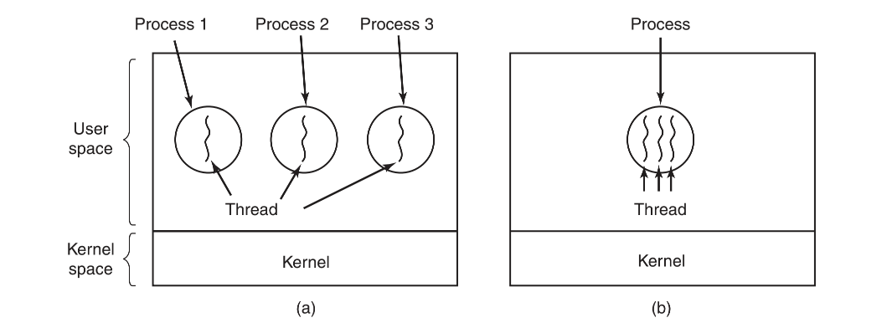
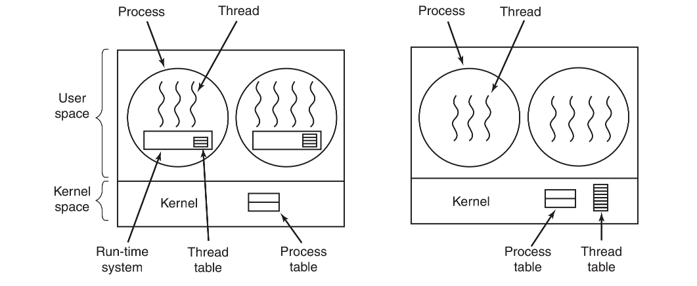

# 线程

在传统操作系统中，每个进程有一个地址空间和一个控制线程。不过，经常存在在同一个地址空间中准并行运行多个控制线程的情形，这些线程就像分离的进程（共享地址空间除外）。

## 线程的优势

**数据共享：**并行实体共享同一个地址空间和所有可用数据的能力。对于某些应用而言，这种能力是必需的，而这正是多进程模型（它们具有不同地址空间）所无法表达的。

**轻量：**由于线程比进程更轻量级，所以它们比进程更容易（即更快）创建，也更容易撤销。在许多系统中，创建一个线程较创建一个进程要快10～100倍。

**处理速度：**若多个线程都是CPU密集型的，那么并不能获得性能上的增强，但是如果存在着大量的计算和大量的I/O处理，拥有多个线程允许这些活动彼此重叠进行，从而会加快应用程序执行的速度。

## 线程模型

理解进程的一个角度是，用某种方法把相关的资源集中在一起。进程有存放程序正文和数据以及其他资源的地址空间。这些资源中包括打开的文件、子进程、即将发生的报警、信号处理程序、账号信息等。

进程拥有一个执行的线程，通常简写为线程`（thread）`。在线程中有一个程序计数器，用来记录接着要执行哪一条指令。线程拥有寄存器，用来保存线程当前的工作变量。线程还拥有一个堆栈，用来记录执行历史，其中每一帧保存了一个已调用的但是还没有从中返回的过程。

尽管线程必须在某个进程中执行，但是线程和它的进程是不同的概念，并且可以分别处理。进程用于把资源集中到一起，而线程则是在CPU上被调度执行的实体。

线程给进程模型增加了一项内容，即在同一个进程环境中，允许彼此之间有较大独立性的多个线程执行。在同一个进程中并行运行多个线程，是对在同一台计算机上并行运行多个进程的模拟，所以有时被称为轻量级进程`（lightweight process）`。

可以看到三个传统的进程。每个进程有自己的地址空间和单个控制线程。相反，在图`b`中，可以看到一个进程带有三个控制线程。尽管在两种情形中都有三个线程，但是在图`a`中，每一个线程都在不同的地址空间中运行，而在图`b`中，这三个线程全部在相同的地址空间中运行。

所有的线程都有完全一样的地址空间，这意味着它们也共享同样的全局变量。由于各个线程都可以访问进程地址空间中的每一个内存地址，所以一个线程可以读、写或甚至清除另一个线程的堆栈。线程之间是没有保护的，

和传统进程一样（即只有一个线程的进程），线程可以处于若干种状态的任何一个：运行、阻塞、就绪或终止。

每个线程的堆栈有一帧，供各个被调用但是还没有从中返回的过程使用。在该帧中存放了相应过程的局部变量以及过程调用完成之后使用的返回地址，通常每个线程会调用不同的过程，从而有一个各自不同的执行历史。这就是为什么每个线程需要有自己的堆栈的原因。

进程通常会从当前的单个线程开始。这个线程有能力通过调用一个库函数（如thread_create）创建新的线程，当一个线程完成工作后，可以通过调用一个库过程（如thread_exit）退出，另一个常见的线程调用是thread_yield，它允许线程自动放弃CPU从而让另一个线程运行。这样一个调用是很重要的，因为不同于进程，（线程库）无法利用时钟中断强制线程让出CPU。

## POSIX线程

为实现可移植的线程程序，`IEEE`在`IEEE标准1003.1c`中定义了线程的标准。它定义的线程包叫做`Pthread`。我们将仅仅描述一些主要的函数，以说明它是如何工作的。

所有`Pthread`线程都有某些特性。每一个都含有一个标识符、一组寄存器（包括程序计数器）和一组存储在结构中的属性。这些属性包括堆栈大小、调度参数以及使用线程需要的其他项目。

创建一个新线程需要使用`pthread_create`调用。新创建的线程的线程标识符作为函数值返回。当一个线程完成分配给它的工作时，可以通过调用`pthread_exit`来终止。这个调用终止该线程并释放它的栈

一般一个线程在继续运行前需要等待另一个线程完成它的工作并退出。可以通过`pthread_join`线程调用来等待别的特定线程的终止。而要等待线程的线程标识符作为一个参数给出。

`pthread_attr_init`建立关联一个线程的属性结构并初始化成默认值。这些值（例如优先级）可以通过修改属性结构中的域值来改变。最后，`pthread_attr_destroy`删除一个线程的属性结构，释放它占用的内存。它不会影响调用它的线程。这些线程会继续存在。

## 线程的实现

有两种主要的方法实现线程包：在用户空间中和在内核中。这两种方法互有利弊，不过混合实现方式也是可能的。

#### 用户空间

第一种方法是把整个线程包放在用户空间中，内核对线程包一无所知，从内核角度考虑，按正常的方式管理，即单线程进程。

在用户空间管理线程时，每个进程需要有其专用的线程表`（thread table）`，用来跟踪该进程中的线程。这些表和内核中的进程表类似，不过它仅仅记录各个线程的属性，如每个线程的程序计数器、堆栈指针、寄存器和状态等。

当某个线程做了一些会引起在本地阻塞的事情之后，例如，等待进程中另一个线程完成某项工作，它调用一个运行时系统的过程，这个过程检查该线程是否必须进入阻塞状态。如果是，它在线程表中保存该线程的寄存器（即它本身的），查看表中可运行的就绪线程，并把新线程的保存值重新装入机器的寄存器中。只要堆栈指针和程序计数器一被切换，新的线程就又自动投入运行。如果机器有一条保存所有寄存器的指令和另一条装入全部寄存器的指令，那么整个线程的切换可以在几条指令内完成。进行类似于这样的线程切换至少比陷入内核要快一个数量级（或许更多），这是使用用户级线程包的极大的优点。

在线程完成运行时，例如，在它调用`thread_yield`时，`pthread_yield`代码可以把该线程的信息保存在线程表中，进而，可以调用线程调度程序来选择另一个要运行的线程。保存该线程状态的过程和调度程序都只是本地过程，所以启动它们比进行内核调用效率更高。另一方面，不需要陷阱，不需要上下文切换，也不需要对内存高速缓存刷新，这就使得线程调度非常快捷。

用户级线程还有另一个优点。它允许每个进程有自己定制的调度算法。

尽管用户级线程包有更好的性能，但它也存在一些明显的问题。其中第一个问题是如何实现阻塞系统调用。首先要允许每个线程使用阻塞调用，但是还要避免被阻塞的线程影响其他的线程。有了阻塞系统调用，这个目标不是轻易地能够实现的。

用户级线程包的另一个问题是，如果一个线程开始运行，那么在该进程中的其他线程就不能运行，除非第一个线程自动放弃`CPU`。在一个单独的进程内部，没有时钟中断，所以不可能用轮转调度（轮流）的方式调度进程。除非某个线程能够按照自己的意志进入运行时系统，否则调度程序就没有任何机会。

#### 内核空间

当某个线程希望创建一个新线程或撤销一个已有线程时，它进行一个系统调用，这个系统调用通过对线程表的更新完成线程创建或撤销工作，内核的线程表保存了每个线程的寄存器、状态和其他信息。

所有能够阻塞线程的调用都以系统调用的形式实现，这与运行时系统过程相比，代价是相当可观的。当一个线程阻塞时，内核根据其选择，可以运行同一个进程中的另一个线程（若有一个就绪线程）或者运行另一个进程中的线程。而在用户级线程中，运行时系统始终运行自己进程中的线程，直到内核剥夺它的CPU（或者没有可运行的线程存在了）为止。

由于在内核中创建或撤销线程的代价比较大，某些系统采取环保的处理方式，回收其线程。当某个线程被撤销时，就把它标志为不可运行的，但是其内核数据结构没有受到影响。稍后，在必须创建一个新线程时，就重新启动某个旧线程，从而节省了一些开销。

#### 混合实现

人们已经研究了各种试图将用户级线程的优点和内核级线程的优点结合起来的方法。一种方法是使用内核级线程，然后将用户级线程与某些或者全部内核线程多路复用起来。

采用这种方法，内核只识别内核级线程，并对其进行调度。其中一些内核级线程会被多个用户级线程多路复用。如同在没有多线程能力操作系统中某个进程中的用户级线程一样，可以创建、撤销和调度这些用户级线程。在这种模型中，每个内核级线程有一个可以轮流使用的用户级线程集合。

