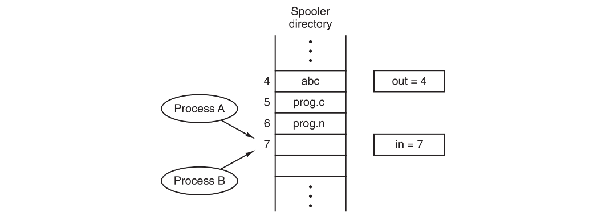
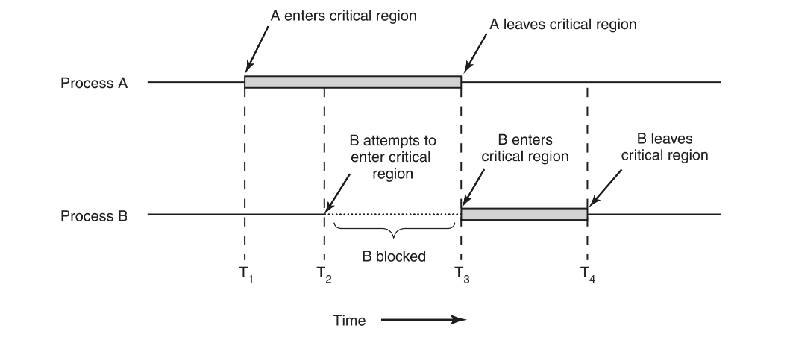
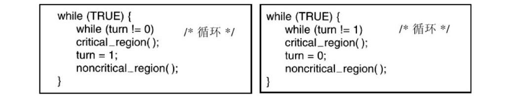
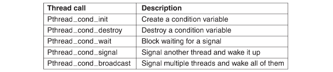
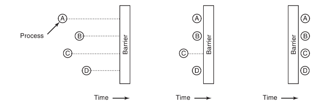

# 进程间通信

进程经常需要与其他进程通信`（Inter Process Communication，IPC）`。例如，在一个shell管道中，第一个进程的输出必须传送给第二个进程，这样沿着管道传递下去。因此在进程之间需要通信，而且最好使用一种结构良好的方式，不要使用中断。

## 竞争条件

在一些操作系统中，协作的进程可能共享一些彼此都能读写的公用存储区。这个公用存储区可能在内存中（可能是在内核数据结构中），也可能是一个共享文件。

为了理解实际中进程间通信如何工作，我们考虑一个简单但很普遍的例子：一个假脱机打印程序。当一个进程需要打印一个文件时，它将文件名放在一个特殊的假脱机目录`（spooler directory）`下。另一个进程（打印机守护进程）则周期性地检查是否有文件需要打印，若有就打印并将该文件名从目录下删掉。

设想假脱机目录中有许多槽位，编号依次为`0，1，2，…`，每个槽位存放一个文件名。同时假设有两个共享变量：`out`，指向下一个要打印的文件；`in`，指向目录中下一个空闲槽位。可以把这两个变量保存在一个所有进程都能访问的文件中，该文件的长度为两个字。

在某一时刻，`0`号至`3`号槽位空（其中的文件已经打印完毕），`4`号至`6`号槽位被占用（其中存有排好队列的要打印的文件名）。几乎在同一时刻，进程`A`和进程`B`都决定将一个文件排队打印。



在`Murphy`法则（任何可能出错的地方终将出错）生效时，可能发生以下的情况。

进程`A`读到`in`的值为`7`，将`7`存在一个局部变量`next_free_slot`中。此时发生一次时钟中断，`CPU`认为进程`A`已运行足够长时间，决定切换到进程`B`。进程`B`也读取`in`，同样得到值`7`，于是将`7`存在`B`的局部变量`next_free_slot`中。在这一时刻两个进程都认为下一个可用槽位是`7`。

进程`B`现在继续运行，它将其文件名存在槽位`7`中并将`in`的值更新为`8`。然后它离开，继续执行其他操作。

最后进程A接着从上次中断的地方再次运行。它检查变量`next_free_slot`，发现其值为`7`，于是将打印文件名存入`7`号槽位，这样就把进程`B`存在那里的文件名覆盖掉。然后它将`next_free_slot`加`1`，得到值为`8`，就将`8`存到`in`中。此时，假脱机目录内部是一致的，所以打印机守护进程发现不了任何错误，但进程B却永远得不到任何打印输出。类似这样的情况，即两个或多个进程读写某些共享数据，而最后的结果取决于进程运行的精确时序，称为竞争条件`（race condition）`。

## 临界区

怎样避免竞争条件？实际上凡涉及共享内存、共享文件以及共享任何资源的情况都会引发与前面类似的错误，要避免这种错误，关键是要找出某种途径来阻止多个进程同时读写共享的数据。换言之，我们需要的是互斥`（mutual exclusion）`。



某些时候进程可能需要访问共享内存或共享文件，或执行另外一些会导致竞争的操作。我们把对共享内存进行访问的程序片段称作临界区域`（critical region）`或临界区`（critical section）`。

为了保证使用共享数据的并发进程能够正确和高效地进行协作。对于一个好的解决方案，需要满足以下4个条件：

1. 任何两个进程不能同时处于其临界区。
2. 不应对`CPU`的速度和数量做任何假设。
3. 临界区外运行的进程不得阻塞其他进程。
4. 不得使进程无限期等待进入临界区。

## 忙等待

#### 屏蔽中断

在单处理器系统中，最简单的方法是使每个进程在刚刚进入临界区后立即屏蔽所有中断，并在就要离开之前再打开中断。屏蔽中断后，时钟中断也被屏蔽。CPU只有发生时钟中断或其他中断时才会进行进程切换，这样，在屏蔽中断之后CPU将不会被切换到其他进程。于是，一旦某个进程屏蔽中断之后，它就可以检查和修改共享内存，而不必担心其他进程介入。

但是这个方案并不好，因为把屏蔽中断的权力交给用户进程是不明智的，所以屏蔽中断于操作系统本身而言是一项很有用的技术，但对于用户进程则不是一种合适的通用互斥机制。

同时由于多核芯片的数量越来越多，屏蔽一个CPU的中断不会阻止其他CPU干预第一个CPU所做的操作。

#### 锁变量

设想有一个共享锁变量，其初始值为`0`。当一个进程想进入其临界区时，它首先测试这把锁。如果该锁的值为`0`，则该进程将其设置为`1`并进入临界区。若这把锁的值已经为`1`，则该进程将等待直到其值变为`0`。

```go
const mutex = 0;

func getMutex() {
  for mutex != 0 { /** wait*/ } 
  mutex = 1; 	// enter critical region
}
```

但是，这种想法也有疏漏。假设一个进程读出锁变量的值并发现它为0，而恰好在它将其值设置为1之前，另一个进程被调度运行，将该锁变量设置为1。当第一个进程再次能运行时，它同样也将该锁设置为1，则此时同时有两个进程进入临界区中。

#### 严格轮换法

第三种互斥的方法如图所示，整型变量`turn`，初始值为0，用于记录轮到哪个进程进入临界区，并检查或更新共享内存。开始时，进程`0`检查`turn`，发现其值为`0`，于是进入临界区。进程`1`也发现其值为`0`，所以在一个等待循环中不停地测试`turn`，看其值何时变为`1`。连续测试一个变量直到某个值出现为止，称为忙等待`（busy waiting）`。由于这种方式浪费`CPU`时间，所以通常应该避免。



只有在有理由认为等待时间是非常短的情形下，才使用忙等待。用于忙等待的锁，称为自旋锁`（spin lock）`。

进程`0`很快就执行完其整个循环，它退出临界区，并将`turn`的值设置为`1`。此时，`turn`的值为`1`，两个进程都在其临界区外执行。突然，进程0结束了非临界区的操作并且返回到循环的开始。但是，这时它不能进入临界区，因为`turn`的当前值为1，而此时进程`1`还在忙于非临界区的操作，进程`0`只有继续`while`循环，直到进程`1`把`turn`的值改为`0`。

这种情况违反了前面叙述的条件 **3**：进程 **0** 被一个临界区之外的进程阻塞。

#### Peterson 解法

在进入其临界区之前，各个进程(一共两个)使用其进程号`0`或`1`作为参数来调用`enter_region`。该调用在需要时将使进程等待，直到能安全地进入临界区。在完成对共享变量的操作之后，进程将调用`leave_region`，表示操作已完成，若其他的进程希望进入临界区，则现在就可以进入。

```c
#define FALSE 0
#define TRUE 1
#define N 2 /* number of processes */

int turn; /* whose turn is it? */
int interested[N]; /* all values initially 0 (FALSE) */

void enter region(int process); /* process is 0 or 1 */ 
{
	int other; /* number of the other process */
	other = 1 − process; /* the opposite of process */
	interested[process] = TRUE; /* show that you are interested */
	turn = process; /* set flag */
	while (turn == process && interested[other] == TRUE) /* null statement */ 
}

void leave region(int process) /* process: who is leaving */ 
{
	interested[process] = FALSE; /* indicate departure from critical region */ 
}
```

一开始，没有任何进程处于临界区中，现在进程`0`调用`enter_region`。它通过设置其数组元素和将`turn`置为`0`来标识它希望进入临界区。进程`1`并不想进入临界区，所以`enter_region`很快便返回。如果进程`1`现在调用`enter_region`，进程`1`将在此处挂起直到`interested[0]`变成`FALSE`，该事件只有在进程`0`调用`leave_region`退出临界区时才会发生。

考虑两个进程几乎同时调用`enter_region`的情况。它们都将自己的进程号存入`turn`，但只有后被保存进去的进程号才有效，前一个因被重写而丢失。假设进程`1`是后存入的，则`turn`为`1`。当两个进程都运行到`while`语句时，进程`0`将循环`0`次并进入临界区，而进程`1`则将不停地循环且不能进入临界区，直到进程`0`退出临界区为止。

#### TSL指令

现在来看需要硬件支持的一种方案，“多处理器的计算机，都有下面一条指令：

```assembly
TSL RX, LOCK
```

称为测试并加锁`（Test and Set Lock）`，它将一个内存字`lock`读到寄存器`RX`中，然后在该内存地址上存一个非零值。读字和写字操作保证是不可分割的，即该指令结束之前其他处理器均不允许访问该内存字。执行`TSL`指令的`CPU`将锁住内存总线，以禁止其他`CPU`在本指令结束之前访问内存。

锁住存储总线不同于屏蔽中断。屏蔽中断，然后在读内存字之后跟着写操作并不能阻止总线上的第二个处理器在读操作和写操作之间访问该内存字。事实上，在处理器`1`上屏蔽中断对处理器`2`根本没有任何影响。让处理器`2`远离内存直到处理器`1`完成的惟一方法就是锁住总线，。

为了使用`TSL`指令，要使用一个共享变量`lock`来协调对共享内存的访问。当`lock`为`0`时，任何进程都可以使用`TSL`指令将其设置为`1`，并读写共享内存。当操作结束时，进程用一条普通的`move`指令将`lock`的值重新设置为`0`。

这条指令如何防止两个进程同时进入临界区呢？

```assembly
enter region:
	TSL REGISTER, LOCK ;| copy lock to register and set lock to 1
	CMP REGISTER, $0   ;| was lock zero?
	JNE enter region   ;| if it was not zero, lock was set, so loop
	RET                ;| return to caller; critical region entered
leave region:
	MOVE LOCK, $0 		 ;| store a 0 in lock
	RET 							;| return to caller
```

进程在进入临界区之前先调用`enter_region`，这将导致忙等待，直到锁空闲为止，随后它获得该锁并返回。在进程从临界区返回时它调用`leave_region`，这将把lock设置为`0`。

## 睡眠与唤醒

`Peterson`解法和`TSL`或`XCHG`解法都是正确的，但它们都有忙等待的缺点。这些解法在本质上是这样的：当一个进程想进入临界区时，先检查是否允许进入，若不允许，则该进程将原地等待，直到允许为止。

这种方法不仅浪费了`CPU`时间，而且还可能引起预想不到的结果。考虑一台计算机有两个进程，`H`优先级较高，`L`优先级较低。调度规则规定，只要`H`处于就绪态它就可以运行。在某一时刻，`L`处于临界区中，此时`H`变到就绪态。现在`H`开始忙等待，但由于当`H`就绪时`L`不会被调度，也就无法离开临界区，所以`H`将永远忙等待下去。这种情况有时被称作优先级反转问题`（priority inversion problem）`。

下面有几条进程间通信原语，它们在无法进入临界区时将阻塞，而不是忙等待。最简单的是`sleep`和`wakeup`。`sleep`是一个将引起调用进程阻塞的系统调用，即被挂起，直到另外一个进程将其唤醒。`wakeup`调用有一个参数，即要被唤醒的进程。

#### 生产者-消费者问题

作为使用这些原语的一个例子，我们考虑生产者-消费者`（producer-consumer）`问题，也称作有界缓冲区`（bounded-buffer）`问题。两个进程共享一个公共的固定大小的缓冲区。其中一个是生产者，将信息放入缓冲区；另一个是消费者，从缓冲区中取出信息。

问题在于当缓冲区已满，而此时生产者还想向其中放入一个新的数据项的情况。其解决办法是让生产者睡眠，待消费者从缓冲区中取出一个或多个数据项时再唤醒它。同样地，当消费者试图从缓冲区中取数据而发现缓冲区为空时，消费者就睡眠，直到生产者向其中放入一些数据时再将其唤醒。

```c
#define N 100 /* number of slots in the buffer */
int count = 0; /* number of items in the buffer */
void producer(void)
{
	int item;
	while (TRUE) { /* repeat forever */
		item = produce item( ); /* generate next item */
		if (count == N) sleep( ); /* if buffer is full, go to sleep */
		insert item(item); /* put item in buffer */
		count = count + 1; /* increment count of items in buffer */
		if (count == 1) wakeup(consumer); /* was buffer empty? */ 
  } 
}
void consumer(void)
{
	int item;
	while (TRUE) { /* repeat forever */
		if (count == 0) sleep( ); /* if buffer is empty, got to sleep */
		item = remove item( ); /* take item out of buffer */
		count = count − 1; /* decrement count of items in buffer */
		if (count == N − 1) wakeup(producer); /* was buffer full? */
		consume item(item); /* pr int item */ 
  } 
}
```

现在回到竞争条件的问题。这里有可能会出现竞争条件，其原因是对`count`的访问未加限制。有可能出现以下情况：缓冲区为空，消费者刚刚读取`count`的值发现它为`0`。此时调度程序决定暂停消费者并启动运行生产者。生产者向缓冲区中加入一个数据项，`count`加1。现在`count`的值变成了`1`。它推断认为由于`count`刚才为`0`，所以消费者此时一定在睡眠，于是生产者调用`wakeup`来唤醒消费者。

但是，消费者此时在逻辑上并未睡眠，所以`wakeup`信号丢失。当消费者下次运行时，它将测试先前读到的`count`值，发现它为`0`，于是睡眠。生产者迟早会填满整个缓冲区，然后睡眠。这样一来，两个进程都将永远睡眠下去。

#### 信号量

信号量是`Dijkstra`提出的一种方法，它使用一个整型变量来累计唤醒次数，供以后使用。在他的建议中引入了一个新的变量类型，称作信号量`（semaphore）`。一个信号量的取值可以为`0（表示没有保存下来的唤醒操作）`或者为`正值（表示有一个或多个唤醒操作）`。

`Dijkstra`建议设立两种操作：`down`和`up`（分别为一般化后的`sleep`和`wakeup`）。对一信号量执行`down`操作，则是检查其值是否大于`0`。若该值大于`0`，则将其值减`1`（即用掉一个保存的唤醒信号）并继续；若该值为`0`，则进程将睡眠，而且此时`down`操作并未结束。**检查数值、修改变量值以及可能发生的睡眠操作均作为一个单一的、不可分割的原子操作完成。**保证一旦一个信号量操作开始，则在该操作完成或阻塞之前，其他进程均不允许访问该信号量。

这种原子性对于解决同步问题和避免竞争条件是绝对必要的。所谓原子操作，是指一组相关联的操作要么都不间断地执行，要么都不执行。原子操作在计算机科学的其他领域也是非常重要的。

`up`操作对信号量的值增`1`。如果一个或多个进程在该信号量上睡眠，都无法完成先前的`down`操作，则由系统选择其中的一个（如随机挑选）并允许该进程完成它的`down`操作。于是，对一个有进程在其上睡眠的信号量执行一次`up`操作之后，该信号量的值仍旧是`0`，但在其上睡眠的进程却少了一个。信号量的值增`1`和唤醒一个进程同样也是不可分割的。不会有某个进程因执行`up`而阻塞。

**用信号量解决生产者-消费者问题**

测试信号量、更新信号量以及在需要时使某个进程睡眠。由于这些动作只需要几条指令，所以屏蔽中断不会带来什么副作用。如果使用多个CPU，则每个信号量应由一个锁变量进行保护。通过TSL或XCHG指令来确保同一时刻只有一个CPU在对信号量进行操作。

该解决方案使用了三个信号量：一个称为`full`，用来记录充满的缓冲槽数目；一个称为`empty`，记录空的缓冲槽总数；一个称为`mutex`，用来确保生产者和消费者不会同时访问缓冲区。`full`的初值为`0`，`empty`的初值为缓冲区中槽的数目，`mutex`初值为1。供两个或多个进程使用的信号量，其初值为`1`，保证同时只有一个进程可以进入临界区，称作二元信号量`（binary semaphore）`。如果每个进程在进入临界区前都执行一个`down`操作，并在刚刚退出时执行一个`up`操作，就能够实现互斥

```c
#define N 100 /* number of slots in the buffer */
typedef int semaphore; /* semaphores are a special kind of int */
semaphore mutex = 1; /* controls access to critical region */
semaphore empty = N; /* counts empty buffer slots */
semaphore full = 0; /* counts full buffer slots */
void producer(void)
{
int item;
while (TRUE) { /* TRUE is the constant 1 */
		item = produce item( ); /* generate something to put in buffer */
		down(&empty); /* decrement empty count */
		down(&mutex); /* enter critical region */
		insert item(item); /* put new item in buffer */
		up(&mutex); /* leave critical region */
		up(&full); /* increment count of full slots */ 
	} 
}
void consumer(void)
{
	int item;
	while (TRUE) { /* infinite loop */
		down(&full); /* decrement full count */
		down(&mutex); /* enter critical region */
		item = remove item( ); /* take item from buffer */
		up(&mutex); /* leave critical region */
		up(&empty); /* increment count of empty slots */
		consume item(item); /* do something with the item */ 
	} 
}
```

这段代码中，生产者会不断减小空的缓冲区数目，增加满的缓冲区数目，而消费者则运行一个无限的循环不断的拿走缓冲区里的`item`一旦一次`down`操作检测到`0`那么立刻阻塞挂起，等待一次`up`操作，随机挑选一个阻塞的程序运行。

信号量的这种用途是用于实现同步`（synchronization）`。信号量`full`和`empty`用来保证某种事件的顺序发生或不发生。本例中，它们保证当缓冲区满的时候生产者停止运行，以及当缓冲区空的时候消费者停止运行。这种用法与互斥是不同的。

#### 互斥量

如果不需要信号量的计数能力，有时可以使用信号量的一个简化版本，称为互斥量`（mutex）`。

互斥量是一个可以处于两态之一的变量：解锁和加锁。这样，只需要一个二进制位表示它，常常使用一个整型量，`0`表示解锁，而其他所有的值则表示加锁。

互斥量使用两个过程。当一个线程需要访问临界区时，它调用`mutex_lock`。如果该互斥量当前是解锁的，此调用成功，调用线程可以自由进入该临界区。

```assembly
mutex lock:
	TSL REGISTER MUTEX;| copy mutex to register and set mutex to 1
	CMP REGISTER $0;| was mutex zero?
	JZE ok;| if it was zero, mutex was unlocked, so return
	CALL thread yield;| mutex is busy; schedule another thread
	JMP mutex lock;| try again
	ok: RET;| return to caller; critical region entered
mutex unlock:
	MOVE MUTEX, $0;| store a 0 in mutex
	RET ;| return to caller
```

另一方面，如果该互斥量已经加锁，调用线程被阻塞，直到在临界区中的线程完成并调用`mutex_unlock`。如果多个线程被阻塞在该互斥量上，将随机选择一个线程并允许它获得锁。

取锁失败时，它调用`thread_yield`将`CPU`放弃给另一个线程。这样，就没有忙等待。在该线程下次运行时，它再一次对锁进行测试。

由于`thread_yield`只是在用户空间中对线程调度程序的一个调用，所以它的运行非常快捷。这样，`mutex_lock`和`mutex_unlock`都不需要任何内核调用。通过使用这些过程，用户线程完全可以实现在用户空间中的同步，这些过程仅仅需要少量的指令。

**Pthread中的互斥**

Pthread提供许多可以用来同步线程的函数。其基本机制是使用一个可以被锁定和解锁的互斥量来保护每个临界区。一个线程如果想要进入临界区，它首先尝试锁住相关的互斥量。如果互斥量没有加锁，那么这个线程可以立即进入，并且该互斥量被自动锁定以防止其他线程进入。如果互斥量已经被加锁，则调用线程被阻塞，直到该互斥量被解锁。如果多个线程在等待同一个互斥量，当它被解锁时，这些等待的线程中只有一个被允许运行并将互斥量重新锁定。


通过`pthread_mutex_lock`给互斥量加锁，如果该互斥量已被加锁时，会阻塞调用者。另一调用`pthread_mutex_trylock`可以用来尝试锁住一个互斥量，当互斥量已被加锁时会返回错误代码而不是阻塞调用者，如果需要的话，该调用允许一个线程有效地忙等待。

`pthread_mutex_unlock`用来给一个互斥量解锁，并在一个或多个线程等待它的情况下正确地释放一个线程。

**Pthread中的条件变量**



除互斥量之外，pthread提供了另一种同步机制：条件变量。互斥量在允许或阻塞对临界区的访问上是很有用的，条件变量则允许线程由于一些未达到的条件而阻塞。

举一个简单的例子，再次考虑一下生产者-消费者问题：一个线程将产品放在一个缓冲区内，由另一个线程将它们取出。当发现缓冲区已经满了以后，生产者需要一种方法来阻塞自己并在以后被唤醒。这便是条件变量做的事了。

与条件变量相关的最重要的两个操作是`pthread_cond_wait和pthread_cond_signal`。前者阻塞调用线程直到另一其他线程向它发信号（使用后一个调用）。

被阻塞的线程经常是在等待发信号的线程去做某些工作、释放某些资源或一些其他活动。只有完成后被阻塞的线程才可以继续运行。条件变量允许这种等待与阻塞原子性地进行。有多个线程阻塞等待同一个信号时，可以使用`pthread_cond_broadcast`调用。

条件变量与互斥量经常一起使用。这种模式用于让一个线程锁住一个互斥量，然后当它不能获得它期待的结果时等待一个条件变量。`pthread_cond_wait`原子性地调用并解锁它持有的互斥量。由于这个原因，互斥量是参数之一。

```c
#include <stdio.h>
#include <pthread.h>
#define MAX 1000000000 /* how many numbers to produce */

pthread mutex t the mutex;
pthread cond t condc, condp; /* used for signaling */

int buffer = 0; /* buffer used between producer and consumer */

void *producer(void *ptr) /* produce data */
{ 
  int i;
	for (i= 1; i <= MAX; i++) {
    pthread mutex lock(&the mutex); /* get exclusive access to buffer */
    while (buffer != 0) pthread cond wait(&condp, &the mutex);
    buffer = i; /* put item in buffer */
    pthread cond signal(&condc); /* wake up consumer */
    pthread mutex unlock(&the mutex); /* release access to buffer */
	}
	pthread exit(0);
}
void *consumer(void *ptr) /* consume data */
{ 
  int i;
	for (i = 1; i <= MAX; i++) {
		pthread mutex lock(&the mutex); /* get exclusive access to buffer */
		while (buffer ==0) pthread cond wait(&condc, &the mutex);
		buffer = 0; /* take item out of buffer */
		pthread cond signal(&condp); /* wake up producer */
		pthread mutex unlock(&the mutex); /* release access to buffer */
	}
pthread exit(0);
}
```

#### 管程

假设将生产者代码中的两个`down`操作交换一下次序，将使得`mutex`的值在`empty`之前而不是在其之后被减`1`。如果缓冲区完全满了，生产者将阻塞，`mutex`值为`0`。

```c
down(&mutex); /* enter critical region */
down(&empty); /* decrement empty count */
```

这样消费者下次访问缓冲区时，它将对`mutex`执行一个`down`操作，由于`mutex`值为`0`，则消费者也将阻塞。两个进程都将永远地阻塞下去，无法再进行有效的工作，这种不幸的状况称作死锁`dead lock`。

指出这个问题是为了说明使用信号量时要非常小心，为了更易于编写正确的程序，`Brinch Hansen`和`Hoare`提出了一种高级同步原语，称为管程`（monitor）`。

一个管程是一个由过程、变量及数据结构等组成的一个集合，它们组成一个特殊的模块或软件包。进程可在任何需要的时候调用管程中的过程，但它们不能在管程之外声明的过程中直接访问管程内的数据结构。

```ruby
monitor example
	integer i;
	condition c;
	procedure producer( ); 
  ...
	end;
	procedure consumer( );
	...
	end;
end monitor;
```

即任一时刻管程中只能有一个活跃进程，这一特性使管程能有效地完成互斥。当一个进程调用管程过程时，该过程中的前几条指令将检查在管程中是否有其他的活跃进程。如果有，调用进程将被挂起，直到另一个进程离开管程将其唤醒。如果没有活跃进程在使用管程，则该调用进程可以进入。

进入管程时的互斥由编译器负责，但通常的做法是用一个互斥量或二元信号量。因为是由编译器而非程序员来安排互斥，所以出错的可能性要小得多。

在生产者-消费者问题中，很容易将针对缓冲区满和缓冲区空的测试放到管程过程中，但是生产者在发现缓冲区满的时候如何阻塞呢？

解决的方法是引入条件变量`（condition variables）`以及相关的两个操作：`wait`和`signal`。当一个管程过程发现它无法继续运行时，它会在某个条件变量上（如`full`）执行`wait`操作。该操作导致调用进程自身阻塞，并且还将另一个以前等在管程之外的进程调入管程。在中给出了用类`Pascal`语言，通过管程实现的生产者-消费者问题的解法框架。

```pascal
monitor ProducerConsumer
	condition full, empty;
	integer count;
	procedure insert(item: integer);
	begin
		if count = N then wait(full);
		insert item(item);
		count := count + 1;
		if count = 1 then signal(empty)
	end;
	function remove: integer;
	begin
		if count = 0 then wait(empty);
		remove = remove item;
		count := count − 1;
		if count = N − 1 then signal(full)
	end;
	count := 0;
end monitor;

procedure producer;
	begin
		while true do
		begin
			item = produce item;
			ProducerConsumer.insert(item)
		end
	end;

procedure consumer;
	begin
		while true do
		begin
			item = ProducerConsumer.remove;
			consume item(item)
		end
	end;
```

> produce 表示一个管程，一次只能有一个管程过程活跃。其中的缓冲区有N个槽。

另一个进程，比如消费者，可以唤醒正在睡眠的伙伴进程，这可以通过对其伙伴正在等待的一个条件变量执行`signal`完成。为了避免管程中同时有两个活跃进程，我们需要一条规则来通知在`signal`之后该怎么办：执行signal的进程必须立即退出管程，即signal语句只可能作为一个管程过程的最后一条语句。如果在一个条件变量上有若干进程正在等待，则在对该条件变量执行`signal`操作后，系统调度程序只能在其中选择一个使其恢复运行。

## 消息传递

这种进程间通信的方法使用两条原语`send`和`receive`，它们像信号量而不像管程，是系统调用而不是语言成分。

```c
send(destination,＆message); 
receive(source,＆message);
```

前一个调用向一个给定的目标发送一条消息，后一个调用从一个给定的源（或者是任意源，如果接收者不介意的话）接收一条消息。如果没有消息可用，则接收者可能被阻塞，直到一条消息到达，或者，带着一个错误码立即返回。

**1. 消息传递系统的设计要点：**

位于网络中不同机器上的通信进程的情况。例如，消息有可能被网络丢失。为了防止消息丢失，发送方和接收方可以达成如下一致：一旦接收到信息，接收方马上回送一条特殊的确认`acknowledgement`消息。如果发送方在一段时间间隔内未收到确认，则重发消息。当然不可靠消息传递中的成功通信问题是计算机网络的主要研究内容。

消息系统需要解决进程命名的问题，在`send`和`receive`调用中所指定的进程必须没有二义性。身份认证`authentication`也是一个问题。

**2. 用消息传递解决生产者-消费者问题**

现在我们来考察如何用消息传递而不是共享内存来解决生产者-消费者问题，我们给出了一种解法。假设所有的消息都有同样的大小，并且在尚未接收到发出的消息时，由操作系统自动进行缓冲。在该解决方案中共使用`N`条消息，这就类似于一块共享内存缓冲区中的`N`个槽。消费者首先将`N`条空消息发送给生产者。当生产者向消费者传递一个数据项时，它取走一条空消息并送回一条填充了内容的消息。通过这种方式，系统中总的消息数保持不变，所以消息都可以存放在事先确定数量的内存中。

```c
#define N 100 /* number of slots in the buffer */
void producer(void)
{
	int item;
	message m; /* message buffer */
	while (TRUE) {
		item = produce item( ); /* generate something to put in buffer */
		receive(consumer, &m); /* wait for an empty to arrive */
		build message(&m, item); /* constr uct a message to send */
		send(consumer, &m); /* send item to consumer */ 
	} 
}
void consumer(void)
{
	int item, i;
	message m;
	for (i = 0; i < N; i++) send(producer, &m); /* send N empties */
		while (TRUE) {
			receive(producer, &m); /* get message containing item */
			item = extract item(&m); /* extract item from message */
			send(producer, &m); /* send back empty reply */
			consume item(item); /* do something with the item */ 
		} 
	}
}
```

如果生产者的速度比消费者快，则所有的消息最终都将被填满，等待消费者，生产者将被阻塞，等待返回一条空消息。如果消费者速度快，则情况正好相反：所有的消息均为空，等待生产者来填充它们，消费者被阻塞，以等待一条填充过的消息。

**信箱 mailbox**

消息传递方式可以有许多变体。我们首先介绍如何对消息进行编址。一种方法是为每个进程分配一个惟一的地址，让消息按进程的地址编址。另一种方法是引入一种新的数据结构，称作信箱`（mailbox）`。

信箱是一个用来对一定数量的消息进行缓冲的地方，信箱中消息数量的设置方法也有多种，典型的方法是在信箱创建时确定消息的数量。当使用信箱时，在`send`和`receive`调用中的地址参数就是信箱的地址，而不是进程的地址。当一个进程试图向一个满的信箱发消息时，它将被挂起，直到信箱内有消息被取走，从而为新消息腾出空间。

对于生产者-消费者问题，生产者和消费者均应创建足够容纳`N`条消息的信箱。生产者向消费者信箱发送包含实际数据的消息，消费者则向生产者信箱发送空的消息。

使用信箱的另一种极端方法是彻底取消缓冲。采用这种方法时，如果`send`在`receive`之前执行，则发送进程被阻塞，直到`receive`发生。在执行`receive`时，消息可以直接从发送者复制到接收者，不用任何中间缓冲。类似地，如果先执行`receive`，则接收者会被阻塞，直到`send`发生。这种方案常被称为会合`rendezvous`。与带有缓冲的消息方案相比，

## 屏障

最后的同步机制是用于进程组而不是用于双进程的生产者-消费者类情形的。在有些应用中划分了若干阶段，并且规定，除非所有的进程都就绪准备着手下一个阶段，否则任何进程都不能进入下一个阶段。可以通过在每个阶段的结尾安置屏障`barrier`来实现这种行为。当一个进程到达屏障时，它就被屏障阻拦，直到所有进程都到达该屏障为止。



>  When the last process arrives at the barrier, all of them are let through.

第一个进程完成了所有需要在第一阶段进行的计算。它接着执行`barrier`原语，这通常是调用一个库过程。于是该进程被挂起。第二个和第三个进程也完成了第一阶段的计算，也接着执行`barrier`原语。结果，当最后一个进程C到达屏障时，所有的进程就一起被释放。
