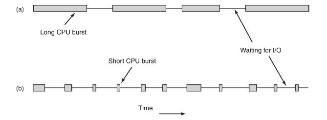
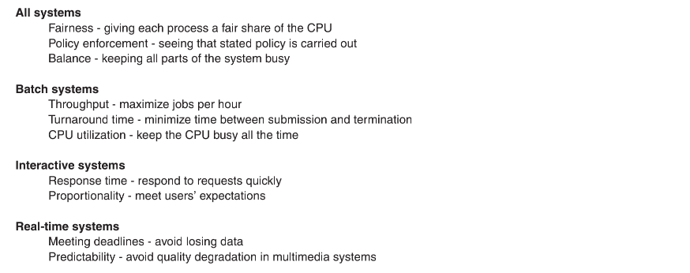
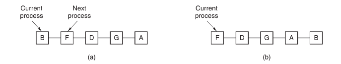
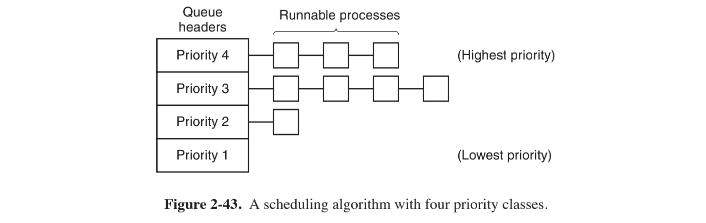
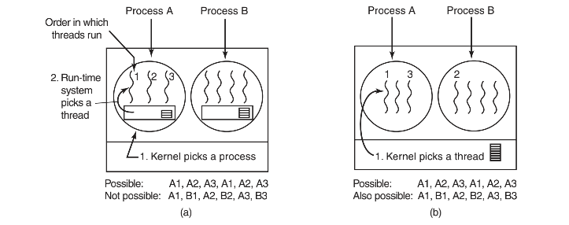

# 调度

当计算机系统是多道程序设计系统时，通常就会有多个进程或线程同时竞争`CPU`。如果只有一个`CPU`可用，那么就必须选择下一个要运行的进程。在操作系统中，完成选择工作的这一部分称为调度程序`scheduler`，该程序使用的算法称为调度算法`scheduling algorithm`。

调度程序还要考虑`CPU`的利用率，因为进程切换的代价是比较高的。首先用户态必须切换到内核态；然后要保存当前进程的状态，包括在进程表中存储寄存器值以便以后重新装载。接着，通过运行调度算法选定一个新进程；

## 进程行为

`CPU`不停顿地运行一段时间，然后发出一个系统调用以便读写文件。在完成系统调用之后，`CPU`又开始计算，直到它需要读更多的数据或写更多的数据为止。

请注意，某些`I/O`活动可以看作是计算。例如，当`CPU`向视频`RAM`复制数据以更新屏幕时，因为使用了`CPU`，所以这是计算，而不是`I/O`活动。按照这种观点，当一个进程等待外部设备完成工作而被阻塞时，才是`I/O`活动。



某些进程`（a的进程）`花费了绝大多数时间在计算上，而其他进程`（b的进程）`则在等待I/O上花费了绝大多数时间。前者称为计算密集型`（compute-bound）`，后者称为I/O密集型`（I/O-bound）`。

典型的计算密集型进程具有较长时间的`CPU`集中使用和较小频度的`I/O`等待。`I/O`密集型进程具有较短时间的`CPU`集中使用和频繁的`I/O`等待。

随着`CPU`变得越来越快，更多的进程倾向为`I/O`密集型。这种现象之所以发生是因为`CPU`的改进比磁盘的改进快得多，其结果是，未来对`I/O`密集型进程的调度处理似乎更为重要。

## 调度时机

有关调度处理的一个关键问题是何时进行调度决策，存在着需要调度处理的各种情形：

第一，在创建一个新进程之后，需要决定是运行父进程还是运行子进程。由于这两种进程都处于就绪状态，所以这是一种正常的调度决策，可以任意决定，也就是说，调度程序可以合法选择先运行父进程还是先运行子进程。

第二，在一个进程退出时必须做出调度决策。一个进程不再运行（因为它不再存在），所以必须从就绪进程集中选择另外某个进程。如果没有就绪的进程，通常会运行一个系统提供的空闲进程。

第三，当一个进程阻塞在I/O和信号量上或由于其他原因阻塞时，必须选择另一个进程运行。例如，如果A是一个重要的进程，并正在等待B退出临界区，让B随后运行将会使得B退出临界区，从而可以让A运行。

第四，在一个I/O中断发生时，必须做出调度决策。如果中断来自I/O设备，而该设备现在完成了工作，某些被阻塞的等待该I/O的进程就成为可运行的就绪进程了。

## 调度算法分类

根据如何处理时钟中断，可以把调度算法分为两类。非抢占式调度算法挑选一个进程，然后让该进程运行直至被阻塞（阻塞在`I/O`上或等待另一个进程），或者直到该进程自动释放`CPU`。

相反，抢占式调度算法挑选一个进程，并且让该进程运行某个固定时段的最大值。如果在该时段结束时，该进程仍在运行，它就被挂起，而调度程序挑选另一个进程运行（如果存在一个就绪进程）。进行抢占式调度处理，需要在时间间隔的末端发生时钟中断，以便把CPU控制返回给调度程序。如果没有可用的时钟，那么非抢占式调度就是惟一的选择了。

此外不同的环境需要不同的调度算法，换句话说，在不同的系统中，调度程序的优化是不同的。这里有必要划分出三种环境：

1. 批处理
2. 交互式
3. 实时

## 调度算法目标

公平是很重要的。相似的进程应该得到相似的服务。对一个进程给予较其他等价的进程更多的CPU时间是不公平的。

与公平有关的是系统策略的强制执行。如果局部策略是，只要需要就必须运行安全控制进程（即便这意味着推迟30秒钟发薪），那么调度程序就必须保证能够强制执行该策略。

另一个共同的目标是保持系统的所有部分尽可能忙碌。如果CPU和所有I/O设备能够始终运行，那么相对于让某些部件空转而言，每秒钟就可以完成更多的工作。



## 批处理系统中的调度

#### 先来先服务

在所有调度算法中，最简单的是非抢占式的先来先服务`first-come first-severd`算法。使用该算法，进程按照它们请求CPU的顺序使用CPU。

基本上，有一个就绪进程的单一队列。当第一个作业从外部进入系统，就立即开始并允许运行它所期望的时间。不会中断该作业。当其他作业进入时，它们就被安排到队列的尾部。当正在运行的进程被阻塞时，队列中的第一个进程就接着运行。在被阻塞的进程变为就绪时，就像一个新来到的作业一样，排到队列的末尾。

先来先服务也有明显的缺点。假设有一个一次运行1秒钟的计算密集型进程和很少使用`CPU`但是每个都要进行`1000`次磁盘读操作才能完成的大量`I/O`密集型进程存在。计算密集进程运行1秒钟，接着读一个磁盘块。所有的`I/O`进程开始运行并读磁盘。当该计算密集进程获得其磁盘块时，它运行下一个1秒钟，紧跟随着的是所有`I/O`进程。

这样做的结果是，每个`I/O`进程在每秒钟内读到一个磁盘块，要花费`1000`秒钟才能完成操作。如果有一个调度算法每`10ms`抢占计算密集型进程，那么`I/O`进程将在`10`秒钟内完成而不是`1000`秒钟，而且还不会对计算密集型进程产生多少延迟。

#### 最短作业优先

现在来看一种适用于运行时间可以预知的另一个非抢占式的批处理调度算法。

如图`a`，`4`个作业`A、B、C、D`，运行时间分别为8`、4、4、4`分钟。若按图中的次序运行，则`A`的周转时间为`8`分钟，`B`为`12`分钟，`C`为`16`分钟，`D`为`20`分钟，平均为`14`分钟。


而按图`B`的方式目前周转时间分别为`4、8、12`和`20`分钟，平均为`11`分钟。可以证明最短作业优先是最优的。

考虑有4个作业的情况，其运行时间分别为`a、b、c、d`。第一个作业在时间`a`结束，第二个在时间`a+b`结束，以此类推。平均周转时间为`（4a+3b+2c+d）/4`。显然a对平均值影响最大，所以它应是最短作业，其次是`b`，再次是`c`，最后的`d`只影响它自己的周转时间。对任意数目作业的情况，道理完全一样。

#### 最短剩余时间优先

最短作业优先的抢占式版本是最短剩余时间优先`（shortest remaining time next）`算法。使用这个算法，调度程序总是选择剩余运行时间最短的那个进程运行。再次提醒，有关的运行时间必须提前掌握。当一个新的作业到达时，其整个时间同当前进程的剩余时间做比较。如果新的进程比当前运行进程需要更少的时间，当前进程就被挂起，而运行新的进程。

## 交互式系统中的调度

现在考察用于交互式系统中的一些调度算法，它们在个人计算机、服务器和其他类系统中都是常用的。

#### 轮转调度

一种最古老、最简单、最公平的算法是轮转调度`（round robin）`。每个进程被分配一个时间段，称为时间片`quantum`，即允许该进程在该时间段中运行。如果在时间片结束时该进程还在运行，则将剥夺`CPU`并分配给另一个进程。如果该进程在时间片结束前阻塞或结束，则`CPU`立即进行切换。时间片轮转调度很容易实现，调度程序所要做的就是维护一张可运行进程列表，如图`a`所示。当一个进程用完它的时间片后，就被移到队列的末尾。



时间片轮转调度中惟一有趣的一点是时间片的长度。从一个进程切换到另一个进程是需要一定时间进行管理事务处理的——保存和装入寄存器值及内存映像、更新各种表格和列表、清除和重新调入内存高速缓存等。假如进程切换`（process switch）`需要`1ms`。再假设时间片设为4ms。有了这些参数，则CPU在做完4ms有用的工作之后，CPU将花费`1ms`来进行进程切换。因此，CPU时间的`20%`浪费在管理开销上。

总之时间片设得太短会导致过多的进程切换，降低了`CPU`效率；而设得太长又可能引起对短的交互请求的响应时间变长。将时间片设为`20ms～50 ms`通常是一个比较合理的折中。

#### 优先级调度

其基本思想很清楚：每个进程被赋予一个优先级，允许优先级最高的可运行进程先运行。

为了防止高优先级进程无休止地运行下去，调度程序可以在每个时钟滴答（即每个时钟中断）降低当前进程的优先级。如果这个动作导致该进程的优先级低于次高优先级的进程，则进行进程切换。一个可采用的方法是，每个进程可以被赋予一个允许运行的最大时间片，当这个时间片用完时，下一个次高优先级的进程获得机会运行。

优先级可以是静态赋予或动态赋予，静态赋予比如：在一个商业计算中心，高优先级作业每小时费用为`100`美元，中优先级每小时75美元，低优先级每小时`50`美元。

优先级也可以由系统动态确定。例如，有些进程为`I/O`密集型，其多数时间用来等待`I/O`结束。当这样的进程需要`CPU`时，应立即分配给它`CPU`，以便启动下一个`I/O`请求。

使`I/O`密集型进程获得较好服务的一种简单算法是，将其优先级设为`1/f`，`f`为该进程在上一时间片中所占的部分。一个在其`50ms`的时间片中只使用`1ms`的进程将获得优先级`50`，而在阻塞之前用掉`25ms`的进程将具有优先级`2`，而使用掉全部时间片的进程将得到优先级`1`。



上图给出了一个有`4`类优先级的系统，其调度算法如下：只要存在优先级为第`4`类的可运行进程，就按照轮转法为每个进程运行一个时间片，此时不理会较低优先级的进程。如果不偶尔对优先级进行调整，则低优先级进程很可能会产生饥饿现象。

#### 多级队列

属于最高优先级类的进程运行一个时间片，属于次高优先级类的进程运行2个时间片，再次一级运行`4`个时间片，以此类推。当一个进程用完分配的时间片后，它被移到下一类。

作为一个例子，考虑有一个进程需要连续计算`100`个时间片。它最初被分配`1`个时间片，然后被换出。下次它将获得`2`个时间片，接下来分别是`4、8、16、32和64`。当然最后一次它只使用`64`个时间片中的`37`个便可以结束工作。该进程需要`7`次交换，而如果采用纯粹的轮转算法则需要`100`次交换。而且，随着进程优先级的不断降低，它的运行频度逐渐放慢，从而为短的交互进程让出`CPU`。

对于那些刚开始运行一段长时间，而后来又需要交互的进程，为了防止其永远处于被惩罚状态，可以采取下面的策略。只要终端上有回车键（Enter键）按下，则属于该终端的所有进程就都被移到最高优先级，

#### 最短进程优先

如果我们将每一条命令的执行看作是一个独立的“作业”，则我们可以通过首先运行最短的作业来使响应时间最短。这里惟一的问题是如何从当前可运行进程中找出最短的那一个进程。

一种办法是根据进程过去行为进行推测，并执行估计运行时间最短的那一个。假设某个终端上每条命令的估计运行时间为`T0`。现在假设测量到其下一次运行时间为`T1` 。可以用这两个值的加权和来改进估计时间，即`aT0 +(1-a)T1` 。

当a=1/2时，可以得到如下序列：

$$
T0 ，T0 /2+T1 /2，T0 /4+T1 /4+T2 /2，T0 /8+T1 /8+T2 /4+T3 /2
$$
有时把这种通过当前测量值和先前估计值进行加权平均而得到下一个估计值的技术称作老化（aging）。它适用于许多预测值必须基于先前值的情况。老化算法在a=1/2时特别容易实现，只需将新值加到当前估计值上，然后除以2（即右移一位）。

#### 保证调度

一种完全不同的调度算法是向用户作出明确的性能保证，然后去实现它。

一种很实际并很容易实现的保证是：在一个有`n`个进程运行的单用户系统中，若所有的进程都等价，则每个进程将获得`1/n`的CPU时间。看上去足够公平了。

为了实现所做的保证，系统必须跟踪各个进程自创建以来已使用了多少`CPU`时间。然后它计算各个进程应获得的`CPU`时间，即自创建以来的时间除以`n`。很容易计算出真正获得的`CPU`时间和应获得的`CPU`时间之比。比率为`0.5`说明一个进程只获得了应得时间的一半，而比率为`2.0`则说明它获得了应得时间的2倍。于是该算法随后转向比率最低的进程，直到该进程的比率超过它的最接近竞争者为止。

#### 彩票调度

有一个既可给出类似预测结果而又有非常简单的实现方法的算法，这个算法称为彩票调度`（lottery scheduling）`。

其基本思想是向进程提供各种系统资源`（如CPU时间）`的彩票。一旦需要做出一项调度决策时，就随机抽出一张彩票，拥有该彩票的进程获得该资源。

如果出售了`100`张彩票，而有一个进程持有其中的20张，那么在每一次抽奖中该进程就有20%的取胜机会。在较长的运行中，该进程会得到`20%`的`CPU`。

彩票调度可以用来解决用其他方法很难解决的问题。一个例子是，有一个视频服务器，在该视频服务器上若干进程正在向其客户提供视频流，每个视频流的帧速率都不相同。假设这些进程需要的帧速率分别是`10、20和25`帧/秒。如果给这些进程分别分配`10、20和25`张彩票，那么它们会自动地按照大致正确的比例`（即10∶20∶25）`划分`CPU`的使用。

#### 公平分享调度

在这种模式中，每个用户分配到`CPU`时间的一部分，而调度程序以一种强制的方式选择进程。这样，如果两个用户都得到获得`50%CPU`时间的保证，那么无论一个用户有多少进程存在，每个用户都会得到应有的`CPU`份额。

作为一个例子，考虑有两个用户的一个系统，每个用户都保证获得`50%CPU`时间。用户`1`有`4`个进程`A、B、C和D`，而用户2只有1个进程E。如果采用轮转调度，一个满足所有限制条件的可能序列是：

```c
A E B E C E D E A E B E C E D E…
```

## 调度策略

以上讨论的调度算法中没有一个算法从用户进程接收有关的调度决策信息，这就导致了调度程序很少能够做出最优的选择。

解决问题的方法是将调度机制`（scheduling mechanism）`与调度策略`（scheduling policy）`分离，也就是将调度算法以某种形式参数化，而参数可以由用户进程填写。在这里，调度机制位于内核，而调度策略则由用户进程决定。

## 线程调度

当若干进程都有多个线程时，就存在两个层次的并行：进程和线程。在这样的系统中调度处理有本质差别，这取决于所支持的是用户级线程还是内核级线程。

首先考虑用户级线程。由于内核并不知道有线程存在，所以内核还是和以前一样地操作，选取一个进程，假设为A，并给予A以时间片控制。A中的线程调度程序决定哪个线程运行，假设为A1。由于多道线程并不存在时钟中断，所以这个线程可以按其意愿任意运行多长时间。如果该线程用完了进程的全部时间片，内核就会选择另一个进程运行。

考虑A线程每次`CPU计`算工作较少的情况，例如，在`50ms`的时间片中有`5ms`的计算工作。于是，每个线程运行一会儿，然后把`CPU`交回给线程调度程序。这样在内核切换到进程`B`之前，就会有序列`A1，A2，A3，A1，A2，A3，A1，A2，A3，A1`。



现在考虑使用内核级线程的情形。内核选择一个特定的线程运行。它不用考虑该线程属于哪个进程，不过如果有必要的话，它可以这样做。对被选择的线程赋予一个时间片，而且如果超过了时间片，就会强制挂起该线程。

用户级线程和内核级线程之间的差别在于性能。用户级线程的线程切换需要少量的机器指令，而内核级线程需要完整的上下文切换，修改内存映像，使高速缓存失效，这导致了若干数量级的延迟。另一方面，在使用内核级线程时，一旦线程阻塞在I/O上就不需要像在用户级线程中那样将整个进程挂起。

从进程A的一个线程切换到进程B的一个线程，其代价高于运行进程A的第2个线程。例如，给定两个在其他方面同等重要的线程，其中一个线程与刚好阻塞的线程属于同一个进程，而另一个线程属于其他的进程，那么应该倾向前者。

