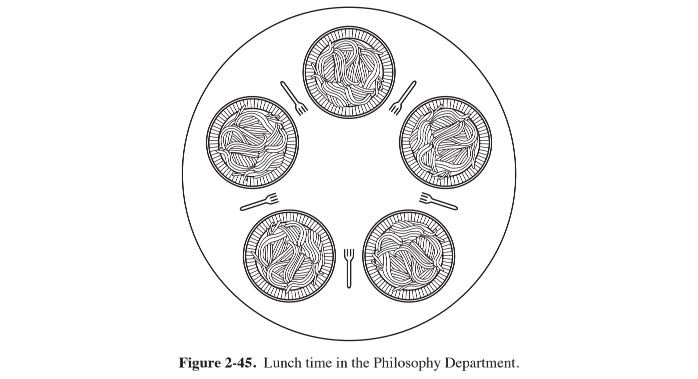

# 经典的IPC问题

操作系统文献中有许多广为讨论和分析的有趣问题，它们与同步方法的使用相关。

## 哲学家就餐问题

1965年，Dijkstra提出并解决了一个他称之为哲学家就餐的同步问题，这个问题可以简单地描述如下：五个哲学家围坐在一张圆桌周围，每个哲学家面前都有一盘通心粉。由于通心粉很滑，所以需要两把叉子才能夹住。相邻两个盘子之间放有一把叉子，餐桌如图所示。

哲学家的生活中有两种交替活动时段：即吃饭和思考。当一个哲学家觉得饿了时，他就试图分两次去取其左边和右边的叉子，每次拿一把，但不分次序。如果成功地得到了两把叉子，就开始吃饭，吃完后放下叉子继续思考。

关键问题是：能为每一个哲学家写一段描述其行为的程序，且决不会死锁吗？

