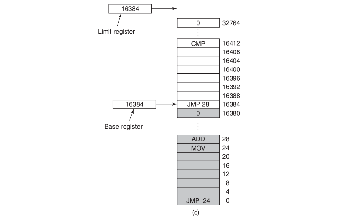
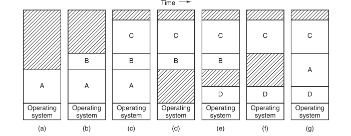
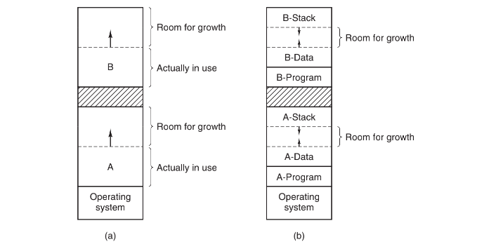
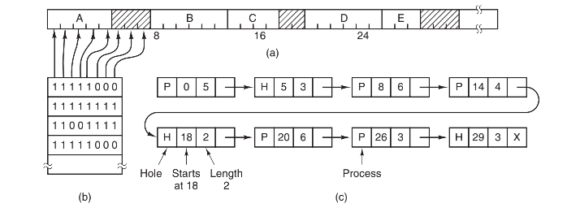
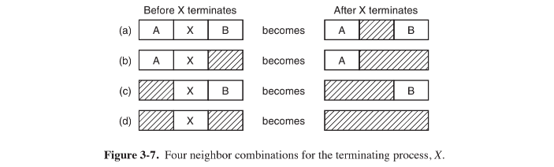

# 内存管理

人们提出了“分层存储器体系”`（memory hierarchy）`的概念，即在这个体系中，计算机有若干兆`（MB）`快速、昂贵且易失性的高速缓存`（cache）`，数千兆`（GB）`速度与价格适中且同样易失性的内存，以及几兆兆`（TB）`低速、廉价、非易失性的磁盘存储，另外还有诸如`DVD`和`USB`等可移动存储装置。操作系统的工作是将这个存储体系抽象为一个有用的模型并管理这个抽象模型。

> ”不管存储器有多大，程序都可以把它填满。“																												——帕金森定律

操作系统中管理分层存储器体系的部分称为存储管理器`（memory manager）`。它的任务是有效地管理内存，即记录哪些内存是正在使用的，哪些内存是空闲的；在进程需要时为其分配内存，在进程使用完后释放内存。

## 无存储器抽象

最简单的存储器抽象就是根本没有抽象，每一个程序都直接访问物理内存。当一个程序执行如下指令：

```assembly
MOV REGISTER1, 1000
```

计算机会将位置为`1000`的物理内存中的内容移到`REGISTER1`中。因此，那时呈现给编程人员的存储器模型就是简单的物理内存：从0到某个上限的地址集合，每一个地址对应一个可容纳一定数目二进制位的存储单元，通常是8个。

在这种情况下，要想在内存中同时运行两个程序是不可能的。如果第一个程序在`2000`的位置写入一个新的值，将会擦掉第二个程序存放在相同位置上的所有内容，所以同时运行两个程序是根本行不通的，这两个程序会立刻崩溃。

#### 在不使用内存抽象的情况下运行多道程序

即使没有内存抽象，同时运行多个程序也是可能的。操作系统只需要把当前内存中所有内容保存到磁盘文件中，然后把下一个程序读入到内存中再运行即可。

## 存储器抽象——地址空间

总之，把物理地址暴露给进程会带来下面几个严重问题。第一，如果用户程序可以寻址内存的每个字节，它们就可以很容易地破坏操作系统，从而使系统慢慢地停止运行。第二使用这种模型，想要同时运行多个程序是很困难的。

#### 地址空间的概念

要保证多个应用程序同时处于内存中并且不互相影响，则需要解决两个问题：保护和重定位。

就像进程的概念创造了一类抽象的CPU以运行程序一样，地址空间为程序创造了一种抽象的内存。地址空间是一个进程可用于寻址内存的一套地址集合。每个进程都有一个自己的地址空间，并且这个地址空间独立于其他进程的地址空间。

地址空间可以不是数字的。一套`“.com”`的互联网域名也是地址空间。这个地址空间是由所有包含`2～63`个字符并且后面跟着`“.com”`的字符串组成的，组成这些字符串的字符可以是字母、数字和连字符。

## 基址寄存器与界限寄存器

简单的解决办法使用一种简单的动态重定位。它所做的是简单地把每个进程的地址空间映射到物理内存的不同部分。

经典办法是给每个`CPU`配置两个特殊硬件寄存器，通常叫做基址寄存器和界限寄存器。当使用基址寄存器和界限寄存器时，程序装载到内存中连续的空闲位置且装载期间无须重定位，

当一个进程运行时，程序的起始物理地址装载到基址寄存器中，程序的长度装载到界限寄存器中。当第一个程序运行时，装载到这些硬件寄存器中的基址和界限值分别是`0`和`16 384`。当第二个程序运行时，这些值分别是`16 384`和`32 768`。如果第三个`16KB`的程序被直接装载在第二个程序的地址之上并且运行，这时基址寄存器和界限寄存器里的值会是`32 768`和`16 384`。



每次一个进程访问内存，取一条指令，读或写一个数据字，`CPU`硬件会在把地址发送到内存总线前，自动把基址值加到进程发出的地址值上。同时，它检查程序提供的地址是否等于或大于界限寄存器里的值。如果访问的地址超过了界限，会产生错误并中止访问。

程序执行

```assembly
JMP 28
```

但是硬件把这条指令解释成为

```assembly
JMP 16412
```

使用基址寄存器和界限寄存器重定位的缺点是，每次访问内存都需要进行加法和比较运算。比较可以做得很快，但是加法由于进位传递时间的问题，在没有使用特殊电路的情况下会显得很慢。

## 交换技术

如果计算机物理内存足够大，可以保存所有进程，那么之前提及的所有方案都或多或少是可行的，但实际上，所有进程所需的`RAM`数量总和通常要远远超出存储器能够支持的范围。

有两种处理内存超载的通用方法。最简单的策略是交换`（swapping）`技术，即把一个进程完整调入内存，使该进程运行一段时间，然后把它存回磁盘。空闲进程主要存储在磁盘上，所以当它们不运行时就不会占用内存。另一种策略是虚拟内存`（virtual memory）`，该策略甚至能使程序在只有一部分被调入内存的情况下运行。

交换系统的操作如图中所示。开始时内存中只有进程`A`。之后创建进程`B`和`C`或者从磁盘将它们换入内存。图中显示`A`被交换到磁盘。然后`D`被调入，`B`被调出，最后`A`再次被调入。



交换在内存中产生了多个空闲区（`hole`，也称为空洞），通过把所有的进程尽可能向下移动，有可能将这些小的空闲区合成一大块。该技术称为内存紧缩`（memory compaction）`。这个操作通常不进行，因为它要耗费大量的`CPU`时间。例如，一台有`1GB`内存的计算机可以每`20ns`复制`4`个字节，它紧缩全部内存大约要花费`5s`。

若进程创建时其大小是固定的并且不再改变，则分配很简单，操作系统准确地按其需要的大小进行分配，不多也不少。

若该进程与一个空闲区相邻，那么可把该空闲区分配给该进程让它在这个空闲区增大。另一方面，若进程相邻的是另一个进程，那么要么把需要增长的进程移到内存中一个足够大的区域中去，要么把一个或多个进程交换出去，以便生成一个足够大的空闲区。若一个进程在内存中不能增长，而且磁盘上的交换区也已满了，那么这个进程只有挂起直到一些空间空闲（或者可以结束该进程）。

如果大部分进程在运行时都要增长，为了减少因内存区域不够而引起的进程交换和移动所产生的开销，一种可用的方法是，当换入或移动进程时为它分配一些额外的内存。



在图中可以看到所示进程的堆栈段在进程所占内存的顶端并向下增长，紧接在程序段后面的数据段向上增长。在这两者之间的内存可以供两个段使用。如果用完了，进程或者必须移动到足够大的空闲区中（它可以被交换出内存直到内存中有足够的空间），或者结束该进程。

## 空闲内存管理

在动态分配内存时，操作系统必须对其进行管理。一般而言，有两种方式跟踪内存使用情况：位图和空闲链表。下面我们将介绍这两种方式。

#### 1.使用位图的存储管理

使用位图方法时，内存可能被划分成小到几个字或大到几千字节的分配单元。每个分配单元对应于位图中的一位，`0`表示空闲，`1`表示占用（或者相反）。一块内存区和其对应的位图如图中所示。



分配单元的大小是一个重要的设计因素。分配单元越小，位图越大。然而即使只有4个字节大小的分配单元，`32`位的内存也只需要位图中的`1`位；`32n`位的内存需要`n`位的位图，所以位图只占用了`1/33`的内存。若选择比较大的分配单元，则位图更小。但若进程的大小不是分配单元的整数倍，那么在最后一个分配单元中就会有一定数量的内存被浪费了。

因为内存的大小和分配单元的大小决定了位图的大小，所以它提供了一种简单的利用一块固定大小的内存区就能对内存使用情况进行记录的方法。这种方法的主要问题是，在决定把一个占`k`个分配单元的进程调入内存时，存储管理器必须搜索位图，在位图中找出有`k`个连续`0`的串。查找位图中指定长度的连续`0`串是耗时的操作（因为在位图中该串可能跨越字的边界），这是位图的缺点。

#### 2.使用链表的存储管理

另一种记录内存使用情况的方法是，维护一个记录已分配内存段和空闲内存段的链表。其中链表中的一个结点或者包含一个进程，或者是两个进程间的一个空的空闲区。可用图中所示的段链表来表示图中所示的内存布局。链表中的每一个结点都包含以下域：空闲区`（H）`或进程`（P）`的指示标志、起始地址、长度和指向下一结点的指针。

段链表是按照地址排序的，其好处是当进程终止或被换出时链表的更新非常直接。一个要终止的进程一般有两个邻居（除非它是在内存的最底端或最顶端），它们可能是进程也可能是空闲区，这就导致了图所示的四种组合。在图中更新链表需要把`P`替换为`H`；在图中`b`和`c`两个结点被合并成为一个，链表少了一个结点；在图`d`中三个结点被合并为一个，从链表中删除了两个结点。



当按照地址顺序在链表中存放进程和空闲区时，有几种算法可以用来为创建的进程（或从磁盘换入的已存在的进程）分配内存。这里，假设存储管理器知道要为进程分配的多大的内存。最简单的算法是首次适配`（first fit）`算法。存储管理器沿着段链表进行搜索，直到找到一个足够大的空闲区，除非空闲区大小和要分配的空间大小正好一样，否则将该空闲区分为两部分，一部分供进程使用，另一部分形成新的空闲区。首次适配算法是一种速度很快的算法，因为它尽可能少地搜索链表结点。

对首次适配算法进行很小的修改就可以得到下次适配`（next fit）`算法。它的工作方式和首次适配算法相同，不同点是每次找到合适的空闲区时都记录当时的位置。以便在下次寻找空闲区时从上次结束的地方开始搜索，而不是像首次适配算法那样每次都从头开始。

另一个著名的并广泛应用的算法是最佳适配`（best fit）`算法。最佳适配算法搜索整个链表（从开始到结束），找出能够容纳进程的最小的空闲区。最佳适配算法试图找出最接近实际需要的空闲区，以最好地区配请求和可用空闲区，而不是先拆分一个以后可能会用到的大的空闲区。

最佳适配的空闲区会分裂出很多非常小的空闲区，为了避免这一问题，可以考虑最差适配`（worst fit）`算法，即总是分配最大的可用空闲区，使新的空闲区比较大从而可以继续使用。

另一种分配算法称为快速适配`（quick fit）`算法，它为那些常用大小的空闲区维护单独的链表。例如，有一个`n`项的表，该表的第一项是指向大小为`4KB`的空闲区链表表头的指针，第二项是指向大小为`8KB`的空闲区链表表头的指针，第三项是指向大小为`12KB`的空闲区链表表头的指针，以此类推。像`21KB`这样的空闲区既可。

