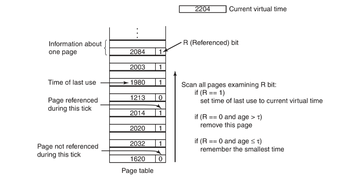

## 虚拟内存

尽管基址寄存器和界限寄存器可以用于创建地址空间的抽象，还有另一个问题需要解决：管理软件的膨胀`（bloatware）`。

需要运行的程序往往大到内存无法容纳，而且必然需要系统能够支持多个程序同时运行，即使内存可以满足其中单独一个程序的需要，但总体来看，它们仍然超出了内存大小。交换技术`（swapping）`并不是一个有吸引力的解决方案，因为一个典型的`SATA`磁盘的峰值传输率最高达到`100MB/s`，这意味着至少需要`10`秒才能换出一个`1GB`的程序，并需要另一个10秒才能再将一个1GB的程序换入。”

程序大于内存的问题早在计算时代就产生了，20世纪60年代采取的解决方法是：把程序分割成许多片段，称为覆盖`overlay`。程序开始执行时，将覆盖管理模块装入内存，该管理模块立即装入并运行覆盖`0`。执行完成后，覆盖`0`通知管理模块装入覆盖`1`，或者占用覆盖`0`的上方位置（如果有空间），或者占用覆盖`0`（如果没有空间）。一些覆盖系统非常复杂，允许多个覆盖块同时在内存中。覆盖块存放在磁盘上，在需要时由操作系统动态地换入换出。

虚拟内存的基本思想是：**每个程序拥有自己的地址空间**，这个空间被分割成多个块，每一块称作一页或页面`（page）`。每一页有连续的地址范围。这些页被映射到物理内存，但并不是所有的页都必须在内存中才能运行程序。当程序引用到一部分在物理内存中的地址空间时，由硬件立刻执行必要的映射。当程序引用到一部分不在物理内存中的地址空间时，由操作系统负责将缺失的部分装入物理内存并重新执行失败的指令。

虚拟内存很适合在多道程序设计系统中使用，许多程序的片段同时保存在内存中。当一个程序等待它的一部分读入内存时，可以把CPU交给另一个进程使用。

使用虚拟内存之后新进程的运行有两种选择，将程序的部分装入内存运行时再请求调入，或者是直接请求调入。

## 分页

大部分虚拟内存系统中都使用一种称为分页`（paging）`的技术。在任何一台计算机上，程序引用了一组内存地址。当程序执行指令

```assembly
MOV REG, 1000
```

它把地址为`1000`的内存单元的内容复制到REG中，由程序产生的这些地址称为虚拟地址`（virtual address）`，它们构成了一个虚拟地址空间`（virtual address space）`。

在没有虚拟内存的计算机上，系统直接将虚拟地址送到内存总线上，读写操作使用具有同样地址的物理内存字；而在使用虚拟内存的情况下，虚拟地址不是被直接送到内存总线上，而是被送到内存管理单元`（Memory Management Unit）`，`MMU`把虚拟地址映射为物理内存地址。


图中一个例子说明了这种映射是如何工作的。在这个例子中，有一台可以产生`16`位地址的计算机，地址范围从`0-64K`，且这些地址是虚拟地址。然而，这台计算机只有`32KB`的物理内存，因此，虽然可以编写`64KB`的程序，但它们却不能被完全调入内存运行。在磁盘上必须有一个可以大到`64KB`的程序核心映像的完整副本，以保证程序片段在需要时能被调入内存。”


> 页表给出虚拟地址与物理内存地址之间映射关系。每一页起始于`4096`的倍数位置，结束于起址加`4095`，所以`4K`到`8K`实际为`4096～8191`；`8K`到`12K`就是`8192～12287`
>

虚拟地址空间按照固定大小划分成称为页面`（page）`的若干单元。在物理内存中对应的单元称为页框`（page frame）`。页面和页框的大小通常是一样的，

当程序试图访问地址0时，例如执行下面这条指令

```assembly
MOV REG, 0
```

将虚拟地址`0`送到`MMU`。`MMU`看到虚拟地址落在页面`0（0～4095）`，根据其映射结果，这一页面对应的是页框`2（8192～12 287）`，因此`MMU`把地址变换为`8192`，并把地址`8192`送到总线上。内存对`MMU`一无所知，它只看到一个读或写地址`8192`的请求并执行它。`MMU`从而有效地把所有从`0～4095`的虚拟地址映射到了`8192～12 287`的物理地址。

通过恰当地设置`MMU`，可以把`16`个虚拟页面映射到8个页框中的任何一个。但是这并没有解决虚拟地址空间比物理内存大的问题，在实际的硬件中，用一个“在/不在”位`（present/absent bit）`记录页面在内存中的实际存在情况。

当程序访问了一个未映射的页面，例如执行指令

```assembly
MOV REG, 32780
```

`MMU`注意到该页面没有被映射（图中叉号表示），于是`CPU`陷入到操作系统，这个陷阱称为缺页中断`（page fault）`。操作系统找到一个很少使用的页框且把它的内容写入磁盘（如果它不在磁盘上）。随后把需要访问的页面读到刚才回收的页框中，修改映射关系，然后重新启动引起陷阱的指令。

下面查看一下`MMU`的内部结构以便了解它是怎么工作的，以及了解为什么我们选用的页面大小都是`2`的整数次幂。在图中可以看到一个虚拟地址的例子，虚拟地址`8196（二进制是0010000000000100）`用图中的`MMU`映射机制进行映射，输入的`16`位虚拟地址被分为`4`位的页号和`12`位的偏移量。`4`位的页号可以表示`16`个页面，`12`位的偏移可以为一页内的全部`4096`个字节编址。


可用页号作为页表`（page table）`的索引，以得出对应于该虚拟页面的页框号。如果“在/不在”位是`0`，则将引起一个操作系统陷阱。如果该位是`1`，则将在页表中查到的页框号复制到输出寄存器的高`3`位中，再加上输入虚拟地址中的低`12`位偏移量。如此就构成了`15`位的物理地址。

## 页表

作为一种最简单的实现，虚拟地址到物理地址的映射可以概括如下：虚拟地址被分成虚拟页号（高位部分）和偏移量（低位部分）两部分。

虚拟页号可用做页表的索引，以找到该虚拟页面对应的页表项。由页表项可以找到页框号。然后把页框号拼接到偏移量的高位端，以替换掉虚拟页号，形成送往内存的物理地址。

页表的目的是把虚拟页面映射为页框。从数学角度说，页表是一个函数，它的参数是虚拟页号，结果是物理页框号。通过这个函数可以把虚拟地址中的虚拟页面域替换成页框域，从而形成物理地址。

#### 页表项的结构

下面将讨论单个页表项的细节。页表项的结构是与机器密切相关的，但不同机器的页表项存储的信息都大致相同。


不同计算机的页表项大小可能不一样，但`32`位是常用的大小。最重要的域是页框号。

其次是`“在/不在”`位，这一位是`1`时表示该表项是有效的，可以使用；如果是`0`，则表示该表项对应的虚拟页面现在不在内存中，访问该页面会引起一个缺页中断。

`保护（protection）`位指出一个页允许什么类型的访问。最简单的形式是这个域只有一位，0表示读/写，1表示只读。一个更先进的方法是使用三位，各位分别对应是否启用读、写、执行该页面。

为了记录页面的使用状况，引入了`修改(modified)`位和`访问(referenced)`位。在写入一页时由硬件自动设置修改位。该位在操作系统重新分配页框时是非常有用的。如果一个页面已经被修改过，则必须把它写回磁盘。如果一个页面没有被修改过，则只简单地把它丢弃就可以了，因为它在磁盘上的副本仍然是有效的。这一位有时也被称为`脏位(dirty bit)`，因为它反映了该页面的状态。

不论是读还是写，系统都会在该页面被访问时设置访问位。它的值被用来帮助操作系统在发生缺页中断时选择要被淘汰的页面。不再使用的页面要比正在使用的页面更适合淘汰。

最后一位用于禁止该页面被高速缓存，通过这一位可以禁止高速缓存。

应该注意的是，若某个页面不在内存时，用于保存该页面的磁盘地址不是页表的一部分。原因很简单，页表只保存把虚拟地址转换为物理地址时硬件所需要的信息。操作系统在处理缺页中断时需要把该页面的磁盘地址等信息保存在操作系统内部的软件表格中。硬件不需要它。

## 加速分页过程

在任何分页式系统中，都需要考虑两个主要问题：

1. 虚拟地址到物理地址的映射必须非常快。
2. 如果虚拟地址空间很大，页表也会很大。

第一个问题是由于每次访问内存，都需要进行虚拟地址到物理地址的映射。所有的指令最终都必须来自内存，并且很多指令也会访问内存中的操作数。如果执行一条指令需要`1ns`，页表查询必须在`0.2ns`之内完成，以避免映射成为一个主要瓶颈。

第二个问题来自现代计算机使用至少`32`位的虚拟地址，而且`64`位变得越来越普遍。假设页长为`4KB`，`32`位的地址空间将有`100万页`，而`64`位地址空间简直多到超乎你的想象。如果虚拟地址空间中有`100万个页`，那么页表必然有100万条表项。另外请记住，每个进程都需要自己的页表（因为它有自己的虚拟地址空间）。

#### 1.转换检测缓冲区

上面提到的解决方案是为计算机设置一个小型的硬件设备，将虚拟地址直接映射到物理地址，而不必再访问页表。这种设备称为转换检测缓冲区`（Translation Lookaside Buffer，TLB）`，有时又称为相联存储器`（associate memory）`，如图所示。它通常在`MMU`中，包含少量的表项，在此例中为`8`个，在实际中很少会超过`64`个。每个表项记录了一个页面的相关信息，包括虚拟页号、页面的修改位、保护码（读/写/执行权限）和该页所对应的物理页框。除了虚拟页号，这些域与页表中的域是一一对应的。另外还有一位用来记录这个表项是否有效（即是否在使用）。

现在看一下`TLB`是如何工作的。将一个虚拟地址放入`MMU`中进行转换时，硬件首先通过将该虚拟页号与`TLB`中所有表项同时进行匹配，判断虚拟页面是否在其中。如果发现了一个有效的匹配并且要进行的访问操作并不违反保护位，则将页框号直接从`TLB`中取出而不必再访问页表。


当虚拟页号不在`TLB`中时发生的事情值得讨论。如果`MMU`检测到没有有效匹配项时，就会进行正常的页表查询。接着从`TLB`中淘汰一个表项，然后用新找到的页表项代替它。这样，如果这一页面很快再被访问，第二次访问TLB时自然将会命中而不是不命中。当一个表项被清除出TLB时，将修改位复制到内存中的页表项，而除了访问位，其他的值不变。当页表项中从页表装入到TLB中时，所有的值都来自内存。

#### 软件TLB管理

许多现代的`RISC`机器，包括`SPARC、MIPS以及HP PA`，几乎所有的页面管理都是在软件中实现的。在这些机器上，`TLB`表项被操作系统显式地装载。当发生`TLB`访问失效，不再是由`MMU`到页表中查找并取出需要的页表项，而是生成一个`TLB`失效并将问题交给操作系统解决。系统必须先找到该页面，然后从`TLB`中删除一个项，接着装载一个新的项，最后再执行先前出错的指令。当然，所有这一切都必须在有限的几条指令中完成，因为`TLB`失效比缺页中断发生的更加频繁。

无论是用硬件还是用软件来处理`TLB`失效，常见方法都是找到页表并执行索引操作以定位将要访问的页面。用软件做这样的搜索的问题是，页表可能不在`TLB`中，这就会导致处理过程中的额外的`TLB`失效。可以通过在内存中的固定位置维护一个大的`TLB`表项的软件高速缓存来减少`TLB`失效。通过首先检查软件高速缓存，操作系统能够实质性地减少`TLB`失效。

当一个页面访问在内存中而不在`TLB`中时，将产生软失效`soft miss`。那么此时所要做的就是更新一下`TLB`，不需要产生磁盘`I/O`。典型的处理需要`10～20`个机器指令并花费几个纳秒完成操作。相反，当页面本身不在内存中（当然也不在`TLB`中）时，将产生硬失效。此刻需要一次磁盘存取以装入该页面，这个过程大概需要几毫秒。硬失效的处理时间往往是软失效的百万倍。

## 针对大内存的页表

在原有的内存页表的方案之上，引入快表`（TLB）`可以用来加快虚拟地址到物理地址的转换。不过这不是惟一需要解决的问题，另一个问题是怎样处理巨大的虚拟地址空间。下面将讨论两种解决方法。

#### 多级页表

第一种方法是采用多级页表。

在图中，`32`位的虚拟地址被划分为`10`位的`PT1`域、`10`位的`PT2`域和`12`位的`Offset（偏移量）`域。因为偏移量是`12`位，所以页面长度是`4KB`，共有`220` 个页面。

引入多级页表的原因是避免把全部页表一直保存在内存中。特别是那些从不需要的页表就不应该保留。比如一个需要`12MB`内存的进程，其最底端是`4MB`的程序正文段，后面是`4MB`的数据段，顶端是`4MB`的堆栈段，在数据段上方和堆栈段下方之间是大量根本没有使用的空闲区。


考察图中例子中的二级页表是如何工作的。在左边是顶级页表，它具有`1024`个表项，对应于`10`位的`PT1`域。当一个虚拟地址被送到`MMU`时，`MMU`首先提取`PT1`域并把该值作为访问顶级页表的索引。因为整个`4GB（32位）`虚拟地址空间已经被分成`1024`个`4MB`的块，所以这`1024`个表项中的每一个都表示`4MB`的虚拟地址空间。

由索引顶级页表得到的表项中含有二级页表的地址或页框号。顶级页表的表项`0`指向程序正文的页表，表项`1`指向数据的页表，表项1023指向堆栈的页表。

其他的表项（用阴影表示的）未用。现在把`PT2`域作为访问选定的二级页表的索引，以便找到该虚拟页面的对应页框号。

下面看一个示例，考虑`32`位虚拟地址`0x00403004（十进制4 206 596）`位于数据部分`12 292`字节处。它的虚拟地址对应`PT1=1，PT2=2，Offset=4`。`MMU`首先用`PT1`作为索引访问顶级页表得到表项`1`，它对应的地址范围是`4M～8M`。然后，它用`PT2`作为索引访问刚刚找到的二级页表并得到表项`3`，它对应的虚拟地址范围是在它的`4M`块内的`12 288～16 383（即绝对地址4 206 592～4 210 687）`。这个表项含有虚拟地址`0x00403004`所在页面的页框号。如果该页面不在内存中，页表项中的“在/不在”位将是`0`，引发一次缺页中断。如果该页面在内存中，从二级页表中得到的页框号将与偏移量`4`结合形成物理地址。该地址被放到总线上并送到内存中。

#### 倒排页表

随着`64`位计算机变得更加普遍，情况发生了彻底的变化。如果现在的地址空间是`264` 字节，页面大小为`4KB`，我们需要一个有`252` 个表项的页表。如果每一个表项`8`个字节，那么整个页表就会超过`3000万GB`。仅仅为页表耗费`3000万GB`不是个好主意。

解决方案之一就是使用倒排页表`（inverted page table）`。在这种设计中，在实际内存中每一个页框有一个表项，而不是每一个虚拟页面有一个表项。例如，对于`64`位虚拟地址，`4KB`的页，`1GB`的`RAM`，一个倒排页表仅需要`262 144`个页表项。表项记录哪一个（进程，虚拟页面）对定位于该页框。


## 页面置换算法

当发生缺页中断时，操作系统必须在内存中选择一个页面将其换出内存，以便为即将调入的页面腾出空间。如果要换出的页面在内存驻留期间已经被修改过，就必须把它写回磁盘以更新该页面在磁盘上的副本；如果该页面没有被修改过，那么它在磁盘上的副本已经是最新的，不需要回写。直接用调入的页面覆盖掉被淘汰的页面就可以了。

当发生缺页中断时，虽然可以随机地选择一个页面来置换，但是如果每次都选择不常使用的页面会提升系统的性能。如果一个被频繁使用的页面被置换出内存，很可能它在很短时间内又要被调入内存，这会带来不必要的开销。

> **注意：**置换算法先访问的是页表里的在不在位，来访问访问实际的页框。

#### 最优页面置换算法

很容易就可以描述出最好的页面置换算法，虽然此算法不可能实现。该算法是这样工作的：在缺页中断发生时，有些页面在内存中，其中有一个页面紧接着的下一条指令就被访问，其他页面则可能要到10、100或1000条指令后才会被访问，每个页面都可以用在该页面首次被访问前所要执行的指令数作为标记。最优页面置换算法规定应该置换标记最大的页面。

这个算法惟一的问题就是它是无法实现的。当缺页中断发生时，操作系统无法知道各个页面下一次将在什么时候被访问。

#### 最近未使用页面置换算法

在大部分具有虚拟内存的计算机中，系统为每一页面设置了两个状态位。当页面被访问（读或写）时设置`R`位；当页面（即修改页面）被写入时设置`M`位。每次访问内存时更新这些位，因此由硬件来设置它们是必要的。一旦设置某位为1，它就一直保持1直到操作系统将它复位。

可以用`R`位和`M`位来构造一个简单的页面置换算法：当启动一个进程时，它的所有页面的两个位都由操作系统设置成`0`，`R`位被定期地（比如在每次时钟中断时）清零，以区别最近没有被访问的页面和被访问的页面。

当发生缺页中断时，操作系统检查所有的页面并根据它们当前的`R`位和`M`位的值，把它们分为4类：

- 第0类：没有被访问，没有被修改。
- 第1类：没有被访问，已被修改。
- 第2类：已被访问，没有被修改。
- 第3类：已被访问，已被修改。

`NRU（Not Recently Used，最近未使用）`算法随机地从类编号最小的非空类中挑选一个页面淘汰之。这个算法隐含意思是，在最近一个时钟滴答中`（典型的时间是大约20ms）`淘汰一个没有被访问的已修改页面要比淘汰一个被频繁使用的干净页面。

#### 先进先出页面置换算法

另一种开销较小的页面置换算法是`FIFO（First-In First-Out，先进先出）`算法，由操作系统维护一个所有当前在内存中的页面的链表，最新进入的页面放在表尾，最久进入的页面放在表头。当发生缺页中断时，淘汰表头的页面并把新调入的页面加到表尾。

然而这种算法是不太合理的。

#### 第二次机会页面置换算法

`FIFO`算法可能会把经常使用的页面置换出去，为避免此问题，对该算法做一个简单的修改：检查最老页面的`R`位。如果`R`位是`0`，那么这个页面既老又没有被使用，可以立刻置换掉；如果是`1`，就将`R`位清`0`，并把该页面放到链表的尾端，修改它的装入时间使它就像刚装入的一样，然后继续搜索。


假设在时间`20`发生了一次缺页中断，这时最老的页面是`A`，它是在时刻`0`到达的。如果`A`的`R`位是`0`，则将它淘汰出内存，或者把它写回磁盘（如果它已被修改过），或者只是简单地放弃（如果它是“干净”的）；另一方面，如果其R位已经设置了，则将A放到链表的尾部并且重新设置装入时间。

#### 时钟页面置换算法

尽管第二次机会算法是一个比较合理的算法，但它经常要在链表中移动页面，既降低了效率又不是很有必要。一个更好的办法是把所有的页面都保存在一个类似钟面的环形链表中，一个表针指向最老的页面：


当发生缺页中断时，算法首先检查表针指向的页面，如果它的`R`位是`0`就淘汰该页面，并把新的页面插入这个位置，然后把表针前移一个位置；如果`R`位是`1`就清除`R`位并把表针前移一个位置，重复这个过程直到找到了一个`R`位为`0`的页面为止。

#### 最近最少使用页面置换算法

已经很久没有使用的页面很有可能在未来较长的一段时间内仍然不会被使用。这个思想提示了一个可实现的算法：在缺页中断发生时，置换未使用时间最长的页面。这个策略称为`LRU（Least Recently Used，最近最少使用）`页面置换算法。

虽然`LRU`在理论上是可以实现的，但代价很高。为了完全实现LRU，需要在内存中维护一个所有页面的链表，最近最多使用的页面在表头，最近最少使用的页面在表尾。困难的是在每次访问内存时都必须要更新整个链表。在链表中找到一个页面，删除它，然后把它移动到表头是一个非常费时的操作。

然而，还是有一些使用特殊硬件实现`LRU`的方法。假设硬件有一个`64`位计数器`C`，它在每条指令执行完后自动加`1`，每个页表项必须有一个足够容纳这个计数器值的域。在每次访问内存后，将当前的`C`值保存到被访问页面的页表项中。一旦发生缺页中断，操作系统就检查所有页表项中计数器的值，找到值最小的一个页面，这个页面就是最近最少使用的页面。

#### 用软件模拟LRU

前面两种LRU算法虽然在理论上都是可以实现的，但只有非常少的计算机拥有这种硬件。因此，需要一个能用软件实现的解决方案。一种可能的方案称为`NFU（Not Frequently Used，最不常用）`算法。

该算法将每个页面与一个软件计数器相关联，计数器的初值为0。每次时钟中断时，由操作系统扫描内存中所有的页面，将每个页面的R位`(0或1)`加到它的计数器上。这个计数器大体上跟踪了各个页面被访问的频繁程度。发生缺页中断时，则置换计数器值最小的页面。

`NFU`的主要问题是它从来不清除状态。比如，在一个多次（扫描）编译器中，在第一次扫描中被频繁使用的页面在程序进入第二次扫描时，其计数器的值可能仍然很高。结果是操作系统将置换有用的页面而不是不再使用的页面。同时如果两个最不常用值相同时我们无法知道那个更近被访问过。

幸运的是只需对`NFU`做一个小小的修改就能使它很好地模拟`LRU`。其修改分为两部分：首先，在R位被加进之前先将计数器右移一位；其次，将R位加到计数器最左端的位而不是最右端的位。

修改以后的算法称为老化`（aging）`算法，图3-18解释了它是如何工作的。假设在第一个时钟滴答后，页面0到页面5的R位值分别是`1、0、1、0、1、1（页面0为1，页面1为0，页面2为1，以此类推）`。


缺页中断时，将置换计数器值最小的页面。如果一个页面在前面`4`个时钟滴答中都没有访问过，那它的计数器最前面应该有`4`个连续的`0`，因此它的值肯定要比在前面三个时钟滴答中都没有被访问过的页面的计数器值小。

`LRU`和老化算法的第二个区别是老化算法的计数器只有有限位数（本例中是`8`位），这就限制了其对以往页面的记录。如果两个页面的计数器都是`0`，我们只能在两个页面中随机选一个进行置换。如果时钟滴答是`20ms`，`8`位一般是够用的。假如一个页面已经`160ms`没有被访问过，那么它很可能并不重要。

#### 工作集页面置换算法

在单纯的分页系统里，刚启动进程时，在内存中并没有页面。在`CPU`试图取第一条指令时就会产生一次缺页中断，使操作系统装入含有第一条指令的页面。其他由访问全局数据和堆栈引起的缺页中断通常会紧接着发生。一段时间以后，进程需要的大部分页面都已经在内存了，进程开始在较少缺页中断的情况下运行。这个策略称为请求调页`（demand paging）`，因为页面是在需要时被调入的，而不是预先装入。

一个进程当前正在使用的页面的集合称为它的工作集`（working set）`，如果整个工作集都被装入到了内存中，那么进程在运行到下一运行阶段之前，不会产生很多缺页中断。若内存太小而无法容纳下整个工作集，那么进程的运行过程中会产生大量的缺页中断，导致运行速度也会变得很缓慢，因为通常只需要几个纳秒就能执行完一条指令，而通常需要十毫秒才能从磁盘上读入一个页面。如果一个程序每`10ms`只能执行一到两条指令，那么它将会需要很长时间才能运行完。若每执行几条指令程序就发生一次缺页中断，那么就称这个程序发生了颠簸`（thrashing）`

不少分页系统都会设法跟踪进程的工作集，以确保在让进程运行以前，它的工作集就已在内存中了。该方法称为工作集模型`（working set model）`，其目的在于大大减少缺页中断率。在让进程运行前预先装入其工作集页面也称为预先调页`（prepaging）`。

大多数程序都不均匀地访问它们的地址空间，而访问往往是集中于一小部分页面。一次内存访问可能取出一条指令，也可能会取数据，或者是存储数据。在任一时刻`t`，都存在一个集合，它包含所有最近k次内存访问所访问过的页面。这个集合`w(k,t)`就是工作集。因为最近k=1次访问肯定会访问最近`k＞1`次访问所访问过的页面，所以`w(k,t)`是`k`的单调非递减函数。


`k`的值有一个很大的范围，它处在这个范围中时工作集不会变。因为工作集随时间变化很慢，那么当程序重新开始时，就有可能根据它上次结束时的工作集对要用到的页面做一个合理的推测，预先调页就是在程序继续运行之前预先装入推测出的工作集的页面。

为了实现工作集模型，操作系统必须跟踪哪些页面在工作集中。通过这些信息可以直接推导出一个合理的页面置换算法：当发生缺页中断时，淘汰一个不在工作集中的页面。为了实现该算法，就需要一种精确的方法来确定哪些页面在工作集中。根据定义，工作集就是最近`k`次内存访问所使用过的页面的集合。为了实现工作集算法，必须预先选定`k`的值。一旦选定某个值，每次内存访问之后，最近`k`次内存访问所使用过的页面的集合就是唯一确定的了。

由于`k`次内存访问的数据不好计算，所以我们的解决方案就是不是向后找最近`k`次的内存访问，而是考虑其执行时间。按照以前的方法，我们定义工作集为前`1000`万次内存访问所使用过的页面的集合，那么现在可以这样定义：工作集即是过去`10ms`中的内存访问所用到的页面的集合。

现在让我们来看一下基于工作集的页面置换算法。基本思路就是找出一个不在工作集中的页面并淘汰它，每个表项至少包含两条信息：上次使用该页面的`近似时间`和`R（访问）`位。



假定在每个时钟滴答中，有一个定期的时钟中断会用软件方法来清除`R`位。每当缺页中断发生时，扫描页表以找出一个合适的页面淘汰之。

在处理每个表项时，都需要检查`R`位。如果它是`1`，就把当前实际时间写进页表项的`“上次使用时间”`域，以表示缺页中断发生时该页面正在被使用。”

如果`R`是`0`，那么表示在当前时钟滴答中，该页面还没有被访问过，则它就可以作为候选者被置换。为了知道它是否应该被置换，需要计算它的生存时间，然后与τ做比较。如果它的生存时间大于`τ`，那么这个页面就不在工作集中，而用新页面置换它。

然而，如果`R`是`0`同时生存时间小于或等于`τ`，则该页面仍然在工作集中。这样就要把该页面临时保留下来，**但是要记录生存时间最长（“上次使用时间”的最小值）的页面。**如果扫描完整个页表却没有找到适合被淘汰的页面，也就意味着所有的页面都在工作集中。在这种情况下，如果找到了一个或者多个`R=0`的页面，就淘汰生存时间最长的页面。在最坏情况下，在当前时间滴答中，所有的页面都被访问过了，因此就随机选择一个页面淘汰，如果有的话最好选一个干净页面。

#### 工作集时钟页面置换算法

当缺页中断发生后，需要扫描整个页表才能确定被淘汰的页面，因此基本工作集算法是比较费时的。有一种改进的算法，它基于时钟算法，并且使用了工作集信息，称为`WSClock（工作集时钟）`算法。

与时钟算法一样，所需的数据结构是一个以页框为元素的循环表，最初，该表是空的。当装入第一个页面后，把它加到该表中。随着更多的页面的加入，它们形成一个环。每个表项包含来自基本工作集算法的上次使用时间，以及`R`位和`M`位。


与时钟算法一样，每次缺页中断时，首先检查指针指向的页面。如果`R`位被置为`1`，该页面在当前时钟滴答中就被使用过，那么该页面就不适合被淘汰。然后把该页面的`R`位置为`0`，指针指向下一个页面，并重复该算法。

现在来考虑指针指向的页面在`R=0`时会发生什么。如果页面的生存时间大于`τ`并且该页面是干净的，它就不在工作集中，并且在磁盘上有一个有效的副本。申请此页框，并把新页面放在其中。另一方面，如果此页面被修改过，就不能立即申请页框，因为这个页面在磁盘上没有有效的副本。为了避免由于调度写磁盘操作引起的进程切换，指针继续向前走，算法继续对下一个页面进行操作。毕竟，有可能存在一个旧的且干净的页面可以立即使用。

如果指针经过一圈返回它的起始点会发生什么呢？这里有两种情况：

1. 至少调度了一次写操作。

2. 没有调度过写操作。

对于第一种情况，指针仅仅是不停地移动，寻找一个干净页面。既然已经调度了一个或者多个写操作，最终会有某个写操作完成，它的页面会被标记为干净。置换遇到的第一个干净页面，这个页面不一定是第一个被调度写操作的页面，因为硬盘驱动程序为了优化性能可能已经把写操作重排序了。

对于第二种情况，所有的页面都在工作集中，否则将至少调度了一个写操作。由于缺乏额外的信息，一个简单的方法就是随便置换一个干净的页面来使用，扫描中需要记录干净页面的位置。如果不存在干净页面，就选定当前页面并把它写回磁盘。

## 分页系统中的问题

### 局部分配策略和全局分配策略

怎样在相互竞争的可运行进程之间分配内存。假如`A`发生了缺页中断，页面置换算法在寻找最近最少使用的页面时是只考虑分配给`A`的`6`个页面呢？还是考虑所有在内存中的页面？如果只考虑分配给A的页面，生存时间值最小的页面是`A5`，于是将得到图`b`所示的状态。


如果淘汰内存中生存时间值最小的页面，而不管它属于哪个进程，则将选中页面`B3`，于是将得到图`c`所示的情况。图`b`的算法被称为局部`（local）`页面置换算法，而图`c`被称为全局`（global）`页面置换算法。局部算法可以有效地为每个进程分配固定的内存片段。全局算法在可运行进程之间动态地分配页框，因此分配给各个进程的页框数是随时间变化的。

全局算法在通常情况下工作得比局部算法好，当工作集的大小随进程运行时间发生变化时这种现象更加明显。若使用局部算法，即使有大量的空闲页框存在，工作集的增长也会导致颠簸。如果工作集缩小了，局部算法又会浪费内存。在使用全局算法时，系统必须不停地确定应该给每个进程分配多少页框。一种方法是监测工作集的大小，工作集大小由“老化”位指出，但这个方法并不能防止颠簸。因为工作集的大小可能在几微秒内就会发生改变，而老化位却要经历一定的时钟滴答数才会发生变化。

管理内存动态分配的一种方法是使用`PFF（Page Fault Frequency，缺页中断率）`算法。它指出了何时增加或减少分配给一个进程的页面，但却完全没有说明在发生缺页中断时应该替换掉哪一个页面，它仅仅控制分配集的大小。


正如我们上面讨论过的，有一大类页面置换算法`（包括LRU在内）`，缺页中断率都会随着分配页面的增加而降低，这是`PFF`背后的假定。

一些页面置换算法既适用于局部置换算法，又适用于全局置换算法。例如，FIFO能够将所有内存中最老的页面置换掉（全局算法），也能将当前进程的页面中最老的替换掉（局部算法）。相似地，LRU或是一些类似算法能够将所有内存中最近最少访问的页框替换掉（全局算法），或是将当前进程中最近最少使用的页框替换掉（局部算法）。在某些情况下，选择局部策略还是全局策略是与页面置换算法无关的。

另一方面，对于其他的页面置换算法，只有采用局部策略才有意义。特别是工作集和`WSClock`算法是针对某些特定进程的而且必须应用在这些进程的上下文中。

### 分离的指令空间和数据空间

大多数计算机只有一个地址空间，既存放程序也存放数据，如图所示。如果地址空间足够大，那么一切都好。然而，地址空间通常太小了，这就使得程序员对地址空间的使用出现困难。


为程序正文和数据设置分离的地址空间，分别称为`I`空间和`D`空间，每个地址空间都从`0`开始到某个最大值，比较有代表性的是`2^16 -1`或者`2^32 -1`。链接器必须知道何时使用分离的`I`空间和`D`空间，因为当使用它们时，数据被重定位到虚拟地址`0`，而不是在程序之后开始。

到物理页框的映射。当硬件进行取指令操作时，它知道要使用`I`空间和`I`空间页表。类似地，对数据的访问必须通过`D`空间页表。除了这一区别，拥有分离的`I`空间和`D`空间不会引入任何复杂的设计，而且它还能使可用的地址空间加倍。

### 页面大小

页面大小是操作系统可以选择的一个参数。

要确定最佳的页面大小需要在几个互相矛盾的因素之间进行权衡。首先，有两个因素可以作为选择小页面的理由。随便选择一个正文段、数据段或堆栈段很可能不会恰好装满整数个页面，平均的情况下，最后一个页面中有一半是空的。多余的空间就被浪费掉了，这种浪费称为内部碎片`（internal fragmentation）`。

在内存中有`n`个段、页面大小为`p`字节时，会有`np/2`字节被内部碎片浪费。从这方面考虑，使用小页面更好。

在另一方面，页面小意味着程序需要更多的页面，一个`32KB`的程序只需要`4`个`8KB`的页面，却需要`64`个`512`字节的页面。内存与磁盘之间的传输一般是一次一页，传输中的大部分时间都花在了寻道和旋转延迟上，所以传输一个小的页面所用的时间和传输一个大的页面基本上是相同的。装入`64`个`512`字节的页面可能需要`64×10ms`，而装入`4`个`8KB`的页面可能只需要`4×12ms`。

在某些机器上，每次`CPU`从一个进程切换到另一个进程时都必须把新进程的页表装入硬件寄存器中。这样，页面越小意味着装入页面寄存器花费的时间就会越长，而且页表占用的空间也会随着页面的减小而增大。

最后一点可以从数学上进行分析，假设进程平均大小是`s`个字节，页面大小是`p`个字节，每个页表项需要`e`个字节。那么每个进程需要的页数大约是`s/p`，占用了`se/p`个字节的页表空间。内部碎片在最后一页浪费的内存是`p/2`。因此，由页表和内部碎片损失造成的开销是以下两项之和：
$$
cost = s*e / p + p/2
$$
“在页面比较小的时候，第一项（页表大小）大。在页面比较大时第二项（内部碎片）大。最优值一定在页面大小处于中间的某个值时取得，通过对p一次求导并令右边等于零，我们得到方程：

$$
-se/p^2 +1/2=0
$$
从这个方程可以得出最优页面大小的公式（只考虑碎片浪费和页表所需的内存），结果是：

$$
p = √se
$$

## 分页时操作系统的工作

### 分页的工作

当在分页系统中创建一个新进程时，操作系统要确定程序和数据在初始时有多大，并为它们创建一个页表。**操作系统还要在内存中为页表分配空间并对其进行初始化。当进程被换出时，页表不需要驻留在内存中，但当进程运行时，它必须在内存中。**

另外，操作系统要在磁盘交换区中分配空间，以便在一个进程换出时在磁盘上有放置此进程的空间。

操作系统还要用程序正文和数据对交换区进行初始化，这样当新进程发生缺页中断时，可以调入需要的页面。某些系统直接从磁盘上的可执行文件对程序正文进行分页，以节省磁盘空间和初始化时间。最后，操作系统必须把有关页表和磁盘交换区的信息存储在进程表中。

当调度一个进程执行时，必须为新进程重置`MMU`，刷新`TLB`，以清除以前的进程遗留的痕迹。新进程的页表必须成为当前页表，通常可以通过复制该页表或者把一个指向它的指针放进某个硬件寄存器来完成。有时，在进程初始化时可以把进程的部分或者全部页面装入内存中以减少缺页中断的发生，例如，`PC`（程序计数器）所指的页面肯定是需要的。

当缺页中断发生时，操作系统必须通过读硬件寄存器来确定是哪个虚拟地址造成了缺页中断。通过该信息，它要计算需要哪个页面，并在磁盘上对该页面进行定位。它必须找到合适的页框来存放新页面，必要时还要置换老的页面，然后把所需的页面读入页框。最后，还要备份程序计数器，使程序计数器指向引起缺页中断的指令，并重新执行该指令。

当进程退出的时候，操作系统必须释放进程的页表、页面和页面在硬盘上所占用的空间。如果某些页面是与其他进程共享的，当最后一个使用它们的进程终止的时候，才可以释放内存和磁盘上的页面。

### 缺页中断处理

缺页中断发生时的事件顺序如下：

1. 硬件陷入内核，在堆栈中保存程序计数器。
2. 启动一个汇编代码例程保存通用寄存器和其他易失的信息，以免被操作系统破坏。
3. 当操作系统发现一个缺页中断时，尝试发现需要哪个虚拟页面。通常一个硬件寄存器包含了这一信息，如果没有的话，操作系统必须检索程序计数器，取出这条指令，用软件分析这条指令，看看它在缺页中断时正在做什么。
4. 一旦知道了发生缺页中断的虚拟地址，操作系统检查这个地址是否有效，并检查存取与保护是否一致。如果不一致，向进程发出一个信号或杀掉该进程。如果地址有效且没有保护错误发生，系统则检查是否有空闲页框。如果没有空闲页框，执行页面置换算法寻找一个页面来淘汰。
5. 如果选择的页框“脏”了，安排该页写回磁盘，并发生一次上下文切换，挂起产生缺页中断的进程，让其他进程运行直至磁盘。传输结束。无论如何，该页框被标记为忙，以免因为其他原因而被其他进程占用。
6. 一旦页框“干净”后（无论是立刻还是在写回磁盘后），操作系统查找所需页面在磁盘上的地址，通过磁盘操作将其装入。该页面被装入后，产生缺页中断的进程仍然被挂起，并且如果有其他可运行的用户进程，则选择另一个用户进程运行。
7. 当磁盘中断发生时，表明该页已经被装入，页表已经更新可以反映它的位置，页框也被标记为正常状态。
8. 恢复发生缺页中断指令以前的状态，程序计数器重新指向这条指令。
9. 调度引发缺页中断的进程，操作系统返回调用它的汇编语言例程。
10. 该例程恢复寄存器和其他状态信息，返回到用户空间继续执行，就好像缺页中断没有发生过一样。

### 指令备份

当程序访问不在内存中的页面时，引起缺页中断的指令会半途停止并引发操作系统的陷阱。在操作系统取出所需的页面后，它需要重新启动引起陷阱的指令。但这并不是一件容易实现的事。


`CPU`的设计者们提供了一种解决方法，就是通过使用一个隐藏的内部寄存器。在每条指令执行之前，把程序计数器的内容复制到该寄存器。这些机器可能会有第二个寄存器，用来提供哪些寄存器已经自动增加或者自动减少以及增减的数量等信息。

### 锁定内存中的页面

在等待`I/O`完成时，该进程被挂起，另一个进程被允许运行，而这个进程产生一个缺页中断。

如果分页算法是全局算法，包含`I/O`缓冲区的页面会有很小的机会（但不是没有）被选中换出内存。如果一个`I/O`设备正处在对该页面进行`DMA`传输的过程之中，将这个页面移出将会导致部分数据写入它们所属的缓冲区中，而部分数据被写入到最新装入的页面中。一种解决方法是锁住正在做`I/O`操作的内存中的页面以保证它不会被移出内存。锁住一个页面通常称为在内存中钉住`（pinning）`页面。另一种方法是在内核缓冲区中完成所有的`I/O`操作，然后再将数据复制到用户页面。

