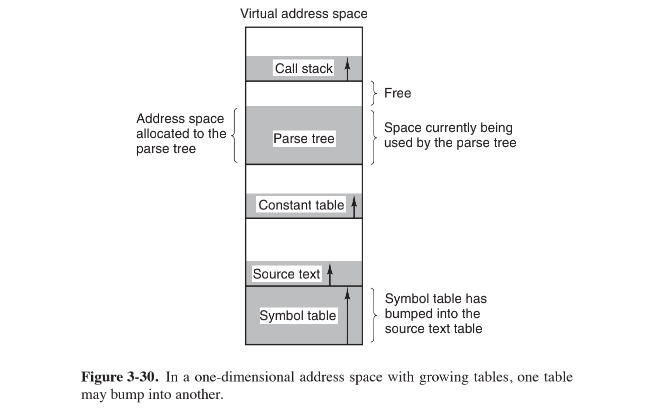
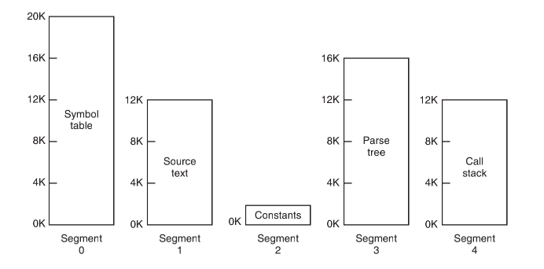
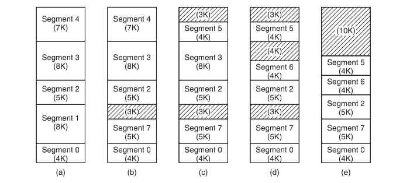
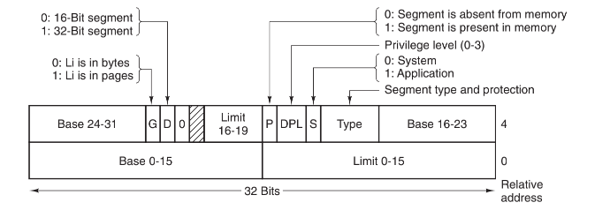
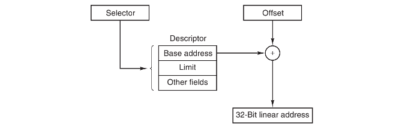
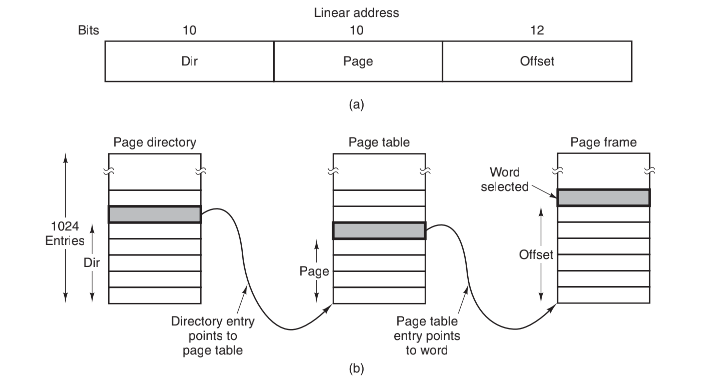

## 分页的问题

到目前为止我们讨论的虚拟内存都是一维的，虚拟地址从0到最大地址，一个地址接着另一个地址。对许多问题来说，有两个或多个独立的地址空间可能比只有一个要好得多。比如，一个编译器在编译过程中会建立许多表，其中可能包括：

1. 被保存起来的源程序正文。
2. 符号表，包含变量的名字和属性。
3. 包含用到的所有整型量和浮点常量的表。
4. 语法分析树，包含程序语法分析的结果。
5. 编译器内部过程调用使用的堆栈。

前`4`个表随着编译的进行不断地增长，最后一个表在编译过程中以一种不可预计的方式增长和缩小。在一维存储器中，这5个表只能被分配到虚拟地址空间中连续的块中。

> 当然应用程序可以自己定义内存管理方法。

考虑一下如果一个程序有非常多的变量，但是其他部分都是正常数量时会发生什么事情。地址空间中分给符号表的块可能会被装满，但这时其他表中还有大量的空间。编译器当然可以简单地打印出一条信息说由于变量太多编译不能继续进行，但在其他表中还有空间时这样做似乎并不恰当。

我们真正需要的是一个能够把程序员从管理表的扩张和收缩的工作中解放出来的办法，就像虚拟内存使程序员不用再为怎样把程序划分成覆盖块担心一样。

## 分段

一个直观并且通用的方法是在机器上提供多个互相独立的称为段`（segment）`的地址空间。每个段由一个从0到最大的线性地址序列构成。各个段的长度可以是0到某个允许的最大值之间的任何一个值。不同的段的长度可以不同，并且通常情况下也都不相同。段的长度在运行期间可以动态改变，比如，堆栈段的长度在数据被压入时会增长，在数据被弹出时又会减小。

因为每个段都构成了一个独立的地址空间，所以它们可以独立地增长或减小而不会影响到其他的段。如果一个在某个段中的堆栈需要更多的空间，它就可以立刻得到所需要的空间，因为它的地址空间中没有任何其他东西阻挡它增长。

在这种分段或二维的存储器中指示一个地址，程序必须提供两部分地址，一个段号和一个段内地址。

因为每个段是一个为程序员所知道的逻辑实体，比如一个过程、一个数组或一个堆栈，故不同的段可以有不同种类的保护。一个过程段可以被指明为只允许执行，从而禁止对它的读出和写入；一个浮点数组可以被指明为允许读写但不允许执行，任何试图向这个段内的跳转都将被截获。这样的保护有助于找到编程错误。

在分段系统中，由于用户会认为所有的段都一直在内存中，也就是说他可以当作所有这些段都在内存中那样去访问，他可以分别保护各个段，所以不需要关心覆盖它们的管理工作。

## 纯分段的实现

分段和分页的实现本质上是不同的：页面是定长的而段不是。图 a 中所示的物理内存在初始时包含了`5`个段。现在让我们考虑当段`1`被淘汰后，比它小的段`7`放进它的位置时会发生什么样的情况。这时的内存配置如图 b所示，在段7与段2之间是一个未用区域，即一个空闲区。随后段`4`被段5代替，如图 c 所示；段`3`被段`6`代替，如图 d 所示。

在系统运行一段时间后内存被划分为许多块，一些块包含着段，一些则成了空闲区，这种现象称为棋盘形碎片或外部碎片`（external fragmentation）`。空闲区的存在使内存被浪费了，而这可以通过内存紧缩来解决。

## 段页式 — Intel Pentium

`Pentium`处理器有`16K`个独立的段，每个段最多可以容纳`10`亿个`32`位字。

`Pentium`处理器中虚拟内存的核心是两张表，即`LDT（Local Descriptor Table，局部描述符表）`和`GDT（Global Descriptor Table，全局描述符表）`。每个程序都有自己的`LDT`，但是同一台计算机上的所有程序共享一个`GDT`。`LDT`描述局部于每个程序的段，包括其代码、数据、堆栈等；`GDT`描述系统段，包括操作系统本身。

为了访问一个段，一个`Pentium`程序必须把这个段的选择子`selector`装入机器的`6`个段寄存器的某一个中。在运行过程中，`CS`寄存器保存代码段的选择子，`DS`寄存器保存数据段的选择子，

每个选择子是一个16位数，

选择子中的一位指出这个段是局部的还是全局的，其他的13位是`LDT`或`GDT`的表项编号。因此，这些表的长度被限制在最多容纳`8`K个段描述符。还有两位和保护有关，我们将在后面讨论。描述符`0`是禁止使用的，它可以被安全地装入一个段寄存器中用来表示这个段寄存器目前不可用，如果使用会引起一次陷阱。

在选择子被装入段寄存器时，对应的描述符被从`LDT`或`GDT`中取出装入微程序寄存器中，以便快速地访问。一个描述符由8个字节构成，包括段的基地址、大小和其他信息：

“选择子的格式经过合理设计，使得根据选择子定位描述符十分方便。首先根据第2位选择LDT或GDT；随后选择子被复制进一个内部擦除寄存器中并且它的低3位被清0；最后，LDT或GDT表的地址被加到它上面，得出一个直接指向描述符的指针。例如，选择子72指向GDT的第9个表项，它位于地址GDT+72。

现在让我们跟踪一个描述地址的（选择子，偏移量）二元组被转换为物理地址的过程。微程序知道我们具体要使用哪个段寄存器后，它就能从内部寄存器中找到对应于这个选择子的完整的描述符。如果段不存在（选择子为0）或已被换出，则会发生一次陷阱。

硬件随后根据Limit（段长度）域检查偏移量是否超出了段的结尾，如果是，也发生一次陷阱。从逻辑上来说，在描述符中应该简单地有一个32位的域给出段的大小，但实际上剩余20位可以使用，因此采用了一种不同的方案。如果Gbit（Granularity）域是0，则是精确到字节的段长度，最大1MB；如果是1，Limit域以页面替代字节作为单元给出段的大小。Pentium处理器的页面大小是固定的4KB，因此20位足以描述最大232 字节的段。

假设段在内存中并且偏移量也在范围内，Pentium处理器接着把描述符中32位的基址和偏移量相加形成线性地址（linear address），如图3-41所示。为了和只有24位基址的286兼容，基址被分为3片分布在描述符的各个位置。实际上，基址允许每个段的起始地址位于32位线性地址空间内的任何位置。

如果禁止分页（通过全局控制寄存器中的一位），线性地址就被解释为物理地址并被送往存储器用于读写操作。因此在禁止分页时，我们就得到了一个纯的分段方案。各个段的基址在它的描述符中。另外，段之间允许互相覆盖，这可能是因为验证所有的段都互不重叠太麻烦太费时间的缘故。

另一方面，如果允许分页，线性地址将通过页表映射到物理地址，很像我们前面讲过的例子。这里惟一真正复杂的是在32位虚拟地址和4KB页的情况下，一个段可能包含多达100万个页面，因此使用了一种两级映射，以便在段较小时减小页表大小。

每个运行程序都有一个由1024个32位表项组成的页目录（page directory）。它通过一个全局寄存器来定位。这个目录中的每个目录项都指向一个也包含1024个32位表项的页表，页表项指向页框，这个方案如图3-42所示。

在图3-42a中我们看到线性地址被分为三个域：目录、页面和偏移量。目录域被作为索引在页目录中找到指向正确的页表的指针，随后页面域被用作索引在页表中找到页框的物理地址，最后，偏移量被加到页框的地址上得到需要的字节或字的物理地址。

每个页表项是32位，其中20位是页框号。其余的位包含了由硬件设置供操作系统使用的访问位

“和“脏”位、保护位和一些其他有用的位。

每个页表有描述1024个4KB页框的表项，因此一个页表可以处理4MB的内存。一个小于4MB的段的页目录中将只有一个表项，这个表项指向一个惟一的页表。通过这种方法，长度短的段的开销只是两个页面，而不是一级页表时的100万个页面。

为了避免重复的内存访问，Pentium处理器和MULTICS一样，也有一个小的TLB把最近使用过的“目录-页面”二元组映射为页框的物理地址。只有在当前组合不在TLB中时，图3-42所示的机制才被真正执行并更新TLB。只要TLB的缺失率很低，则性能就不错。

还有一点值得注意，如果某些应用程序不需要分段，而是需要一个单独的、分页的32位地址空间，这样的模式是可以做到的。这时，所有的段寄存器可以用同一个选择子设置，其描述符中基址设为0，段长度被设置为最大。指令偏移量会是线性地址，只使用了一个地址空间——效果上就是正常的分页。事实上，所有当前的Pentium操作系统都是这样工作的。OS/2是惟一一个使用Intel MMU体系结构所有功能的操作系统。

不管怎么说，我们不得不称赞Pentium处理器的设计者，因为他们面对的是互相冲突的目标，实现纯的分页、纯的分段和段页式管理，同时还要与286兼容，而他们高效地实现了所有的目标，最终的设计非常简洁。

尽管我们已经简单地讨论了Pentium处理器虚拟内存的全部体系机制，关于保护我们还是值得再说几句的，因为它和虚拟内存联系很紧密。和虚拟内存一样，Pentium处理器的保护系统与MULTICS很类似。它支持4个保护级，0级权限最高，3级最低，如图3-43所示。在任何时刻，运行程序都处在由PSW中的两位域所指出的某个保护级上，系统中的每个段也有一个级别。
