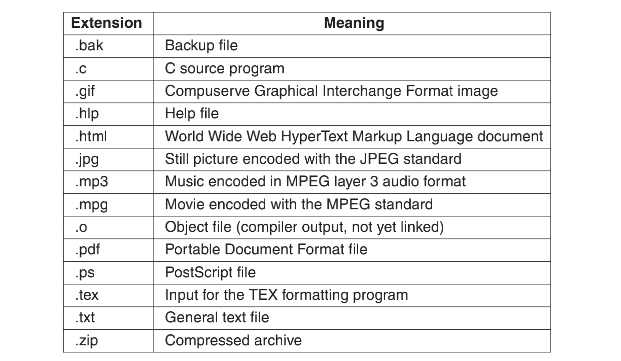
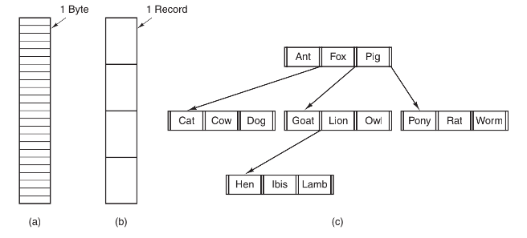
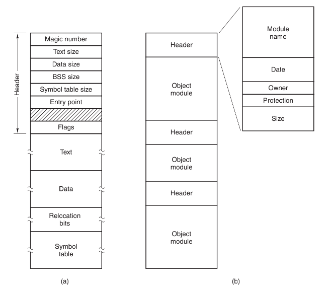
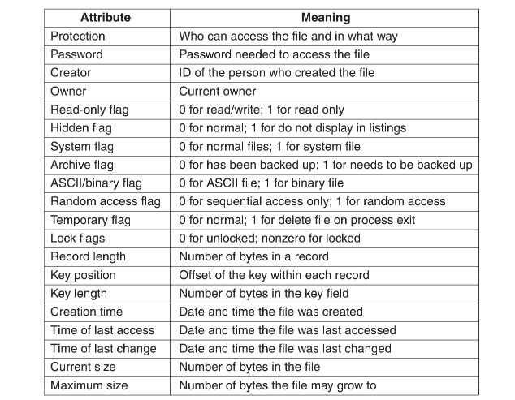
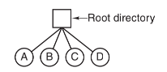
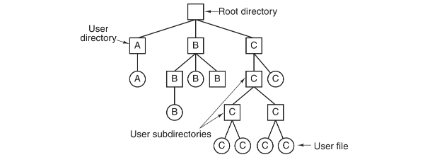
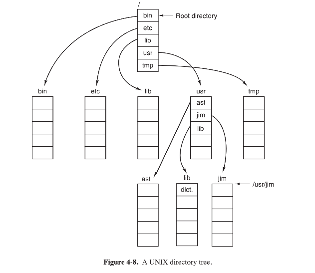

## 文件系统

-------

磁盘 `magnetic disk`由于其长期存储的性质，已经有多年的使用历史。近年来，固态硬盘逐渐流行，因为它们不但没有易损坏的部件而且提供快速访问能力。具体的原理会在`IO`中介绍，现在我们先把磁盘当作一种固定块大小的线性序列，并且支持如下两种操作：

1. 读块 `k`
2. 写块 `k`

文件是进程创建的信息逻辑单元。一个磁盘一般含有几千甚至几百万个文件，每个文件是独立于其他文件的。文件不仅仅被用来对磁盘建模，以替代对随机存储器 `RAM` 建模，事实上，如果能把每个文件看成一种地址空间，那么读者就离理解文件的本质不远了。

进程可以读取已存在的文件，在需要时建立新的文件。存储在文件中的信息必须是持久的，也就是说，不会因为进程的创建与终止而受到影响。一个文件应只在所有者明确删除它的情况下才会消失。

文件是受操作系统管理的。有关文件的构造、命名、存取、使用、保护、实现和管理方法都是操作系统设计的主要内容。从总体上看，操作系统中处理文件的部分称为文件系统 `file system`。

下面我们将从用户角度来了解一下文件系统。

## 文件

------

文件是一种抽象机制，它提供了一种在磁盘上保留信息而且方便以后读取的方法。这种方法可以使用户不用了解存储信息的方法、位置和实际磁盘工作方式等有关细节。

#### 文件命名

文件的具体命名规则在各个系统中是不同的，不过所有的现代操作系统都允许用`1`至`8`个字母组成的字符串作为合法的文件名。因此，`andrea`、`bruce`和`cathy`都是合法文件名。通常，文件名中也允许有数字和一些特殊字符。许多文件系统支持长达`255`个字符的文件名。

有的文件系统区分大小写字母，有的则不区分。`UNIX`是前一类，`MS-DOS`是后一类。



许多操作系统支持文件名用圆点隔开分为两部分，如文件名`prog.c`。圆点后面的部分称为文件扩展名` file extension`，文件扩展名通常表示文件的一些信息，在某些系统中`(如UNIX)`，文件扩展名只是一种约定，操作系统并不强迫采用它。名为`file.txt`的文件也许是文本文件，这个文件名在于提醒所有者，而不是表示传送什么信息给计算机。

相反，`Windows`对扩展名赋予含义。用户（或进程）可以在操作系统中注册扩展名，并且规定哪个程序“拥有”该扩展名。

#### 文件结构

文件可以有多种构造方式，在图中列出了常用的三种方式。图a中的文件是无结构的字节序列，操作系统事实上不知道也不关心文件内容是什么，操作系统所见到的就是字节，其任何含义只在用户程序中解释。在`UNIX`和`Windows`中都采用这种方法。



把文件看成字节序列为操作系统提供了最大的灵活性。用户程序可以向文件中加入任何内容，并以任何方便的形式命名。操作系统不提供任何帮助，但也不会构成阻碍。

第三种文件结构如图c所示。文件在这种结构中由一棵记录树构成，每个记录并不具有同样的长度，而记录的固定位置上有一个“键”字段。这棵树按“键”字段进行排序，可以对特定“键”进行快速查找。这类文件结构与`UNIX`和`Windows`中采用的无结构字节流明显不同，但它在一些处理商业数据的大型计算机中获得广泛使用。

#### 文件类型

很多操作系统支持多种文件类型。如 `UNIX` 和 `Windows` 中都有普通文件和目录，`UNIX` 还有字符特殊文件`（character special file）`和块特殊文件`（block special file）`。

普通文件一般分为 `ASCII` 文件和二进制文件。`ASCII` 文件由多行正文组成。在某些系统中，每行用回车符结束，其他系统则用换行符结束。有些系统还同时采用回车符和换行符（如 `MS-DOS` ）。文件中各行的长度不一定相同。`ASCII` 文件的最大优势是可以显示和打印，还可以用任何文本编辑器进行编辑。再者，如果很多程序都以 `ASCII` 文件作为输入和输出，就很容易把一个程序的输出作为另一个程序的输入，如shell管道一样。”

如图 `a` 是一个简单的可执行二进制文件，它取自某个版本的 `UNIX`。尽管这个文件只是一个字节序列，但只有文件的格式正确时，操作系统才会执行这个文件。这个文件有五个段：文件头、正文、数据、重定位位及符号表。文件头以所谓的魔数`（magic number）`开始，表明该文件是一个可执行的文件（防止非这种格式的文件偶然运行）。魔数后面是文件中各段的长度、执行的起始地址和一些标志位。程序本身的正文和数据在文件头后面。这些被装入内存，并使用重定位位重新定位。符号表则用于调试。



所有操作系统必须能够识别它们自己的可执行文件的文件类型，其中有些操作系统还可识别更多的信息。在 `UNIX` 中，就是在 `shell` 中嵌入make程序。这时操作系统要求用户必须采用固定的文件扩展名，从而确定哪个源程序生成哪个二进制文件。

#### 文件存取

早期操作系统只有一种文件存取方式：顺序存取`（sequential access）`。进程在这些系统中可从头顺序读取文件的全部字节或记录，但不能跳过某一些内容，也不能不按顺序读取。顺序存取文件是可以返回到起点的，需要时可多次读取该文件。在存储介质是磁带而不是磁盘时，顺序存取文件是很方便的。

当用磁盘来存储文件时，我们可以不按顺序地读取文件中的字节或记录，或者按照关键字而不是位置来存取记录。这种能够以任何次序读取其中字节或记录的文件称作随机存取文件`（random access file）`。许多应用程序需要这种类型的文件。

有两种方法可以指示从何处开始读取文件。一种是每次 `read` 操作都给出开始读文件的位置。另一种是用一个特殊的 `seek` 操作设置当前位置，在 `seek` 操作后，从这个当前位置顺序地开始读文件。`UNIX` 和 `Windows` 使用的是后一种方法。

#### 文件属性

文件都有文件名和数据。另外，所有的操作系统还会保存其他与文件相关的信息，如文件创建的日期和时间、文件大小等。这些附加信息称为文件属性`attribute`，有些人称之为元数据`metadata`



#### 文件操作

1. `create`：创建不包含任何数据的文件。该调用的目的是表示文件即将建立，并设置文件的一些属性。
2. `delete`：当不再需要某个文件时，必须删除该文件以释放磁盘空间。任何文件系统总有一个系统调用用来删除文件。
3. `open`：在使用文件之前，必须先打开文件。`open` 调用的目的是：把文件属性和磁盘地址表装入内存，便于后续调用的快速存取。
4. `close`；存取结束后，不再需要文件属性和磁盘地址，这时应该关闭文件以释放内部表空间。很多系统限制进程打开文件的个数，以鼓励用户关闭不再使用的文件。磁盘以块为单位写入，关闭文件时，写入该文件的最后一块，即使这个块还没有满。
5. `read`：在文件中读取数据。一般地，读出数据来自文件的当前位置。调用者必须指明需要读取多少数据，并且提供存放这些数据的缓冲区。
6. `write`: 向文件写数据，写操作一般也是从文件当前位置开始。如果当前位置是文件末尾，文件长度增加。如果当前位置在文件中间，则现有数据被覆盖，并且永远丢失。
7. `append`: `write` 的限制形式，它只能在文件末尾添加数据。若系统只提供最小系统调用集合，则通常没有append。很多系统对同一操作提供了多种实现方法，这些系统中有时有 `append` 调用。
8. `seek`: 对于随机存取文件，要指定从何处开始取数据，通常的方法是用seek系统调用把当前位置指针指向文件中特定位置。seek调用结束后，就可以从该位置开始读写数据了。
9. `get attributes`: 进程运行常需要读取文件属性。
10. `set attributes`: 某些属性是可由用户设置的，在文件创建之后，用户还可以通过系统调用 `set attributes` 来修改它们。保护模式信息是一个显著的例子，大多数标志也属于此类属性。
11. `rename`: 用户常常要改变已有文件的名字，`rename` 系统调用用于这一目的。严格地说，设置这个系统调用不是必要的，因为可以先把文件复制到一个新文件名的文件中，然后删除原来的文件。

## 目录

-------

文件系统通常提供目录或文件夹用于记录文件，在很多系统中目录本身也是文件。本节讨论目录、目录的组成、目录的特性和可以对目录进行的操作。

#### 一级目录系统

目录系统的最简单形式是在一个目录中包含所有的文件。这有时称为根目录，但是由于只有一个目录，所以其名称并不重要。



#### 层次目录系统

层次结构（一个目录树）。通过这种方式，可以用很多目录把文件以自然的方式分组。



#### 路径名

第一种是，每个文件都赋予一个绝对路径名`absolute path name`，它由从根目录到文件的路径组成。

```
Windows \usr\ast\mailbox
UNIX /usr/ast/mailbox
MULTICS >usr>ast>mailbox
```

另一种指定文件名的方法是使用相对路径名`（relative path name）`。它常和工作目录`（working directory）`也称作当前目录`（current directory）`一起使用。

每个进程都有自己的工作目录，这样在进程改变工作目录并退出后，其他进程不会受到影响，文件系统中也不会有改变的痕迹。

对进程而言，切换工作目录是安全的，所以只要需要，就可以改变当前工作目录。但是，如果改变了库过程的工作目录，并且工作完毕之后没有修改回去，则其他程序有可能无法正常运行，因为它们关于当前目录的假设已经失效。所以库过程很少改变工作目录，若非改不可，必定要在返回之前改回到原有的工作目录。

支持层次目录结构的大多数操作系统在每个目录中有两个特殊的目录项`.`和`..`，常读作`dot`和`dotdot`。`dot`指当前目录，`dotdot`指其父目录（在根目录中例外，根目录中它指向自己）。 



#### 目录操作

不同系统中管理目录的系统调用的差别比管理文件的系统调用的差别大：

1. `create` 创建目录。除目录项`.`和`..`外，目录内容为空。目录项`.`和`..`是系统自动放在目录中的。
2. `delete` 删除目录。只有空目录可删除。只包含目录项`.`和`..`的目录被认为是空目录，这两个目录项通常不能删除。
3. `opendir` 目录内容可被读取。例如，为列出目录中全部文件，程序必须先打开该目录，然后读其中全部文件的文件名。与打开和读文件相同，在读目录前，必须打开目录。
4. `closedir` 读目录结束后，应关闭目录以释放内部表空间。
5. `readdir` 系统调用`readdir`返回打开目录的下一个目录项。以前也采用`read`系统调用来读目录，但这方法有一个缺点：程序员必须了解和处理目录的内部结构。相反，不论采用哪一种目录结构，`readdir`总是以标准格式返回一个目录项。
6. `rename` 在很多方面目录和文件都相似。文件可换名，目录也可以。
7. `link` 连接技术允许在多个目录中出现同一个文件。这个系统调用指定一个存在的文件和一个路径名，并建立从该文件到路径所指名字的连接。这样，可以在多个目录中出现同一个文件。这种类型的连接，增加了该文件的`i`节点`i-node`计数器的计数（记录含有该文件的目录数目），称为硬连接`hard link`。
8. `unlink` 删除目录项。如果被解除连接的文件只出现在一个目录中，则将它从文件系统中删除。如果它出现在多个目录中，则只删除指定路径名的连接，依然保留其他路径名的连接。在`UNIX`中，用于删除文件的系统调用实际上就是`unlink`。

关于连接文件的一种不同想法是符号连接。不同于使用两个文件名指向同一个内部数据结构来代表一个文件，所建立的文件名指向了命名另一个文件的小文件。

符号连接的优点在于它能够跨越磁盘的界限，甚至可以命名在远程计算机上的文件，不过符号连接的实现并不如硬连接那样有效率。
