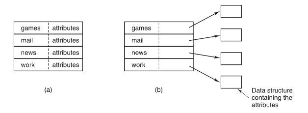

## 文件系统的实现

-------

接下来我们主要讨论文件和目录是怎样存储的、磁盘空间是怎样管理的以及怎样使系统有效而可靠地工作等。

#### 文件系统布局

文件系统存放在磁盘上。多数磁盘划分为一个或多个分区，每个分区中有一个独立的文件系统。磁盘的 0 号扇区称为主引导记录`（Master Boot Record，MBR）`，用来引导计算机。在`MBR`的结尾是分区表。该表给出了每个分区的起始和结束地址。表中的一个分区被标记为活动分区。在计算机被引导时，`BIOS`读入并执行`MBR`。`MBR`做的第一件事是确定活动分区，读入它的第一个块，称为引导块`（boot block）`，并执行之。引导块中的程序将装载该分区中的操作系统。为统一起见，每个分区都从一个启动块开始，即使它不含有一个可启动的操作系统。不过，在将来这个分区也许会有一个操作系统的。

可以用位图或指针列表的形式给出。后面也许跟随的是一组i节点，这是一个数据结构数组，每个文件一个，`i`节点说明了文件的方方面面。接着可能是根目录，它存放文件系统目录树的根部。最后，磁盘的其他部分存放了其他所有的目录和文件。

## 文件的实现

-------

文件存储的实现的关键问题是记录各个文件分别用到哪些磁盘块。不同操作系统采用不同的方法。

#### 连续分配

最简单的分配方案是把每个文件作为一连串连续数据块存储在磁盘上。所以，在块大小为`1KB`的磁盘上，`50KB`的文件要分配`50`个连续的块。对于块大小为`2KB`的磁盘，将分配`25`个连续的块。

请注意，每个文件都从一个新的块开始，这样如果文件`A`实际上只有`3^1/2` 块，那么最后一块的结尾会浪费一些空间。

连续磁盘空间分配方案有两大优势。首先，实现简单，记录每个文件用到的磁盘块简化为只需记住两个数字即可：第一块的磁盘地址和文件的块数。其次，读操作性能较好，因为在单个操作中就可以从磁盘上读出整个文件。只需要一次寻找（对第一个块）。之后不再需要寻道和旋转延迟，所以，数据以磁盘全带宽的速率输入。可见连续分配实现简单且具有高的性能。

连续分配方案也同样有相当明显的不足之处：随着时间的推移，磁盘会变得零碎。会出现很多的磁盘空洞，为了挑选合适大小的空洞存入文件，就有必要知道该文件的最终大小。

#### 链表分配

存储文件的第二种方法是为每个文件构造磁盘块链表，如图所示。每个块的第一个字作为指向下一块的指针，块的其他部分存放数据。

与连续分配方案不同，这一方法可以充分利用每个磁盘块。不会因为磁盘碎片而浪费存储空间。同样，在目录项中，只需要存放第一块的磁盘地址，文件的其他块就可以从这个首块地址查找到。但是在链表分配方案中，尽管顺序读文件非常方便，但是随机存取却相当缓慢。要获得块`n`，操作系统每一次都必须从头开始，并且要先读前面的`n-1`块。显然，进行如此多的读操作太慢了。

而且，由于指针占去了一些字节，每个磁盘块存储数据的字节数不再是`2`的整数次幂。虽然这个问题并不是非常严重，但是怪异的大小确实降低了系统的运行效率，因为许多程序都是以长度为`2`的整数次幂来读写磁盘块的。

#### 在内存中采用表的链表分配

如果取出每个磁盘块的指针字，把它放在内存的一个表中，就可以解决上述链表的两个不足。下面两个图中有两个文件，文件A依次使用了磁盘块`4、7、2、10、12`，文件`B`依次使用了磁盘块`6、3、11、14`。这两个链都以一个不属于有效磁盘编号的特殊标记结束。内存中的这样一个表格称为文件分配表`（File Allocation Table，FAT）`。

按这类方式组织，整个块都可以存放数据。进而，随机存取也容易得多。虽然仍要顺着链在文件中查找给定的偏移量，但是整个链表都存放在内存中，所以不需要任何磁盘引用。与前面的方法相同，不管文件有多大，在目录项中只需记录一个整数（起始块号），按照它就可以找到文件的全部块。

这种方法的主要缺点是必须把整个表都存放在内存中。对于`200 GB`的磁盘和`1KB`大小的块，这张表需要有`2`亿项，每一项对应于这2亿个磁盘块中的一个块。每项至少`3`个字节，为了提高查找速度，有时需要`4`个字节。根据系统对空间或时间的优化方案，这张表要占用`600MB`或`800MB`内存，不太实用。很显然`FAT`方案对于大磁盘而言不太合适。

#### `i`节点

最后一个记录各个文件分别包含哪些磁盘块的方法是给每个文件赋予一个称为i节点`index-node`的数据结构，其中列出了文件属性和文件块的磁盘地址。

相对于在内存中采用表的方式而言，这种机制具有很大的优势，即只有在对应文件打开时，其 `i` 节点才在内存中。如果每个`i`节点占有`n`个字节，最多`k`个文件同时打开，那么为了打开文件而保留`i`节点的数组所占据的全部内存仅仅是`kn`个字节。只需要提前保留少量的空间。

这个数组通常比上一节中叙述的文件分配表`FAT`所占据的空间要小。其原因很简单，保留所有磁盘块的链接表的表大小正比于磁盘自身的大小。如果磁盘有`n`块，该表需要`n`个表项。由于磁盘变得更大，该表格也线性随之增加。相反，`i`节点机制需要在内存中有一个数组，其大小正比于可能要同时打开的最大文件个数。它与磁盘是`10GB`、`100GB`还是`1000GB`无关。

`i`节点的一个问题是，如果每个i节点只能存储固定数量的磁盘地址，那么当一个文件所含的磁盘块的数目超出了i节点所能容纳的数目怎么办？一个解决方案是最后一个“磁盘地址”不指向数据块，而是指向一个包含磁盘块地址的块的地址。

更高级的解决方案是：可以有两个或更多个包含磁盘地址的块，或者指向其他存放地址的磁盘块的磁盘块。在后面讨论`UNIX`时，我们还将涉及`i`节点。

## 目录的实现

------

在读文件前，必须先打开文件。打开文件时，操作系统利用用户给出的路径名找到相应目录项。目录项中提供了查找文件磁盘块所需要的信息。因系统而异，这些信息有可能是整个文件的磁盘地址（对于连续分配方案）、第一个块的编号（对于两种链表分配方案）或者是i节点号。

无论怎样，目录系统的主要功能是把`ASCII`文件名映射成定位文件数据所需的信息。

与此密切相关的问题是在何处存放文件属性。一种显而易见的方法是把文件属性直接存放在目录项中。在这个简单设计中，目录中有一个固定大小的目录项列表，每个文件对应一项，其中包含一个文件名、一个文件属性结构以及用以说明磁盘块位置的一个或多个磁盘地址（至某个最大值）。

对于采用`i`节点的系统，还存在另一种方法，即把文件属性存放在i节点中而不是目录项中。在这种情形下，目录项会更短：只有文件名和`i`节点号。

#### 文件名

> **有趣的是文件名属于文件但是又不属于文件，`inode id` 是文件的真正索引，而文件名只不过是文件夹中用来索引 `inode` 的标识罢了。**

到目前为止，我们已经假设文件具有较短的、固定长度的名字。但是，几乎所有的现代操作系统都支持可变长度的长文件名。那么它们是如何实现的呢？

一种替代方案是放弃“所有目录项大小一样”的想法。这种方法中，每个目录项有一个固定部分，这个固定部分通常以目录项的长度开始，后面是固定格式的数据，通常包括所有者、创建时间、保护信息以及其他属性。这个固定长度的头的后面是实际文件名，每个文件名以一个特殊字符（通常是 `0`）结束，在图中用带叉的矩形表示。为了使每个目录项从字的边界开始，每个文件名被填充成整数个字，如图**a**中带阴影的矩形所示。

这个方法的缺点是，当从目录移走文件后，就引入了一个长度可变的空隙，而下一个进来的文件不一定正好适合这个空隙。这个问题与我们已经看到的连续磁盘文件的问题是一样的，由于整个目录在内存中，所以只有对目录进行紧凑操作才可节省空间。另一个问题是，一个目录项可能会分布在多个页面上，在读取文件名时可能发生页面故障。

处理可变长度文件名字的另一种方法是，使目录项自身都有固定长度，而将文件名放置在目录后面的堆中，如图**b**所示。这一方法的优点是，当一个文件目录项被移走后，另一个文件的目录项总是可以适合这个空隙。当然，必须要对堆进行管理，而在处理文件名时页面故障仍旧会发生。

#### 数据结构优化

到目前为止，在需要查找文件名时，所有的方案都是线性地从头到尾对目录进行搜索。对于非常长的目录，线性查找就太慢了。加快查找速度的一个方法是在每个目录中使用散列表。

查找文件按照相同的过程进行。散列处理文件名，以便选择一个散列表项。检查链表头在该位置上的所有表项，查看要找的文件名是否存在。如果名字不在该链上，该文件就不在这个目录中。使用散列表的优点是查找非常迅速。其缺点是需要复杂的管理。只有在预计系统中的目录经常会有成百上千个文件时，才把散列方案真正作为备用方案考虑。

一种完全不同的加快大型目录查找速度的方法是，将查找结果存入高速缓存。在开始查找之前，先查看文件名是否在高速缓存中。如果是，该文件可以立即定位。当然，只有在构成查找主体的文件非常少的时候，高速缓存的方案才有效果。

#### 共享文件：链接

`B`的目录与该共享文件的联系称为一个连接`link`。这样，文件系统本身是一个有向无环图`（Directed Acyclic Graph，DAG）`而不是一棵树。

共享文件是方便的，但也带来一些问题。如果目录中包含磁盘地址，则当连接文件时，必须把`C`目录中的磁盘地址复制到`B`目录中。如果`B`或`C`随后又往该文件中添加内容，则新的数据块将只列入进行添加工作的用户的目录中。其他的用户对此改变是不知道的。所以违背了共享的目的。

有两种方法可以解决这一问题。**第一种解决方案**，磁盘块不列入目录，而是列入一个与文件本身关联的小型数据结构中。目录将指向这个小型数据结构。这是`UNIX`系统中所采用的方法（小型数据结构即是`i`节点）。

在第二种解决方案中，通过让系统建立一个类型为`LINK`的新文件，并把该文件放在`B`的目录下，使得`B`与`C`的一个文件存在连接。新的文件中只包含了它所连接的文件的路径名。当B读该连接文件时，操作系统查看到要读的文件是`LINK`类型，则找到该文件所连接的文件的名字，并且去读那个文件。与传统（硬）连接相对比起来，这一方法称为符号连接`（symbolic linking）`。

以上每一种方法都有其缺点。第一种方法中，当`B`连接到共享文件时，`i`节点记录文件的所有者是`C`。建立一个连接并不改变所有关系，但它将i节点的连接计数加`1`，所以系统知道目前有多少目录项指向这个文件。如果以后`C`试图删除这个文件，系统将面临问题。如果系统删除文件并清除`i`节点，`B`则有一个目录项指向一个无效的`i`节点。如果该i节点以后分配给另一个文件，则`B`的连接指向一个错误的文件。系统通过`i`节点中的计数可知该文件仍然被引用，但是没有办法找到指向该文件的全部目录项以删除它们。指向目录的指针不能存储在`i`节点中，原因是有可能有无数个目录。

惟一能做的就是只删除`C`的目录项，但是将`i`节点保留下来，只有到计数变为0的时刻，才会删除该文件。

因为只有真正的文件所有者才有一个指向`i`节点的指针。连接到该文件上的用户只有路径名，没有指向`i`节点的指针。当文件所有者删除文件时，该文件被销毁。以后若试图通过符号连接访问该文件将导致失败，因为系统不能找到该文件。删除符号连接根本不影响该文件。

符号连接的问题是需要额外的开销。必须读取包含路径的文件，然后要一个部分一个部分地扫描路径，直到找到i节点。这些操作也许需要很多次额外的磁盘存取。此外，每个符号连接都需要额外的i节点，以及额外的一个磁盘块用于存储路径，虽然如果路径名很短，作为一种优化，系统可以将它存储在 `i` 节点中。符号连接有一个优势，即只要简单地提供一个机器的网络地址以及文件在该机器上驻留的路径，就可以连接全球任何地方的机器上的文件。

## 高级文件系统

-------

#### 日志结构文件系统

`CPU`的运行速度越来越快，磁盘容量越来越大，价格也越来越便宜，同时内存容量也以指数形式增长。而没有得到快速发展的参数是磁盘的寻道时间。所以这些问题综合起来，便成为影响很多文件系统性能的一个瓶颈。为此，`Berkeley`设计了一种全新的文件系统，试图缓解这个问题，即日志结构文件系统`（Log-structured File System，LFS）`。

促使设计`LFS`的主要原因是，`CPU`的运行速度越来越快，`RAM`内存容量变得更大，同时磁盘高速缓存也迅速地增加。进而，不需要磁盘访问操作，就有可能满足直接来自文件系统高速缓存的很大一部分读请求。所以从上面的事实可以推出，未来多数的磁盘访问是写操作，这样，在一些文件系统中使用的提前读机制（需要读取数据之前预取磁盘块），并不能获得更好的性能。

更为糟糕的情况是，在大多数文件系统中，写操作往往都是零碎的。一个`50µs`的磁盘写操作之前通常需要`10ms`的寻道时间和`4ms`的旋转延迟时间，可见零碎的磁盘写操作是极其没有效率的。根据这些参数，磁盘的效率降低到`1%`以下。

考虑在`UNIX`文件系统上创建一个新文件。为写这个文件，必须写该文件目录的i节点、目录块、文件的i节点以及文件本身。而这些写操作都有可能被延迟，那么如果在写操作完成之前发生死机，就可能在文件系统中造成严重的不一致性。

出于这一原因，`LFS`的设计者决定重新实现一种`UNIX`文件系统，该系统即使对于一个大部分由零碎的随机写操作组成的任务，同样能够充分利用磁盘的带宽。其基本思想是将整个磁盘结构化为一个日志。每隔一段时间，或有特殊需要时，缓冲在内存中的写操作都被放到一个单独的段中，作为在日志末尾的一个邻接段写入磁盘。一个单独的段可能会包括i节点、目录块、数据块或者都有。每一个段的开始都是该段的摘要，说明该段中都包含哪些内容。如果所有的段平均在`1MB`左右，那么就几乎可以利用磁盘的完整带宽。

在`LFS`的设计中，同样存在着`i`节点，且具有与`UNIX`中一样的结构，但是`i`节点分散在整个日志中，而不是放在磁盘的某一个固定位置。尽管如此，当一个`i`节点被定位后，定位一个块就用通常的方式来完成。当然，由于这种设计，要在磁盘中找到一个`i`节点就变得比较困难了，因为`i`节点的地址不能像在`UNIX`中那样简单地通过计算得到。为了能够找到`i`节点，要维护一个由`i`节点编号索引组成的`i`节点图。在这个图中的表项i指向磁盘中的第`i`个`i`节点。这个图保存在磁盘上，但是也保存在高速缓存中，因此，大多数情况下这个图的最常用部分还是在内存中。

总而言之，所有的写操作最初都被缓冲在内存中，然后周期性地把所有已缓冲的写作为一个单独的段，在日志的末尾处写入磁盘。要打开一个文件，则首先需要从`i`节点图中找到文件的`i`节点。一旦i节点定位之后就可以找到相应的块的地址。所有的块都放在段中，在日志的某个位置上。

如果磁盘空间无限大，那么有了前面的讨论就足够了。但是，实际的硬盘空间是有限的，这样最终日志将会占用整个磁盘，到那个时候将不能往日志中写任何新的段。幸运的是，许多已有的段包含了很多不再需要的块，例如，如果一个文件被覆盖了，那么它的i节点就会指向新的块，但是旧的磁盘块仍然在先前写入的段中占据着空间。

为了解决这个问题，`LFS`有一个清理线程，该清理线程周期地扫描日志进行磁盘压缩。该线程首先读日志中的第一个段的摘要，检查有哪些`i`节点和文件。

日志的管理并不简单，因为当一个文件块被写回到一个新段的时候，该文件的`i`节点（在日志的某个地方）必须首先要定位、更新，然后放到内存中准备写回到下一个段中。

`LFS`在处理大量的零碎的写操作时性能上优于`UNIX`，而在读和大块写操作的性能方面并不比`UNIX`文件系统差，甚至更好。

#### 日志文件系统

虽然基于日志结构的文件系统是一个很吸引人的想法，但是由于它们和现有的文件系统不相匹配，所以还没有被广泛应用。尽管如此，它们内在的一个思想，即面对出错的鲁棒性，却可以被其他文件系统所借鉴。

这里的基本想法是保存一个用于记录系统下一步将要做什么的日志。这样当系统在完成它们即将完成的任务前崩溃时，重新启动后，可以通过查看日志，获取崩溃前计划完成的任务，并完成它们。这样的文件系统被称为日志文件系统，并已被实际应用。微软`（Microsoft）`的`NTFS`文件系统、`Linux ext3`和`ReiserFS`文件系统都使用日志。接下来，我们会对这个话题进行简介。

为了看清这个问题的实质，考虑一个简单、普通并经常发生的操作：移除文件。这个操作需要三个步骤完成：

1. 在目录中删除文件；
2. 释放i节点到空闲i节点池；
3. 将所有磁盘块归还空闲磁盘块池；

假如在第一步完成后系统崩溃。`i`节点和文件块将不会被任何文件获得，也不会被再分配；它们只存在于废物池中的某个地方，并因此减少了可利用的资源。如果崩溃发生在第二步后，那么只有磁盘块会丢失。

日志文件系统则先写一个日志项，列出三个将要完成的动作。然后日志项被写入磁盘**（注意：写入内存是不行的，数据不会持久化）**。只有当日志项已经被写入，不同的操作才可以进行。当所有的操作成功完成后，擦除日志项。如果系统这时崩溃，系统恢复后，文件系统可以通过检查日志来查看是不是有未完成的操作。如果有，可以重新运行所有未完成的操作（这个过程在系统崩溃重复发生时执行多次），直到文件被正确地删除。

为了让日志文件系统工作，被写入日志的操作必须是幂等的，它意味着只要有必要，它们就可以重复执行很多次，并不会带来破坏。

为了增加可信性，一个文件系统可以引入数据库中原子事务`（atomic transaction）`的概念。使用这个概念，一组动作可以被界定在开始事务和结束事务操作之间。

#### 虚拟文件系统

即使在同一台计算机上同一个操作系统下，也会使用很多不同的文件系统。一个`Windows`可能有一个主要的`NTFS`文件系统，但是也有继承的`FAT-32`或者`FAT-16`驱动，或包含旧的但仍被使用的数据的分区，并且不时地也可能需要一个`CD-ROM`或者`DVD`

`Windows`通过指定不同的盘符来处理这些不同的文件系统，比如`“C:”、“D:”`等。当一个进程打开一个文件，盘符是显式或者隐式存在的，所以`Windows`知道向哪个文件系统传递请求，不需要尝试将不同类型文件系统整合为统一模式。

相比之下，所有现代的UNIX系统做了一个很认真的尝试，即将多种文件系统整合到一个统一的结构中。一个`Linux`系统可以用一个硬盘的 `ext2`分区作为根文件系统，`ext3`分区装载在`/home`下，另一块采用`ReiserFS`文件系统的硬盘装载在`/home`下，以及一个`ISO 9660`的`CD-ROM`临时装载在`/mnt`下。从用户的观点来看，那只有一个文件系统层级。它们事实上是多种（不相容的）文件系统，对于用户和进程是不可见的。

但是，多种文件系统的存在，在实际应用中是明确可见的，而且因为先前`Sun`公司所做的工作，绝大多数 `UNIX` 操作系统都使用虚拟文件系统`（Virtual File System，VFS）`概念尝试将多种文件系统统一成一个有序的框架。关键的思想就是抽象出所有文件系统都共有的部分，并且将这部分代码放在单独的一层，该层调用底层的实际文件系统来具体管理数据。

所有和文件相关的系统调用在最初的处理上都指向虚拟文件系统。这些来自用户进程的调用，都是标准的`POSIX`系统调用，比如`open、read、write、lseek`等。因此，虚拟文件系统对用户进程有一个“更高层”接口，它就是著名的`POSIX`接口。

`VFS`也有一个对于实际文件系统的“更低层”接口，就是在图中被标记为`VFS`接口的部分。这个接口包含许多功能调用，这样`VFS`可以使每一个文件系统完成任务。因此，当创造一个新的文件系统和`VFS`一起工作时，新文件系统的设计者就必须确定它提供 `VFS` 所需要的功能调用。关于这个功能的一个明显的例子就是从磁盘中读某个特定的块，把它放在文件系统的高速缓冲中，并且返回指向它的指针。因此，`VFS`有两个不同的接口：上层给用户进程的接口和下层给实际文件系统的接口。

为了理解`VFS`是如何工作的，我来举一个例子。当系统启动时，根文件系统在`VFS`中注册。另外，当装载其他文件系统时，不管在启动时还是在操作过程中，它们也必须在`VFS`中注册。当一个文件系统注册时，它做的最基本的工作就是提供一个包含`VFS`所需要的函数地址的列表，可以是一个长的调用矢量（表），或者是许多这样的矢量（如果`VFS`需要），每个`VFS`对象一个。因此，只要一个文件系统在`VFS`注册，`VFS`就知道如何从它那里读一个块——它从文件系统提供的矢量中直接调用第`4`个（或者任何一个）功能。同样地，`VFS`也知道如何执行实际文件系统提供的每一个其他的功能：它只需调用某个功能，该功能所在的地址在文件系统注册时就提供了。

## 有关磁盘空间优化

-------

要使文件系统工作是一件事，使真实世界中的文件系统有效、鲁棒地工作是另一回事。本节中，我们将考察有关管理磁盘的一些问题：

#### 磁盘空间管理

**块大小**

一旦决定把文件按固定大小的块来存储，就会出现一个问题：块的大小应该是多少？

拥有大的块尺寸意味着每个文件，甚至一个 `1` 字节的文件，都要占用一整个柱面，也就是说小的文件浪费了大量的磁盘空间。另一方面，小的块尺寸意味着大多数文件会跨越多个块，因此需要多次寻道与旋转延迟才能读出它们，从而降低了性能。因此，如果分配的单元太大，则浪费了空间；如果太小，则浪费时间。

图中的虚线表示一个磁盘的数据率与块大小之间的函数关系。计算空间利用率，则要对文件的平均大小做出假设。为简单起见，假设所有文件都是 `4KB`。图中的实线表示作为盘块大小函数的空间利用率。

在 `Ext2` 文件系统中所支持的 `block` 大小有 `1K`, `2K` 及 `4K` 三种，由于 `block` 大小的区别，会导致该文件系统能够支持的最大磁盘容量与最大单一文件容量各不相同：

| Block大小 | 最大单一档案限制 | 最大档案系统总容量 |
| --------- | ---------------- | ------------------ |
| 1KB       | 16GB             | 2TB                |
| 2KB       | 256GB            | 8TB                |
| 4KB       | 2TB              | 16TB               |

> 事实上现在的磁盘容量都太大了，所以一般都会选择 `4K` 的 `block` 大小

**记录空闲块**

一旦选定了块大小，下一个问题就是怎样跟踪空闲块。有两种方法被广泛采用，如图所示。

第一种方法是采用磁盘块链表，每个块中包含尽可能多的空闲磁盘块号。对于 `1KB` 大小的块和 `32` 位的磁盘块号，空闲表中每个块包含有 `255` 个空闲块的块号（需要有一个位置存放指向下一个块的指针）。考虑 `500GB` 的磁盘，拥有 `488×106` 个块。为了在 `255` 块中存放全部这些地址，需要 `190` 万个块。通常情况下，采用空闲块存放空闲表，这样存储器基本上是空的。

使用空闲表方法，只需要在内存中保存一个指针块。当文件创建时，所需要的块从指针块中取出。现有的指针块用完时，从磁盘中读入一个新的指针块。类似地，当删除文件时，其磁盘块被释放，并添加到内存的指针块中。当这个块填满时，就把它写入磁盘。

在某些特定情形下，这个方法产生了不必要的磁盘 `I/O`。考虑图中的情形，内存中的指针块只有两个表项了。如果释放了一个有三个磁盘块的文件，该指针块就溢出了，必须将其写入磁盘，这就产生了图`b` 的情形。如果现在写入含有三个块的文件，满的指针块不得不再次读入，这将回到图 `a` 的情形。如果有三个块的文件只是作为临时文件被写入，当它被释放时，就需要另一个磁盘写操作，以便把满的指针块写回磁盘。总之，当指针块几乎为空时，一系列短期的临时文件就会引起大量的磁盘 `I/O`。 

一个可以避免过多磁盘I/O的替代策略是，拆分满了的指针块。这样，当释放三个块时，不再是从图 `a` 变化到图 `b`，而是从图 `a` 变化到图 `c`。如果内存中指针块满了，就写入磁盘，半满的指针块从磁盘中读入。这里的思想是：保持磁盘上的大多数指针块为满的状态（减少磁盘的使用），但是在内存中保留一个半满的指针块。这样，它可以既处理文件的创建又同时处理文件的删除操作，而不会为空闲表进行磁盘 `I/O`。

另一种空闲磁盘空间管理的方法是采用位图。`n` 个块的磁盘需要 `n` 位位图。在位图中，空闲块用 `1` 表示，已分配块用 `0` 表示（或者反之）。对于 `500GB` 磁盘的例子，需要 `488×106` 位表示，即需要 `60 000` 个 `1KB` 块存储。很明显，位图方法所需空间较少，因为每块只用一个二进制位标识，相反在链表方法中，每一块要用到 `32` 位。只有在磁盘快满时链表方案需要的块才比位图少。

对于位图，在内存中只保留一个块是有可能的，只有在该块满了或空了的情形下，才到磁盘上取另一块。这样处理的附加好处是，通过在位图的单一块上进行所有的分配操作，磁盘块会较为紧密地聚集在一起，从而减少了磁盘臂的移动。由于位图是一种固定大小的数据结构，所以如果内核是（部分）分页的，就可以把位图放在虚拟内存内，在需要时将位图的页面调入。

**磁盘配额**

为了防止人们贪心而占有太多的磁盘空间，多用户操作系统常常提供一种强制性磁盘配额机制。其思想是系统管理员分给每个用户拥有文件和块的最大数量，操作系统确保每个用户不超过分给他们的配额。

当用户打开一个文件时，系统找到文件属性和磁盘地址，并把它们送入内存中的打开文件表。其中一个属性告诉文件所有者是谁。任何有关该文件大小的增长都记到所有者的配额上。第二张表包含了每个用户当前打开文件的配额记录，即使是其他人打开该文件也一样。这张表如图所示，该表的内容是从被打开文件的所有者的磁盘配额文件中提取出来的。当所有文件关闭时，该记录被写回配额文件。

当在打开文件表中建立一新表项时，会产生一个指向所有者配额记录的指针，以便很容易找到不同的限制。每一次往文件中添加一块时，文件所有者所用数据块的总数也增加，引发对配额硬限制和软限制检查。可以超出软限制，但硬限制不可以超出。当已达到硬限制时，再往文件中添加内容将引发错误。同时，对文件数目也存在着类似的检查。

当用户试图登录时，系统核查配额文件，查看该用户文件数目或磁盘块数目是否超过软限制。如果超过了任一限制，则显示一个警告，保存的警告计数减1。如果该计数已为 `0`，表示用户多次忽略该警告，因而将不允许该用户登录。要想再得到登录的许可，就必须与系统管理员协商。

#### 文件系统的一致性

影响文件系统可靠性的另一个问题是文件系统的一致性。很多文件系统读取磁盘块，进行修改后，再写回磁盘。如果在修改过的磁盘块全部写回之前系统崩溃，则文件系统有可能处于不一致状态。如果一些未被写回的块是 `i` 节点块、目录块或者是包含有空闲表的块时，这个问题尤为严重。

为了解决文件系统的不一致问题，很多计算机都带有一个实用程序以检验文件系统的一致性。例如，`UNIX` 有 `fsck`，而 `Windows` 用 `scandisk`。系统启动时，特别是崩溃启动，可以运行该程序。

一致性检查分为两种：块的一致性检查和文件的一致性检查。在检查块的一致性时，程序构造两张表，每张表中为每个块设立一个计数器，都初始化为 `0`。第一个表中的计数器跟踪该块在文件中的出现次数，第二个表中的计数器跟踪该块在空闲表中的出现次数。

接着检验程序使用原始设备读取全部的 `i` 节点，忽略文件的结构，只返回所有的磁盘块，从 `0` 开始。由 `i`节点开始，可以建立相应文件中采用的全部块的块号表。每当读到一个块号时，该块在第一个表中的计数器加 `1`。然后，该程序检查空闲表或位图，查找全部未使用的块。每当在空闲表中找到一个块时，就会使它在第二个表中的相应计数器加 `1`。

如果文件系统一致，则每一块或者在第一个表计数器中为 `1`，或者在第二个表计数器中为 `1`，如图 `a` 所示。但是当系统崩溃后，这两张表可能如图 `b` 所示，其中，磁盘块2没有出现在任何一张表中，这称为块丢失。尽管块丢失不会造成实际的损害，但它的确浪费了磁盘空间，减少了磁盘容量。块丢失问题的解决很容易：文件系统检验程序把它们加到空闲表中即可。

有可能出现的另一种情况如图 `c` 所示。其中，块4在空闲表中出现了 `2` 次（只在空闲表是真正意义上的一张表时，才会出现重复，在位图中，不会发生这类情况）。解决方法也很简单：只要重新建立空闲表即可。

最糟的情况是，在两个或多个文件中出现同一个数据块，如图 `d` 中的块 `5`。如果其中一个文件被删除，块 `5` 会添加到空闲表中，导致一个块同时处于使用和空闲两种状态。若删除这两个文件，那么在空闲表中这个磁盘块会出现两次。

文件系统检验程序可以采取相应的处理方法是，先分配一空闲块，把块 `5` 中的内容复制到空闲块中，然后把它插到其中一个文件之中。这样文件的内容未改变（虽然这些内容几乎可以肯定是不对的），但至少保持了文件系统的一致性。这一错误应该报告，由用户检查文件受损情况。

## 有关性能优化

------

访问磁盘比访问内存慢得多。读内存中一个 `32` 位字大概要 `10ns`。从硬盘上读的速度大约超过 `100MB/s`，对 `32` 位字来说，大约要慢 `4` 倍，还要加上 `5～10ms` 寻道时间，并等待所需的扇面抵达磁头下。如果只需要一个字，内存访问则比磁盘访问快百万数量级。考虑到访问时间的这个差异，许多文件系统采用了各种优化措施以改善性能。本节我们将介绍其中三种方法。

#### 高速缓存

最常用的减少磁盘访问次数技术是块高速缓存 `block cache` 或者缓冲区高速缓存 `buffer cache`。高速缓存指的是一系列的块，它们在逻辑上属于磁盘，但实际上基于性能的考虑被保存在内存中。

管理高速缓存有不同的算法，常用的算法是：检查全部的读请求，查看在高速缓存中是否有所需要的块。如果存在，可执行读操作而无须访问磁盘。如果该块不在高速缓存中，首先要把它读到高速缓存，再复制到所需地方。之后，对同一个块的请求都通过高速缓存完成。

高速缓存的操作如图所示。由于在高速缓存中有许多块（通常有上千块），所以需要有某种方法快速确定所需要的块是否存在。常用方法是将设备和磁盘地址进行散列操作，然后，在散列表中查找结果。具有相同散列值的块在一个链表中连接在一起，这样就可以沿着冲突链查找其他块。

如果高速缓存已满，则需要调入新的块，因此，要把原来的某一块调出高速缓存。这种情况与分页非常相似，所有常用的页面置换算法在第3章中已经介绍，例如 `FIFO` 算法、第二次机会算法、LRU算法等，它们都适用于高速缓存。与分页相比，高速缓存的好处在于对高速缓存的引用不很频繁，所以按精确的 `LRU` 顺序在链表中记录全部的块是可行的。

#### 减少磁盘臂运动

把有可能顺序存取的块放在一起，当然最好是在同一个柱面上，从而减少磁盘臂的移动次数。当写一个输出文件时，文件系统就必须按照要求一次一次地分配磁盘块。如果用位图来记录空闲块，并且整个位图在内存中，那么选择与前一块最近的空闲块是很容易的。如果用空闲表，并且
