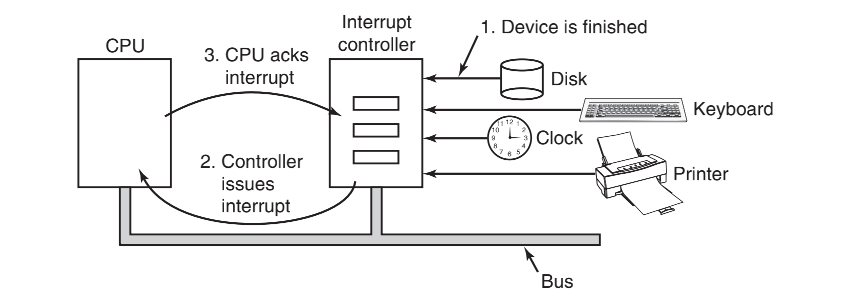

## I/O

-----

除了提供抽象(例如，进程（和线程）、地址空间和文件）以外，操作系统还要控制计算机的所有 `I/O`（输入/输出）设备。操作系统必须向设备发送命令，捕捉中断，并处理设备的各种错误。它还应该在设备和系统的其他部分之间提供简单且易于使用的接口。如果有可能，这个接口对于所有设备都应该是相同的，这就是所谓的设备无关性。

## I/O 硬件原理

-------

不同的人对于 `I/O` 硬件的理解是不同的。对于电子工程师而言，`I/O` 硬件就是芯片、导线、电源、电机和其他组成硬件的物理部件。对程序员而言，则只注意 `I/O` 硬件提供给软件的接口，如硬件能够接收的命令、它能够完成的功能以及它能够报告的错误。本书主要介绍怎样对 `I/O` 设备编程，而不是如何设计、制造和维护硬件，因此，我们的讨论限于如何对硬件编程，而不是其内部的工作原理。

#### I/O 设备

`I/O` 设备大致可以分为两类：块设备 `block device` 和字符设备 `character device`。

块设备把信息存储在固定大小的块中，每个块有自己的地址。通常块的大小在 `512` 字节至`32 768` 字节之间。所有传输以一个或多个完整的（连续的）块为单位。块设备的基本特征是每个块都能独立于其他块而读写。硬盘、`CD-ROM` 和 `USB` 盘是最常见的块设备。磁盘是公认的块可寻址的设备，因为无论磁盘臂当前处于什么位置，它总是能够寻址其他柱面并且等待所需要的磁盘块旋转到磁头下面。


另一类 `I/O` 设备是字符设备。字符设备以字符为单位发送或接收一个字符流，而不考虑任何块结构。字符设备是不可寻址的，也没有任何寻道操作。打印机、网络接口、鼠标（用作指点设备），以及大多数与磁盘不同的设备都可看作是字符设备。

这种分类方法并不完美，有些设备就没有包括进去。例如，时钟既不是块可寻址的，也不产生或接收字符流。它所做的工作就是按照预先规定好的时间间隔产生中断。内存映射的显示器也不适用于此模型。

#### I/O 设备控制器

`I/O` 设备一般由机械部件和电子部件两部分组成。通常可以将这两部分分开处理，以提供更加模块化和更加通用的设计。电子部件称作设备控制器 `device controller` 或适配器`adapter` 。在个人计算机上，它经常以主板上的芯片的形式出现，或者以插入 `PCI` 扩展槽中的印刷电路板的形式出现。

控制器卡上通常有一个连接器，通向设备本身的电缆可以插入到这个连接器中。很多控制器可以操作 `2` 个、`4` 个甚至 `8` 个相同的设备。如果控制器和设备之间采用的是标准接口，无论是官方的 `ANSI`、`IEEE` 或 `ISO` 标准还是事实上的标准，各个公司都可以制造各种适合这个接口的控制器或设备。例如，许多公司都生产符合 `IDE`、`SATA`、`SCSI`、`USB`或火线 `IEEE 1394` 接口的磁盘驱动器。

控制器与设备之间的接口通常是一个很低层次的接口。例如，磁盘可以按每个磁道 `10 000` 个扇区，每个扇区 `512` 字节进行格式化。然而，实际从驱动器出来的却是一个串行的位（比特）流，它以一个前导符 `preamble` 开始，接着是一个扇区中的 `4096` 位，最后是一个校验和，也称为错误校正码 `Error-Correcting Code，ECC`。前导符是在对磁盘进行格式化时写上去的，它包括柱面数和扇区号、扇区大小以及类似的数据，此外还包含同步信息。

控制器的任务是把串行的位流转换为字节块，并进行必要的错误校正工作。字节块通常首先在控制器内部的一个缓冲区中按位进行组装，然后在对校验和进行校验并证明字节块没有错误后，再将它复制到主存中。

**内部缓冲区**

在 `DMA` 可以开始之前或者 `CPU` 读取之前，磁盘首先要将数据读入其内部的缓冲区中。你也许会产生疑问：为什么控制器从磁盘读取字节后不立即将其存储在主存中？换句话说，为什么需要一个内部缓冲区？有两个原因。首先，通过进行内部缓冲，磁盘控制器可以在开始传送之前检验校验和。如果校验和是错误的，那么将发出一个表明错误的信号并且不会进行传送。

第二个原因是，一旦磁盘传送开始工作，从磁盘读出的数据就是以固定速率到达的，而不论控制器（或者 `CPU`）是否准备好接收数据。如果控制器要将数据直接写到内存，则它必须为要传送的每个字取得系统总线的控制权。此时，若由于其他设备使用总线而导致总线忙（例如在突发模式中），则控制器只能等待。如果在前一个磁盘字还未被存储之前下一个磁盘字到达，控制器只能将它存放在某个地方。如果总线非常忙，控制器可能需要存储很多字,“而且还要完成大量的管理工作。如果块被放入内部缓冲区，则在 `DMA` 启动前不需要使用总线，这样，控制器的设计就可以简化，因为对 `DMA` 到内存的传送没有严格的时间要求。

#### I/O 内存映射 

每个控制器有几个寄存器用来与 `CPU` 进行通信。通过写入这些寄存器，操作系统可以命令设备发送数据、接收数据、开启或关闭，或者执行某些其他操作。通过读取这些寄存器，操作系统可以了解设备的状态，是否准备好接收一个新的命令等。

除了这些控制寄存器以外，许多设备还有一个操作系统可以读写的数据缓冲区。例如，在屏幕上显示像素的常规方法是使用一个视频 `RAM`，这一 `RAM` 基本上只是一个数据缓冲区，可供程序或操作系统写入数据。

`CPU` 如何与设备的控制寄存器和数据缓冲区进行通信？存在两个可选的方法：


**I/O 端口空间**

在第一个方法中，每个控制寄存器被分配一个 `I/O` 端口 `I/O port` 号，这是一个 `8` 位或 `16` 位的整数。所有 `I/O` 端口形成 `I/O` 端口空间 `I/O port space`，并且受到保护使得普通的用户程序不能对其进行访问（只有操作系统可以访问）。使用一条特殊的`I/O`指令，例如：

```assembly
IN REG,PORT
```

`IN REG,PORT`，`CPU` 可以读取控制寄存器 `PORT` 的内容并将结果存入到 `CPU` 寄存器 `REG` 中。类似地，使用

```assembly
OUT PORT,REG
```

`CPU` 可以将 `REG` 的内容写入到控制寄存器中。

在这一方案中，内存地址空间和 `I/O` 地址空间是不同的，如图 `a` 所示。

**内存映射I/O**

第二个方法将所有控制寄存器映射到内存空间中，如图 `b` 所示。每个控制寄存器被分配惟一的一个内“存地址，并且不会有内存被分配这一地址。这样的系统称为内存映射I/O `memory-mapped I/O`。

我们首先来看一看内存映射I/O的优点：

- 设备控制寄存器只是内存中的变量，在C语言中可以和任何其他变量一样寻址。因此，对于内存映射I/O，I/O设备驱动程序可以完全用C语言编写。如果不使用内存映射I/O，就要用到某些汇编代码。
- 不需要特殊的保护机制来阻止用户进程执行 `I/O` 操作。操作系统必须要做的全部事情只是避免把包含控制寄存器的那部分地址空间放入任何用户的虚拟地址空间之中。


**混合方案**

通常分配给控制寄存器的地址位于地址空间的顶端。图 `c` 所示是一种混合的方案，这一方案具有内存映射 `I/O` 的数据缓冲区，而控制寄存器则具有单独的 `I/O` 端口。`Pentium`处理器使用的就是这一体系结构。

**原理**

这些方案是怎样工作的？在各种情形下，当 `CPU` 想要读入一个字的时候，不论是从内存中读入还是从 `I/O` 端口中读入，它都要将需要的地址放到总线的地址线上，然后在总线的一条控制线上置起一个 `READ` 信号。还要用到第二条信号线来表明需要的是 `I/O` 空间还是内存空间。如果是内存空间，内存将响应请求。如果是 `I/O` 空间，`I/O` 设备将响应请求。如果只有内存空间（如图 `b` 所示的情形），那么每个内存模块和每个 `I/O`  设备都会将地址线和它所服务的地址范围进行比较，如果地址落在这一范围之内，它就会响应请求。因为绝对不会有地址既分配给内存又分配给 `I/O` 设备，所以不会存在歧义和冲突。


如果只有内存空间（如图 `b` 所示的情形），那么每个内存模块和每个 `I/O` 设备都会将地址线和它所服务的地址范围进行比较，如果地址落在这一范围之内，它就会响应请求。因为绝对不会有地址既分配给内存又分配给 `I/O` 设备，所以不会存在歧义和冲突。

**权衡**

先来看看内存映射 `I/O` 的优点：

- 对于内存映射 `I/O`，`I/O` 设备驱动程序可以完全用C语言编写。如果不使用内存映射 `I/O`，就要用到某些汇编代码。

- 对于内存映射I/O，不需要特殊的保护机制来阻止用户进程执行 `I/O` 操作。操作系统必须要做的全部事情只是避免把包含控制寄存器的那部分地址空间放入任何用户的虚拟地址空间之中。

- 如果每个设备在地址空间的不同页面上拥有自己的控制寄存器，操作系统只要简单地通过在其页表中包含期望的页面就可以让用户控制特定的设备而不是其他设备。这样的方案可以使不同的设备驱动程序放置在不同的地址空间中，不但可以减小内核的大小，而且可以防止驱动程序之间相互干扰。

- 对于内存映射 `I/O`，可以引用内存的每一条指令也可以引用控制寄存器。例如，一条指令 `TEST` 可以测试一个内存字是否为 `0`，那么它也可以用来测试一个控制寄存器是否为 `0`，为 `0` 可以作为信号，表明设备空闲可以接收一条新的命令。汇编代码可能是这样的：

  ```assembly
  LOOP:TEST PORT_4//检测端口4是否为0
  BEQ READY//如果为0，转向READY
  BRANCH LOOP//否则，继续测试
  READY:
  ```

  > 如果不是内存映射 `I/O`，那么必须首先将控制寄存器读入 `CPU`，然后再测试，这样就需要两条指令而不是一条，这样会稍稍降低检测空闲设备的响应度。
  >

在计算机设计中，实际上任何事情都要涉及权衡，此处也不例外。内存映射 `I/O` 也有缺点:

- 首先，现今大多数计算机都拥有某种形式的内存字高速缓存。对一个设备控制寄存器进行高速缓存可能是灾难性的。在存在高速缓存的情况下考虑上面给出的汇编代码循环。第一次引用 `PORT_4` 将导致它被高速缓存，随后的引用将只从高速缓存中取值并且不会再查询设备(设备是不会去更新高速缓存的)。之后当设备最终变为就绪时，软件将没有办法发现这一点。结果，循环将永远进行下去。
  - 为了避免这一情形，硬件必须针对每个页面具备选择性禁用高速缓存的能力。操作系统必须管理选择性高速缓存，所以这一特性为硬件和操作系统两者增添了额外的复杂性。

- 现代个人计算机的趋势是包含专用的高速内存总线，如图 `b` 所示。具有单独的内存总线的麻烦是 `I/O` 设备没有办法查看内存地址，因为内存地址旁路到内存总线上，所以没有办法响应。
  - 一种可能的解决方法是首先将全部内存引用发送到内存，如果内存响应失败，CPU将尝试其他总线。这一设计是可以工作的，但是需要额外的硬件复杂性。
  - 第二种可能的设计是在内存总线上放置一个探查设备，放过所有潜在地指向所关注的 `I/O` 设备的地址。此处的问题是，`I/O` 设备可能无法以内存所能达到的速度处理请求。
  - 第三种可能的设计是在 `PCI` 桥芯片中对地址进行过滤，这也是上图 `Pentium` 结构上所使用的。该芯片中包含若干个在引导时预装载的范围寄存器。例如，`640K` 到 `1M-1` 可能被标记为非内存范围。落在标记为非内存的那些范围之内的地址将被转发给 `PCI` 总线而不是内存。这一设计的缺点是需要在引导时判定哪些内存地址不是真正的内存地址。

#### 直接存储器读取 (DMA)

无论一个 `CPU` 是否具有内存映射 `I/O`，它都需要寻址设备控制器以便与它们交换数据。`CPU` 可以从 `I/O` 控制器每次请求一个字节的数据，但是这样做浪费 `CPU` 的时间，所以经常用到一种称为直接存储器存取 `Direct Memory Access，DMA` 的不同方案。只有硬件具有 `DMA` 控制器时操作系统才能使用 `DMA`。有时 `DMA` 控制器集成到磁盘控制器和其他控制器之中，但是这样的设计要求每个设备有一个单独的 `DMA` 控制器。更加普遍的是，只有一个 `DMA` 控制器可利用（例如,在主板上），由它调控到多个设备的数据传送，而这些数据传送经常是同时发生的。

`DMA` 控制器能够独立于 `CPU` 而访问系统总线，如图所示。它包含若干个可以被 `CPU` 读写的寄存器，其中包括一个内存地址寄存器、一个字节计数寄存器和一个或多个控制寄存器。控制寄存器指定要使用的 `I/O` 端口、传送方向（从 `I/O` 设备读或写到 `I/O` 设备）、传送单位（每次一个字节或每次一个字）以及在一次突发传送中要传送的字节数。


**工作原理**

为了解释 `DMA` 的工作原理，让我们首先看一下没有使用 `DMA` 时磁盘如何读。首先，控制器从磁盘驱动器串行地、一位一位地读一个块（一个或多个扇区），直到将整块信息放入控制器的内部缓冲区中。接着，它计算校验和，以保证没有读错误发生。然后控制器产生一个中断。当操作系统开始运行时，它重复地从控制器的缓冲区中一次一个字节或一个字地读取该块的信息，并将其存入内存中。

使用 `DMA` 时，过程是不同的。首先，`CPU` 通过设置 `DMA` 控制器的寄存器对它进行编程，所以 `DMA` 控制器知道将什么数据传送到什么地方（图中的第1步）。`DMA` 控制器还要向磁盘控制器发出一个命令，通知它从磁盘读数据到其内部的缓冲区中，并且对校验和进行检验。如果磁盘控制器的缓冲区中的数据是有效的，那么 `DMA` 就可以开始了。

`DMA` 控制器通过在总线上发出一个读请求到磁盘控制器而发起 `DMA` 传送（第2步）。这一读请求看起来与任何其他请求是一样的，并且磁盘控制器并不知道或者并不关心它是来自 `CPU` 还是来自`DMA`控制器。一般情况下，要写的内存地址在总线的地址线上，所以当磁盘控制器从其内部缓冲区中读取下一个字的时候，它知道将该字写到什么地方。写到内存是另一个标准总线周期（第3步）。

当写操作完成时，磁盘控制器在总线上发出一个应答信号到 `DMA` 控制器（第4步）。于是，`DMA` 控制器步增要使用的内存地址，并且步减字节计数。如果字节计数仍然大于 `0`，则重复第2步到第4步，直到字节计数到达 `0`。此时，`DMA` 控制器将中断 `CPU` 以便让 `CPU` 知道传送现在已经完成了。当操作系统开始工作时，用不着将磁盘块复制到内存中，因为它已经在内存中了。

**多路传送**

复杂一些的 `DMA` 控制器经过编程可以一次处理多路传送，这样的控制器内部具有多组寄存器，每一通道一组寄存器。`CPU` 通过用与每路传送相关的参数装载每组寄存器而开始。每路传送必须使用不同的设备控制器。在图中，传送每一个字之后，`DMA` 控制器要决定下一次要为哪一设备提供服务。`DMA` 控制器可能被设置为使用轮转算法，它也可能具有一个优先级规划设计，以便让某些设备受到比其他设备更多的照顾。假如存在一个明确的方法分辨应答信号，那么在同一时间就可以挂起对不同设备控制器的多个请求。出于这样的原因，经常将总线上不同的应答线用于每一个 `DMA` 通道。

**总线模式**

许多总线能够以两种模式操作：每次一字模式和块模式。某些 `DMA` 控制器也能够以这两种模式操作。在前一个模式中，操作如上所述：`DMA` 控制器请求传送一个字并且得到那个字，如果`CPU`也想使用总线，它必须等待。这一机制称为周期窃取 `cycle stealing`，因为设备控制器偶尔偷偷溜入并且从 `CPU` 偷走一个临时的总线周期，从而轻微地延迟 `CPU`。

在块模式中，`DMA` 控制器通知设备获得总线，发起一连串的传送，然后释放总线。这一操作形式称为突发模式 `burst mode`。它比周期窃取效率更高，因为获得总线占用了时间，并且以一次总线获得的代价能够传送多个字。突发模式的缺点是，如果正在进行的是长时间突发传送，有可能将 `CPU` 和其他设备阻塞相当长的周期。

我们一直讨论的模型称为飞越模式 `fly-by mode` 中，`DMA` 控制器通知设备控制器直接将数据传送到主存。某些 `DMA` 控制器使用的其他模式是让设备控制器将字发送给 `DMA` 控制器，`DMA`控制器然后发起第2个总线请求将该字写到它应该去的任何地方。采用这种方案，每传送一个字需要一个额外总线周期，但是更加灵活，因为它可以执行设备到设备的复制甚至是内存到内存的复制。

**地址转换**

大多数 `DMA` 控制器使用物理内存地址进行传送。使用物理地址要求操作系统将预期的内存虚拟地址转换为物理地址，并且将该物理地址写入 `DMA` 控制器的地址寄存器中。

在少数`DMA`控制器中使用的一个替代方案是将虚拟地址写入 `DMA` 控制器，然后 `DMA` 控制器必须使用 `MMU` 来完成虚拟地址到物理地址的转换。只有在 `MMU` 是内存的组成部分，而不是CPU的组成部分的情况下，才可以将虚拟地址放到总线上。

#### 重温中断

在一台典型的个人计算机系统中，中断结构如图所示。在硬件层面，中断的工作如下所述。当一个 `I/O` 设备完成交给它的工作时，它就产生一个中断（假设操作系统已经开放中断），它是通过在分配给它的一条总线信号线上置起信号而产生中断的。该信号被主板上的中断控制器芯片检测到，由中断控制器芯片决定做什么。



终端处理一般分为四个步骤：`发起中断请求`、`置起中断信号`、`处理中断`、`响应中断`：

1. 如果没有其他中断悬而未决，中断控制器将立刻对中断进行处理。如果有另一个中断正在处理中，或者另一个设备在总线上具有更高优先级的一条中断请求线上同时发出中断请求，该设备将暂时不被理睬。在这种情况下，该设备将继续在总线上置起中断信号，直到得到 `CPU` 的服务 (图中 `1`)。
2. 为了处理中断，中断控制器在地址线上放置一个数字表明哪个设备需要关注，并且置起一个中断 `CPU` 的信号 (图中 `2`)。
3. 中断信号导致 `CPU` 停止当前正在做的工作并且开始做其他的事情。地址线上的数字被用做指向一个称为中断向量 `interrupt vector` 的表格的索引，以便读取一个新的程序计数器。这一程序计数器指向相应的中断服务过程的开始。一般情况下，陷阱和中断从这一点上看使用相同的机制，并且常常共享相同的中断向量。中断向量的位置可以硬布线到机器中，也可以在内存中的任何地方通过一个CPU寄存器指向其起点。
4. 中断服务过程开始运行后，它立刻通过将一个确定的值写到中断控制器的某个 `I/O` 端口来对中断做出应答(图中 `3`)。这一应答告诉中断控制器可以自由地发出另一个中断。通过让 `CPU` 延迟这一应答直到它准备好处理下一个中断，就可以避免与多个几乎同时发生的中断相牵涉的竞争状态。

**数据缓存**

在开始服务程序之前，`CPU`要保存一些信息。作为最低限度，必须保存程序计数器，这样被中断中断的进程才能够重新开始。在另一个极端，所有可见的寄存器和很多内部寄存器或许也要保存。

将这些信息保存到什么地方是一个问题。一种选择是将其放入内部寄存器中，在需要时操作系统可以读出这些内部寄存器。这一方法的问题是，中断控制器之后无法得到应答，直到所有可能的相关信息被读出，以免第二个中断重写内部寄存器保存状态。这一策略在中断被禁止时将导致长时间的死机，并且可能丢失中断和丢失数据。

因此，大多数 `CPU` 在堆栈中保存信息。然而，这种方法也有问题。首先，使用谁的堆栈？如果使用当前堆栈，则它很可能是用户进程的堆栈。堆栈指针甚至可能不是合法的，这样当硬件试图在它所指的地址处写某些字时，将导致致命错误。此外，它可能指向一个页面的末端。若干次内存写之后，页面边界可能被超出并且产生一个页面故障。在硬件中断处理期间如果发生页面故障将引起更大的问题：在何处保存状态以处理页面故障？

如果使用内核堆栈，将存在更多的堆栈指针是合法的并且指向一个固定的页面的机会。然而，切换到核心态可能要求改变 `MMU` 上下文，并且可能使高速缓存和TLB的大部分或全部失效。静态地或动态地重新装载所有这些东西将增加处理一个中断的时间，因而浪费 `CPU`的时间。

**精确中断**

一个问题是由下面这样的事实引起的：现代 `CPU` 大量地采用流水线并且有时还采用超标量（内部并行）。这一模型使用了隐含的假设，这就是如果一个中断正好在某一指令之后发生，那么这条指令前的所有指令都完整地执行过了，而这条指令后的指令一条也没有执行。在老式的机器上，这一假设总是正确的，而在现代计算机上，这一假设则未必是正确的。


首先，考虑图 `a` 的流水线模型。在流水线满的时候，如果出现一个中断，那么会发生什么情况？许多指令正处于各种不同的执行阶段，当中断出现时，程序计数器的值可能无法正确地反映已经执行过的指令和尚未执行的指令之间的边界。事实上，许多指令可能部分地执行了，不同的指令完成的程度或多或少。在这种情况下，程序计数器更有可能反映的是将要被取出并压入流水线的下一条指令的地址，而不是刚刚被执行单元处理过的指令的地址。

在如图 `b` 所示的超标量计算机上，事情更加糟糕。指令可能分解成微操作，而微操作有可能乱序执行，这取决于内部资源（如功能单元和寄存器）的可用性。当中断发生时，某些很久以前启动的指令可能还没开始执行，而其他最近启动的指令可能几乎要完成了。可能存在许多指令处于不同的完成状态，它们与程序计数器之间没有什么关系。

将机器留在一个明确状态的中断称为精确中断 `precise interrupt`。精确中断具有 `4` 个特性：

1. `PC`（程序计数器）保存在一个已知的地方。
2. `PC` 所指向的指令之前的所有指令已经完全执行。
3. `PC` 所指向的指令之后的所有指令都没有执行。
4. `PC` 所指向的指令的执行状态是已知的。

注意，对于 `PC` 所指向的指令之后的那些指令来说，此处并没有禁止它们开始执行，而只是要求在中断发生之前必须撤销它们对寄存器或内存所做的任何修改。`PC` 所指向的指令有可能已经执行了，也有可能还没有执行，然而，必须清楚适用的是哪种情况。通常，如果中断是一个 `I/O` 中断，那么指令就会还没有开始执行。然而，如果中断实际上是一个陷阱或者页面故障，那么 `PC` 一般指向导致错误的指令，所以它以后可以重新开始执行。图 `a` 所示的情形描述了精确中断。程序计数器 `316` 之前的所有指令都已经完成了，而它之后的指令都还没有启动（或者已经回退以撤销它们的作用）。


**不精确中断**

不满足这些要求的中断称为不精确中断 `imprecise interrupt`，操作系统必须断定已经发生了什么以及还要发生什么。图 `b` 描述了不精确中断，其中邻近程序计数器的不同指令处于不同的完成状态，老的指令不一定比新的指令完成得更多。具有不精确中断的机器通常将大量的内部状态“吐出”到堆栈中，从而使操作系统有可能判断出正在发生什么事情。重新启动机器所必需的代码通常极其复杂。此外，在每次中断发生时将大量的信息保存在内存中使得中断响应十分缓慢，而恢复则更加糟糕。这就导致具有讽刺意味的情形：由于缓慢的中断使得非常快速的超标量 `CPU` 有时并不适合实时工作。


