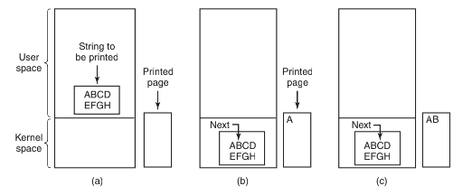
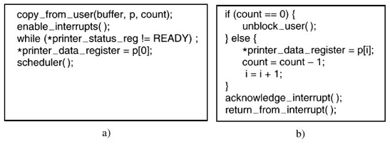
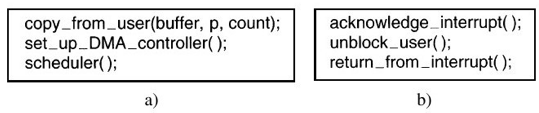
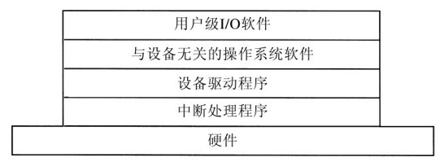
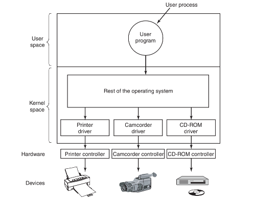
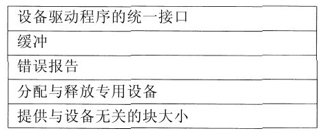
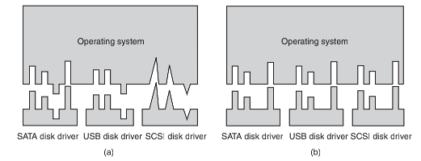
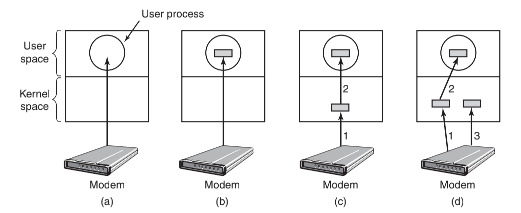
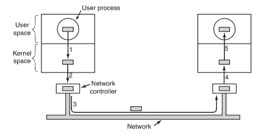
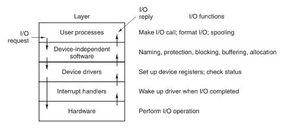

## I/O软件原理

------

在讨论了 `I/O` 硬件之后，下面我们来看一看 `I/O` 软件。首先我们将看一看 `I/O` 软件的目标，然后从操作系统的观点来看一看 `I/O`实现的不同方法。

#### I/O 软件目标

**设备独立性**

在设计 `I/O` 软件时一个关键的概念是设备独立性 `device independence`。它的意思是应该能够编写出这样的程序：它可以访问任意 `I/O` 设备而无需事先指定设备。例如，读取一个文件作为输入的程序应该能够在硬盘、`CD-ROM`、`DVD` 或者 `USB` 盘上读取文件，无需为每一种不同的设备修改程序。尽管这些设备实际上差别很大，需要非常不同的命令序列来读或写，但这一事实所带来的问题将由操作系统负责处理。

**统一命名**

与设备独立性密切相关的是统一命名 `uniform naming` 这一目标。一个文件或一个设备的名字应该是一个简单的字符串或一个整数，它不应依赖于设备。例如，一个 `USB` 盘可以安装 `mount` 到目录 `/usr/ast/backup` 下，这样复制一个文件到 `/usr/ast/backup/monday` 就是将文件复制到 `USB` 盘上。用这种方法，所有文件和设备都采用相同的方式——路径名进行寻址。

**错误处理**

`I/O` 软件的另一个重要问题是错误处理 `error handling`，错误应该尽可能地在接近硬件的层面得到处理。当控制器发现了一个读错误时，如果它能够处理那么就应该自己设法纠正这一错误。如果控制器处理不了，那么设备驱动程序应当予以处理，可能只需重读一次这块数据就正确了。在许多情况下，错误恢复可以在低层透明地得到解决，而高层软件甚至不知道存在这一错误。

**同步异步**

另一个关键问题是同步 `synchronous`（即阻塞）和异步 `asynchronous`（即中断）传输。大多数物理 `I/O` 是异步的—— `CPU` 启动传输后便转去做其他工作，直到中断发生。如果 `I/O`操作是阻塞的，那么用户程序就更加容易编写——在 `read` 系统调用之后，程序将自动被挂起，直到缓冲区中的数据准备好。

**缓冲**

I/O软件的另一个问题是缓冲 `buffering`。数据离开一个设备之后通常并不能直接存放到其最终的目的地。例如，从网络上进来一个数据包时，直到将该数据包存放在某个地方并对其进行检查，操作系统才知道要将其置于何处。缓冲涉及大量的复制工作，并且经常对 `I/O` 性能有重大影响。

**共享还是抢占**

最后一个概念是共享设备和独占设备的问题。有些 `I/O` 设备（如磁盘）能够同时让多个用户使用。多个用户同时在同一磁盘上打开文件不会引起什么问题。其他设备（如磁带机）则必须由单个用户独占使用，直到该用户使用完，另一个用户才能拥有该磁带机。

## I/O软件

--------

#### 程序控制 I/O

`I/O` 可以以三种根本不同的方式实现。第一种（程序控制 `I/O`），`I/O` 的最简单形式是让 `CPU` 做全部工作，这一方法称为程序控制 `I/O（programmed I/O）`。

借助于例子来说明程序控制 `I/O` 是最简单的。考虑一个用户进程，该进程想在打印机上打印8个字符的字符串 `ABCDEFGH`。它首先要在用户空间的一个缓冲区中组装字符串，如图 `a` 所示。

然后，用户进程通过发出系统调用打开打印机来获得打印机以便进行写操作。如果打印机当前被另一个进程占用，该系统调用将失败并返回一个错误代码，或者将阻塞直到打印机可用，具体情况取决于操作系统和调用参数。一旦拥有打印机，用户进程就发出一个系统调用通知操作系统在打印机上打印字符串。

然后，操作系统将字符串缓冲区复制到内核空间中的一个数组中，然后操作系统要查看打印机当前是否可用。如果不可用，就要等待直到它可用。一旦打印机可用，操作系统就复制第一个字符到打印机的数据寄存器中，在这个例子中使用了内存映射 `I/O`。这一操作将激活打印机。字符也将打印，



一旦将第一个字符复制到打印机，操作系统就要查看打印机是否就绪准备接收另一个字符。一般而言，打印机都有第二个寄存器，用于表明其状态。将字符写到数据寄存器的操作将导致状态变为非就绪。当打印机控制器处理完当前字符时，它就通过在其状态寄存器中设置某一位或者将某个值放到状态寄存器中来表示其可用性。

这时，操作系统将等待打印机状态再次变为就绪。打印机就绪事件发生时，操作系统就打印下一个字符，如图 `c` 所示。这一循环继续进行，直到整个字符串打印完。然后，控制返回到用户进程。

下图清楚地说明了程序控制 `I/O` 的最根本的方面，这就是输出一个字符之后，`CPU` 要不断地查询设备以了解它是否就绪准备接收另一个字符。这一行为经常称为轮询 `polling` 或忙等待 `busy waiting` 。

```go
copy from user(buffer, p, count); /* p is the ker nel buffer */
for (i = 0; i < count; i++) {
  /* loop on every character */
	while (*pr inter status reg != READY) ; 
  /* loop until ready */ 
  *pr inter data register = p[i]; /* output one character */ 
}
retur n to user( );
```

程序控制 `I/O` 十分简单但是有缺点，即直到全部 `I/O` 完成之前要占用 `CPU` 的全部时间。

#### 中断驱动 I/O

允许 `CPU` 在等待打印机变为就绪的同时做某些其他事情的方式就是使用中断。当打印字符串的系统调用被发出时，如我们前面所介绍的，字符串缓冲区被复制到内核空间，并且一旦打印机准备好接收一个字符时就将第一个字符复制到打印机中。这时，`CPU` 要调用调度程序，并且某个其他进程将运行。请求打印字符串的进程将被阻塞，直到整个字符串打印完。系统调用所做的工作如图 `a` 所示。



当打印机将字符打印完并且准备好接收下一个字符时，它将产生一个中断。这一中断将停止当前进程并且保存其状态。然后，打印机中断服务过程将运行。

图 `b` 所示为打印机中断服务过程的一个粗略的版本。如果没有更多的字符要打印，中断处理程序将采取某个操作将用户进程解除阻塞。否则，它将输出下一个字符，应答中断，并且返回到中断之前正在运行的进程，该进程将从其停止的地方继续运行。

#### 使用 `DMA` 的 I/O

中断驱动 `I/O` 的一个明显缺点是中断发生在每个字符上。中断要花费时间，所以这一方法将浪费一定数量的 `CPU` 时间。这一问题的一种解决方法是使用 `DMA`。此处的思路是让 `DMA` 控制器一次给打印机提供一个字符，而不必打扰 `CPU`。本质上，`DMA` 是程序控制 `I/O`，只是由 `DMA` 控制器而不是主 `CPU` 做全部工作，`DMA` 接受每个字符的应答并且在最后向 `CPU` 发起中断。



`DMA` 重大的成功是将中断的次数从打印每个字符一次减少到打印每个缓冲区一次。如果有许多字符并且中断十分缓慢，那么采用 `DMA` 可能是重要的改进。另一方面，`DMA` 控制器通常比主 `CPU` 要慢很多。如果 `DMA` 控制器不能以全速驱动设备，或者 `CPU` 在等待 `DMA` 中断的同时没有其他事情要做，那么采用中断驱动 `I/O` 甚至采用程序控制 `I/O` 也许更好。

## I/O 软件层次

-------

介绍了几种主要的 `I/O` 软件，接下来我们来了解一下 `I/O` 软件的层次。`I/O` 软件通常组织成四个层次，如图所示。每一层具有一个要执行的定义明确的功能和一个的定义明确的与邻近层次的接口。功能与接口随系统的不同而不同，



#### 中断处理程序

中断是令人不愉快的事情并且无法避免。应当将其深深地隐藏在操作系统内部，以便系统的其他部分尽量不与它发生联系。隐藏它们的最好办法是将启动一个 `I/O` 操作的驱动程序阻塞起来，直到I/O操作完成且产生一个中断。驱动程序阻塞自己的手段有：在一个信号量上执行 `down` 操作、在一个条件变量上执行 `wait` 操作、在一个消息上执行 `receive` 操作或者某些类似的操作。

当中断发生时，中断处理程序将做它必须要做的全部工作以便对中断进行处理。然后，它可以将启动中断的驱动程序解除阻塞。在一些情形中，它只是在一个信号量上执行 `up` 操作；其他情形中，是对管程中的条件变量执行 `signal` 操作；还有一些情形中，是向被阻塞的驱动程序发一个消息。

对操作系统而言，还涉及更多的工作。我们将按一系列步骤给出这一工作的轮廓，这些步骤是硬件中断完成之后必须在软件中执行的。

1. 保存没有被中断硬件保存的所有寄存器（包括 `PSW`）
2. 为中断服务过程设置上下文，可能包括设置 `TLB`、`MMU`和页表
3. 为中断服务过程设置堆栈
4. 应答中断控制器，如果不存在集中的中断控制器，则再次开放中断
5. 将寄存器从它们被保存的地方（可能是某个堆栈）复制到进程表中
6. 运行中断服务过程，从发出中断的设备控制器的寄存器中提取信息
7. 选择下一次运行哪个进程，如果中断导致某个被阻塞的高优先级进程变为就绪，则可能选择它现在就运行
8. 为下一次要运行的进程设置MMU上下文，也许还需要设置某个TLB
9. 装入新进程的寄存器，包括其PSW
10.  开始运行新进程

由此可见，中断处理远不是无足轻重的小事。它要花费相当多的 `CPU` 指令，特别是在存在虚拟内存并且必须设置页表或者必须保存 `MMU` 状态（例如 `R` 和 `M` 位）的机器上。

#### 设备驱动程序

我们注意到每一个控制器都设有某些设备寄存器用来向设备发出命令，或者设有某些设备寄存器用来读出设备的状态，或者设有这两种设备寄存器。设备寄存器的数量和命令的性质在不同设备之间有着根本性的不同。

因而，每个连接到计算机上的 `I/O` 设备都需要某些设备特定的代码来对其进行控制。这样的代码称为设备驱动程序 `device driver`，它一般由设备的制造商编写并随同设备一起交付。每个设备驱动程序通常处理一种类型的设备，或者至多处理一类紧密相关的设备。例如，`SCSI` 磁盘驱动程序通常可以处理不同大小和不同速度的多个 `SCSI` 磁盘。

**驱动与内核**

为了访问设备的硬件（意味着访问设备控制器的寄存器），设备驱动程序通常必须是操作系统内核的一部分。当然也有可能构造运行在用户空间的驱动程序，使用系统调用来读写设备寄存器。这一设计使内核与驱动程序相隔离，并且使驱动程序之间相互隔离，这样做可以消除系统崩溃的一个主要源头——有问题的驱动程序以这样或那样的方式干扰内核。

在某些系统中，操作系统是一个二进制程序，包含需要编译到其内部的所有驱动程序。这一方案多年以来对 `UNIX` 系统而言是标准规范，因为 `UNIX` 系统主要由计算中心运行，`I/O` 设备几乎不发生变化。如果添加了一个新设备，系统管理员只需重新编译内核，将新的驱动程序增加到新的二进制程序中。

随着个人计算机的出现，这一模型不再起作用，因为个人计算机有太多种类的 `I/O` 设备。即便拥有源代码或目标模块，也只有很少的用户有能力重新编译和重新连接内核，何况他们并不总是拥有源代码或目标模块。为此，从 `MS-DOS` 开始，操作系统转向驱动程序在执行期间动态地装载到系统中的另一个模型。不同的操作系统以不同的方式处理驱动程序的装载工作。

因为操作系统的设计者知道由外人编写的驱动程序代码片断将被安装在操作系统的内部，所以需要有一个体系结构来允许这样的安装。设备驱动程序通常位于操作系统其余部分的下面，如图所示：



**接口**

操作系统通常将驱动程序归类于少数的类别之一。最为通用的类别是块设备 `block device` 和字符设备 `character device`。块设备（例如磁盘）包含多个可以独立寻址的数据块，字符设备（例如键盘和打印机）则生成或接收字符流。

大多数操作系统都定义了一个所有块设备都必须支持的标准接口，并且还定义了另一个所有字符设备都必须支持的标准接口。这些接口由许多过程组成，操作系统的其余部分可以调用它们让驱动程序工作。

设备驱动程序具有若干功能。最明显的功能是接收来自其上方与设备无关的软件所发出的抽象的读写请求，除此之外，还有一些其他的功能必须执行。例如，如果需要的话，驱动程序必须对设备进行初始化。它可能还需要对电源需求和日志事件进行管理。

**工作过程**

典型的驱动程序在启动时要检查输入参数，检查输入参数的目的是搞清它们是否是有效的，如果不是，则返回一个错误。如果输入参数是有效的，则可能需要进行从抽象事项到具体事项的转换。对磁盘驱动程序来说，这可能意味着将一个线性的磁盘块号转换成磁盘几何布局的磁头、磁道、扇区和柱面号。

接着，驱动程序可能要检查设备当前是否在使用。如果在使用，请求将被排入队列以备稍后处理。如果设备是空闲的，驱动程序将检查硬件状态以了解请求现在是否能够得到处理。在传输能够开始之前，可能需要接通设备或者启动马达。一旦设备接通并就绪，实际的控制就可以开始了。

驱动程序在获知哪些命令将要发出之后，它就开始将它们写入控制器的设备寄存器。驱动程序在把每个命令写到控制器之后，它可能必须进行检测以了解控制器是否已经接收命令并且准备好接收下一个命令。这一序列继续进行，直到所有命令被发出。

命令发出之后，会牵涉两种情形之一。在多数情况下，设备驱动程序必须等待，直到控制器为其做某些事情，所以驱动程序将阻塞其自身直到中断到来解除阻塞。然而，在另外一些情况下，操作可以无延迟地完成，所以驱动程序不需要阻塞。在字符模式下滚动屏幕只需要写少许字节到控制器的寄存器中，由于不需要机械运动，所以整个操作可以在几纳秒内完成，这便是后一种情形的例子。

在前一种情况下，阻塞的驱动程序可以被中断唤醒。在后一种情况下，驱动程序根本就不会休眠。无论是哪一种情况，操作完成之后驱动程序都必须检查错误。如果一切顺利，驱动程序可能要将数据（例如刚刚读出的一个磁盘块）传送给与设备无关的软件。最后，它向调用者返回一些用于错误报告的状态信息。如果还有其他未完成的请求在排队，则选择一个启动执行。如果队列中没有未完成的请求，则该驱动程序将阻塞以等待下一个请求。

**热插拔**

当一个驱动程序正忙于从某设备读数据时，系统可能会通知它用户突然将设备从系统中删除了。在这样的情况下，不但当前I/O传送必须中止并且不能破坏任何核心数据结构，而且任何对这个现已消失的设备的悬而未决的请求都必须适当地从系统中删除，同时还要为它们的调用者提供这一坏消息。此外，未预料到的新设备的添加可能导致内核重新配置资源（例如中断请求线），从驱动程序中撤除旧资源，并且在适当位置填入新资源。

#### 与设备无关的 I/O 软件

虽然 `I/O` 软件中有一些是设备特定的，但是其他部分 `I/O` 软件是与设备无关的。设备驱动程序和与设备无关的软件之间的确切界限依赖于具体系统（和设备），因为对于一些本来应按照与设备无关方式实现的功能，出于效率和其他原因，实际上是由驱动程序来实现的。



**1.设备驱动程序的统一接口**

*统一驱动接口*

操作系统的一个主要问题是如何使所有 `I/O` 设备和驱动程序看起来或多或少是相同的。如果磁盘、打印机、键盘等接口方式都不相同，那么每次在一个新设备出现时，都必须为新设备修改操作系统。必须为每个新设备修改操作系统决不是一个好主意。

如果每个设备驱动程序有不同的与操作系统的接口。这意味着，可供系统调用的驱动程序函数随驱动程序的不同而不同。这可能还意味着，驱动程序所需要的内核函数也是随驱动程序的不同而不同的。综合起来看，这意味着为每个新的驱动程序提供接口都需要大量全新的编程工作。



相反，图 `b` 所示为一种不同的设计，在这种设计中所有驱动程序具有相同的接口。当然实际上，虽然并非所有的设备都是绝对一样的，但是通常只存在少数设备类型，而它们的确大体上是相同的。这种设计的工作方式如下。对于每一种设备类型，例如磁盘或打印机，操作系统定义一组驱动程序必须支持的函数。对于磁盘而言，这些函数自然地包含读和写，除此之外还包含开启和关闭电源、格式化以及其他与磁盘有关的事情。

驱动程序通常包含一张表格，这张表格具有针对这些函数指向驱动程序自身的指针。当驱动程序装载时，操作系统记录下这张函数指针表的地址，所以当操作系统需要调用一个函数时，它可以通过这张表格发出间接调用。这张函数指针表定义了驱动程序与操作系统其余部分之间的接口。给定类型（磁盘、打印机等）的所有设备都必须服从这一要求。

*命名统一接口*

如何给 `I/O` 设备命名是统一接口问题的另一个方面。与设备无关的软件要负责把符号化的设备名映射到适当的驱动程序上。例如，在 `UNIX` 系统中，像 `/dev/disk0` 这样的设备名惟一确定了一个特殊文件的 `i` 节点，这个 `i` 节点包含了主设备号 `major device number`，主设备号用于定位相应的驱动程序。

与设备命名密切相关的是设备保护。系统如何防止无权访问设备的用户访问设备呢？在 `UNIX` 和 `Windows` 中，设备是作为命名对象出现在文件系统中的，这意味着针对文件的常规的保护规则也适用于`I/O` 设备。系统管理员可以为每一个设备设置适当的访问权限。

**2.缓冲**

无论对于块设备还是对于字符设备，由于种种原因，缓冲也是一个重要的问题。

*无缓冲*

为例子，我们考虑一个想要从调制解调器读入数据的进程。让用户进程执行 `read` 系统调用并阻塞自己以等待字符的到来，这是对到来的字符进行处理的一种可能的策略。每个字符的到来都将引起中断，中断服务过程负责将字符递交给用户进程并且将其解除阻塞。用户进程把字符放到某个地方之后可以对另一个字符执行读操作并且再次阻塞。这一模型如图 `a` 所示。



这种处理方式的问题在于：对于每个到来的字符，都必须启动用户进程。对于短暂的数据流量让一个进程运行许多次效率会很低，所以这不是一个良好的设计。

*用户空间的缓冲*

图 `b` 所示为一种改进措施。此处，用户进程在用户空间中提供了一个包含 `n` 个字符的缓冲区，并且执行读入 `n` 个字符的读操作。中断服务过程负责将到来的字符放入该缓冲区中直到缓冲区填满，然后唤醒用户进程。

这一方案比前一种方案的效率要高很多，但是它也有一个缺点：当一个字符到来时，如果缓冲区被分页而调出了内存会出现什么问题呢？解决方法是将缓冲区锁定在内存中，但是如果许多进程都在内存中锁定页面，那么可用页面池就会收缩并且系统性能将下降。

*用户+内核空间的缓冲*

另一种方法是在内核空间中创建一个缓冲区并且让中断处理程序将字符放到这个缓冲区中，如图 `c` 所示。当该缓冲区被填满的时候，将包含用户缓冲区的页面调入内存，并且在一次操作中将内核缓冲区的内容复制到用户缓冲区中。这一方法的效率要高很多。

然而，即使这种方案也面临一个问题：正当包含用户缓冲区的页面从磁盘调入内存的时候有新的字符到来，因为缓冲区已满，所以没有地方放置这些新来的字符。

*双缓冲*

一种解决问题的方法是使用第二个内核缓冲区。第一个缓冲区填满之后，在它被清空之前，使用第二个缓冲区，如图 `d` 所示。当第二个缓冲区填满时，就可以将它复制给用户（假设用户已经请求它）。当第二个缓冲区正在复制到用户空间的时候，第一个缓冲区可以用来接收新的字符。以这样的方法，两个缓冲区轮流使用：当一个缓冲区正在被复制到用户空间的时候，另一个缓冲区正在收集新的输入。像这样的缓冲模式称为双缓冲 `double buffering`。

*循环缓冲区*

广泛使用的另一种形式的缓冲是循环缓冲区 `circular buffer`。它由一个内存区域和两个指针组成。一个指针指向下一个空闲的字，新的数据可以放置到此处。另一个指针指向缓冲区中数据的第一个字，该字尚未被取走。在许多情况下，当添加新的数据时，硬件将推进第一个指针，而操作系统在取走并处理数据时推进第二个指针。两个指针都是环绕的，当它们到达顶部时将回到底部。

*性能*

缓冲是一种广泛采用的技术，但是它也有不利的方面。如果数据被缓冲太多次，性能就会降低。

例如，考虑图中的网络。其中，一个用户执行了一个系统调用向网络写数据。内核将数据包复制到一个内核缓冲区中，从而立即使用户进程得以继续进行。在此刻，用户程序可以重用缓冲区。



当驱动程序被调用时，它将数据包复制到控制器上以供输出（第 `2` 步）。它不是将数据包从内核内存直接输出到网线上，其原因是一旦开始一个数据包的传输，它就必须以均匀的速度继续下去，驱动程序不能保证它能够以均匀的速度访问内存，因为 `DMA` 通道与其他 `I/O` 设备可能正在窃取许多周期。不能及时获得一个字将毁坏数据包，而通过在控制器内部对数据包进行缓冲就可以避免这一问题。

当数据包复制到控制器的内部缓冲区中之后，它就会被复制到网络上（第 `3` 步）。数据位被发送之后立刻就会到达接收器，所以在最后一位刚刚送出之后，该位就到达了接收器，在这里数据包在控制器中被缓冲。接下来，数据包复制到接收器的内核缓冲区中（第 `4` 步）。最后，它被复制到接收进程的缓冲区中（第 `5` 步）。

然后接收器通常会发回一个应答。当发送者得到应答时，它就可以自由地发送下一个数据包。然而，应该清楚的是，所有这些复制操作都会在很大程度上降低传输速率，因为所有这些步骤必须有序地发生。

**3.错误报告**

一种类型的 `I/O` 错误是编程错误，这些错误发生在一个进程请求某些不可能的事情时，例如写一个输入设备（键盘、扫描仪、鼠标等）或者读一个输出设备（打印机、绘图仪等）。其他的错误包括提供了一个无效的缓冲区地址或者其他参数，以及指定了一个无效的设备（例如，当系统只有两块磁盘时指定了磁盘 `3`），如此等等。在这些错误上采取的行动是直截了当的：只是将一个错误代码报告返回给调用者。

另一种类型的错误是实际的 `I/O` 错误，例如，试图写一个已经被破坏的磁盘块，或者试图读一个已经关机的便携式摄像机。在这些情形中，应该由驱动程序决定做什么。如果驱动程序不知道做什么，它应该将问题向上传递，返回给与设备无关的软件。

**4.分配与释放专用设备**

某些设备，例如 `CD-ROM` 刻录机，在任意给定的时刻只能由一个进程使用。这就要求操作系统对设备使用的请求进行检查，并且根据被请求的设备是否可用来接受或者拒绝这些请求。

一种代替的方法是对于请求和释放专用设备要有特殊的机制。试图得到不可用的设备可以将调用者阻塞，而不是让其失败。阻塞的进程被放入一个队列。

**5.与设备无关的块大小**

不同的磁盘可能具有不同的扇区大小。应该由与设备无关的软件来隐藏这一事实并且向高层提供一个统一的块大小，例如，将若干个扇区当作一个逻辑块。这样，高层软件就只需处理抽象的设备，这些抽象设备全都使用相同的逻辑块大小，与物理扇区的大小无关。

#### 用户空间的 I/O 软件

尽管大部分 `I/O` 软件都在操作系统内部，但是仍然有一小部分在用户空间，包括与用户程序连接在一起的库，甚至完全运行于内核之外的程序。系统调用（包括 `I/O` 系统调用）通常由库过程实现。

**假脱机系统**

当然并非所有的用户层 `I/O` 软件都是由库过程组成的。另一个重要的类别是假脱机系统。假脱机 `spooling` 是多道程序设计系统中处理独占I/O设备的一种方法。考虑一种典型的假脱机设备：打印机。尽管在技术上可以十分容易地让任何用户进程打开表示该打印机的字符特殊文件，但是假如一个进程打开它，然后很长时间不使用，则其他进程都无法打印。

另一种方法是创建一个特殊进程，称为守护进程 `daemon`，以及一个特殊目录，称为假脱机目录 `spooling directory`。一个进程要打印一个文件时，首先生成要打印的整个文件，并且将其放在假脱机目录下。由守护进程打印该目录下的文件，该进程是允许使用打印机特殊文件的惟一进程。通过保护特殊文件来防止用户直接使用，可以解决某些进程不必要地长期空占打印机的问题。

假脱机不仅仅用于打印机，还可以在其他情况下使用。例如，通过网络传输文件常常使用一个网络守护进程。要发送一个文件到某个地方，用户可以将该文件放在一个网络假脱机目录下。稍后，由网络守护进程将其取出并且发送出去。

#### 总结

下图对I/O系统进行了总结，给出了所有层次以及每一层的主要功能。从底部开始，这些层是硬件、中断处理程序、设备驱动程序、与设备无关的软件，最后是用户进程。



图中的箭头表明了控制流。例如，当一个用户程序试图从一个文件中读一个块时，操作系统被调用以实现这一请求。与设备无关的软件在缓冲区高速缓存中查找有无要读的块。如果需要的块不在其中，则调用设备驱动程序，向硬件发出一个请求，让它从磁盘中获取该块。然后，进程被阻塞直到磁盘操作完成。

当磁盘操作完成时，硬件产生一个中断。中断处理程序就会运行，它要查明发生了什么事情，也就是说此刻需要关注哪个设备。然后，中断处理程序从设备提取状态信息，唤醒休眠的进程以结束此次I/O请求，并且让用户进程继续运行。
