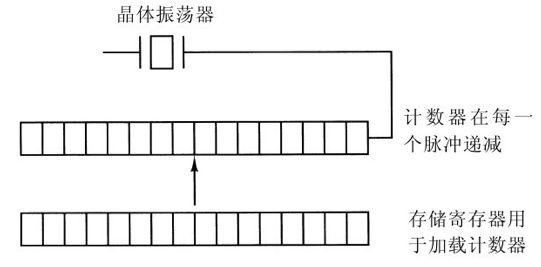
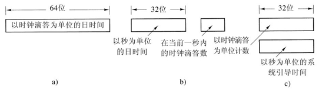
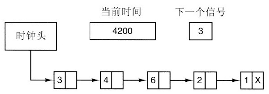

## 时钟

-------

时钟 `clock` 又称为定时器 `timer`。时钟负责维护时间，并且防止一个进程垄断 `CPU`，此外还有其他的功能。接下来我们先看看时钟硬件，再来看看时钟软甲 (驱动)。

#### 时钟硬件

**硬件原理**

计算机里常使用两种类型的时钟，比较简单的时钟被连接到 `110V` 或 `220V` 的电源线上，这样每个电压周期产生一个中断，频率是 `50Hz` 或 `60Hz` 。这些时钟过去曾经占据统治地位，但是如今却非常罕见。

另一种类型的时钟由三个部件构成：`晶体振荡器`、`计数器` 和 `存储寄存器`，如图所示。当把一块石英晶体适当地切割并且安装在一定的压力之下时，它就可以产生非常精确的周期性信号，典型的频率范围是几百兆赫兹，具体的频率值与所选的晶体有关。

使用电子器件可以将这一基础信号乘以一个小的整数来获得高达 `1000MHz` 甚至更高的频率。在任何一台计算机里通常都可以找到至少一个这样的电路，它给计算机的各种电路提供同步信号。该信号被送到计数器，使其递减计数至 `0`。当计数器变为 `0` 时，产生一个 `CPU` 中断。

可编程时钟的优点是其中断频率可以由软件控制。如果采用 `500MHz` 的晶体，那么计数器将每隔 `2ns` 脉动一次。对于 `32` 位寄存器，中断可以被编程为从 `2ns - 8.6s` 时间间隔发生一次。可编程时钟芯片通常包含两个或三个独立的可编程时钟，并且还具有许多其他选项（例如，用正计时代替倒计时、屏蔽中断等）。

**时钟模式**

*一次完成模式 one-shot mode*

可编程时钟通常具有几种操作模式。在一次完成模式 `one-shot mode` 下，当时钟启动时，它把存储寄存器的值复制到计数器中，然后，来自晶体的每一个脉冲使计数器减 `1`。当计数器变为 `0` 时，产生一个中断，并停止工作，直到软件再一次显式地启动它。

*方波模式 square-wave mode*

在方波模式 `square-wave mode` 下，当计数器变为 `0` 并且产生中断之后，存储寄存器的值自动复制到计数器中，并且整个过程无限期地再次重复下去。这些周期性的中断称为时钟滴答 `clock tick`。

**备份时钟**

为了防止计算机的电源被切断时丢失当前时间，大多数计算机具有一个由电池供电的备份时钟。电池时钟可以在系统启动的时候读出。

如果不存在备份时钟，软件可能会向用户询问当前日期和时间。对于一个连入网络的系统而言还有一种从远程主机获取当前时间的标准方法。无论是哪种情况，当前时间都要像 `UNIX` 所做的那样转换成自 `1970` 年 `1` 月 `1` 日上午 `12` 时 `UTC（Universal Time Coordinated，协调世界时，以前称为格林威治平均时）`以来的时钟滴答数，或者转换成自某个其他标准时间以来的时钟滴答数。`Windows` 的时间原点是 `1980` 年 `1` 月 `1` 日。每一次时钟滴答都使实际时间增加一个计数。

#### 时钟软件

时钟硬件所做的全部工作是根据已知的时间间隔产生中断。涉及时间的其他所有工作都必须由软件——时钟驱动程序完成。时钟驱动程序的确切任务因操作系统而异，但通常包括下面的大多数任务：

1. 维护日时间;
2. 防止进程超时运行;
3. 对 `CPU` 的使用情况记账;
4. 处理用户进程提出的 `alarm` 系统调用;
5. 为系统本身的各个部分提供监视定时器;
6. 完成概要剖析、监视和统计信息收集;

**维护日时间**

时钟的第一个功能是维持正确的日时间，也称为实际时间 `real time`，这并不难实现，只需要如前面提到的那样在每个时钟滴答将计数器加 `1` 即可。惟一要当心的事情是日时间计数器的位数，对于一个频率为`60Hz` 的时钟来说，`32` 位的计数器仅仅超过 `2` 年就会溢出。很显然，系统不可能在 `32` 位中按照自 `1970` 年 `1` 月 `1` 日以来的时钟滴答数来保存实际时间。

可以采取三种方法来解决这一问题:

第一种方法是使用一个 `64` 位的计数器，但这样做使更新计数器的代价很高，因为 `1` 秒内需要做很多次更新计数器的工作。

第二种方法是以秒为单位维护日时间，而不是以时钟滴答为单位，该方法使用一个辅助计数器来对时钟滴答计数，直到累计完整的一秒。因为 `232` 秒超过了 `136` 年，所以该方法可以工作到 `22` 世纪。

第三种方法是对时钟滴答计数，但是这一计数工作是相对于系统引导的时间，而不是相对于一个固定的外部时间。当读入备份时钟或者用户输入实际时间时，系统引导时间就从当前日时间开始计算，并且以任何方便的形式存放在内存中。以后，当请求日时间时，存储的日时间值加到计数器上就可以得到当前的日时间。所有这三种方法如图所示。

**防止超时**

时钟的第二个功能是防止进程超时运行。每当启动一个进程时，调度程序就将一个 `计数器` 初始化为以时钟滴答为单位的该进程时间片的取值。每次时钟中断时，时钟驱动程序将时间片计数器减 `1`。当计数器变为 `0` 时，时钟驱动程序调用调度程序以激活另一个进程。

**CPU记账**

时钟的第三个功能是 `CPU` 记账。最精确的记账方法是，每当一个进程启动时，便启动一个不同于主系统定时器的辅助定时器。当进程终止时，读出这个定时器的值就可以知道该进程运行了多长时间。为了正确地记账，当中断发生时应该将辅助定时器保存起来，中断结束后再将其恢复。

**报警**

在许多系统中，进程可以请求操作系统在一定的时间间隔之后向它报警。警报通常是信号、中断、消息或者类似的东西。需要这类报警的一个应用是网络，当一个数据包在一定时间间隔之内没有被确认时，该数据包必须重发。另一个应用是计算机辅助教学，如果学生在一定时间内没有响应，就告诉他答案。

**操作系统定时器 (监视定时器)**

操作系统的组成部分也需要设置定时器，这些定时器被称为监视定时器 `watchdog timer`  。例如，为了避免磨损介质和磁头，软盘在不使用时是不旋转的。当数据需要从软盘读出时，电机必须首先启动。只有当软盘以全速旋转时，`I/O` 才可以开始。当一个进程试图从一个空闲的软盘读取数据时，软盘驱动程序启动电机然后设置一个监视定时器以便在足够长的时间间隔之后引发一个中断。

**剖析**

时钟最后要做的事情是剖析 `profiling`。某些操作系统提供了一种机制，通过该机制用户程序可以让系统构造它的程序计数器的一个直方图，这样它就可以了解时间花在了什么地方。当剖析是可能的事情时，在每一时钟滴答驱动程序都要检查当前进程是否正在被进行剖析，如果是，则计算对应于当前程序计数器的区间 `bin` 号（一段地址范围），然后将该区间的值加 `1`。这一机制也可用来对系统本身进行剖析。

#### 虚拟时钟

如果时钟驱动程序拥有足够的时钟，它就可以为每个请求设置一个单独的时钟。如果不是这样的情况，它就必须用一个物理时钟来模拟多个虚拟时钟。一种方法是维护一张链表，将所有未完成的定时器的信号时刻记入表中，还要维护一个变量给出下一个信号的时刻。每当时钟滴答时，时钟驱动程序进行检查以了解最近的信号是否应该已经发生。如果是的话，则在表中搜索下一个要发生的信号的时刻。

如果预期有许多信号，那么通过在一个链表中把所有未完成的时钟请求按时间排序链接在一起，这样来模拟多个时钟则更为有效，如图所示。链表中的每个表项指出在前一个信号之后等待多少时钟滴答引发下一个信号。在本例中，等待处理的信号对应的时钟滴答分别是 `4203`、`4207`、`4213`、`4215` 和 `4216`。

在图中，经过 `3` 个时钟滴答发生下一个中断。每一次滴答时，下一个信号减 `1`，当它变为 `0` 时，就引发与链表中第一个表项相对应的信号，并将这一表项从链表中删除，然后将下一个信号设置为现在处于链表头的表项的取值，在本例中是 `4` 。

注意在时钟中断期间，时钟驱动程序要做几件事情——将实际时间增 `1`，将时间片减 `1` 并检查它是否为 `0`，对 `CPU` 记账，以及将报警计数器减`1`。然而，因为这些操作在每一秒之中要重复许多次，所以每个操作都必须仔细地安排以加快速度。

#### 软定时器

大多数计算机拥有辅助可编程时钟，可以设置它以程序需要的任何速率引发定时器中断。只要中断频率比较低，将这个辅助定时器用于应用程序特定的目的就不存在任何问题。但是当应用程序特定的定时器的频率非常高时，麻烦就来了。下面我们将简要描述一个基于软件的定时器模式，它在许多情况下性能良好，甚至在相当高的频率下也是如此。

一般而言，有两种方法管理 `I/O`：中断和轮询。中断具有较低的等待时间，也就是说，它们在事件本身之后立即发生，具有很少的延迟或者没有延迟。另一方面，对于现代 `CPU` 而言，由于需要上下文切换以及对于流水线、`TLB` 和高速缓存的影响，中断具有相当大的开销。

替代中断的是让应用程序对它本身期待的事件进行轮询。这样做避免了中断，但是可能存在相当长的等待时间，因为一个事件可能正好发生在一次轮询之后，在这种情况下它就要等待几乎整个轮询间隔。平均而言，等待时间是轮询间隔的一半。

对于某些应用而言，中断的开销和轮询的等待时间都是不能接受的。例如，考虑一个高性能的网络，如千兆位以太网。该网络能够每 `12µs` 接收或者发送一个全长的数据包。为了以优化的输出性能运行，每隔`12µs` 就应该发出一个数据包。达到这一速率的一种方法是当一个数据包传输完成时引发一个中断，或者将辅助定时器设置为每 `12µs` 中断一次。问题是在一个`300` MHz的 `Pentium II `计算机上该中断经实测要花费 `4.45µs`的时间，这样的开销实在是太大。

软定时器 `soft timer` 避免了中断。无论何时当内核因某种其他原因在运行时，在它返回到用户态之前，它都要检查实时时钟以了解软定时器是否到期。如果这个定时器已经到期，则执行被调度的事件（例如，传送数据包或者检查到来的数据包），而无需切换到内核态，因为系统已经在内核态。在完成工作之后，软定时器被复位以便再次闹响。要做的全部工作是将当前时钟值复制给定时器并且将超时间隔加上。

软定时器随着因为其他原因进入内核的频率而脉动。这些原因包括：

1. 系统调用;
2. `TLB` 未命中;
3. 页面故障;
4. `I/O` 中断;
5. `CPU` 变成空闲;

如果应用程序对于偶然的时间间隔能够忍受每秒只有 `1000` 个数据包，那么软定时器和低频硬件定时器的组合可能比纯粹的中断驱动I/O或者纯粹的轮询要好。

