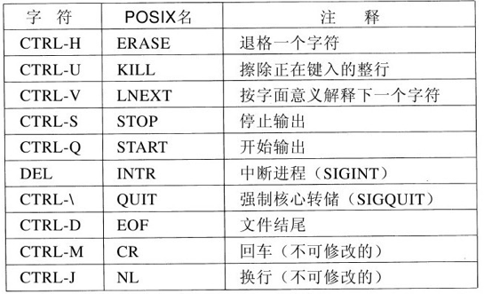

## 输入设备

------

用户输入主要来自键盘和鼠标，所以我们要了解它们。

## 键盘

-------

在个人计算机上，键盘包含一个嵌入式微处理器，该微处理器通过一个特殊的串行端口与主板上的控制芯片通信。每当一个键被按下的时候都会产生一个中断，并且每当一个键被释放的时候还会产生第二个中断。在发生每个这样的键盘中断时，键盘驱动程序都要从与键盘相关联的 `I/O` 端口提取信息，以了解发生了什么事情。其他的一切事情都是在软件中发生的，在相当大的程度上独立于硬件。

#### 键盘驱动

`I/O` 端口中的数字是键编号，称为扫描码 `scan code`，而不是 `ASCII` 码。键盘所拥有的键不超过 `128` 个，所以只需 `7` 个位表示键编号。当键按下时，第 `8` 位设置为 `0`，当键释放时，第 `8` 位设置为1。跟踪每个键的状态（按下或弹起）是驱动程序的任务。同时键盘驱动也负责将键编号转化为 `ASCII` 码并且传递个上层程序。

例如，当 `A` 键被按下时，扫描码 `30` 被写入一个 `I/O` 寄存器。驱动程序应该负责确定键入的是小写字母、大写字母、`CTRL-A`、`ALT-A`、`CTRL-ALT-A` 还是某些其他组合。由于驱动程序可以断定哪些键已经按下但是还没有被释放（例如 `SHIFT`），所以它拥有足够多的信息来做这一工作。

例如，下列两组击键序列*：

1. 按下 `SHIFT`，按下 `A`，释放 `A`，释放 `SHIFT`，指示的是大写字母 `A`;
2. 按下 `SHIFT`，按下 `A`，释放 `SHIFT`，释放 `A`，指示的也是大写字母 `A`;

尽管该键盘接口将所有的负担都加在软件上，但是却极其灵活。例如，用户程序可能对刚刚键入的一个数字是来自顶端的一排键还是来自边上的数字键盘感兴趣。原则上，驱动程序能够提供这一信息。

**工作模式**

键盘驱动程序可以采纳两种可能的处理方法。它们分别被称为原始模式 `raw mode` 和加工模式 `cooked mode`。`POSIX` 标准使用规范模式 `canonical mode` 来描述面向行的模式。非规范模式 `noncanonical mode` 与原始模式是等价的，`POSIX` 兼容的系统提供了若干库函数，支持选择这两种模式中的一种并且修改许多参数。

*字符模式(原始模式)*

在第一种处理方法中，驱动程序的工作只是接收输入并且不加修改地向上层传送。这样，从键盘读数据的程序得到的是 `ASCII` 码的原始序列。

这种处理方法非常适合于像 `vsccode` 那样的复杂屏幕编辑器的需要，它允许用户对任意字符或字符序列施加任意的动作。然而，这意味着如果用户键入的是 `dste` 而不是 `date`，为了修改错误而键入三个退格键和 `ate` ，然后是一个回车键，那么提供给用户程序的是键入的全部 `11` 个 `ASCII` 码，如下所示：

```shell
dste ← ← ← ate CR
```

但是即使键盘处于原始模式，程序也可能尚未请求输入，所以字符也必须缓冲起来以便允许用户提前键入。可以使用专用的缓冲区，或者缓冲区也可以从池中分配。前者对提前键入提出了固定的限制，后者则没有。在 `unix` 系统中如果终端有程序正在运行而用户还在键入，那么键入的内容会被缓冲，并且会在程序结束的时候在终端上回显。

> **小贴士** 虽然键盘与监视器在逻辑上是两个独立的设备，但是很多用户已经习惯于看到他们刚刚键入的字符出现在屏幕上。这个过程叫做回显 `echoing`。

*行内模式(加工模式)*

并非所有的程序都想要这么多的细节，它们常常只想要校正后的输入，而不是如何产生它的准确的序列。这一认识导致了第二种处理方法：键盘驱动程序处理全部行内编辑，并且只将校正后的行传送给用户程序。第一种处理方法是面向字符的；第二种处理方法是面向行的。如果键盘处于规范（加工）模式，则字符必须存储起来直到积累完整的一行，因为用户随后可能决定删除一行中的一部分。

**制表符**

另一个问题是制表符的处理。通常由驱动程序来计算光标当前定位在什么位置，它既要考虑程序的输出又要考虑回显的输出，并且要计算要回显的正确的空格个数。

**回车换行**

逻辑上，在一个文本行的结尾，人们需要一个回车和一个换行，回车使光标移回到第一列，换行使光标前进到下一行。要求用户在每一行的结尾键入回车和换行是不受欢迎的。这就要求驱动程序将输入转化成操作系统使用的格式。在 `UNIX` 中，`ENTER` 键被转换成一个换行用于内部存储；而在 `Windows` 中，它被转换成一个回车跟随一个换行。

如果标准形式只是存储一个换行（`UNIX` 约定），那么回车（由 `Enter` 键造成）应该转换为换行。如果内部格式是存储两者（ `Windows` 约定），那么驱动程序应该在得到回车时生成一个换行并且在得到换行时生成一个回车。

**特殊字符**

在规范模式下操作时，许多输入字符具有特殊的含义。图中显示出了 `POSIX` 要求的所有特殊字符。默认的是所有控制字符，这些控制字符应该不与程序所使用的文本输入或代码相冲突，但是除了最后两个以外所有字符都可以在程序的控制下修改。



*ERASE (CTRL + H)*

`ERASE` 字符允许用户删除刚刚键入的字符。它通常是退格符 `CTRL+H`。它并不添加到字符队列中，而是从队列中删除前一个字符。它应该被回显为三个字符的序列，即退格符、空格和退格符，以便从屏幕上删除前一个字符。

如果前一个字符是制表符，那么删除它取决于当它被键入的时候是如何处理的。如果制表符直接展开成空格，那么就需要某些额外的信息来决定后退多远。如果制表符本身被存放在输入队列中，那么就可以将其删除并且重新输出整行。在大多数系统中，退格只删除当前行上的字符，不会删除回车并且后退到前一行。

*KILL (CTRL + U)*

当用户注意到正在键入的一行的开头有一个错误时，擦除一整行并且从头再来常常比较方便。`KILL` 字符擦除一整行。大多数系统使被擦除的行从屏幕上消失。与 `ERASE` 一样，`KILL` 通常也不可能从当前行进一步回退。

*LNEXT (CTRL + V)*

`LNEXT` 字符用作一个转义字符 `escape character`。可以通过键入`CTRL+V next_key` 而按字面意义键入。看到一个 `CTRL+V` 之后，驱动程序设置一个标志，表示下一字符免除特殊处理。`LNEXT` 字符本身并不进入字符队列。

*STOP (CTRL+S)| START (CTRL+Q)*

为了让用户阻止屏幕图像滚动出视线，提供了控制码以便冻结屏幕并且之后重新开始滚动。在UNIX系统中，这些控制码分别是 `STOP (CTRL+S)`和 `START (CTRL+Q)`。它们并不被存储，只是用来设置或清除键盘数据结构中的一个标志。每当试图输出时，就检查这个标志。如果标志已设置，则不输出。通常，回显也随程序输出一起被抑制。

*INTR (DEL) | QUIT (CTRL+\)*

杀死一个正在被调试的失控程序经常是有必要的，`INTR(DEL)`和 `QUIT(CTRL+\)` 字符可以用于这一目的。在 `UNIX` 中，`DEL` 将 `SIGINT` 信号发送到从该键盘启动的所有进程。

`CTRL+\` 与 `DEL` 相类似，只是它发送的是 `SIGQUIT` 信号，如果这个信号没有被捕捉到或被忽略，则强迫进行核心转储。当敲击这些键中的任意一个键时，驱动程序应该回显一个回车和换行并且为了全新的开始而放弃累积的全部输入。`INTR` 的默认值经常是 `CTRL+C` 而不是 `DEL` ，因为许多程序针对编辑操作可互换地使用DEL与退格符。

*EOF (CTRL+D)*

另一个特殊字符是 `EOF(CTRL+D)`。在 `UNIX` 中，它使任何一个针对该终端的未完成的读请求以缓冲区中可用的任何字符来满足，即使缓冲区是空的。在一行的开头键入 `CTRL+D` 将使得程序读到0个字节，按惯例该字符被解释为文件结尾，并且使大多数程序按照它们在处理输入文件时遇到文件结尾的同样方法对其进行处理。

## 鼠标

------

大多数 `PC` 机具有一个鼠标，或者具有一个跟踪球，跟踪球不过是躺在其背部上的鼠标。一种常见类型的鼠标在内部具有一个橡皮球，该橡皮球通过鼠标底部的一个圆洞突出，当鼠标在一个粗糙表面上移动时橡皮球会随着旋转。当橡皮球旋转时，它与放置在相互垂直的滚轴上的两个橡皮滚筒相摩擦。东西方向的运动导致平行于 `y` 轴的滚轴旋转，南北方向的运动导致平行于 `x` 轴的滚轴旋转。

另一种流行的鼠标类型是光学鼠标，它在其底部装备有一个或多个发光二极管和光电探测器。早期的光学鼠标必须在特殊的鼠标垫上操作，鼠标垫上刻有矩形的网格，这样鼠标能够计数穿过的线数。现代光学鼠标在其中有图像处理芯片并且获取处于它们下方的连续的低分辨率照片，寻找从图像到图像的变化。

#### 数据返回

当鼠标在随便哪个方向移动了一个确定的最小距离，或者按钮被按下或释放时，都会有一条消息发送给计算机。最小距离大约是 `0.1mm`（尽管它可以在软件中设置）。这一单位称为一个鼠标步 `mickey`。

鼠标可能具有一个、两个或者三个按钮。某些鼠标具有滚轮，可以将额外的数据发送回计算机。无线鼠标与有线鼠标相同，区别是无线鼠标使用低功率无线电，例如使用蓝牙 `Bluetooth` 标准将数据发送回计算机，而有线鼠标是通过导线将数据发送回计算机。

发送到计算机的消息包含三个项目：`∆x`、`∆y`、按钮，即自上一次消息之后 `x` 位置的变化、自上一次消息之后 `y` 位置的变化、按钮的状态。消息的格式取决于系统和鼠标所具有的按钮的数目。通常，消息占 `3` 字节。大多数鼠标返回报告最多每秒 `40` 次，所以鼠标自上一次报告之后可能移动了多个鼠标步。

#### 双击

某些 `GUI` 区分单击与双击鼠标按钮。如果两次点击在空间上（鼠标步）足够接近，并且在时间上（毫秒）也足够接近，那么就会发出双击信号。最大的“足够接近”是软件的事情，并且这两个参数通常是用户可设置的。