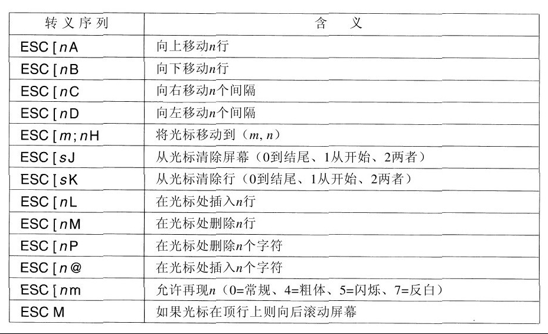

## 输出软件

-----

下面我们考虑输出软件。首先我们将讨论到文本窗口的简单输出，这是程序员通常喜欢使用的方式。然后，我们将考虑图形用户界面，这是其他用户经常喜欢使用的。

## 文本窗口

-----

当输出是连续的单一字体、大小和颜色的形式时，输出比输入简单。大体上，程序将字符发送到当前窗口，而字符在那里显示出来。通常，一个字符块或者一行是在一个系统调用中被写到窗口上的。

#### 屏幕编辑器

屏幕编辑器和许多其他复杂的程序需要能够以更加复杂的方式更新屏幕，例如在屏幕的中间替换一行。为满足这样的需要，大多数输出驱动程序支持一系列命令来移动光标，在光标处插入或者删除字符或行。这些命令常常被称为转义序列 `escape sequence`。在 `25` 行 `80` 列 `ASCII` 哑终端的全盛期，有数百种终端类型，每一种都有自己的转义序列。因而，编写在一种以上的终端类型上工作的软件是十分困难的。

一种解决方案是称为 `termcap` 的终端数据库，它是在伯克利 `UNIX` 中引入的。该软件包定义了许多基本动作，例如将光标移动到（行，列）。为了将光标移动到一个特殊的位置，软件（如一个编辑器）使用一个一般的转义序列，然后该转义序列被转换成将要被执行写操作的终端的实际转义序列。以这种方式，该编辑器就可以工作在任何具有 `termcap` 数据库入口的终端上。

逐渐地，业界看到了转义序列标准化的需要，所以就开发了一个 `ANSI` 标准。图中所示为一些该标准的取值。



下面考虑文本编辑器怎样使用这些转义序列。假设用户键入了一条命令指示编辑器完全删除第 `3` 行，然后封闭第 `2` 行和第 `4` 行之间的间隙。编辑器可以通过串行线向终端发送如下的转义序列：

```shell
ESC [3;1 H ESC [0 K ESC [1 M
```

其中在上面使用的空格只是为了分开符号，它们并不传送。这一序列将光标移动到第 `3` 行的开头，擦除整个一行，然后删除现在的空行，使从第4行开始的所有行向上移动一行。现在，第4行变成了第 `3` 行，第`5` 行变成了第 `4` 行，以此类推。类似的转义序列可以用来在显示器的中间添加文本。字和字符可以以类似的方式添加或删除。

#### 图形用户界面

大多数个人计算机提供了 `GUI`（`Graphical User Interface`，图形用户界面）。首字母缩写词 `GUI` 的发音是 `gooey`。

`GUI` 是由斯坦福研究院的 `Douglas Engelbart` 和他的研究小组发明的。之后 `GUI` 被 `Xerox PARC` 的研究人员摹仿。在一个风和日丽的日子，`Apple` 公司的共同创立者 `Steve Jobs` 参观了 `PARC`，并且在一台 `Xerox` 计算机上见到了 `GUI`。这使他产生了开发一种新型计算机的想法，这种新型计算机就是 `Apple Lisa `。`Lisa`因为太过昂贵因而在商业上是失败的，但是它的后继者 `Macintosh` 获得了巨大的成功。

`GUI` 用字符 `WIMP` 表示的四个基本要素，这些字母分别代表窗口 `Window`、图标 `Icon`、菜单 `Menu` 和定点设备 `Pointing device`。窗口是一个矩形块状的屏幕区域，用来运行程序。图标是小符号，可以在其上点击导致某个动作发生。菜单是动作列表，人们可以从中进行选择。最后，定点设备是鼠标、跟踪球或者其他硬件设备，用来在屏幕上移动光标以便选择项目。

`GUI` 软件可以在用户级代码中实现（如 `UNIX` 系统所做的那样），也可以在操作系统中实现（如 `Windows` 的情况）。

**图像适配器**

`GUI` 系统的输入仍然使用键盘和鼠标，但是输出几乎总是送往特殊的硬件电路板，称为图形适配器 `graphics adapter`。图形适配器包含特殊的内存，称为视频 `RAM（video RAM）`，它保存出现在屏幕上的图像。高端的图形适配器通常具有强大的 `32` 位或 `64` 位 `CPU` 和多达 `1GB` 自己的 `RAM`，独立于计算机的主存。

每个图形适配器支持几种屏幕尺寸。常见的尺寸是 `1024×768`、`1280×960`、`1600×1200` 和 `1920×1200`。除了 `1920×1200` 以外，所有这些尺寸的宽高比都是 `4:3`，符合 `NTSC` 和 `PAL` 电视机的屏幕宽高比，因此可以在用于电视机的相同的监视器上产生正方形的像素。`1920×1200` 尺寸意在用于宽屏监视器，它的宽高比与这一分辨率相匹配。在最高的分辨率下，每个像素具有 `24` 位的彩色显示，只是保存图像就需要大约 `6.5MB` 的 `RAM`，所以，拥有 `256MB` 或更多的 `RAM`，图形适配器就能够一次保存许多图像。如果整个屏幕每秒刷新 `75` 次，那么视频 `RAM` 必须能够连续地以每秒 `489MB` 的速率发送数据。

