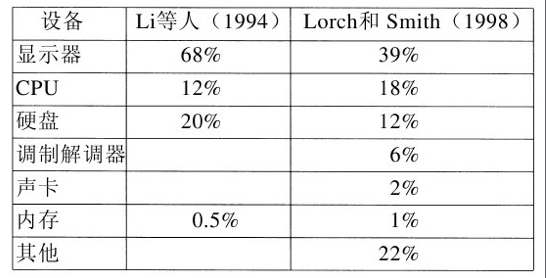
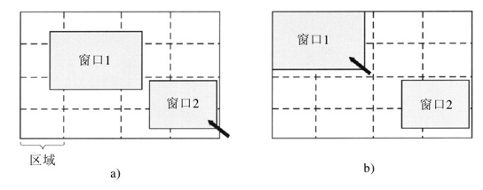

## 电源管理

-------

我们从桌面 `PC` 开始讨论。桌面 `PC` 通常具有 `200` 瓦的电源（其效率一般是 `85%`，`15%` 进来的能量损失为热量）。如果全世界 `l` 亿台这样的机器同时开机，合起来它们要用掉 `20 000` 兆瓦的电力。这是 `20` 座中等规模的核电站的总产出。如果电力需求能够削减一半，我们就可以削减 `10` 座核电站。从环保的角度看，削减 `10` 座核电站是一个巨大的胜利，非常值得追求。

另一个要着重考虑电源的场合是电池供电的计算机，包括笔记本电脑、掌上机以及 `Web` 便笺簿等。问题的核心是电池不能保存足够的电荷以持续非常长的时间，至多也就是几个小时。此外，尽管电池公司、计算机公司和消费性电子产品公司进行了巨大的研究努力，但进展仍然缓慢。对于一个已经习惯于每 `18` 个月性能翻一番（摩尔定律）的产业来说，毫无进展就像是违背了物理定律，但这就是现状。因此，使计算机使用较少的能量因而现有的电池能够持续更长的时间就高悬在每个人的议事日程之上。操作系统在这里扮演着主要的角色，我们将在下面看到这一点。

存在两种减少能量消耗的一般方法。第一种方法是当计算机的某些部件（主要是 `I/O` 设备）不用的时候由操作系统关闭它们，因为关闭的设备使用的能量很少或者不使用能量。第二种方法是应用程序使用较少的能量，这样为了延长电池时间可能会降低用户体验的质量。我们将依次看一看这些方法，但是首先就电源使用方面谈一谈硬件设计。

#### 硬件问题

电池一般分为两种类型：一次性使用的和可再充电的。一次性使用的电池（AAA、AA与D电池）可以用来运转掌上设备，但是没有足够的能量为具有大面积发光屏幕的笔记本电脑供电。相反，可再充电的电池能够存储足够的能量为笔记本电脑供电几个小时。在可再充电的电池中，镍镉电池曾经占据主导地位，但是它们后来让位给了镍氢电池，镍氢电池持续的时间更长并且当它们最后被抛弃时不如镍镉电池污染环境那么严重。锂电池更好一些，并且不需要首先完全耗尽就可以再充电，但是它们的容量同样非常有限。

大多数计算机厂商对于电池节约采取的一般措施是将CPU、内存以及 `I/O` 设备设计成具有多种状态：工作、睡眠、休眠和关闭。要使用设备，它必须处于工作状态。当设备在短时间内暂时不使用时，可以将其置于睡眠状态，这样可以减少能量消耗。当设备在一个较长的时间间隔内不使用时，可以将其置于休眠状态，这样可以进一步减少能量消耗。这里的权衡是，使一个设备脱离休眠状态常常比使一个设备脱离睡眠状态花费更多的时间和能量。最后，当一个设备关闭时，它什么事情也不做并且也不消耗电能。并非所有的设备都具有这些状态，但是当它们具有这些状态时，应该由操作系统在正确的时机管理状态的变迁。

某些计算机具有两个甚至三个电源按钮。这些按钮之一可以将整个计算机置于睡眠状态，通过键入一个字符或者移动鼠标，能够从该状态快速地唤醒计算机。另一个按钮可以将计算机置于休眠状态，从该状态唤醒计算机花费的时间要长得多。在这两种情况下，这些按钮通常除了发送一个信号给操作系统外什么也不做，剩下的事情由操作系统在软件中处理。

许多研究人员研究了笔记本电脑以了解电能的去向。这些结论清楚地说明能量吸收的前三名依次是显示器、硬盘和 `CPU`。可能因为测量的不同品牌的计算机确实具有不同的能量需求，这些数字并不紧密地吻合，但是很显然，显示器、硬盘和 `CPU` 是节约能量的目标。

#### 操作系统问题

操作系统在能量管理上扮演着一个重要的角色，它控制着所有的设备，所以它必须决定关闭什么设备以及何时关闭。如果它关闭了一个设备并且该设备很快再次被用户需要，可能在设备重启时存在恼人的延迟。另一方面，如果它等待了太长的时间才关闭设备，能量就白白地浪费了。

这里的技巧是找到算法和试探法，让操作系统对关于关闭什么设备以及何时关闭能够作出良好的决策。问题是“良好”是高度主观的。一个用户可能觉得在 `30s` 未使用计算机之后计算机要花费 `2s` 的时间响应击键是可以接受的。另一个用户在相同的条件下可能会发出一连串的咒骂。

**显示器**

为了获得明亮而清晰的图像，屏幕必须是背光照明的，这样会消耗大量的能量。许多操作系统试图通过当几分钟的时间没有活动时关闭显示器而节省能量。关闭显示器是一个睡眠状态，因为当任意键被敲击或者定点设备移动时，它能够（从视频 `RAM`）即时地再生。

`Flinn` 提出了一种可能的改进。他们建议让显示器由若干数目的区域组成，这些区域能够独立地开启和关闭。在图中，我们描述了 `16` 个区域，使用虚线分开它们。当光标在窗口 `2` 中的时候，如图 `a` 所示，只有右下角的 `4` 个区域必须点亮。其他 `12` 个区域可以是黑暗的，节省了 `3/4` 的屏幕功耗。

**硬盘**

