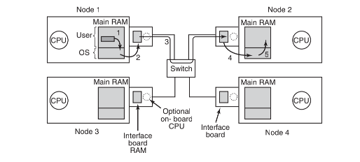

## 多计算机系统

--------

多处理机流行和有吸引力的原因是，它们提供了一个简单的通信模型：所有 `CPU` 共享一个公用存储器。进程可以向存储器写消息，然后被其他进程读取。可以使用互斥信号量、信号量、管程 `monitor` 和其他适合的技术实现同步。惟一美中不足的是，大型多处理机构造困难，因而造价高昂。

为了解决这个问题，人们在多计算机 `multicomputers` 领域中进行了很多研究。多计算机是紧耦合 `CPU`，不共享存储器。每台计算机有自己的存储器，如图 `8-1b` 所示。众所周知，这些系统有各种其他的名称，如机群计算机 `（cluster computers）`。

多计算机容易构造，因为其基本部件只是一台配有高性能网络接口卡的 `PC` 裸机。当然，获得高性能的秘密是巧妙地设计互连网络以及接口卡。这个问题与在一台多处理机中构造共享存储器是完全类似的。但是，由于目标是在微秒 `microsecond` 数量级上发送消息，而不是在纳秒（nanosecond）数量级上访问存储器，所以这是一个相对简单、便宜且容易实现的任务。

在下面几节中，我们将首先简要地介绍多计算机硬件，特别是互连硬件。然后，我们将讨论软件，从低层通信软件开始，接着是高层通信软件。我们还将讨论在没有共享存储器的系统中实现共享存储器的方法。

## 多计算机硬件

-----

一台多计算机的基本节点包括一个 `CPU`、存储器、一个网络接口，有时还有一个硬盘。节点可以封装在标准的 `PC` 机箱中，不过通常没有图像适配卡、显示器、键盘和鼠标等。在某些情况下，`PC` 机中有一块 `2` 通道或 `4` 通道的多处理机主板，可能带有双核或者四核芯片而不是单个 `CPU`，不过为了简化问题，我们假设每个节点有一个 `CPU`。通常成百个甚至上千个节点连接在一起组成一个多计算机。下面我们将介绍一些关于硬件如何组织的内容。

#### 互连技术

**拓扑结构**

在每个节点上有一块网卡，带有一根或两根从网卡上接出的电缆（或光纤）。这些电缆或者连到其他的节点上，或者连到交换机上。在小型系统中，可能会有一个按照图 `a` 的星型拓扑结构连接所有节点的的交换机。现代交换型以太网就采用了这种拓扑结构。

作为单一交换机设计的另一种选择，节点可以组成一个环，有两根线从网络接口卡上出来，一根去连接左面的节点，另一根去连接右面的节点，如图 `b` 所示。在这种拓扑结构中不需要交换机，所以图中也没有。

图 `c` 中的网格 `grid` 是一种在许多商业系统中应用的二维设计。它相当规整，而且容易扩展为大规模系统。这种系统有一个直径 `diameter`，即在任意两个节点之间的最长路径，并且该值只按照节点数目的平方根增加。网格的变种是双凸面 `double torus`，如图8-16d所示，这是一种边连通的网格。这种拓扑结构不仅较网格具有更强的容错能力而且其直径也比较小，因为对角之间的通信只需要两跳。

图 `e` 中的立方体 `cube` 是一种规则的三维拓扑结构。我们展示的是 `2×2×2` 立方体，更一般的情形则是 `k×k×k` 立方体。在图 `f` 中，是一种用两个三维立方体加上对应边连接所组成四维立方体。我们可以仿照图 `f` 的结构并且连接对应的节点以组成四个立方体组块来制作五维立方体。为了实现六维，可以复制四个立方体的块并把对应节点互连起来，以此类推。以这种形式组成的 `n` 维立方体称为超立方体`hypercube`。许多并行计算机采用这种拓扑结构，因为其直径随着维数的增加线性增长。换句话说，直径是节点数的自然对数，例如，一个 `10` 维的超立方体有 `1024` 个节点，但是其直径仅为 `10`，有着出色的延迟特性。注意，与之相反的是，`1024` 的节点如果按照 `32×32` 网格布局则其直径为 `62`，较超立方体相差了六倍多。

对于超立方体而言，获得较小直径的代价是扇出数量 `fanout` 以及由此而来的连接数量（及成本）的大量增加。


**交换机制**

在多计算机中可采用两种交换机制。在第一种机制里，每个消息首先被分解（由用户软件或网络接口进行）成为有最大长度限制的块，称为包 `packet`。该交换机制称为存储转发包交换 `store-and-forward packet switching`，由源节点的网络接口卡注入到第一个交换机的包组成，如图 `a` 所示。比特串一次进来一位，当整个包到达一个输入缓冲区时，它被复制到沿着其路径通向下一个交换机的队列当中，如图 `b` 所示。当包到达目标节点所连接的交换机时，如图 `c` 所示，该包被复制进入目标节点的网络接口卡，并最终到达其 `RAM`。


尽管存储转发包交换灵活且有效，但是它存在通过互连网络时增加时延（延迟）的问题。假设在图中把一个包传送一跳所花费的时间为 `T` 纳秒。为了从 `CPU 1` 到 `CPU 2`，该包必须被复制四次（至 `A` 、至`C`、至 `D` 以及到目标 `CPU`），而且在前一个包完成之前，不能开始有关的复制，所以通过该互连网络的时延是 `4T`。一条出路是设计一个网络，其中的包可以逻辑地划分为更小的单元。只要第一个单元到达一个交换机，它就被转发到下一个交换机，甚至可以在包的结尾到达之前进行。可以想象，这个传送单元可以小到 `1` 比特。

另一种交换机制是电路交换 `circuit switching`，它包括由第一个交换机建立的，通过所有交换机而到达目标交换机的一条路径。一旦该路径建立起来，比特流就从源到目的地通过整个路径不断地尽快输送。在所涉及的交换机中，没有中间缓冲。电路交换需要有一个建立阶段，它需要一点时间，但是一旦建立完成，速度就很快。在包发送完毕之后，该路径必须被拆除。电路交换的一种变种称为虫孔路由 `wormhole routing`，它把每个包拆成子包，并允许第一个子包在整个路径还没有完全建立之前就开始流动。

#### 网络接口

在多计算机中，所有节点里都有一块插卡板，它包含节点与互连网络的连接，这使得多计算机连成一体。

**RAM**

接口板上都有一些用来存储进出包的`RAM`。通常，在包被传送到第一个交换机之前，这个要送出的包必须被复制到接口板的`RAM`中。这样设计的原因是许多互连网络是同步的，所以一旦一个包的传送开始，比特流必须以恒定的速率连续进行。如果包在主`RAM`中，由于内存总线上有其他的信息流，所以这个送到网络上的连续流是不能保证的。在接口板上使用专门的`RAM`，就消除了这个问题。



同样的问题还出现在接收进来的包上。从网络上到达的比特流速率是恒定的，并且经常有非常高的速率。如果网络接口卡不能在它们到达的时候实时存储它们，数据将会丢失。同样，在这里试图通过系统总线（例如`PCI`总线）到达主`RAM`是非常危险的。由于网卡通常插在`PCI`总线上，这是一个惟一的通向主`RAM`的连接，所以不可避免地要同磁盘以及每个其他的`I/O`设备竞争总线。而把进来的包首先保存在接口板的私有`RAM`中，然后再把它们复制到主`RAM`中，则更安全些。

**DMA**

接口板上可以有一个或多个`DMA`通道，甚至在板上有一个完整的`CPU`（乃至多个`CPU`）。通过请求在系统总线上的块传送（`block transfer`），`DMA`通道可以在接口板和主`RAM`之间以非常高的速率复制包，因而可以一次性传送若干字而不需要为每个字分别请求总线。不过，准确地说，正是这种块传送（它占用了系统总线的多个总线周期）使接口板上的`RAM`的需要是第一位的。

很多接口板上有一个完整的`CPU`，可能另外还有一个或多个`DMA`通道。它们被称为网络处理器（`network processor`），并且其功能日趋强大。这种设计意味着主`CPU`将一些工作分给了网卡，诸如处理可靠的传送（如果底层的硬件会丢包）、多播（将包发送到多于一个的目的地）、压缩/解压缩、加密/解密以及在多进程系统中处理安全事务等。但是，有两个`CPU`则意味着它们必须同步，以避免竞争条件的发生，这将增加额外的开销，并且对于操作系统来说意味着要承担更多的工作。

#### 低层通信软件

**过度的复制**

在多计算机系统中高性能通信的敌人是对包的过度复制。在最好的情形下，在源节点会有从 `RAM` 到接口板的一次复制，从源接口板到目的接口板的一次复制（如果在路径上没有存储和转发发生）以及从目的接口板再到目的地 `RAM` 的一次复制，这样一共有三次复制。

*1.内核空间映射*

如果接口板被映射到内核虚拟地址空间中而不是用户虚拟地址空间的话，用户进程只能通过发出一个陷入到内核的系统调用的方式来发送包。内核会同时在输入和输出时把包复制到自己的存储空间去，从而在传送到网络上时避免出现缺页异常（`page fault`）。同样，接收包的内核在有机会检查包之前，可能也不知道应该把进来的包放置到哪里。这个时候复制的次数会从 `3` 变为 `5`，上述五个复制步骤如图所示。


*2.用户空间映射*

如果说进出`RAM`的复制是性能瓶颈，那么进出内核的额外复制会将端到端的延迟加倍，并把吞吐量（`throughput`）降低一半。为了避免这种对性能的影响，不少多计算机把接口板映射到用户空间，并允许用户进程直接把包送到卡上，而不需要内核的参与。尽管这种处理确实改善了性能，但却带来了两个问题。

首先，如果在节点上有若干个进程运行而且需要访问网络以发送包，该怎么办？哪一个进程应该在其地址空间中获得接口板呢？映射拥有一个系统调用将接口板映射进出一个虚拟地址空间，其代价是很高的，但是，如果只有一个进程获得了卡，那么其他进程该如何发送包呢？如果网卡被映射进了进程A的虚拟地址空间，而所到达的包却是进程 `B` 的，又该怎么办?

一个解决方案是，把接口板映射到所有需要它的进程中去，但是这样做就需要有一个机制用以避免竞争。例如，如果`A`申明接口板上的一个缓冲区，而由于时间片，`B`开始运行并且申明同一个缓冲区，那么就会发生灾难。需要有某种同步机制，但是那些诸如互斥信号量（`mutex`）一类的机制需要在进程会彼此协作的前提下才能工作。

从这里得到的结论是，对于将接口板映射到用户空间的方案，只有在每个节点上只有一个用户进程运行时才能够发挥作用，否则必须设置专门的预防机制（例如，对不同的进程可以把接口板上 `RAM` 的不同部分映射到各自的地址空间）。

**多队列网卡**

较新的网络接口通常都是多队列的，这意味着他们有多个缓冲区可以有效地支持多个用户，如 `Intel I350` 系列有 `8` 个接收队列和 `8` 个发送队列，可以虚拟化为许多虚拟端口。这种网卡可以通过自己的散列逻辑将数据包引导到合适的进程 (根据 `TCP` 的 `IP` 地址和端口号)

**内核与用户**

第二个问题是，内核本身会经常需要访问互连网络，例如，访问远程节点上的文件系统。如果考虑让内核与任何用户共享同一块接口板，即便是基于分时方式，也不是一个好主意。假设当板被映射到用户空间，收到了一个内核的包，那么怎么办？或者若某个用户进程向一个伪装成内核的远程机器发送了一个包，又该怎么办？结论是，最简单的设计是使用两块网络接口板，一块映射到用户空间供应用程序使用，另一块映射到内核空间供操作系统使用。许多多计算机就正是这样做的。

**如何复制**

下一个问题是如何将包送到接口板上。最快的方法是使用板上的`DMA`芯片直接将它们从`RAM`复制到板上。这种方式的问题是，`DMA`使用物理地址而不是虚拟地址，并且独立于`CPU`运行。首先，尽管一个用户进程肯定知道它打算发送的任何包所在的虚拟地址，但它通常不知道有关的物理地址。设计一个系统调用进行虚拟地址到物理地址的映射是不可取的，因为把接口板放到用户空间的首要原因就是为了避免不得不为每个要发送的包进行一次系统调用。

另外，如果操作系统决定替换一个页面，而`DMA`芯片正在从该页面复制一个包，就会传送错误的数据。然而更加糟糕的是，如果操作系统在替换某一个页面的同时`DMA`芯片正在把一个包复制进该页面，结果不仅进来的包会丢失，无辜的存储器页面也会被毁坏。

为了以避免上述问题，可采用一类将页面钉住和释放的系统调用，把有关页面标记成暂时不可交换的。但是不仅需要有一个系统调用钉住含有每个输出包的页面，还要有另一个系统调用进行释放工作，这样做的代价太大。如果包很小，比如`64`字节或更小，就不能忍受钉住和释放每个缓冲区的开销。对于大的包，比如说`1KB`或更大，也许会容忍相关开销。对于大小在这两者之间的包，就要取决于硬件的具体情况了。除了会对性能带来影响，钉住和释放页面将会增加软件的复杂性。

#### 用户层通信软件

在多计算机中，不同 `CPU` 上的进程通过互相发送消息实现通信。在最简单的情况下，这种消息传送是暴露给用户进程的。换句话说，操作系统提供了一种发送和接收消息的途径，而库过程使得这些低层的调用对用户进程可用。

**发送和接收**

在最简化的的情形下，所提供的通信服务可以减少到两个（库）调用，一个用于发送消息，另一个用于接收消息。发送一条消息的调用可能是：

```go
send(dest,＆mptr);
```

而接收消息的调用可能是

```go
receive(addr,＆mptr);
```

前者把由`mptr`参数所指向的消息发送给由`dest`参数所标识的进程，并且引起对调用者的阻塞，直到该消息被发出。后者引起对调用者的阻塞，直到消息到达。该消息到达后，被复制到由`mptr`参数所指向的缓冲区，并且撤销对调用者的阻塞。`addr`参数指定了接收者要监听的地址。这两个过程及其参数有许多可能的变种。

**阻塞调用和非阻塞调用**

*1.阻塞调用*

上面所叙述的调用是阻塞调用（有时称为同步调用）。当一个进程调用`send`时，它指定一个目标以及用以发送消息到该目标的一个缓冲区。当消息发送时，发送进程被阻塞（挂起）。在消息已经完全发送出去之前，不会执行跟随在调用`send`后面的指令，如图`8-19a`所示。类似地，在消息真正接收并且放入由参数指定的消息缓冲区之前，对`receive`的调用也不会把控制返回。在`receive`中进程保持挂起状态，直到消息到达为止，这甚至有可能等待若干小时。在有些系统中，接收者可以指定希望从谁处接收消息，在这种情况下接收者就保持阻塞状态，直到来自那个发送者的消息到达为止。

*2.非阻塞调用*

相对于阻塞调用的另一种方式是非阻塞调用（有时称为异步调用）。如果`send`是非阻塞的，在消息发出之前，它立即将控制返回给调用者。这种机制的优点是发送进程可以继续运算，与消息传送并行，而不是让`CPU`空闲（假设没有其他可运行的进程）。


但是，非阻塞原语所提供的性能优点被其严重的缺点所抵消了：直到消息被送出发送者才能修改消息缓冲区。进程在传输过程中重写消息的后果是如此可怕以致不得不慎重考虑。发送进程不知道传输何时会结束，所以根本不知道什么时候重用缓冲区是安全的。不可能永远避免再碰缓冲区。

有三种可能的解决方案。第一种方案是，让内核复制这个消息到内部的内核缓冲区，然后让进程继续，如图`b`所示。从发送者的观点来看，这个机制与阻塞调用相同：只要进程获得控制，就可以随意重用缓冲区了。当然，消息还没有发送出去，但是发送者是不会被这种情况所妨碍的。这个方案的缺点是对每个送出的消息都必须将其从用户空间复制进内核空间。面对大量的网络接口，消息最终要复制进硬件的传输缓冲区中，所以第一次的复制实质上是浪费。额外的复制会明显地降低系统的性能。

第二种方案是，当消息发送之后中断发送者，告知缓冲区又可以使用了。这里不需要复制。从而节省了时间，但是用户级中断使编写程序变得棘手，并可能会要处理竞争条件，这些都使得该方案难以设计并且几乎无法调试。

第三种方案是，让缓冲区写时复制（`copy on write`），也就是说，在消息发送出去之前将其标记为只读。在消息发送出去之前，如果缓冲区被重用，则进行复制。这个方案的问题是，除非缓冲区被孤立在自己的页面上，否则对临近变量的写操作也会导致复制。此外，需要有额外的管理，因为这样的发送消息行为隐含着对页面读/写状态的影响。最后，该页面迟早会再次被写入，它会触发一次不再必要的复制。

这样，在发送端的选择是

1. 阻塞发送（`CPU` 在消息传输期间空闲）。
2. 带有复制操作的非阻塞发送（`CPU` 时间浪费在额外的复制上）。
3. 带有中断操作的非阻塞发送（造成编程困难）。
4. 写时复制（最终可能也会需要额外的复制）。

正如 `send` 可以是阻塞的和非阻塞的一样，`receive` 也同样可以是阻塞的和非阻塞的。阻塞调用就是挂起调用者直到消息到达为止。如果有多线程可用，这是一种简单的方法。另外，非阻塞 `receive` 只是通知内核缓冲区所在的位置，并几乎立即返回控制。可以使用中断来告知消息已经到达。然而，中断方式编程困难，并且速度很慢，所以也许对于接收者来说，更好的方法是使用一个过程`poll`轮询进来的消息。该过程报告是否有消息正在等待。若是，调用者可调用`get`_`message`，它返回第一个到达的消息。在有些系统中，编译器可以在代码中合适的地方插入`poll`调用，不过，要掌握以怎样的频度使用`poll`则是需要技巧的。

还有另一个选择，其机制是在接收者进程的地址空间中，一个消息的到达自然地引起一个新线程的创建。这样的线程称为弹出式线程（`pop-up thread`）。这个线程运行一个预定义的过程，其参数是一个指向进来消息的指针。在处理完这个消息之后，该线程直接退出并被自动撤销。

#### 远程过程调用

尽管消息传递模型提供了一种构造多计算机操作系统的便利方式，但是它有不可救药的缺陷：构造所有通信的范型（`paradigm`）都是输入/输出。过程`send`和`receive`基本上在做`I/O`工作，而许多人认为`I/O`就是一种错误的编程模型。

这个问题很早就为人所知，但是一直没有什么进展，直到``Birrell``和``Nelson``在其论文（``Birrell``和``Nelson``，``1984``）中引进了一种完全不同的方法来解决这个问题。尽管其思想是令人吃惊的简单，但其含义却相当精妙。

简言之，``Birrell``和``Nelson``所建议的是，允许程序调用位于其他``CPU``中的过程。当机器``1``的进程调用机器``2``的过程时，在机器``1``中的调用进程被挂起，在机器``2``中被调用的过程执行。可以在参数中传递从调用者到被调用者的信息，并且可在过程的处理结果中返回信息。根本不存在对程序员可见的消息传递或``I/O``。这种技术即是所谓的远程过程调用（``Remote Procedure Call``，``RPC``），并且已经成为大量多计算机的软件的基础。习惯上，称发出调用的过程为客户机，而称被调用的过程为服务器。

`RPC`背后的思想是尽可能使远程过程调用像本地调用。在最简单的情形下，要调用一个远程过程，客户程序必须被绑定在一个称为客户端桩（`client stub`）的小型库过程上，它在客户机地址空间中代表服务器过程。类似地，服务器程序也绑定在一个称为服务器端桩（`server stub`）的过程上。这些过程隐藏了这样一个事实，即从客户机到服务器的过程调用并不是本地调用。


进行`RPC`的实际步骤如图`8-20`所示。第`1`步是客户机调用客户端桩。该调用是一个本地调用，其参数以通常方式压入栈内。第`2`步是客户端桩将有关参数打包成一条消息，并进行系统调用来发出该消息。这个将参数打包的过程称为编排（`marshaling`）。第`3`步是内核将该消息从客户机发给服务器。第`4`步是内核将接收进来的消息传送给服务器端桩（通常服务器端桩已经提前调用了`receive`）。最后，第`5`步是服务器端桩调用服务器过程。应答则是在相反的方向沿着同一步骤进行。

这里需要说明的关键是由用户编写的客户机过程，只进行对客户端桩的正常（本地）调用，而客户端桩与服务器过程同名。由于客户机过程和客户端桩在同一个地址空间，所以有关参数以正常方式传递。类似地，服务器过程由其所在的地址空间中的一个过程用它所期望的参数进行调用。对服务器过程而言，一切都很正常。通过这种方式，不采用带有`send`和`receive`的`I/O`，通过伪造一个普通的过程调用而实现了远程通信。

**实现相关的问题**

无论`RPC`的概念是如何优雅，但是“在草丛中仍然有几条蛇隐藏着”。

*指针的传递*

一大条就是有关指针参数的使用。通常，给过程传递一个指针是不存在问题的。由于两个过程都在同一个虚拟地址空间中，所以被调用的过程可以使用和调用者同样的方式来运用指针。但是，由于客户机和服务器在不同的地址空间中，所以用`RPC`传递指针是不可能的。

在某些情形下，可以使用一些技巧使得传递指针成为可能。假设第一个参数是一个指针，它指向一个整数`k`。客户端桩可以编排`k`并把它发送给服务器。然后服务器端桩创建一个指向`k`的指针并把它传递给服务器过程，这正如服务器所期望的一样。当服务器过程把控制返回给服务器端桩后，后者把`k`送回客户机，这里新的`k`覆盖了原来旧的，只是因为服务器修改了它。实际上，通过引用调用（`call-by-reference`）的标准调用序列被复制-恢复（`copy-restore`）所替代了。然而不幸的是，这个技巧并不是总能正常工作的，例如，如果要把指针指向一幅图像或其他的复杂数据结构就不行。由于这个原因，对于被远程调用的过程而言，必须对参数做出某些限制。

*弱类型*

第二个问题是，对于弱类型的语言，如`C`语言，编写一个过程用于计算两个矢量（数组）的内积且不规定其任何一个矢量的大小，这是完全合法的。每个矢量可以由一个指定的值所终止，而只有调用者和被调用的过程掌握该值。在这样的条件下，对于客户端桩而言，基本上没有可能对这种参数进行编排：没有办法能确定它们有多大。

*泛型*

第三个问题是，参数的类型并不总是能够推导出的，甚至不论是从形式化规约还是从代码自身。这方面的一个例子是`printf`，其参数的数量可以是任意的（至少一个），而且它们的类型可以是整形、短整形、长整形、字符、字符串、各种长度的浮点数以及其他类型的任意混合。试图把`printf`作为远程过程调用实际上是不可能的，因为`C`是如此的宽松。

*全局变量*

第四个问题与使用全局变量有关。通常，调用者和被调用过程除了使用参数之外，还可以通过全局变量通信。如果被调用过程此刻被移到远程机器上，代码将失效，因为全局变量不再是共享的了。
