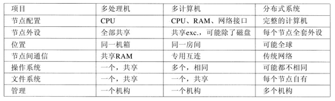
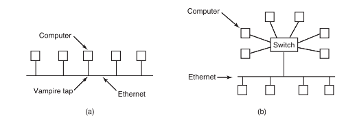
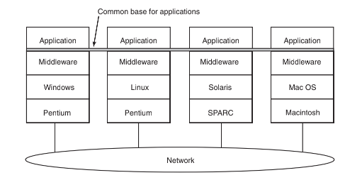
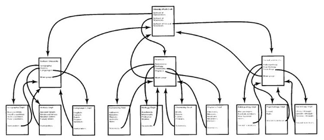
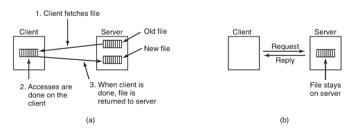
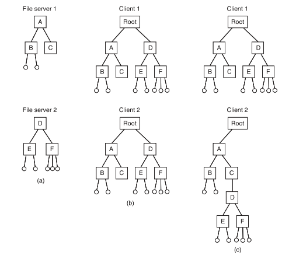
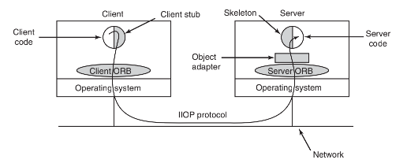
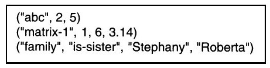
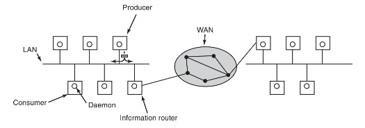

## 分布式系统

--------

到此为止有关多处理机、多计算机和虚拟机的讨论就结束了，现在应该转向最后一种多处理机系统，即分布式系统 `distributed system`。这些系统与多计算机类似，每个节点都有自己的私有存储器，整个系统中没有共享的物理存储器。但是，分布式系统与多计算机相比，耦合更加松散。

首先，一台多计算机的节点通常有`CPU`、`RAM`、网卡，可能还有用于分页的硬盘。与之相反，分布式系统中的每个节点都是一台完整的计算机，带有全部的外部设备。

其次，一台多计算机的所有节点一般就在一个房间里，这样它们可以通过专门的高速网络通信，而分布式系统中的节点则可能分散在全世界范围内。

最后，一台多计算机的所有节点运行同样的操作系统，共享一个文件系统，并处在一个共同的管理之下，而一个分布式系统的节点可以运行不同的操作系统，每个节点有自己的文件系统，并且处在不同的管理之下。

一个典型的多计算机的例子如一个公司或一所大学的一个房间中用于诸如药物建模等工作的`512`个节点，而一个典型的分布式系统包括了通过`Internet`松散协作的上千台机器。在图中，对多处理机、多计算机和分布式系统就上述各点进行了比较。

在某种程度上，分布式系统中计算机的松散耦合既是优点又是缺点。它之所以是优点，是因为这些计算机可用在各种类型的应用之中，但它也是缺点，因为它由于缺少共同的底层模型而使得这些应用程序很难编程实现。

分布式系统添加在其底层网络上的是一些通用范型（模型），它们提供了一种统一的方法来观察整个系统。分布式系统想要做的是，将松散连接的大量机器转化为基于一种概念的一致系统。这些范型有的比较简单，而有的是很复杂的，但是其思想则总是提供某些东西用来统一整个系统。

## 网络硬件

------

分布式系统构建在计算机网络的上层，所以有必要对计算机网络这个主题做个简要的介绍。网络主要有两种，覆盖一座建筑物或一个校园的`LAN`（局域网，`Local Area Networks`）和可用于城市、乡村甚至世界范围的`WAN`（广域网，`Wide Area Network`）。最重要的`LAN`类型是以太网（`Ethernet`），所以我们把它作为`LAN`的范例来考察。至于`WAN`的例子，我们将考察`Internet`，尽管在技术上`Internet`不是一个网络，而是上千个分离网络的联邦。但是，就我们的目标而言，把`Internet`视为一个`WAN`就足够了。

#### 以太网 `Ethernet`

经典的以太网，在`IEEE802.3`标准中有具体描述，由用来连接若干计算机的同轴电缆组成。这些电缆之所以称为以太网（`Ethernet`），是源于发光以太，人们曾经认为电磁辐射是通过以太传播的。（`19`世纪英国物理学家`James Clerk Maxwell`发现了电磁辐射可用一个波动方程描述，那时科学家们假设空中必须充满了某些以太介质，而电磁辐射则在该以太介质中传播。

在以太网的非常早的第一个版本中，计算机与钻了半截孔的电缆通过一端固定在这些孔中而另一端与计算机连接的电线相连接。它们被称为插入式分接头（`vampire tap`），如图`8-31a`中所示。可是这种接头很难接正确，所以没过多久，就换用更合适的接头了。无论怎样，从电气上来看，所有的计算机都被连接起来，在网络接口卡上的电缆仿佛是被焊上一样。

要在以太网上发送包，计算机首先要侦听电缆，看看是否有其他的计算机正在进行传输。如果没有，这台计算机便开始传送一个包，其中有一个短包头，随后是`0`到`1500`字节的有效信息载荷（`payload`）。如果电缆正在使用中，计算机只是等待直到当前的传输结束，接着该台计算机开始发送。

如果两台计算机同时开始发送，就会导致冲突发生，两台机器都做检测。两机都用中断其传输来响应检测到的碰撞，然后在等待一个从`0`到`T`微秒的随机时间段之后，再重新开始。如果再一次冲突发生，所有碰撞的计算机进入`0`到`2T`微秒的随机等待。然后再尝试。在每个后续的冲突中，最大等待间隔加倍，用以减少更多碰撞的机会。这个算法称为二进制指数补偿算法（`binary exponential backoff`）。在前面有关减少锁的轮询开销中，我们曾介绍过这种算法。

以太网有其最大电缆长度限制，以及可连接的最多的计算机台数限制。要想超过其中一个的限制，就要在一座大建筑物或校园中连接多个以太网，然后用一种称为桥接器（`bridge`）的设备把这些以太网连接起来。接器允许信息从一个以太网传递到另一个以太网，而源在桥接器的一边，目的地在桥接器的另一边。

为了避免碰撞问题，现代以太网使用交换机（`switch`），如图`8-31b`所示。每个交换机有若干个端口，一个端口用于连接一台计算机、一个以太网或另一个交换机。当一个包成功地避开所有的碰撞并到达交换机时，它被缓存在交换机中并送往另一个通往目的地机器的端口。若能忍受较大的交换机成本，可以使每台机器都拥有自己的端口，从而消除掉所有的碰撞。作为一种妥协方案，在每个端口上连接少量的计算机还是有可能的。在图 `b` 中，一个经典的由多个计算机组成以太网连接到交换机的一个端口中，这个以太网中的计算机通过插入式分接头连接在电缆上。

#### 因特网

`Internet`由`ARPANET`（美国国防部高级研究项目署资助的一个实验性的分组交换网络）演化而来。它自`1969`年`12`月起开始运行，由三台在加州的计算机和一台在犹他州的计算机组成。当时正值冷战的顶峰时期，它被设计为一个高度容错的网络，在核弹直接击中网络的多个部分时，该网络将能够通过自动改换已死亡机器周边的路由，继续保持军事通信的中继。

`ARPANET`在`20`世纪`70`年代迅速地成长，结果拥有了上百台计算机。接着，一个分组无线网络、一个卫星网络以及成千的以太网都联在了该网络上，从而变成为网络的联邦，即我们今天所看到的`Internet`。

`Internet`包括了两类计算机，主机和路由器。主机（`host`）有 `PC` 机、笔记本计算机、掌上电脑，服务器、大型计算机以及其他那些个人或公司所有且希望与`Internet`连接的计算机。路由器（`router`）是专用的交换计算机，它在许多进线中的一条线上接收进来的包，并在许多个出口线中的一条线上按照其路径发送包。路由器类似于图`8-31b`中的交换机，但是路由器与这种交换机也是有差别的，这些差别就不在这里讨论了。在大型网络中，路由器互相连接，每台路由器都通过线缆或光缆连接到其他的路由器或主机上。电话公司和互联网服务提供商（`Internet Service Providers`，`ISP`）为其客户运行大型的全国性或全球性路由器网络。

图中展示了`Internet`的一部分。在图的顶部是其主干网（`backbone`）之一，通常由主干网操作员管理。它包括了大量通过宽带光纤连接的路由器，同时连接着其他（竞争）电话公司运行管理的主干网。除了电话公司为维护和测试所需运行的机器之外，通常没有主机直接联在主干网上。

地区网络和`ISP`的路由器通过中等速度的光纤连接到主干网上。依次，每个配备路由器的公司以太网连接到地区网络的路由器上。而`ISP`的路由器则被连接到供`ISP`客户们使用的调制解调器汇集器（`bank`）上。按照这种方式，在`Internet`上的每台主机至少拥有通往其他主机的一条路径，而且每台经常拥有多条通往其他主机的路径。

在`Internet`上的所有通信都以包（`packet`）的形式传送。每个包在其内部携带着目的地的地址，而这个地址是供路由器使用的。当一个包来到某个路由器时，该路由器抽取目的地地址并在一个表格（部分）中进行查询，以找出用哪根出口线发送该包以及发送到哪个路由器。这个过程不断重复，直到这个包到达目的主机。路由表是高度动态的，并且随着路由器和链路的损坏、恢复以及通信条件的变化在连续不断地更新。

## 中间件

-----

分布式系统面对不同硬件和操作系统实现某种统一性的途径是，在操作系统的顶部添加一层软件。这层软件称为中间件 `middleware`，如图所示。这层软件提供了一些特定的数据结构和操作，从而允许散布的机器上的进程和用户用一致的方式互操作。

#### 基于文档的中间件

中间件层位于基础网络上，为应用程序和用户提供一致的范型。我们将从一个简单但是却非常著名的例子开始：万维网（`World Wide Web`）。`Web`是由在欧洲核子中心（`CERN`）工作的`Tim Berners-Lee`于`1989`年发明的，从那以后`Web`就像野火一样传遍了全世界。

`Web`背后的原始范型是非常简单的：每个计算机可以持有一个或多个文档，称为`Web`页面（`Web page`）。在每个页面中有文本、图像、图标、声音、电影等，还有到其他页面的超链接（`hyperlink`）（指针）。当用户使用一个称为`Web`浏览器（`Web browser`）的程序请求一个`Web`页面时，该页面就显示在用户的屏幕上。点击一个超链接会使得屏幕上的当前页面被所指向的页面替代。尽管近来在`Web`上添加了许多的花哨名堂，但是其底层的范型仍旧很清楚地存在着：`Web`是一个由文档构成的巨大有向图，其中文档可以指向其他的文档，如图`8-35`所示。

每个`Web`页面都有一个惟一的地址，称为`URL`（统一资源定位符，`Uniform Resource Locator`），其形式为`protocol`://`DNS-name/file-name`。`http`协议（超文本传输协议，`HyperText Transfer Protocol`）是最常用的，不过`ftp`和其他协议也在使用。协议名后面是拥有该文件的主机的`DNS`名称。最后是一个本地文件名，用来说明需要使用哪个文件。

整个系统按如下方式结合在一起：`Web`根本上是一个客户机-服务器系统，用户是客户端，而`Web`站点则是服务器。

#### 基于文件系统的中间件

隐藏在Web背后的基本思想是，使一个分布式系统看起来像一个巨大的、超链接的集合。另一种处理方式则是使一个分布式系统看起来像一个大型文件系统。

分布式系统采用一个文件系统模型意味着只存在一个全局文件系统，全世界的用户都能够读写他们各自具有授权的文件。通过一个进程将数据写入文件而另一个进程把数据读出的办法可以实现通信。由此产生了标准文件系统中的许多问题，但是也有一些与分布性相关的新问题。

**传输模式**

第一个问题是，在上传/下载模式 `upload/download model` 和远程访问模式之间的选择问题。在前一种模式中，如图 `a` 所示，通过把远程服务器上的文件复制到本地的方法，实现进程对远程文件的访问。如果只是需要读该文件，考虑到高性能的需要，就在本地读出该文件。如果需要写入该文件，就在本地写入。进程完成工作之后，把更新后的文件送回原来的服务器。在远程访问模式中，文件停留在服务器上，而客户机向服务器发出命令并在服务器上完成工作，如图 `b` 所示。

上传/下载模式的优点是简单，而且一次性传送整个文件的方法比用小块传送文件的方法效率更高。其缺点是为了在本地存放整个文件，必须拥有足够的空间，即使只需要文件的一部分也要移动整个文件，这样做显然是一种浪费，而且如果有多个并发用户则会产生一致性问题。

**目录层次**

文件只是所涉及的问题中的一部分。另一部分问题是目录系统。所有的分布式系统都支持有多个文件的目录。接下来的设计问题是，是否所有的用户都拥有该目录层次的相同视图。图中的例子正好表达了我们的意思。在图`a`中有两个文件服务器，每个服务器有三个目录和一些文件。在图`b`中有一个系统，其中所有的客户（以及其他机器）对该分布式文件系统拥有相同的视图。如果在某台机器上路径/`D/E/x`是有效的，则该路径对所有其他的客户也是有效的。

相反，在图`c`中，不同的机器有该文件系统的不同视图。重复先前的例子，路径/`D/E/x`可能在客户机`1`上有效，但是在客户机`2`上无效。在通过远程安装方式管理多个文件服务器的系统中，图 `c` 是一个典型示例。

一个密切相关的问题是，是否存在一个所有的机器都承认的全局根目录。获得全局根目录的一个方法是，让每个服务器的根目录只包含一个目录项。在这种情况下，路径取 `/server/path` 的形式，这种方式有其缺点，但是至少做到了在系统中处处相同。

**命名透明性**

#### 基于对象的中间件

有一些程序设计语言，如`C`++和`Java`，是面向对象的，但这些对象是语言级的对象，而不是运行时刻的对象。一个知名的基于运行时对象的系统是`CORBA`（公共对象请求代理体系结构，`Common Object Request Broker Architecture`）（`Vinoski`，`1997`）。`CORBA`是一个客户机-服务器系统，其中在客户机上的客户进程可以调用位于（可能是远程）服务器上的对象操作。`CORBA`是为运行不同硬件平台和操作系统的异构系统而设计的，并且用各种语言编写。为了使在一个平台上的客户有可能使用在不同平台上的服务器，将`ORB`（对象请求代理，`Object Request Broker`）插入到客户机和服务器之间，从而使它们相互匹配。`ORB`在`CORBA`中扮演着重要的角色，以至于连该系统也采用了这个名称。

每个`CORBA`对象是由叫做`IDL`（接口定义语言，`Interface Definition Language`）的语言中的接口定义所定义的，说明该对象提供什么方法，以及每个方法期望使用什么类型的参数。可以

把`IDL`的规约（`specification`）编译进客户端桩过程中，并且存储在一个库里。如果一个客户机进程预先知道它需要访问某个对象，这个进程则与该对象的客户端桩代码链接。也可以把`IDL`规约编译进服务器一方的一个框架（`skeleton`）过程中。如果不能提前知道进程需要使用哪一个`CORBA`对象，进行动态调用也是可能的，但是有关动态调用如何工作的原理则不在本书的讲述范围内。

当创建一个`CORBA`对象时，一个对它的引用也创建出来并返回给创建它的进程。该引用涉及进程如何标识该对象以便随后对其方法进行调用。该引用还可以传递给其他的进程或存储在一个对象目录中。

要调用一个对象中的方法，客户机进程必须首先获得对该对象的引用。引用可以直接来源于创建进程，或更有可能是，通过名字寻找或通过功能在某类目录中寻找。一旦有了该对象的引用，客户机进程将把方法调用的参数编排进一个便利的结构中，然后与客户机`ORB`联系。接着，客户机`ORB`向服务器`ORB`发送一条消息，后者真正调用对象中的方法。整个机制类似于`RPC`。

`ORB`的功能是将客户机和服务器代码中的所有低层次的分布和通信细节都隐藏起来。特别地，客户机的`ORB`隐藏了服务器的位置、服务器是二进制代码还是脚本、服务器在什么硬件和操作

系统上运行、有关对象当前是否是活动的以及两个`ORB`是如何通信的（例如，`TCP/IP`、`RPC`、共享内存等）。

在第一版`CORBA`中，没有规定客户机`ORB`和服务器`ORB`之间的协议。结果导致每一个`ORB`的销售商都使用不同的协议，其中的任何两个协议之间都不能彼此通信。在`2.0`版中，规定了协议。对于用在`Internet`上的通信，协议称为`IIOP`（`Internet InterOrb Protocol`）。

为了能够在`CORBA`系统中使用那些不是为`CORBA`编写的对象，可以为每个对象装备一个对象适配器（`object adapter`）。对象适配器是一种包装器，它处理诸如登记对象、生成对象引用以及激发一个在被调用时处于未活动状态的对象等琐碎事务。所有这些与`CORBA`有关部分的布局如图`8-39`所示。

对于`CORBA`而言，一个严重问题是每个`CORBA`对象只存在一个服务器上，这意味着那些在世界各地客户机上被大量使用的对象，会有很差的性能。在实践中，`CORBA`只在小规模系统中才能有效工作，比如，在一台计算机、一个局域网或者一个公司中用来连接进程。

#### 基于协作的中间件

分布式系统的最后一个范型是所谓基于协作的中间件（`coordination-based middleware`）。我们将从`Linda`系统开始，这是一个开启了该领域的学术性研究项目。然后考察主要由该项目所激发的两个商业案例：`pubilsh/subscribe`以及`Jini`。

**1.Linda**

Linda是一个由耶鲁大学的David Gelernter和他的学生Nick Carriero（Carriero与Gelernter，1986；Carriero与Gelernter，1985）研发的用于通信和同步的新系统。在Linda系统中，相互独立的进程之间通过一个抽象的元组空间（tuple space）进行通信。对整个系统而言，元组空间是全局性的，在任何机器上的进程都可以把元组插入或移出元组空间，而不用考虑它们是如何存放的以及存放在何处。对于用户而言，元组空间像一个巨大的全局共享存储器，如同我们前面已经看到的（见图8-21c）各种类似的形式。

一个元组类似于C语言或者Java中的结构。它包括一个或多个域，每个域是一个由基语言（base language）（通过在已有的语言，如C语言中添加一个库，可以实现Linda）所支持的某种类型的值。对于C-Linda，域的类型包括整数、长整数、浮点数以及诸如数组（包括字符串）和结构（但是不含有其他的元组）之类的组合类型。与对象不同，元组是纯粹的数据；它们没有任何相关联的方法。在图中给出了三个元组的示例。

**发布/订阅 `Pubilsh/Subscribe`**

由于受到`Linda`的启发，出现了基于协作的模型的一个例子，称作`pubilsh/subscribe`（`Oki`等人，`1993`）。它由大量通过广播网网络互联的进程组成。每个进程可以是一个信息生产者、信息消费者或两者都是。

当一个信息生产者有了一条新的信息（例如，一个新的股票价格）后，它就把该信息作为一个元组在网络上广播。这种行为称为发布（`publishing`）。在每个元组中有一个分层的主题行，其中有多个用圆点（英文句号）分隔的域。对特定信息感兴趣的进程可以订阅（`subscribe`）特定的专题，这包括在主题行中使用通配符。在同一台机器上，只要通知一个元组守护进程就可以完成订阅工作，该守护进程监测已出版的元组并查找所需要的专题。

发布/订阅的实现过程如图`8-41`所示。当一个进程需要发布一个元组时，它在本地局域网上广播。在每台机器上的元组守护进程则把所有的已广播的元组复制进入其`RAM`。然后检查主题行看看哪些进程对它感兴趣，并给每个感兴趣的进程发送一个该元组的副本。元组也可以在广域网上或`Internet`上进行广播，这种做法可以通过将每个局域网中的一台机器变作信息路由器，用来收集所有已发布的元组，然后转送到其他的局域网上再次广播的方法来实现。这种转送方法也可以进行得更为聪明，即只把元组转送给至少有一个需要该元组的订阅者的远程局域网。不过要做到这一点，需要使用信息路由器交换有关订阅者的信息。

这里可以实现各种语义，包括可靠发送以及保证发送，即使出现崩溃也没有关系。在后一种情形下，有必要存储原有的元组供以后需要时使用。一种存储的方法是将一个数据库系统和该系统挂钩，并让该数据库订阅所有的元组。这可以通过把数据库封装在一个适配器中实现，从而允许一个已有的数据库以发布/订阅模型工作。当元组们经过时，适配器就一一抓取它们并把它们放进数据库中。

发布/订阅模型完全把生产者和消费者分隔开来，如同在`Linda`中一样。但是，有的时候还是有必要知道，另外还有谁对某种信息感兴趣。这种信息可以用如下的方法来收集：发布一个元组，它只询问：“谁对信息`x`有兴趣？”。以元组形式的响应会是：“我对`x`有兴趣。

