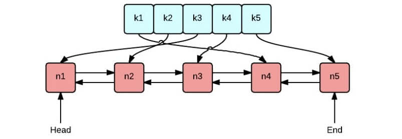
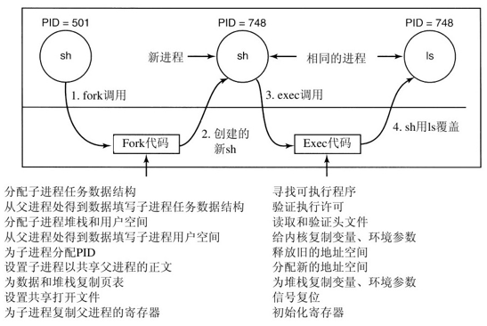
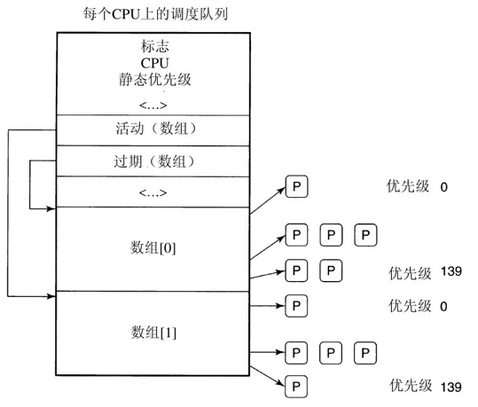
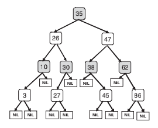

## Linux 进程

------

`Linux` 系统中主要的活动实体就是进程。每个进程执行一段独立的程序并且在进程初始化的时候拥有一个独立的控制线程。换句话说，每一个进程都拥有一个独立的程序计数器，用这个程序计数器可以追踪下一条将要被执行的指令。一旦进程开始运行，`Linux` 系统将允许它创建额外的线程。

即使用户已经退出登录，仍然会有很多后台进程，即守护进程（`daemon`），在运行。在系统启动的时候，这些守护进程就已经被`shell`脚本开启 (`daemon` 是“`demon`”的另一种拼写，而`demon`是指恶魔)。

计划任务 `cron daemon` 是一个典型的守护进程。它每分钟运行一次来检查是否有工作需要它完成。如果有工作要做，它就会将之完成，然后进入休眠状态，直到下一次检查时刻来到。

#### 进程和子进程

在`Linux`系统中，进程通过非常简单的方式创建。系统调用`fork`将会创建一个与原始进程完全相同的进程副本。调用`fork`函数的进程称为父进程，新的进程称为子进程。父进程和子进程都拥有自己的私有内存映像。如果在调用`fork`函数之后，父进程修改了属于它的一些变量，这些变化对于子进程来说是不可见的，反之亦然。

但是，父进程和子进程可以共享已经打开的文件。也就是说，如果某一个文件在父进程调用`fork`函数之前就已经打开了，那么在父进程调用`fork`函数之后，对于父进程和子进程来说，这个文件也是打开的。

#### 进程标识符

父、子进程的内存映像、变量、寄存器以及其他所有的东西都是相同的，这就产生了一个问题：该如何区别这两个进程，即哪一个进程该去执行父进程的代码，哪一个进程该去执行子进程的代码呢？

秘密在于`fork`系统调用给子进程返回一个零值，而给父进程返回一个非零值。这个非零值是子进程的进程标识符（`Process Identifier`，`PID`）。

两个进程检验`fork`函数的返回值，并且根据返回值继续执行：

```c
pid = fork(); 
/* if the for k succeeds, pid > 0 in the parent */
if (pid < 0) {
  handle_error(); 
  /* fork failed (e.g., memory or some table is full) */
} else if (pid > 0) {
	/* parent code goes here. /*/
} else {
	/* child code goes here. /*/ 
}
```

进程以其`PID`来命名。如前所述，当一个进程被创建的时候，它的父进程会得到它的`PID`。如果子进程希望知道它自己的`PID`，可以调用系统调用`getpid`。

#### 进程信息传递

**管道**

`Linux`系统中的进程可以通过一种消息传递的方式进行通信。在两个进程之间，可以建立一个通道，一个进程向这个通道里写入字节流，另一个进程从这个通道中读取字节流。这些通道称为管道（`pipe)`。使用管道也可以实现同步，因为如果一个进程试图从一个空的管道中读取数据，这个进程就会被挂起直到管道中有可用的数据为止。

`shell`中的管线就是用管道技术实现的。当`shell`看到类似下面的一行输入时：

```shell
sort ＜ f|head
```

它会创建两个进程，分别是`sort`和`head`，同时在两个进程间建立一个管道使得`sort`进程的标准输出作为`head`进程的标准输入。

**信号：软件中断**

进程还可以通过另一种方式通信：软件中断。一个进程可以给另一个进程发送信号 `signal`。进程可以告诉操作系统当信号到来时它们希望发生什么事件。

相关的选择有忽略这个信号、抓取这个信号或者利用这个信号杀死某个子进程。如果一个进程希望获取所有发送给它的信号，它就必须指定一个信号处理函数。当信号到达时，控制立即切换到信号处理函数。当信号处理函数结束并返回之后，控制像硬件 `I/O` 中断一样返回到陷入点处。

一个进程只可以给它所在进程组中的其他进程发送信号，这个进程组包括它的父进程、远祖进程、兄弟进程和子进程、以及后裔进程。同时，一个进程可以利用系统调用给它所在的进程组中所有的成员发送信号。

信号还可以用于其他用途。比如说，如果一个进程正在进行浮点运算，但是不慎除数为`0`，它就会得到一个`SIGFPE`信号（浮点运算异常信号）。`POSIX`系统定义的信号详见：

**Signal Cause**

+ *SIGABRT* Sent to abort a process and force a core dump
+ *SIGALRM* The alar m clock has gone off
+ *SIGFPE* A floating-point error has occurred (e.g., division by 0)
+ *SIGHUP* The phone line the process was using has been hung up
+ *SIGILL* The user has hit the DEL key to interr upt the process
+ *SIGQUIT* The user has hit the key requesting a core dump
+ *SIGKILL* Sent to kill a process (cannot be caught or ignored)
+ *SIGPIPE* The process has written to a pipe which has no readers
+ *SIGSEGV* The process has referenced an invalid memory address
+ *SIGTERM* Used to request that a process terminate gracefully
+ *SIGUSR1* Available for application-defined purposes
+ *SIGUSR2* Available for application-defined purposes

#### 进程管理相关的系统调用

#### 进程和线程实现原理

每一个进程都有一个运行用户程序的用户模式。但是当它的某一个线程调用系统调用之后，进程会陷入内核模式并且运行在内核上下文中，它将使用**不同的内存映射并且拥有对所有机器资源的访问权**。它还是同一个线程，但是现在拥有更高的权限，同时拥有自己的内核堆栈以及内核程序计数器。

**数据结构**

在`Linux`系统内核中，进程通过数据结构`task`_`struct`被表示成任务（`task`）。`Linux`系统用任务的数据结构来表示所有的执行上下文。所以，一个单线程的进程只有一个任务数据结构，而一个多线程的进程将为每一个用户级线程分配一个任务数据结构。最后，`Linux`的内核是多线程的，并且它所拥有的是与任何用户进程无关的内核级线程，这些内核级线程执行内核代码。

对于每一个进程，一个类型为`task`_`struct`的进程描述符是始终存在于内存当中的。它包含了内核管理全部进程所需的重要信息，如调度参数、已打开的文件描述符列表等。进程描述符从进程被创建开始就一直存在于内核堆栈之中。

任务数据结构包含非常多的分量。其中一些分量包含指向其他数据结构或段的指针，比如说包含关于已打开文件的信息。有些段只与进程用户级的数据结构有关，当用户进程没有运行的时候，它们是不被关注的。所以，当不需要它们的时候，这些段可以被交换出去或重新分页以达到不浪费内存的目的。

`task_struct` 进程描述符的信息包含以下几大类：

+ *调度参数* 进程优先级，最近消耗的CPU时间，最近睡眠的时间。上面几项内容结合在一起决定了下一个要运行的进程是哪一个。
+ *内存映射* 指向代码、数据、堆栈段或页表的指针。如果代码段是共享的，代码指针指向共享代码表。当进程不在内存当中时，关于如何在磁盘上找到这些数据的信息也被保存在这里。
+ *信号* 掩码显示了哪些信号被忽略、哪些信号需要捕捉、哪些信号被暂时阻塞以及哪些信号在传递当中。
+ *机器寄存器* 当内核陷阱发生时，机器寄存器的内容（也包括被使用了的浮点寄存器的内容）会被保存。
+ *系统调用状态* 关于当前系统调用的信息，包括参数和返回值。
+ *文件描述符表* 当一个与文件描述符有关的系统调用被调用的时候，文件描述符作为索引在文件描述符表中定位相关文件的i节点数据结构。
+ *统计* 指向记录用户、进程占用系统CPU时间的表的指针。一些系统还保存一个进程最多可以占用CPU的时间、进程可以拥有的最大堆栈空间、进程可以消耗的页面数等。
+ *内核堆栈* 进程的内核部分可以使用的固定堆栈

为了与其他`UNIX`系统兼容，`Linux`还通过进程标识符（`PID`）来区分进程。内核将所有进程的任务数据结构组织成一个双向链表。不需要遍历这个链表来访问进程描述符，`PID`可以直接被映射成进程的任务数据结构所在的地址，从而立即访问进程的信息。



**进程的创建**

创建一个新进程的过程非常简单。为子进程创建一个新的进程描述符和用户空间，然后从父进程复制大量的内容。这个子进程被赋予一个`PID`，并建立它的内存映射，同时它也被赋予了访问属于父进程文件的权利。然后，它的寄存器内容被初始化并准备运行。

[fork]()

当系统调用`fork`执行的时候，调用`fork`函数的进程陷入内核并且创建一个任务数据结构和其他相关的数据结构，如内核堆栈和`thread`_`info`结构。这个结构位于进程堆栈栈底固定偏移量的地方，包含一些进程参数，以及进程描述符的地址。把进程描述符的地址存储在一个固定的地方，使得`Linux`系统只需要进行很少的有效操作就可以找到一个运行中进程的任务数据结构。

进程描述符的主要内容根据父进程的进程描述符来填充。`Linux`系统只需要寻找一个可用的`PID`，更新进程标识符散列表的表项使之指向新的任务数据结构即可。如果散列表发生冲突，相同键值的进程描述符会被组成链表。它会把`task`_`struct`结构中的一些分量设置为指向任务数组中相应进程的前一/后一进程的指针。

理论上，现在就应该为子进程分配数据段、堆栈段，并且对父进程的段进行复制，因为 `fork` 函数意味着父、子进程之间不共享内存。其中如果代码段是只读的，可以复制也可以共享。

但是，复制内存的代价相当昂贵，所以现代`Linux`系统都使用了欺骗的手段。它们赋予子进程属于它的页表，但是这些页表都指向父进程的页面，同时把这些页面标记成只读。当子进程试图向某一页面中写入数据的时候，它会收到写保护的错误。内核发现子进程的写入行为之后，会为子进程分配一个该页面的新副本，并将这个副本标记为可读、可写。通过这种方式，使得只有需要写入数据的页面才会被复制。这种机制叫做写时复制。它所带来的额外好处是，不需要在内存中维护同一个程序的两个副本，从而节省了`RAM`。

[exec]()

子进程开始运行之后，运行代码（`shell`的副本）调用系统调用`exec`，将命令名作为`exec`函数的参数。内核找到并核实相应的可执行文件，把参数和环境变量复制到内核，释放旧的地址空间和页表。

现在必须建立并填充新的地址空间。新进程开始运行的时候，它会立刻收到一个缺页中断，这会使得第一个含有代码的页面从可执行文件调入内存。通过这种方式，不需要预先加载任何东西，所以程序可以快速地开始运行，只有在所需页面不在内存中时才会发生页面错误（这种情况是第3章中讨论的最纯粹的按需分页机制）。最后，参数和环境变量被复制到新的堆栈中，信号被重置，寄存器被全部清零。从这里开始，新的命令就可以运行了。

通过下面的例子解释了上述的步骤：某用户在终端键入一个命令`ls`，`shell`调用`fork`函数复制自身以创建一个新进程。新的`shell`调用`exec`函数用可执行文件`ls`的内容覆盖它的内存。



## Linux中的调度

------

现在我们来关注`Linux`系统的调度算法。首先要认识到，`Linux`系统的线程是内核线程，所以`Linux`系统的调度是基于线程的，而不是基于进程的。

#### 静态优先级

为了进行调度，`Linux`系统将线程区分为三类：

+ 实时先入先出
+ 实时轮转
+ 分时

**实时**

实时先入先出线程具有最高优先级，它不会被其他线程抢占，除非那是一个刚刚准备好的、拥有更高优先级的实时先入先出线程。

实时轮转线程与实时先入先出线程基本相同，只是每个实时轮转线程都有一个时间量，时间到了之后就可以被抢占。如果多个实时轮转线程都准备好了，每一个线程运行它的时间量所规定的时间，然后插入到实时轮转线程列表的末尾。

在系统内部，实时线程的优先级从`0`到`99`，`0`是实时线程的最高优先级，`99`是实时线程的最低优先级。

**分时**

传统的非实时(分时)线程按照如下的算法进行调度。在系统内部，非实时线程的优先级从`100`到`139`，也就是说，在系统内部，`Linux`系统区分`140`级的优先级（包括实时和非实时任务）。就像实时轮转线程一样，`Linux`系统根据非实时线程的优先级分配时间量。这个时间量是线程可以连续运行的时钟周期数。在当前的`Linux`版本中，时钟频率为`1000`赫兹，每个时钟周期为`1ms`，也叫做一个最小时间间隔。

**优先级调节**

`Linux`系统给每个线程分配一个`nice`值（即优先级调节值）。默认值是`0`，但是可以通过调用系统调用`nice`（`value`）来修改，修改值的范围从`-20`到+`19`。这个值决定了线程的静态优先级。一个在后台大量计算π值的用户可以在他的程序里调用这个系统调用为其他用户让出更多计算资源。

#### O(1) 调度器

`O(1)` 调度器是一个历史上比较流行的 `liunx` 调度程序，这么命名是因为其可以在常数时间内调度任务，比如选择一个任务，或者将一个任务加入队列。

**数据结构**

`O(1)` 调度器使用一个重要的数据结构——调度队列。在系统中，一个`CPU`有一个调度队列，除了其他信息，调度队列中有两个数组，一个是正在活动的，一个是过期失效的。如图所示，这两个分量都是指向数组的指针，每个数组都包含了`140`个链表头，每个链表具有不同的优先级。链表头指向给定优先级的双向进程链表。调度的基本操作如下所述。



调度器从正在活动数组中选择一个优先级最高的任务。如果这个任务的时间片（时间量）过期失效了，就把它移动到过期失效数组中（可能会插入到优先级不同的列表中）。当正在活动数组中没有其他的任务了，调度器交换指针，使得正在活动数组变为过期失效数组，过期失效数组变为正在活动数组。这种方法可以保证低优先级的任务不会被饿死

不同的优先级被赋予不同的时间片长度。`Linux`系统会赋予高优先级的进程较长的时间片。例如，优先级为`100`的任务可以得到`800ms`的时间片，而优先级为`139`的任务只能得到`5ms`的时间片。

**动态优先级**

由于`Linux`系统（或其他任何操作系统）事先不知道一个任务究竟是`I/O`密集的，还是`CPU`密集的，它只是依赖于连续保持的互动启发模式。通过这种方式，`Linux`系统区分静态优先级和动态优先级。线程的动态优先级不断地被重新计算，其目的在于：

+ 奖励互动进程

- 惩罚占用 `CPU` 的进程

最高的优先级奖励是`-5`，是从调度器接收的与更高优先级相对应的较低优先级的值。最高的优先级惩罚是+`5`。

说得更详细些，调度器给每一个任务维护一个名为`sleep`_`avg`的变量。每当任务被唤醒时，这个变量会增加；当任务被抢占或时间量过期时，这个变量会相应地减少。减少的值用来动态生成优先级奖励，奖励的范围从`-5`到+`5`。当一个线程从正在活动数组移动到过期失效数组中时，`Linux`系统的调度器会重新计算它的优先级。

#### CFS调度算法

这里讲述的调度算法指的是`2.6`版本内核，最初引入这个调度算法的是不稳定的`2.5`版本内核。由于上面描述的内容说明了通过访问正在活动数组就可以做出调度决定，那么调度可以在一个固定的时间`O(1)`内完成，而与系统中进程的数量无关。所以也叫 `O(1)` 调度算法。但是该算法对于处理交互任务时效果很差。

为了解决这个问题，`Ingo Molnar` 提出了一个新的调度程序称为完全公平调度器或 `Cfs` 。

`CFS` 背后的主要思想是使用红黑树作为数据结构。根据任务在 `cpu` 上的运行时间长短有序的排列在树上，这种虚拟运行时间称为 `vruntime` 。如图所示，树中的每个内部节点对应任务。左边的子项对应使用较少 `CPU` 时间的任务，因此将安排得更快，右侧的子节点是消耗 `CPU` 时间最多的任务。



**调度算法可以总结如下：**

该算法总是优先调度`CPU`时间最少的任务，通常在左边节点，`CFS`会周期的根据任务的已运行时间计算他们的虚拟运行时间，并且和树上最左的节点进行比较，如果正在运行的任务仍有较小的虚拟时间值，那么他继续运行，如果他的时间值较大，那么他会被插入适当位置，而 `CPU` 会运行最左边的任务。

考虑到任务有优先记得差异，因此对于不同优先级的任务，`CFS`会有不同的虚拟时间流逝速率，对于优先级低的任务时间流逝的更快，从而让优先级高的任务更快的重新插入。

**效率**

选择树中的一个节点可以以常数级的时间内完成，而插入一个节点需要 `O(logn)`的时间，这是可以被接受的。

#### 不可运行的任务

调度器只考虑可以运行的任务，这些任务被放在适当的调度队列当中。不可运行的任务和正在等待各种`I/O`操作或内核事件的任务被放入另一个数据结构当中，即等待队列。每一种任务可能需要等待的事件对应了一个等待队列。等待队列的头包含一个指向任务链表的指针及一枚自旋锁。为了保证等待队列可以在主内核代码、中断处理函数或其他异步处理请求代码中进行并发操作，自旋锁是非常必要的。