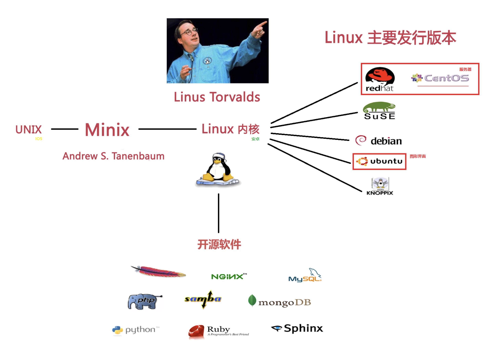

## linux history

------

## linux main issue

-----

**1．Red Hat Linux**

Red Hat是一个比较成熟的Linux版本，无论在销售还是装机量上都比较可观。该版本从4.0开始同时支持Intel、Alpha及Sparc硬件平台，并且通过Red Hat公司的开发使得用户可以轻松地进行软件升级，彻底卸载应用软件和系统部件。Red Hat最早由Bob Young和Marc Ewing在1995年创建，目前分为两个系列，即由Red Hat公司提供收费技术支持和更新的**Red Hat Enterprise Linux**，以及由社区开发的免费的**Fedora Core**。**Fedora Core 1发布于2003年年末，定位为桌面用户(所以服务器大部分使用centos)**。Fedora Core提供了最新的软件包，同时版本更新周期也非常短，仅6个月。目前最新版本为Fedora Core 6，而Fedora Core 7的测试版已经推出，**适用于服务器的版本是Red Hat Enterprise Linux**。由于这是个收费的操作系统，于是国内外许多企业或网络空间公司选择CentOS**。CentOS可以算是Red Hat Enterprise Linux的克隆版，但是免费的**，其官方主页是http://www.redhat.com/。

**2．Debian Linux**

Debian最早由Ian Murdock于1993年创建，可以算是迄今为止最遵循GNU规范的Linux系统。Debian系统分为3个版本分支（Branch），即 Stable、Testing和Unstable。截至2005年5月，这3个版本分支分别对应的具体版本为Woody、Sarge和Sid。其 中，Unstable为最新的测试版本，包括最新的软件包。但是也有相对较多的Bug，适合桌面用户Testing的版本都经过Unstable中的测 试，相对较为稳定，也支持了不少新技术（比如SMP等）。而Woody一般只用于服务器，其中的软件包大部分都比较过时，但是稳定性能和安全性能都非常 高，是如此多的用户痴迷于Debian、Apt-Get和Dpkg原因之一。Dpkg是Debian系列特有的软件包管理工具，它被誉为所有Linux软 件包管理工具（比如RPM）中最强大的，配合Apt-Get在Debian上安装、升级、删除和管理软件变得异常容易。许多Debian的用户都开玩笑地 说，Debian将他们养懒了，因为只要输入"Apt-Get Upgrade && Apt-Get Upgrade"，计算机上所有的软件就会自动更新。其官方主页是http://www.debian.org/。

**3．Ubuntu Linux**

简单而言，Ubuntu就是一个拥有Debian所有的优点，以及自己所加强优点的近乎完美的Linux操作系统。Ubuntu是一个相对较新的发行版，它的出现可能改变了许多潜在用户对Linux的看法。也许，以前人们会认为Linux难以安装并难以使用，但是Ubuntu出现后这些都成为了历史。Ubuntu基于Debian Sid，所以拥有Debian的所有优点，包括Apt-Get。然而不仅如此，Ubuntu默认采用的GNOME桌面系统也将Ubuntu的界面装饰得简 易而不失华丽。当然如果你是一个KDE的拥护者的话，Ubuntu同样适合。Ubuntu的安装非常人性化，只要按照提示一步一步进行，安装操作与 Windows操作系统同样简便。并且Ubuntu被誉为是对硬件支持最好最全面的Linux发行版之一，许多在其他发行版上无法使用或者默认配置时无法 使用的硬件，在Ubuntu上可以轻松实现。并且它采用自行加强的内核（Kernel），安全性方面更加完善。Ubuntu默认不能直接Root登录，必须由第1个创建的用户通过Su或Sudo来获取Root权限（这也许不太方便，但无疑增加了安全性，避免用户由于粗心而损坏系统）。Ubuntu的版本周期为6个月，弥补了Debian更新缓慢的不足，其官方主页是http://www.ubuntulinux.org/。

