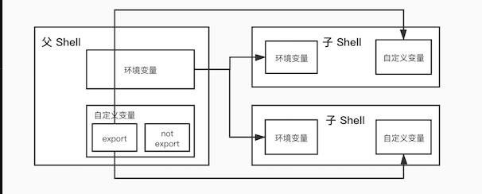

# shell env

-------

正如我们之前所讨论到的，shell 在 shell 会话中维护着大量的信息，这些信息称为  `shell` 环境。 存储在 `shell` 环境中的数据被程序用来确定配置属性。

- printenv - 打印部分或所有的环境变量
- set - 设置 shell 选项
- export — 导出环境变量，让随后执行的程序知道。
- alias - 创建命令别名

`shell` 在环境中存储了两种基本类型的数据，虽然对于 `bash` 来说，很大程度上这些类型是不可辨别的。它们是 `环境变量` 和 `shell` 变量。`Shell` 变量是由 `bash` 存放的少量数据，而剩下的基本上 都是环境变量。

#### 环境变量和`shell` 变量的区别

理解这二者的区别是尤为重要的，首先我们要清楚 `linux` 进程系统调用的两种方式：

1. `fork` 是复制进程，它会复制当前进程的副本，以适当的方式将这些资源交给子进程。所以子进程掌握的资源和父进程是一样的，包括内存中的内容，所以也包括环境变量和变量。但父子进程是完全独立的，它们是一个程序的两个实例。
2. `exec` 是加载另一个应用程序，替代当前运行的进程，也就是说在不创建新进程的情况下加载一个新程序。此时父程序原有的自定义变量就会被清掉。

`shell` 变量不一定会被子 `shell` 进程继承，而 `环境变量` 一定会，具体的继承关系分析子 `shell` 的创建方式，下面举一个简单的例子：

```shell
#!~/.bashrc
# foo=bar
# export bar=foo
> bash
>> echo $foo
>> echo $bar # foo
```

比如我们在上面声明的 `shell` 变量 `foo` 就不能再新的子 `bash` 进程里使用，而导出的 `bar` 就可以。



#### export

`Linux export` 命令用于设置或显示环境变量，由于比较全能，所以在这里单独讲一讲。

在 `shell` 中执行程序时，`shell` 会提供一组环境变量。`export` 可新增，修改或删除环境变量，供后续执行的程序使用。注意如果不是写在配置文件中的 `EXPORT` 只会为一次会话中使用。

该命令的语法如下：

```shell
export [-fnp][变量名称]=[变量设置值]
```

其中：

- `-f`: 代表[变量名称]中为函数名称。
- `-n`: 删除指定的变量。变量实际上并未删除，只是不会输出到后续指令的执行环境中。
- `-p`: 列出所有的 `shell` 赋予程序的环境变量。

## 检查环境变量

--------

我们既可以用 `bash` 的内部命令 `set`，或者是 `printenv` 程序来查看什么存储在环境当中。`set` 命令可以 显示 `shell` 和环境变量两者，而 `printenv` 只是显示环境变量。

**1.使用printenv查看所有环境变量**

printenv 只是显示环境变量:

```bash
> printenv | less
LANG=en_US.UTF-8
HISTCONTROL=ignoredups
SHLVL=1
HOME=/root
GOROOT=/usr/local/go
LOGNAME=root
SSH_CONNECTION=103.63.155.31 43544 172.16.23.65 22
LESSOPEN=||/usr/bin/lesspipe.sh %s
XDG_RUNTIME_DIR=/run/user/0
_=/usr/bin/printenv
```

`printenv` 命令也能够列出特定变量的数值：

```bash
> printenv USER
me
```

**2.使用set查看shell变量和环境变量**

当使用没有带选项和参数的 set 命令时，shell 和环境变量二者都会显示，同时也会显示定义的 shell 函数。

```bash
> set | less
PS1='[\u@\h \W]\$ '
PS2='> '
PS4='+ '
PWD=/root
SHELL=/bin/bash
SHELLOPTS=braceexpand:emacs:hashall:histexpand:history:interactive-comments:monitor
SHLVL=1
SSH_CLIENT='103.63.155.31 43544 22'
SSH_CONNECTION='103.63.155.31 43544 172.16.23.65 22'
SSH_TTY=/dev/pts/0
TERM=xterm
UID=0
USER=root
XDG_RUNTIME_DIR=/run/user/0
XDG_SESSION_ID=121
_=printenv
colors=/root/.dircolors
```

**3.使用echo命令查看单个环境变量**

例如： echo $PATH 

```
[me@linuxbox ~]$ echo $HOME
/home/me
```

**4.使用alias查看命令别名**

如果 shell 环境中的一个成员既不可用 set 命令也不可用 printenv 命令显示，则这个变量是别名。 输入不带参数的 alias 命令来查看

```shell
> alias
alias l.='ls -d .* --color=tty'
alias ll='ls -l --color=tty'
alias ls='ls --color=tty'
alias vi='vim'
alias which='alias | /usr/bin/which --tty-only --read-alias --show-dot --show-tilde'
```

## 如何建立 shell 环境？

---------

当我们登录系统后，启动 bash 程序，并且会读取一系列称为启动文件的配置脚本， 这些文件定义了默认的可供所有用户共享的 shell 环境。然后是读取更多位于我们自己家目录中 的启动文件，这些启动文件定义了用户个人的 shell 环境。精确的启动顺序依赖于要运行的 shell 会话 类型。有两种 shell 会话类型：一个是登录 shell 会话，另一个是非登录 shell 会话。

登录 shell 会话会提示用户输入用户名和密码；例如，我们启动一个虚拟控制台会话。当我们在 GUI 模式下 运行终端会话时，非登录 shell 会话会出现。 

**登录 shell 会话的启动文件：**

| 文件            | 内容                                                         |
| :-------------- | :----------------------------------------------------------- |
| /etc/profile    | 应用于所有用户的全局配置脚本。                               |
| ~/.bash_profile | 用户私人的启动文件。可以用来扩展或重写全局配置脚本中的设置。 |
| ~/.bash_login   | 如果文件 ~/.bash_profile 没有找到，bash 会尝试读取这个脚本。 |
| ~/.profile      | 如果文件 ~/.bash_profile 或文件 ~/.bash_login 都没有找到，bash 会试图读取这个文件。 这是基于 Debian 发行版的默认设置，比方说 Ubuntu。 |
| ~/.bashrc        | 用户私有的启动文件。可以用来扩展或重写全局配置脚本中的设置。 |

**非登录 shell 会话的启动文件：**

| 文件             | 内容                                                         |
| :--------------- | :----------------------------------------------------------- |
| /etc/bash.bashrc | 应用于所有用户的全局配置文件。                               |
| ~/.bashrc        | 用户私有的启动文件。可以用来扩展或重写全局配置脚本中的设置。 |

除了读取以上启动文件之外，非登录 shell 会话也会继承它们父进程的环境设置，通常是一个登录 shell。

在普通用户看来，文件 ~/.bashrc 可能是最重要的启动文件，因为它几乎总是被读取。非登录 shell 默认 会读取它，并且大多数登录 shell 的启动文件会以能读取 ~/.bashrc 文件的方式来书写。

## 设置变量的三种方法

--------

**1.在/etc/profile添加**

用VIM在文件/etc/profile文件中增加变量，该变量将会对Linux下所有用户有效，并且是“永久的”。 

```bash
  1 # System-wide .profile for sh(1)
  2
  3 if [ -x /usr/libexec/path_helper ]; then
  4     eval `/usr/libexec/path_helper -s`
  5 fi
  6
  7 if [ "${BASH-no}" != "no" ]; then
  8     [ -r /etc/bashrc ] && . /etc/bashrc
  9 fi
```

> **注：**修改文件后要想马上生效还要运行 `source /etc/profile` 不然只能在下次重进此用户时生效。

**2.在用户目录下的.bash_profile文件中增加**

用VI在用户目录下的.bash_profile文件中增加变量，改变量仅会对当前用户有效，并且是“永久的”。 

```bash
  1 # environment for go
  2 export GOPATH=/usr/local/Cellar/go/1.7.6
  3 export GOBIN=$GOPATH/bin
  4 export PATH=$PATH:$GOBIN
  5 # environment for java
  6 JAVA_HOME=/Library/Java/JavaVirtualMachines/jdk-12.0.1.jdk/Contents/Home
  7 PATH=$JAVA_HOME/bin:$PATH:.
  8 CLASSPATH=$JAVA_HOME/lib/tools.jar:$JAVA_HOME/lib/dt.jar:.
  9 export JAVA_HOME
 10 export PATH
 11 export CLASSPATH
 12 #environment for mysql
 13 MYSQLPATH=/usr/local/mysql/bin
 14 export PATH=$PATH:$MYSQLPATH
 15 # homebrew config
 16 export HOMEBREW_NO_AUTO_UPDATE=true
```

修改文件后要想马上生效还要运行 `$ source /home/guok/.bash_profile` 不然只能在下次重进此用户时生效。同时 `.` 命令可以代替 `source`。

```bash
> . .bashrc
> source .bashrc
```

**3.直接运行export命令定义变量**

在shell的命令行下直接使用[export 变量名=变量值] 定义变量，**该变量只在当前的shell(BASH)或其子shell(BASH)下是有效的**，shell关闭了，变量也就失效了，再打开新shell时就没有这个变量，需要使用的话还需要重新定义。

## 删除环境变量

--------

set可以设置某个环境变量的值。清除环境变量的值用unset命令。如果未指定值，则该变量值将被设为NULL。

示例如下： 

```bash
$ export TEST="Test..." 
$ unset TEST #删除环境变量TEST 
$ env|grep TEST #此命令没有输出，证明环境变量TEST已经删除
```

## 常用的环境变量

--------

shell 环境中包含相当多的变量，虽然你的 shell 环境可能不同于这里展示的，但是你可能会看到 以下变量在你的 shell 环境中：

| 变量    | 内容                                                         |
| :------ | :----------------------------------------------------------- |
| DISPLAY | 如果你正在运行图形界面环境，那么这个变量就是你显示器的名字。通常，它是 ":0"， 意思是由 X 产生的第一个显示器。 |
| EDITOR  | 文本编辑器的名字。                                           |
| SHELL   | shell 程序的名字。                                           |
| HOME    | 用户家目录。                                                 |
| LANG    | 定义了字符集以及语言编码方式。                               |
| OLD_PWD | 先前的工作目录。                                             |
| PAGER   | 页输出程序的名字。这经常设置为/usr/bin/less。                |
| PATH    | 由冒号分开的目录列表，当你输入可执行程序名后，会搜索这个目录列表。 |
| PS1     | Prompt String 1. 这个定义了你的 shell 提示符的内容。随后我们可以看到，这个变量 内容可以全面地定制。 |
| PWD     | 当前工作目录。                                               |
| TERM    | 终端类型名。类 Unix 的系统支持许多终端协议；这个变量设置你的终端仿真器所用的协议。 |
| TZ      | 指定你所在的时区。大多数类 Unix 的系统按照协调时间时 (UTC) 来维护计算机内部的时钟 ，然后应用一个由这个变量指定的偏差来显示本地时间。 |
| USER    | 你的用户名                                                   |

如果缺失了一些变量，不要担心，这些变量会因发行版本的不同而不同。

## alias

-------

`alias` 用于创建命令别名。

```
alias name='string'
```

