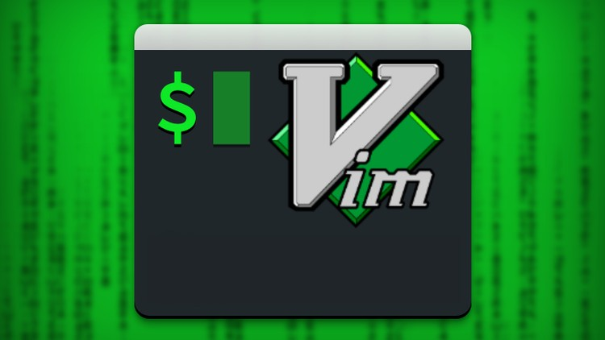
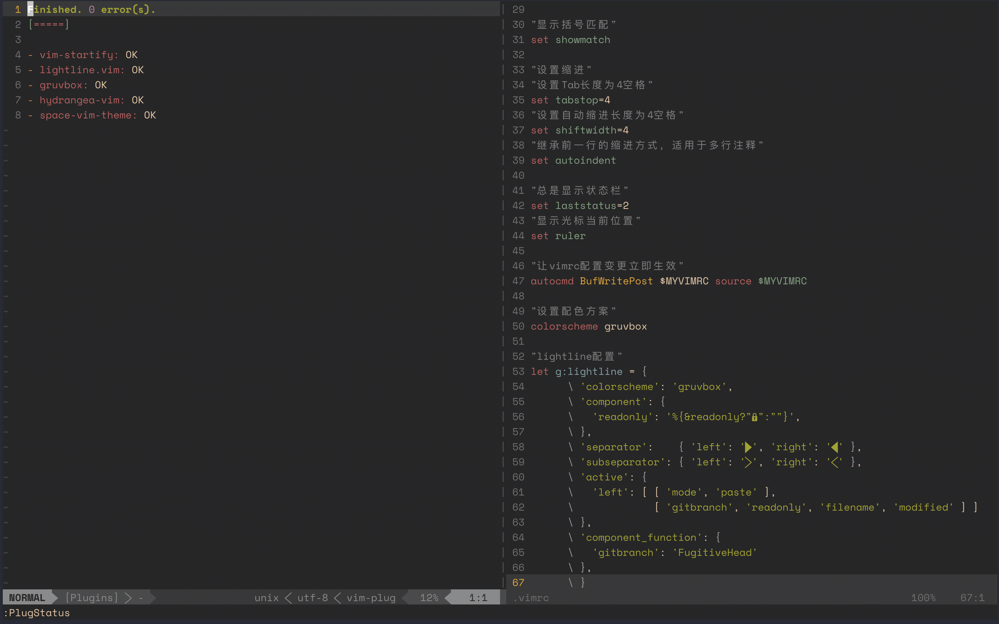
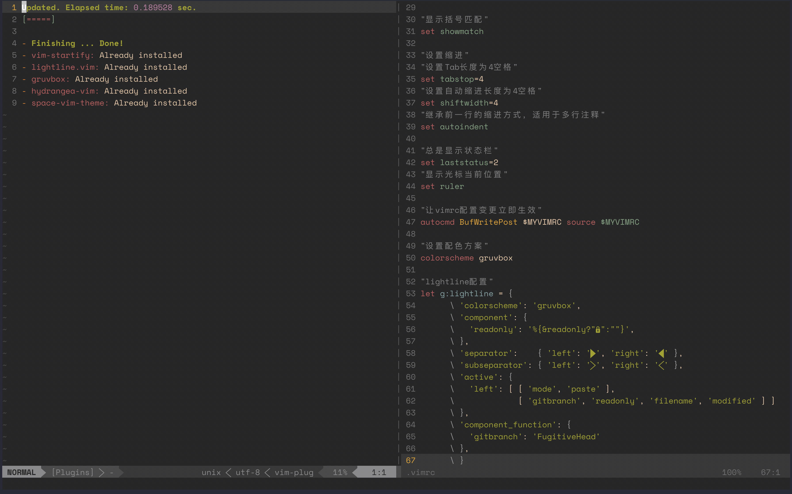

## vim编辑器的三种模式

**Vim中存在三种模式：**命令模式、编辑模式（输入模式）、末行模式（尾行模式）。

- 命令模式：在该模式下是不能对文件直接编辑，可以输入快捷键进行一些操作（删除行，复制行，移动光标，粘贴等等）【打开文件之后默认进入的模式】；
- 编辑模式：在该模式下可以对文件的内容进行编辑；
- 末行模式：可以在末行输入命令来对文件进行操作（搜索、替换、保存、退出、撤销、高亮等等）；

**Vim的打开文件的方式**（4种，要求掌握的就前三种）：

- #vim 文件路径												    作用：打开指定的文件
- #vim  +数字  文件的路径			                作用：打开指定的文件，并且将光标移动到指定行
- #vim  +/关键词  文件的路径		              作用：打开指定的文件，并且高亮显示关键词
- #vim **文件路径1 文件路径2 文件路径3**  作用：同时打开多个文件

**处理多个文件**

使用vim同时打开多个文件，在末行模式下进行切换文件

- 查看当前已经打开的文件名称：“:files”

```bash
:files
  1 #    "passwd"                       line 1
  2 %a   "passwd1"                      line 4
  3      "passwd2"                      line 1
Press ENTER or type command to continue
```

> `%a`：a=active，表示当前正在打开的文件；
>
> `#`：表示上一个打开的文件

**切换文件的方式：**

1. 如果需要指定切换文件的名称，则可以输入：“:open 已经打开的文件名”
2. 可以通过其他命令来切换上一个文件/下一个文件
   1. 输入：“:bn”切换到下一个文件（back next）
   2. 输入：“:bp”切换到上一个文件（back prev）

## 命令模式

注意：该模式是打开文件的第一个看到的模式（打开文件即可进入）

**光标移动**

- 光标移动到行首
  - 按键：shift + 6 或 ^（T字母上面的6，不要按小键盘的6）

- 光标移动到行尾
  - 按键：shift + 4 或 $（R字母的左上角的4，不是小键盘的4）

- 光标移动到首行
  - 按键：gg

- 光标移动到末行
  - 按键：G

**扩展1：光标的快速移动**

- 快速将光标移动到指定的行
  - 按键：数字G    

- 以当前光标为准向上/向下移动n行
  - 按键：数字↑，数字↓

- 以当前光标为准向左/向右移动n字符
  - 按键：数字←，数字→

- 末行模式下的快速移动方式：移动到指定的行
  - 按键：输入英文“:”，其后输入行数数字，按下回车

**翻屏**

- 向上翻屏：
  - 按键ctrl + b  （before）	或 	PgUp 
- 向下翻屏：
  - 按键ctrl + f	  （after）		或		PgDn

**复制**

- 复制光标所在行
  - 按键：yy
  - 粘贴：在想要粘贴的地方按下p键

- 光标所在行为准（包含当前行），向下复制指定的行数
  - 按键：数字yy

- 可视化复制
  - 按键：`ctrl + v（可视块）或V（可视行）`，然后按下`↑↓←→`方向键来选中需要复制的区块，按下`y`键进行复制，最后按下`p`键粘贴

**剪切/删除**

- 剪切/删除光标所在行
  - 按键：dd			（删除之后下一行上移）
  - 注意：dd严格意义上说是剪切命令，但是如果剪切了不粘贴就是删除的效果。
- 剪切/删除光标所在行为准（包含当前行），向下删除/剪切指定的行
  - 按键：数字dd		（删除之后下一行上移）
- 剪切/删除光标所在的当前行之后的内容，但是删除之后下一行不上移
  - 按键：D				（删除之后当前行会变成空白行）
- 可视化删除
  - 按键：ctrl + v（可视块）或V（可视行）或v（可视），上下左右移动，按下D表示删除选中行，d表示删选中块

**撤销/恢复**

- 撤销：输入:u （不属于命令模式） 或者  u			（undo）
- 恢复：ctrl + r			恢复（取消）之前的撤销操作

## 末行模式

**进入方式：**

- 由命令模式进入，按下“:”或者“/（表示查找）”即可进入

**退出方式：**

​		a. 按下esc

​		b. 连按2次esc键

​		c. 删除末行全部输入字符

**保存操作（write）**

- 输入：“:w”				保存文件

- 输入：“:w  路径”		另存为

**退出（quit）**

- 输入：“:q”				退出文件

**保存并退出**

- 输入：“:wq”				保存并且退出

**强制 （!）**

- 输入：“:q!”				表示强制退出，刚才做的修改操作不做保存

**调用外部命令（了解）**

- 输入：“:!外部命令”

```bash
~/learn_vim took 8s
➜ vim +10 passwd


Press ENTER or type command to continue
```

**搜索/查找**

- 输入：“/关键词”

- 例如：我想在passwd文件中搜索“sbin”关键词

> 在搜索结果中切换上/下一个结果：N/n		（next）
>
> 如果需要取消高亮，则需要输入：“:nohl”【no highlight】

**替换**

- :s/搜索的关键词/新的内容				替换光标所在行的第一处符合条件的内容

- :s/搜索的关键词/新的内容/g			替换光标所在行的全部符合条件的内容

- :%s/搜索的关键词/新的内容			替换整个文档中每行第一个符合条件的内容

- :%s/搜索的关键词/新的内容/g			替换整个文档的符合条件的内容

> `%`表示整个文件
>
> `g`表示全局`（global）`

**显示行号（临时）**

- 输入：“:set nu”[number]
  - 如果想取消显示，则输入：“:set nonu”

## 编辑模式

- 进入方式：i（insert）、a（after）。
- 退出方式：按下esc键

## 配置

**Vim配置有三种情况：**

​	a. 在文件打开的时候在末行模式下输入的配置（临时的）

​	b. 个人配置文件（~/.vimrc，如果没有可以自行新建）

​	c. 全局配置文件（vim自带，/etc/vimrc）

> 如果针对同一个配置项，个人配置文件中存在，则以个人配置文件为准，如果个人配置文件中不存在这一项，则以全局配置文件为准。

##  异常退出

什么是异常退出：在编辑文件之后并没有正常的去wq（保存退出），而是遇到突然关闭终端或者断电的情况，则会显示下面的效果，这个情况称之为异常退出：

```bash
E325: ATTENTION
Found a swap file by the name ".passwd.swp"
          owned by: inno   dated: Wed Feb 26 12:55:30 2020
         file name: ~inno/learn_vim/passwd
          modified: YES
         user name: inno   host name: yujinyangdeMacBook-Pro.local
        process ID: 90554
While opening file "passwd"
             dated: Wed Feb 26 12:50:30 2020

(1) Another program may be editing the same file.  If this is the case,
    be careful not to end up with two different instances of the same
    file when making changes.  Quit, or continue with caution.
(2) An edit session for this file crashed.
    If this is the case, use ":recover" or "vim -r passwd"
    to recover the changes (see ":help recovery").
    If you did this already, delete the swap file ".passwd.swp"
    to avoid this message.

Swap file ".passwd.swp" already exists!
[O]pen Read-Only, (E)dit anyway, (R)ecover, (D)elete it, (Q)uit, (A)bort:
```

解决办法：将交换文件（在编程过程中产生的临时文件）删除掉即可

- #rm -f .passwd.swp

```bash
~/learn_vim
➜ ls -al
drwxr-xr-x   6 inno  staff    192  2 26 12:56 .
drwxr-xr-x+ 65 inno  staff   2080  2 26 12:56 ..
-rw-r--r--   1 inno  staff  16384  2 26 12:55 .passwd.swp
-rw-r--r--   1 inno  staff  20989  2 26 12:56 passwd

~/learn_vim
➜ rm -r .passwd.swp
```

## 关于退出方式

**回顾：**

之前vim中退出编辑的文件可以使用“:q”或者“:wq”，除了上面的这个语法之外，vim还支持另外一个保存退出方法“:x”。

**说明：**

1. `":x"`在文件没有修改的情况下，表示直接退出，在文件修改的情况下表示保存并退出；
2. 如果文件没有被修改，但是使用wq进行退出的话，则文件的修改时间会被更新；但是如果文件没有被修改，使用x进行退出的话，则文件修改时间不会被更新的；主要是会混淆用户对文件的修改时间的认定。

因此建议以后使用“:x”来进行对文件的保存退出。

> 但是：不要使用X，不要使用X，不要使用X，X表示对文件进行加密操作。

## .vimrc配置

Vim是一款编辑器，编辑器也是有配置文件的。

**Vim配置有三种情况：**

​	a. 在文件打开的时候在末行模式下输入的配置（临时的）

​	b. 个人配置文件（~/.vimrc，如果没有可以自行新建）

​	c. 全局配置文件（vim自带，/etc/vimrc）

> **注意：**如果针对同一个配置项，个人配置文件中存在，则以个人配置文件为准，如果个人配置文件中不存在这一项，则以全局配置文件为准

```bash
 18 "显示行号"
 19 set nu
 20 syntax on
 21
 22 "设置编码"
 23 set fileencodings=utf-8,ucs-bom,gb18030,gbk,gb2312,cp936
 24 set termencoding=utf-8
 25 set encoding=utf-8
 26
 27 "突出显示当前行"
 28 set cursorline
 29
 30 "显示括号匹配"
 31 set showmatch
 32
 33 "设置缩进"
 34 "设置Tab长度为4空格"
 35 set tabstop=4
 36 "设置自动缩进长度为4空格"
 37 set shiftwidth=4
 38 "继承前一行的缩进方式，适用于多行注释"
 39 set autoindent
 41 "总是显示状态栏"
 42 set laststatus=2
 43 "显示光标当前位置"
 44 set ruler
 45
 46 "让vimrc配置变更立即生效"
 47 autocmd BufWritePost $MYVIMRC source $MYVIMRC
 48
 49 "设置配色方案"
 50 colorscheme gruvbox
 51
 52 "lightline配置"
 53 let g:lightline = {
 54       \ 'colorscheme': 'gruvbox',
 55       \ 'component': {
 56       \   'readonly': '%{&readonly?"":""}',
 57       \ },
 58       \ 'separator':    { 'left': '', 'right': '' },
 59       \ 'subseparator': { 'left': '', 'right': '' },
 60       \ 'active': {
 61       \   'left': [ [ 'mode', 'paste' ],
 62       \             [ 'gitbranch', 'readonly', 'filename', 'modified' ] ]
 63       \ },
 64       \ 'component_function': {
 65       \   'gitbranch': 'FugitiveHead'
 66       \ },
 67       \ }
```

## Vim-plugin插件管理

**配置插件**

```bash
  1 "Specify a directory for plugins
  2 call plug#begin('~/.vim/plugged')  //声明插件储存空间
  3
  4 "hydrangea-vim-theme" 
  5 Plug 'yuttie/hydrangea-vim'
  6 "vim-startify-theme"
  7 Plug 'mhinz/vim-startify'
  8 "space-vim-theme"
  9 Plug 'liuchengxu/space-vim-theme'
 10 "grubox-theme"
 11 Plug 'morhetz/gruvbox'
 12 "底部状态栏插件"
 13 Plug 'itchyny/lightline.vim'
 14
 15 "Initialize plugin system
 16 call plug#end()
```

**查看插件状态**



**安装插件**




