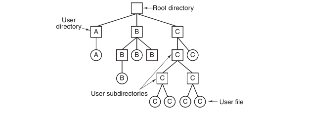
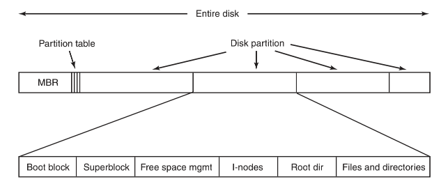
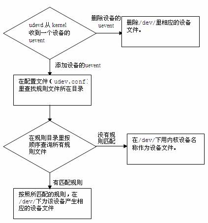
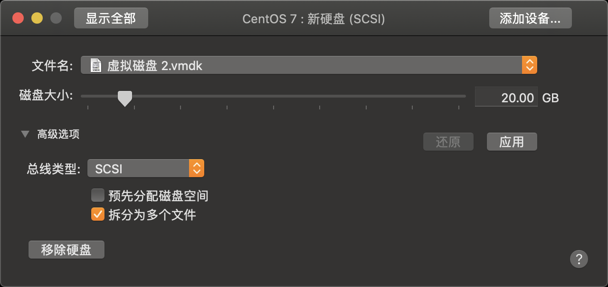

## Linux File Sys

#### All files

`Linux` 中的各种事物比如像文档、目录、键盘、监视器、硬盘、可移动媒体设备、打印机、调制解调器、虚拟终端，还有进程间通信（IPC）和网络通信等输入/输出资源都是定义在文件系统空间下的字节流。一切都可看作是文件，其最显著的好处是对于上面所列出的输入/输出资源，只需要相同的一套 `Linux` 工具、实用程序和 `API`。你可以使用同一套`api(read, write)`和工具(`cat` , 重定向, 管道)来处理 `unix` 中大多数的资源.

为了便于文件的管理，`Linux` 还引入了目录（有时亦被称为文件夹）这一概念。目录使文件可被分类管理，且目录的引入使 `Linux` 的文件系统形成一个层级结构的目录树。



#### Disk

机械硬盘能实现信息存储的功能基于：磁性存储介质能够被磁化，且磁化后会长久保留被磁化的状态，这种被磁化状态能够被读取出来，同时这种磁化状态还能够不断被修改，磁化正好有两个方向，所以可以表示 `0` 和 `1`。硬盘就是把这种磁性存储介质做成一个个盘片，每一个盘片上都分布着数量巨大的磁性存储单位，使用磁性读写头对盘片进行写入和读取。

- 一个硬盘有多张盘片叠成，不同盘片有编号。
- 每张盘片上的存储颗粒成环形一圈圈地排布，每一圈称为磁道，有编号。
- 每条磁道上都有一圈存储颗粒，每`512*8（512字节，0.5KB）`个存储颗粒作为一个扇区，扇区是硬盘上存储的最小物理单位。
- `N` 个扇区可以组成簇，`N` 取决于不同的文件系统或是文件系统的配置，簇是此文件系统中的最小存储单位。
- 所有盘面上的同一磁道构成一个圆柱，称为柱面，柱面是系统分区的最小单位。

磁头读写文件的时候，首先是分区读写的，由 `inode` 编号（区内唯一的编号）找到对应的磁道和扇区，然后一个柱面一个柱面地进行读写。

#### File Sys

`Linux`以文件的形式对计算机中的数据和硬件资源进行管理，也就是彻底的一切皆文件，反映在`Linux`的文件类型上就是：普通文件、目录文件、设备文件、链接文件、管道文件、套接字文件（数据通信的接口）等等。而这些种类繁多的文件被 `Linux` 使用目录树进行管理， 所谓的目录树就是以根目录 `/` 为主，呈现分支状的一种文件结构。不同于纯粹的`ext2`之类的文件系统，我把它称为文件体系，一切皆文件和文件目录树的资源管理方式一起构成了 `Linux` 的文件体系，让 `Linux` 操作系统可以方便使用系统资源。

`Linux` 操作系统支持很多不同的文件系统，比如 `ext2、ext3、XFS、FAT` 等等，而 `Linux` 把对不同文件系统的访问交给了`VFS`（虚拟文件系统），`VFS` 能访问和管理各种不同的文件系统。所以有了区之后就需要把它格式化成具体的文件系统以便 `VFS` 访问。

#### Disk partition

讲分区就不得不先提每块硬盘上最重要的第一扇区，该扇区中有硬盘主引导记录 `(Master boot record, MBR)` 及分区表 `(partition table)` ， 其中 `MBR` 占有 `446 bytes`，而分区表占有 `64 bytes`。硬盘主引导记录放有最基本的引导加载程序，是系统开机启动的关键环节，在附录中有更详细的说明。而分区表则跟分区有关，记录了硬盘分区的相关信息，但因分区表仅有 `64bytes` ， 所以最多只能记彔四块分区（分区本身其实就是对分区表进行设置）。



**拓展扇区**

只能分四个区实在太少了，于是就有了扩展分区的概念，既然第一个扇区所在的分区表只能记录四条数据， 那我可否利用额外的扇区来记录更多的分区信息。扩展分区不同于主分区，它本身并没有内容，它是为进一步逻辑分区提供空间的。在某块分区指定为扩展分区后，就可以对这块扩展分区进一步分成多个逻辑分区。操作系统规定：

- `4` 块分区每块都可以是主分区或扩展分区;
- 扩展分区最多只能有 `1` 个，并且需要占据一个主分区。
- 扩展分区可以进一步分割为多个逻辑分区;
- 扩展分区只是逻辑概念，本身不能被访问，也就是不能被格式化后作为数据访问的分区，能够作为数据访问的分区只有主分区和逻辑分区;
- 逻辑分区的数量依操作系统而不同，在 `Linux` 系统中，IDE 硬盘最多有 `59` 个逻辑分区(`5` 号到 `63` 号)， `SATA` 硬盘则有 `11` 个逻辑分区(`5` 号到 `15` 号)
  一般给硬盘进行分区时，一个主分区一个扩展分区，然后把扩展分区划分为N个逻辑分区是最好的;

特殊的，你最好单独分一个 `swap` 区（内存置换空间），它独为一类，功能是：当有数据被存放在物理内存里面，但是这些数据又不是常被 `CPU` 所取用时，那么这些不常被使用的程序将会被丢到硬盘的 `swap` 置换空间当中， 而将速度较快的物理内存空间释放出来给真正需要的程序使用。

#### Format

`Linux` 操作系统支持很多不同的文件系统，比如 `ext2、ext3、XFS、FAT` 等等，而 `Linux` 把对不同文件系统的访问交给了`VFS`（虚拟文件系统），`VFS` 能访问和管理各种不同的文件系统。所以有了区之后就需要把它格式化成具体的文件系统以便 `VFS` 访问。

标准的 `Linux` 文件系统 `Ext2` 是使用「基于 `inode` 的文件系统」。

在基于 `inode` 的文件系统中，权限与属性放置到 `inode` 中，实际数据放到 `data block` 区块中，而且 `inode` 和 `data block` 都有编号。`Ext2` 文件系统在此基础上文件系统最前面有一个启动扇区 `(boot sector)` 这个启动扇区可以安装开机管理程序， 这个设计让我们能将不同的引导装载程序安装到个别的文件系统前端，而不用覆盖整个硬盘唯一的 `MBR`，也就是这样才能实现多重引导的功能。


为了管理 `inode` 和 `block` 会有单独的 `inode table` 和 `data block` 部分，除了 `inode table` 和 `data block` 外还有 `4` 个附属模块，起到优化和完善系统性能的作用
所以整个分区大概会这样划分：

**inode table**

主要记录文件的属性以及该文件实际数据是放置在哪些 `block` 中，详细内容请见 `文件系统`。`inode` 的数量与大小在格式化时就已经固定了，每个 `inode` 大小均固定为 `128` bytes (新的ext4 与xfs 可设定到256 bytes)。

**data block**

放置文件内容数据的地方，在格式化时 `block` 的大小就固定了，且每个 `block` 都有编号，以方便 `inode` 的记录原则上，`block` 的大小与数量在格式化完就不能够再改变了。

在 `Ext2` 文件系统中所支持的 `block` 大小有 `1K`, `2K` 及 `4K` 三种，由于 `block` 大小的区别，会导致该文件系统能够支持的最大磁盘容量与最大单一文件容量各不相同：

| Block大小 |最大单一档案限制|最大档案系统总容量|
|------|-----|-----|
|1KB|16GB|2TB|
|2KB|256GB|8TB|
|4KB|2TB|16TB|

> 事实上现在的磁盘容量都太大了，所以一般都会选择 `4K` 的 `block` 大小

每个 `block` 内最多只能够放置一个文件的资料，但一个文件可以放在多个 `block` 中（大的话）。

**superblock**

记录整个文件系统相关信息的地方，一般大小为 `1024bytes` ，记录的信息主要有：

- `block` 与 `inode` 的总量；
- 未使用与已使用的 `inode / block` 数量；
- 一个 `valid bit` 数值，若此文件系统已被挂载，则 `valid bit` 为 `0` ，若未被挂载，则 `valid bit` 为 `1`；
- `block` 与 `inode` 的大小 (`block` 为 `1K`, `2K`, `4K`，`inode` 为 `128bytes` 或 `256bytes`)；
- 其他各种文件系统相关信息：`filesystem` 的挂载时间、最近一次写入资料的时间、最近一次检验磁碟 `(fsck)` 的时间；

**Filesystem Description**

文件系统描述，这个区段可以描述每个`block group`的开始与结束的`block`号码，以及说明每个区段`(superblock, bitmap, inodemap, data block)`介于哪一个`block`号码之间.

**block bitmap**

`block bitmap` 用于记录 `block group` 上的 `block` 号码是否为空，它会记录哪些 `block` 是空的，因此我们的系统就能够很快速的找到可使用的空间来存储新的文件信息，同样在你删除某些文件时，那些文件原本占用的 `block` 号码就得要释放出来， 此时在 `block bitmap` 中对应该 `block` 号码的标志位就得要修改成为「未使用中」。

**inode bitmap**

与 `block bitmap` 是类似的功能，只是 `block bitmap` 记录的是使用与未使用的 `block` 号码， 至于 `inode bitmap` 则是记录使用与未使用的 `inode` 号码。

#### Mount

在一个区被格式化为一个文件系统之后，它就可以被 `Linux` 操作系统使用了，只是这个时候 `Linux` 操作系统还找不到它，所以我们还需要把这个文件系统注册进 `Linux` 操作系统的文件体系里，这个操作就叫「挂载 `mount`」。

挂载是利用一个目录当成进入点（类似选一个现成的目录作为代理），将文件系统放置在该目录下，也就是说，进入该目录就可以读取该文件系统的内容，类似整个文件系统只是目录树的一个文件夹（目录），这个进入点的目录我们称为「挂载点」。

由于整个 `Linux` 系统最重要的是根目录，因此根目录一定需要挂载到某个分区。 而其他的目录则可依用户自己的需求来给予挂载到不同的分区。

#### Summary

到这里 `Linux` 的文件体系的构建过程其实已经大体讲完了，总结一下就是：硬盘经过分区和格式化，每个区都成为了一个文件系统，挂载这个文件系统后就可以让 `Linux` 操作系统通过VFS访问硬盘时跟访问一个普通文件夹一样。

## Command

------

### Linux Disk

`Linux` 硬盘分 `IDE` 硬盘和 `SCSI` 硬盘，目前基本上是 `SCSI` 硬盘。

对于 `IDE` 硬盘，驱动器标识符为 `hdx~`,其中 `hd` 表明分区所在设备的类型，这里是指 `IDE` 硬盘了。

`x` 为盘号：

- `a` 为基本盘；
- `b` 为基本从属盘；
- `c` 为辅助主盘；
- `d` 为辅助从属盘；

`~` 代表分区，前四个分区用数字 `1` 到 `4` 表示，它们是主分区或扩展分区，从 `5` 开始就是逻辑分区。

例，`hda3` 表示为第一个 `IDE` 硬盘上的第三个主分区或扩展分区,`hdb2` 表示为第二个 `IDE` 硬盘上的第二个主分区或扩展分区。

对于 `SCSI` 硬盘则标识为 `sdx~`，`SCSI` 硬盘是用 `sd` 来表示分区所在设备的类型的，其余则和 `IDE` 硬盘的表示方法一样。

使用 `lsblk` 可以查看分区状况。

```bash
> lsblk
NAME   MAJ:MIN RM SIZE RO TYPE MOUNTPOINT
vda    253:0    0  40G  0 disk
└─vda1 253:1    0  40G  0 part /
```

### Linux udev

`udev` 是 `Linux 2.6` 内核里的一个功能，它替代了原来的 `devfs`，成为当前 `Linux` 默认的设备管理工具。`udev` 以守护进程的形式运行，通过侦听内核发出来的 `uevent` 来管理 `/dev` 目录下的设备文件。不像之前的设备管理工具，`udev` 在用户空间` (user space)` 运行，而不在内核空间 `(kernel space)` 运行。

下面的流程图显示 `udev` 添加/删除设备文件的过程。



我们都知道，所有的设备在 `Linux` 里都是以设备文件的形式存在。在早期的 `Linux` 版本中，`/dev` 目录包含了所有可能出现的设备的设备文件。很难想象 `Linux` 用户如何在这些大量的设备文件中找到匹配条件的设备文件。现在 `udev` 只为那些连接到 `Linux` 操作系统的设备产生设备文件。并且 `udev` 能通过定义一个 `udev` 规则 `(rule)` 来产生匹配设备属性的设备文件，
这些设备属性可以是内核设备名称、总线路径、厂商名称、型号、序列号或者磁盘大小等等。

**动态管理：**

当设备添加/删除时，`udev` 的守护进程侦听来自内核的 `uevent`，以此添加或者删除 `/dev` 下的设备文件，所以 `udev` 只为已经连接的设备产生设备文件，而不会在 `/dev` 下产生大量虚无的设备文件。

**自定义命名规则：**

通过 `Linux` 默认的规则文件，`udev` 在 `/dev/` 里为所有的设备定义了内核设备名称，比如 `/dev/sda`、`/dev/hda`、`/dev/fd` 等等。

| 模式     | 设备                                                         |
| :------- | :----------------------------------------------------------- |
| /dev/fd* | 软盘驱动器                                                   |
| /dev/hd* | 老系统中的 IDE(PATA)磁盘。典型的主板包含两个 IDE 连接器或者是通道，每个连接器 带有一根缆线，每根缆线上有两个硬盘驱动器连接点。缆线上的第一个驱动器叫做主设备， 第二个叫做从设备。设备名称这样安排，/dev/hdb 是指第一通道上的主设备名；/dev/hdb 是第一通道上的从设备名；/dev/hdc 是第二通道上的主设备名，等等。末尾的数字表示 硬盘驱动器上的分区。例如，/dev/hda1是指系统中第一硬盘驱动器上的第一个分区，而 /dev/hda 则是指整个硬盘驱动器。 |
| /dev/lp* | 打印机                                                       |
| /dev/sd* | SCSI 磁盘。在最近的 Linux 系统中，内核把所有类似于磁盘的设备（包括 PATA/SATA 硬盘， 闪存，和 USB 存储设备，比如说可移动的音乐播放器和数码相机）看作 SCSI 磁盘。 剩下的命名系统类似于上述所描述的旧的/dev/hd*命名方案。 |
| /dev/sr* | 光盘（CD/DVD 读取器和烧写器）                                |

由于 `udev` 是在用户空间 `(user space)` 运行，`Linux` 用户可以通过自定义的规则文件，灵活地产生标识性强的文件名，比如 `/dev/boot_disk、/dev/root_disk、/dev/color_printer` 等等。

**设定设备的权限和所有者/组：**

`udev` 可以按一定的条件来设置设备文件的权限和设备文件所有者/组。

### Add New Disk

下面我们通过一个经典案例 (为 `centos` 虚拟机添加一个新的 `SCSI` 硬盘) 来学习几个硬盘分区和挂载的命令。挂载一个新硬盘基本思路是：创建分区、创建文件系统、挂载。首先我们给虚拟机添加一个虚拟硬盘：



> **注意**：这个过程要先关机。

安装完之后我们可以通过`fdisk -l`查看一下安装磁盘的目录。

```bash
> fdisk -l
# 磁盘 /dev/sdb：42.9 GB, 42949672960 字节，83886080 个扇区

# 磁盘 /dev/sda：42.9 GB, 42949672960 字节，83886080 个扇区
# Units = 扇区 of 1 * 512 = 512 bytes
# 扇区大小(逻辑/物理)：512 字节 / 512 字节
# I/O 大小(最小/最佳)：512 字节 / 512 字节

# 磁盘标识符：0x0008de3e

#       设备  Boot       Start        End       Blocks   Id		System
# /dev/sda1     *        2048    83884031    41940992   83  	Linux
```

#### 创建分区

之后我们要给新添加的磁盘创建分区，注意如果是给已经安装的磁盘创建分区，那么必须先将已经挂载的磁盘分区 `umount`。

```bash
# if mounted
# > sudo umount /dev/sdb1
> sudo fdisk /dev/sdb
```

这里注意我们必须指定设备名称，就整个设备而言，而不是通过分区号。这个程序启动后，我们将看到以下提示：

```bash
Command (m for help):
```

我们想要做的第一件事情是检查已存在的分区布局。输入”p”会打印出这个设备的分区表：

```bash
Command (m for help): p

Disk /dev/sdb: 16 MB, 16006656 bytes
1 heads, 31 sectors/track, 1008 cylinders
Units = cylinders of 31 * 512 = 15872 bytes

Device Boot     Start        End     Blocks   Id        System
```

之后我们就可以新建一个分区，点击 `n`，分区类型默认主分区 `1`，两次回车之后输入 `p` 查看分区结果，并且 `w` 写入。

```bsah
Device Boot     Start        End     Blocks   Id        System
/dev/sdb1           2       1008      15608+   b       w95 FAT32
```

最后使用 `w` 写入：

```bash
The partition table has been altered!
Calling ioctl() to re-read partition table.
WARNING: If you have created or modified any DOS 6.x
partitions, please see the fdisk manual page for additional
information.
Syncing disks.
```

#### 写入文件系统

```bash
> sudo mkfs -t ext4 /dev/sdb1
mke2fs 1.40.2 (12-Jul-2007)
Filesystem label=
OS type: Linux
Block size=1024 (log=0)
Fragment size=1024 (log=0)
3904 inodes, 15608 blocks
...
```

该命令会格式化磁盘并写入文件系统

#### 挂载分区

比如挂载到 `/home` 下面

```bash
mount	/dev/sdb1	/home
```

以上只是临时挂载，还需设置为开机自动挂载，之后执行 `mount -a` 可以立刻生效。

```bash
vim /etc/fstab
# 然后在内容结尾处增加一行（注意文件类型要对应）：
/dev/sdb1    /home    ext4    defaults    0 0
```

#### 查看新挂载点

通过 `df -h` 查看新分区的容量使用以及挂载情况。

```bash
> df -h
文件系统        容量  已用  可用 已用% 挂载点
/dev/sdb1        40G  7.3G   30G   20% /home
```

或者通过 `lsblk` 查看更具体的信息：

```bash
[root@inno ~]# lsblk
NAME   MAJ:MIN RM SIZE RO TYPE MOUNTPOINT
sda    253:0    0  40G  0 disk
└─sda1 253:1    0  40G  0 part /
sdb    253:0    0  40G  0 disk
└─sdb1 253:1    0  40G  0 part /home
```

### 扩容

#### 关于挂载到已有目录

如果你要用来挂载的目录里面并不是空的，那么挂载了文件系统之后，原目录下的东西就会暂时的消失。并不是被覆盖掉，而是暂时的隐藏了起来，等到新分割槽被卸除之后，则原目录原本的内容就会再次出来。

如果要永久挂载已有目录，可以在新硬盘创建文件系统后，先挂载到一个临时目录，然后把要扩展的目录复制到这临时目录，然后删除要扩展的目录，再卸载临时挂载点，重新挂载到要扩展的目录上。举例：

```bash
# 比如要扩充 /var

# 在创建好文件系统后 新建临时挂载点 storage
mkdir /storage

# 将/dev/sdb1挂载到/storage下
mount /dev/sdb1  /storage

# 拷贝/var下的所有内容到新的硬盘
cp -pdr /var /storage
# 或在/var 目录下执行：find . -depth -print | cpio - pldvm /temp
# 删除当前/var目录下的内容
rm -rf /var/*
# 重新挂载硬盘到/var目录
umount /dev/sdb1
mount /dev/sdb1 /var

# 过程中若提示磁盘忙，使用fuser找出将正在使用磁盘的程序并结束掉；
fuser -m -v /var
fuser -m -v -i -k /var
```