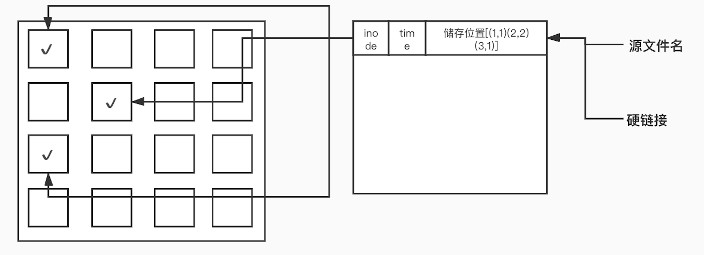
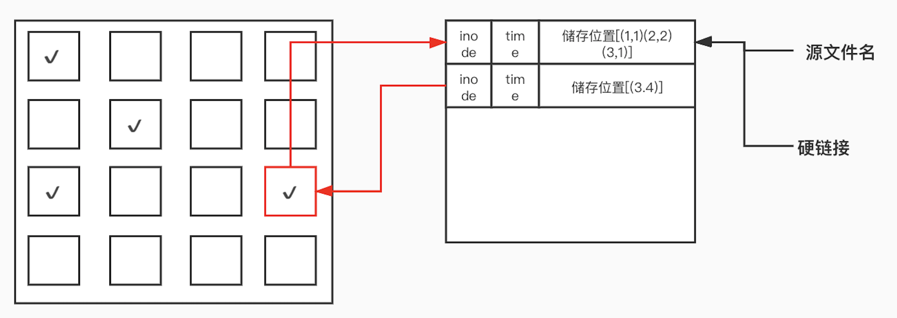

## inode

-----

文件储存在硬盘上，硬盘的最小存储单位叫做扇区 `Sector`。每个扇区储存 `512` 字节（相当于`0.5KB`）。

操作系统读取硬盘的时候，不会一个个扇区地读取，这样效率太低，而是一次性连续读取多个扇区，即一次性读取一个块 `block`。这种由多个扇区组成的"块"，是文件存取的最小单位。"块"的大小，最常见的是`4KB`，即连续八个 `sector` 组成一个 `block`。

文件数据都储存在"块"中，那么很显然，我们还必须找到一个地方储存文件的元信息，比如文件的创建者、文件的创建日期、文件的大小等等。这种储存文件元信息的区域就叫做 `inode`，中文译名为"索引节点"。

每一个文件都有对应的 `inode`，里面包含了与该文件有关的一些信息。

> **注意：** 文件名不存在 `inode` 里，从某种意义上来说文件名是属于文件夹的。

#### inode info

`inode` 包含文件的元信息，具体来说有以下内容：

> - 文件的字节数;
> - 文件拥有者的 `User ID`;
> - 文件的 `Group ID`;
> - 文件的读、写、执行权限;
> - 文件的时间戳，共有三个：`ctime` 指 `inode` 上一次变动的时间，`mtime` 指文件内容上一次变动的时间，`atime`指文件上一次打开的时间;
> - 链接数，即有多少文件名指向这个`inode`;
> - 文件数据 `block` 的位置;

可以用 `stat` 命令，查看某个文件的 `inode` 信息，可以看到什么都有就是没有文件名：

```bash
> stat f
# 文件："f"
# 大小：10240     	块：24         IO 块：4096   普通文件
# 设备：fd01h/64769d	Inode：135537      硬链接：1
# 权限：(0644/-rw-r--r--)  Uid：(    0/    root)   Gid：(    0/    root)
# 最近访问：2020-10-21 14:03:16.207169854 +0800
# 最近更改：2020-10-21 14:03:05.610366064 +0800
# 最近改动：2020-10-21 14:03:05.610366064 +0800
# 创建时间：-
```

#### inode space

`inode` 也会消耗硬盘空间，所以硬盘格式化的时候，操作系统自动将硬盘分成两个区域。一个是数据区，存放文件数据；另一个是`inode`区`（inode table）`，存放 `inode` 所包含的信息。

每个 `inode` 节点的大小，一般是 `128` 字节或 `256` 字节。`inode` 节点的总数，在格式化时就给定，一般是每 `1KB` 或每 `2KB` 就设置一个 `inode`。假定在一块 `1GB` 的硬盘中，每个`inode`节点的大小为 `128` 字节，每 `1KB` 就设置一个 `inode`，那么 `inode table` 的大小就会达到 `128MB`，占整块硬盘的 `12.8%`。

查看每个硬盘分区的inode总数和已经使用的数量，可以使用df命令：

```bash
> df -iH
Filesystem      Size   Used  Avail Capacity iused      ifree %iused  Mounted on
/dev/disk1s1    500G    11G   354G     4%  488417 4881964463    0%   /
devfs           340k   340k     0B   100%    1150          0  100%   /dev
/dev/disk1s2    500G   131G   354G    27% 2501702 4879951178    0%   /System/Volumes/Data
/dev/disk1s5    500G   3.2G   354G     1%       3 4882452877    0%   /private/var/vm
map auto_home     0B     0B     0B   100%       0          0  100%   /System/Volumes/Data/home
/dev/disk1s4    500G   529M   354G     1%      57 4882452823    0%   /Volumes/Recovery
```

#### inode id

每个 `inode` 都有一个号码，`Unix/Linux` 系统内部不使用文件名，而使用 `inode` 号码来识别文件。对于系统来说，文件名只是 `inode` 号码便于识别的别称或者绰号。

表面上，用户在文件夹中通过文件名，打开文件。实际上，系统内部这个过程分成三步：首先，系统找到文件夹中这个文件名对应的 `inode` 号码；其次，通过 `inode` 号码，获取 `inode` 信息；最后，根据 `inode` 信息，找到文件数据所在的 `block`，读出数据。

使用 `ls -i` 命令，可以看到文件名对应的 inode`号码：

```bash
 ls -i
 1013408 Applications                 432859 Postman                    26453743 docker                      1025819 projects
```

#### directory

`Unix/Linux` 系统中，目录`(directory)` 也是一种文件。打开目录，实际上就是打开目录文件。

目录文件的结构非常简单，就是一系列目录项 `dirent` 的列表。每个目录项，由两部分组成：所包含文件的文件名，以及该文件名对应的 `inode` 号码。

> **注意：**为了实现不定长的文件名，文件名和 `inode` 的数据结构可能不是线性的。

## link

-------

`link` 命令用来创建一个指向源文件的链接，链接分为硬链接和符号链接，硬链接就是新建一个 `inode` 指向文件，而符号链接则是新建一个 `inode` 指向当前的 `inode`。

- 格式：`ln 源文件 新文件` (ln:link)
- 参数：`-s` 符号链接

```bash
➜ ln -s /usr/local/redis /Users/inno/redis
➜ ln /usr/local/redis /Users/inno/redish
~
➜ ll
lrwxr-xr-x   1 inno  staff    16B  3  1 10:58 redis -> /usr/local/redis
-rwxr-xr-x   1 inno  staff    16B  3  1 10:58 redish
```

#### 硬链接

创建硬链接的过程其实新建一个 `inode` 节点指向当前的文件，原链接损坏，硬链接仍然可以使用。不过删除文件的时候只有所有的硬链接都删除，文件才真正的删除，在 `inode`中有链接计数项。



**注意：**

- 硬链接不能连链接不同分区的文件。
- 硬链接不能连接目录。
- 有相同的 `inode` 和储存 `block` 快，可以看成是同一文件。

##### 符号链接 (软链接)

软链接实际上是创建了一个新的 `inode` 指向文件的 `inode`，并且标注文件类型为 `l`，这样系统解析的时候就会识别出来这是一个 `LINK` 文件，并且找其对应的 `inode`。



**注意：**

- 源文件坏了软链接不能使用。
- 存的是一条记录 `block` 块，指向链接文件的 `inode`。
- 权限 `lrwxr-xr-x`。


