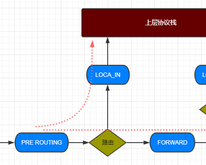

## 网络系统

------

当谈及到网络系统层面，几乎任何东西都能由 `Linux` 来实现。`Linux` 被用来创建各式各样的网络系统和装置， 包括防火墙，路由器，名称服务器，网络连接式存储设备等等。

被用来配置和操作网络系统的命令数目，就如网络系统一样巨大。我们仅仅会关注一些最经常使用到的命令。

- ping - 发送 ICMP ECHO_REQUEST 软件包到网络主机
- traceroute - 打印到一台网络主机的路由数据包
- netstat - 打印网络连接，路由表，接口统计数据，伪装连接，和多路广播成员
- ftp - 因特网文件传输程序
- wget - 非交互式网络下载器
- ssh - OpenSSH SSH 客户端（远程登录程序）

看这些 `Command` 的时候我们先来普及一下计算机网络的基础知识：

#### 内网和外网

姑且认为“外网”指国际互联网，“内网”指不和互联网相连的网络。 简单地讲，内网 `IP` 有 `3` 种：第一种 `10.0.0.0～10.255.255.255`，第二种 `172.16.0.0～172.31.255.255`，第三种 `192.168.0.0～192.168.255.255`。我们通过 `ifconfig` 查看到的其实是路由器分配的内网 `ip`，虽然实际上还是通过公网 `ip` 与互联网互联，但是中间隔了一层 `NAT` 地址转换。

#### IP地址与网络接口

在`Linux`中, 我们可以通过`ifconfig -a`或者`ip addr`看到主机上的所有`网络接口`，它有两种来源，一种是物理网卡的驱动程序创建的，另一种是内核自己或者用户主动创建的虚拟接口。

```bash
> ifconfig -a
eth0: flags=4163<UP,BROADCAST,RUNNING,MULTICAST>  mtu 1500
        inet 172.16.23.65  netmask 255.255.240.0  broadcast 172.16.31.255
        ether 00:16:3e:0a:9b:2f  txqueuelen 1000  (Ethernet)
        RX packets 2271268  bytes 350387402 (334.1 MiB)
        RX errors 0  dropped 0  overruns 0  frame 0
        TX packets 1694416  bytes 432620771 (412.5 MiB)
        TX errors 0  dropped 0 overruns 0  carrier 0  collisions 0

lo: flags=73<UP,LOOPBACK,RUNNING>  mtu 65536
        inet 127.0.0.1  netmask 255.0.0.0
        loop  txqueuelen 1  (Local Loopback)
        RX packets 121  bytes 6838 (6.6 KiB)
        RX errors 0  dropped 0  overruns 0  frame 0
        TX packets 121  bytes 6838 (6.6 KiB)
        TX errors 0  dropped 0 overruns 0  carrier 0  collisions 0
```

`Eth0` 表示 `Linux` 中的一个网卡，`eth0` 是其名称。`Lo`（`loop`，本地回还网卡，其 `ip` 地址一般都是 `127.0.0.1` ）也是一个网卡名称。

我们可以将每个网络接口都视作一条管道，管道的一端连接到本机内核路由子系统，而另一端根据类型各有不同。

另外，从上面的输出内容中还可以注意到的是：网络接口上并不是一定都有`IP`地址(本文提到的IP地址专指IPv4地址)，比如`veth0`和`veth1`后面都没有`IP`地址。

> `IP地址`是网络层的概念，而网卡其实更多的是链路层的概念。

一个简化版的`IP`报文的接收处理流程如下：

```ruby
IF  报文目标MAC == 网卡MAC
    对报文进行路由
    IF 报文目标IP匹配本机路由
        上送本机传输层
    ELSE IF 匹配其他路由
        根据路由进行转发
    END
END
```

在这个过程中，网卡只参加了链路层头部的检查，只要报文通过检查，就会上送给网络层进行路由，至于之后报文去哪，它才不会管。**报文去哪儿完全是路由说了算**！



一般来说就两条路，如果匹配上了`本机路由`，则表示这个报文就是给自己的，那么就根据报文的`protocol`字段，上送给对应协议(比如`TCP` `UDP` `ICMP`)处理；如果匹配上`其他路由`,就表示这个报文只是将本机当作中转站，于是它会根据路由结果找到报文的**出网络接口**，从该网络接口(管道)的另一端发送出去.

## 网络连通性

--------

#### ping

最基本的网络命令是 ping。这个 ping 命令发送一个特殊的网络数据包，叫做 `IMCP ECHO_REQUEST`，到 一台指定的主机。大多数接收这个包的网络设备将会回复它，来允许网络连接验证。

```bash
> ping linuxcommand.org
PING linuxcommand.org (66.35.250.210) 56(84) bytes of data.
64 bytes from vhost.sourceforge.net (66.35.250.210): icmp\_seq=1
ttl=43 time=107 ms
64 bytes from vhost.sourceforge.net (66.35.250.210): icmp\_seq=2
ttl=43 time=108 ms
64 bytes from vhost.sourceforge.net (66.35.250.210): icmp\_seq=3
ttl=43 time=106 ms
64 bytes from vhost.sourceforge.net (66.35.250.210): icmp\_seq=4
ttl=43 time=106 ms
64 bytes from vhost.sourceforge.net (66.35.250.210): icmp\_seq=5
ttl=43 time=105 ms
```

#### traceroute

这个 `traceroute` 程序（一些系统使用相似的 `tracepath` 程序来代替）会显示从本地到指定主机 要经过的所有“跳数”的网络流量列表。例如，看一下到达网站，需要经过的路由器，我们将这样做：

```bash
> traceroute slashdot.org
traceroute to slashdot.org (216.34.181.45), 30 hops max, 40 byte
packets
1 ipcop.localdomain (192.168.1.1) 1.066 ms 1.366 ms 1.720 ms
2 * * *
3 ge-4-13-ur01.rockville.md.bad.comcast.net (68.87.130.9) 14.622
ms 14.885 ms 15.169 ms
4 po-30-ur02.rockville.md.bad.comcast.net (68.87.129.154) 17.634
ms 17.626 ms 17.899 ms
5 po-60-ur03.rockville.md.bad.comcast.net (68.87.129.158) 15.992
ms 15.983 ms 16.256 ms
6 po-30-ar01.howardcounty.md.bad.comcast.net (68.87.136.5) 22.835
```

## 网络配置

------

#### 静态 ip

这里以 `centos` 为例，配置网络需要更改网卡绑定的 `ip`、网关、掩码等等，每一块物理网卡都可以对应一个 `ip` 信息，配置文件的位置为 `/etc/sysconfig/network-scripts` 下的对应网卡配置文件，物理网卡 `1` 即 `ifcfg-eth0`。

```bash
DEVICE=eth0	# 网卡名
HWADDR=B4:2E:99:79:68:E1 # 硬件地址
TYPE=Ethernet # 链路层协议
UUID=9689ba4e-4308-44dd-9209-37e52c05aee7 # UUID
ONBOOT=yes # 启动更新
NM_CONTROLLED=yes
BOOTPROTO=static # 静态ip，可以配置DHCP
DNS1=114.114.114.114 # dns1， 2， 3
IPADDR=10.99.19.208 # ip地址
NETMASK=255.255.255.0 # 掩码
GATEWAY=10.99.19.254 # 网关路由器
```

配置更改完成之后需要重启网络服务：

```bash
service network start
```

## 网络状态

-------

#### netstat

`netstat` 程序被用来检查各种各样的网络设置和统计数据。通过此命令的许多选项，我们可以看看网络设置中的各种特性。使用 `-ie` 选项，我们能够查看系统中的网络接口：

```bash
> netstat -ie
eth0    Link encap:Ethernet HWaddr 00:1d:09:9b:99:67
        inet addr:192.168.1.2 Bcast:192.168.1.255 Mask:255.255.255.0
        inet6 addr: fe80::21d:9ff:fe9b:9967/64 Scope:Link
        UP BROADCAST RUNNING MULTICAST MTU:1500 Metric:1
        RX packets:238488 errors:0 dropped:0 overruns:0 frame:0
        TX packets:403217 errors:0 dropped:0 overruns:0 carrier:0
        collisions:0 txqueuelen:100 RX bytes:153098921 (146.0 MB) TX
        bytes:261035246 (248.9 MB) Memory:fdfc0000-fdfe0000

lo      Link encap:Local Loopback
        inet addr:127.0.0.1 Mask:255.0.0.0
...
```

当执行日常网络诊断时，要查看的重要信息是每个网络接口第四行开头出现的单词 `UP`，说明这个网络接口已经生效，还要查看第二行中 `inet addr` 字段出现的有效 `IP` 地址。对于使用 `DHCP`（动态主机配置协议）的系统，在这个字段中的一个有效 `IP` 地址则证明了 `DHCP` 工作正常。

使用这个 `-r` 选项会显示内核的网络路由表。这展示了系统是如何配置网络之间发送数据包的。

```bahs
> netstat -r
Kernel IP routing table
Destination     Gateway     Genmask         Flags    MSS  Window  irtt Iface

192.168.1.0     *           255.255.255.0   U        0    0          0 eth0
default         192.168.1.1 0.0.0.0         UG       0    0          0 eth0
```

在这个简单的例子里面，我们看到了，位于防火墙之内的局域网中，一台客户端计算机的典型路由表。 第一行显示了目的地 `192.168.1.0`。`IP` 地址以零结尾是指网络，而不是个人主机，所以这个目的地意味着局域网中的任何一台主机。下一个字段，`Gateway`， 是网关（路由器）的名字或 `I`P 地址，用它来连接当前的主机和目的地的网络。 若这个字段显示一个星号，则表明不需要网关。

最后一行包含目的地 `default`。指的是发往任何表上没有列出的目的地网络的流量。 在我们的实例中，我们看到网关被定义为地址 `192.168.1.1` 的路由器，它应该能 知道怎样来处理目的地流量。

#### ifconfig

用于获取网卡相关信息。

```bash
> ifconfig
eth0: flags=4163<UP,BROADCAST,RUNNING,MULTICAST>  mtu 1500
        inet 172.16.23.65  netmask 255.255.240.0  broadcast 172.16.31.255
        ether 00:16:3e:0a:9b:2f  txqueuelen 1000  (Ethernet)
        RX packets 2271268  bytes 350387402 (334.1 MiB)
        RX errors 0  dropped 0  overruns 0  frame 0
        TX packets 1694416  bytes 432620771 (412.5 MiB)
        TX errors 0  dropped 0 overruns 0  carrier 0  collisions 0

lo: flags=73<UP,LOOPBACK,RUNNING>  mtu 65536
        inet 127.0.0.1  netmask 255.0.0.0
        loop  txqueuelen 1  (Local Loopback)
        RX packets 121  bytes 6838 (6.6 KiB)
        RX errors 0  dropped 0  overruns 0  frame 0
        TX packets 121  bytes 6838 (6.6 KiB)
        TX errors 0  dropped 0 overruns 0  carrier 0  collisions 0
```

`Eth0` 表示 `Linux` 中的一个网卡，`eth0` 是其名称。`Lo`（`loop`，本地回还网卡，其 `ip` 地址一般都是 `127.0.0.1` ）也是一个网卡名称。

> **注意：** `inet` 就是网卡的 `ip` 地址，`UP` 表示启用。

## 远程通信

-------

通过网络来远程操控类 `Unix` 的操作系统已经有很多年了。早些年，在因特网普遍推广之前，有 一些受欢迎的程序被用来登录远程主机。它们是 `rlogin` 和 `telnet` 程序。然而这些程序，拥有和 ftp 程序 一样的致命缺点；它们以明码形式来传输所有的交流信息（包括登录命令和密码）。这使它们完全不 适合使用在因特网时代。

#### SSH

为了解决这个问题，开发了一款新的协议，叫做 `SSH（Secure Shell）`。 `SSH` 解决了这两个基本的和远端主机安全交流的问题。首先，它要认证远端主机是否为它所知道的那台主机（这样就阻止了所谓的“中间人”的攻击），其次，它加密了本地与远程主机之间所有的通讯信息。

`SSH` 由两部分组成。`SSH` 服务器运行在远端主机上运行，在端口号 `22` 上监听将要到来的连接，而 `SSH` 客户端用在本地系统中，用来和远端服务器通信。

大多数 `Linux` 发行版自带一个提供 `SSH`功能的软件包，叫做 `OpenSSH`，来自于 `BSD` 项目。一些发行版默认包含客户端和服务器端两个软件包（例如，`Red Hat`）,另一些（比方说 `Ubuntu`）则只是提供客户端服务。为了能让系统接受远端的连接，它必须安装 `OpenSSH-server` 软件包配置运行，并且（如果系统正在运行，或者是在防火墙之后） 它必须允许在 `TCP` 端口号上接收网络连接。

```bash
sudo apt-get install openssh-client 
sudo apt-get install openssh-server
```

但并不是说 `SSH` 就是绝对安全的，因为它本身提供两种级别的验证方法：

**第一种级别（基于口令的安全验证）:** 只要你知道自己帐号和口令，就可以登录到远程主机。所有传输的数据都会被加密，但是不能保证你正在连接的服务器就是你想连接的服务器。可能会有别的服务器在冒充真正的服务器，也就是受到“中间人攻击”这种方式的攻击。

**第二种级别（基于密钥的安全验证）:** 你必须为自己创建一对密钥，并把公钥放在需要访问的服务器上。如果你要连接到 `SSH` 服务器上，客户端软件就会向服务器发出请求，请求用你的密钥进行安全验证。服务器收到请求之后，先在该服务器上你的主目录下寻找你的公钥，然后把它和你发送过来的公钥进行比较。如果两个密钥一致，服务器就用公钥加密“质询”(challenge)并把它发送给客户端软件。客户端软件收到“质询”之后就可以用你的私钥在本地解密再把它发送给服务器完成登录。与第一种级别相比，第二种级别不仅加密所有传输的数据，也不需要在网络上传送口令，因此安全性更高，可以有效防止中间人攻击。

#### 口令登录

口令登录非常简单，只需要一条命令，命令格式为： 

```bash
ssh [-option] use_name@server_ip
```

如果需要**调用图形界面程序**可以使用 **-X 选项**:

```bash
ssh -X use_name@server_ip
```

SSH服务的**默认端口是22**，也就是说，如果你不设置端口的话登录请求会自动送到远程主机的22端口。我们可以使用 **-p 选项来修改端口号**，前提是需要开放端口：

```bash
ssh -p 8888 ldz@192.168.0.1
```

> 第一次登录无法规避中间人攻击，不能确认主机身份，所以会先弹出提示确认。

#### 公钥登录

每次登录远程主机都需要输入密码是很不方便的，如果想要省去这一步骤，可以利用密钥对进行连接，还可以提高安全性。

**在本机生成密钥对**

使用ssh-keygen命令生成密钥对：

```bash
ssh-keygen -t rsa   # -t表示类型选项，这里采用rsa加密算法
```

执行结束以后会在 `/home/当前用户` 目录下生成一个 `.ssh` 文件夹,其中包含 `私钥文件id_rsa` 和 `公钥文件 id_rsa.pub`。

**将公钥复制到远程主机中**

使用 `ssh-copy-id` 命令将公钥复制到远程主机。`ssh-copy-id` 会将公钥写到远程主机的 `~/ .ssh/authorized_key` 文件中

```bash
ssh-copy-id ldz@192.168.0.1
```

## 防火墙

-------

先来看看 `centos6.x` 版本的 `iptables`，可以开放特定的端口，定义出方向和入方向的规则 (入方向指的是请求方向，允许外网访问服务器端口，出方向则是允许访问外网)。


#### Iptables

**开启防火墙**

```bash
service iptables start
```

**关闭防火墙**

```bash
service iptables stop
```

**查看服务状态**

```bash
service iptables status
```

**查看防火墙规则**

查看 `filter` 表的几条链规则(`INPUT` 链可以看出开放了哪些端口)，`-n` 用于 `ip` 地址转化。

```bash
> iptables -L -n
Chain INPUT (policy ACCEPT)
target     prot opt source               destination
ACCEPT     tcp  --  0.0.0.0/0            0.0.0.0/0           tcp dpt:20
ACCEPT     tcp  --  0.0.0.0/0            0.0.0.0/0           tcp dpt:21
ACCEPT     all  --  0.0.0.0/0            0.0.0.0/0           state RELATED,ESTABLISHED
ACCEPT     icmp --  0.0.0.0/0            0.0.0.0/0
ACCEPT     all  --  0.0.0.0/0            0.0.0.0/0
ACCEPT     tcp  --  0.0.0.0/0            0.0.0.0/0           state NEW tcp dpt:22
REJECT     all  --  0.0.0.0/0            0.0.0.0/0           reject-with icmp-host-prohibited

Chain FORWARD (policy ACCEPT)
target     prot opt source               destination
REJECT     all  --  0.0.0.0/0            0.0.0.0/0           reject-with icmp-host-prohibited

Chain OUTPUT (policy ACCEPT)
target     prot opt source               destination
```

`-L` 参数还可以指定请求方向，`--line-numbers` 可以显示规则对应的行号，一般用于删除。

```bash
> iptables -L INPUT --line-numbers -n
Chain INPUT (policy ACCEPT)
num  target     prot opt source               destination
1    ACCEPT     tcp  --  0.0.0.0/0            0.0.0.0/0           tcp dpt:8080
2    ACCEPT     tcp  --  0.0.0.0/0            0.0.0.0/0           tcp dpt:20
3    ACCEPT     tcp  --  0.0.0.0/0            0.0.0.0/0           tcp dpt:21
4    ACCEPT     all  --  0.0.0.0/0            0.0.0.0/0           state RELATED,ESTABLISHED
5    ACCEPT     icmp --  0.0.0.0/0            0.0.0.0/0
6    ACCEPT     all  --  0.0.0.0/0            0.0.0.0/0
7    ACCEPT     tcp  --  0.0.0.0/0            0.0.0.0/0           state NEW tcp dpt:22
8    REJECT     all  --  0.0.0.0/0            0.0.0.0/0           reject-with icmp-host-prohibited
```

查看 `NAT` 表的链规则：

```bash
> iptables -t nat -L -n
Chain PREROUTING (policy ACCEPT)
target     prot opt source               destination

Chain POSTROUTING (policy ACCEPT)
target     prot opt source               destination

Chain OUTPUT (policy ACCEPT)
target     prot opt source               destination
```

**添加规则**

`-I` 表示添加，`INPUT` 指定方向，`-p` 表示传输层协议，`--dport` 表示服务端口。

```bash
> iptables -I INPUT -p tcp --dport 8080 -j ACCEPT
```

**删除规则**

根据行号删除过滤规则（关闭 `8080` 端口），`-D` 表删除，`INPUT` 指定方向，参数是行号。

```bash
iptables -D INPUT 1
```

清除防火墙所有规则：

```bash
iptables -F
iptables -X
iptables -Z
```

## ARP

------

`arp` 命令用于显示和修改 `IP` 到 `MAC` 转换表

#### 补充说明

`Address Resolution Protocol`，地址解析协议，是通过解析网络层地址来找寻数据链路层地址的一个网络协议包中极其重要的网络传输协议。该命令可显示和修改 `arp` 协议解析表中的缓冲数据。

这个核心协议模块实现`RFC826`中定义的 `Address Resolution Protocol` [译注：即`TCP/IP`的第三层到第一层的地址转换协议]，用于在直接相连的网络中换第二层硬件地址和 `Ipv4` 协议地址之间的转换。 用户除非想对其进行配置，否则一般不会直接操作这个模块。

实际上，它提供对核心中其它协议的服务。

用户进程可以使用 `packet(7)` 的 `sockets`，收到 `ARP` 包（译注：一译分组）。 还有一种机制是使用 `netlink(7) sockets`，在用户空间管理 `ARP` 缓存的机制。我们也可以通过 `ioctl (2)` 控制任意 `PF`_`INET socket`上的 `ARP` 表

`ARP` 模块维护一个硬件地址到协议地址映射的缓存。这个缓存有大小限制，所以不常用的和旧的记录（`Entry`）将被垃圾收集器清除（`garbage-collected`），垃圾收集器永远不能删除标为永久的记录。我们可以使用`ioctls`直接操纵缓冲， 并且其性状可以用下面定义的 `sysctl` 调节。

如果在限定的时间（见下面的`sysctl`）内，一条现存映射没有肯定反馈时， 则认为相邻层的缓存记录失效。 为了再次向目标发送数据，`ARP`将首先试着询问本地`arp`进程 `app`_`solicit` 次，获取更新了的 `MAC`（介质访问控制）地址。 如果失败，并且旧的`MAC`地址是已知的，则发送 `ucast`_`solicit` 次的 `unicast probe`。如果仍然失败，则将向网络广播一个新的`ARP`请求,此时要 有待发送数据的队列

如果 `Linux` 接到一个地址请求，而且该地址指向 `Linux` 转发的地址，并且接收接口打开了代理 `arp` 时，`Linux` 将自动添加一条非永久的代理 `arp` 记录；如果存在拒绝到目标的路由，则不添加代理 `arp` 记录。

#### 语法

```shell
arp [-option] [params]
```

#### 选项

```shell
-a # 主机 ：显示 arp 缓冲区的所有条目；
-H # 地址类型 ：指定 arp 指令使用的地址类型；
-d # 主机 ：从 arp 缓冲区中删除指定主机的 arp 条目；
-D # 使用指定接口的硬件地址；
-e # 以 Linux 的显示风格显示 arp 缓冲区中的条目；
-i # 接口 ：指定要操作 arp 缓冲区的网络接口；
-s # 主机 MAC 地址 ：设置指定的主机的 IP 地址与 MAC 地址的静态映射；
-n # 以数字方式显示 arp 缓冲区中的条目；
-v # 显示详细的 arp 缓冲区条目，包括缓冲区条目的统计信息；
-f # 文件 ：设置主机的 IP 地址与 MAC 地址的静态映射。
```

#### 实例

显示 `arp` 缓冲区内容

```shell
[root@localhost ~]# arp -v
Address                  HWtype  HWaddress           Flags Mask            Iface
192.168.0.134            ether   00:21:5E:C7:4D:88   C                     eth1
115.238.144.129          ether   38:22:D6:2F:B2:F1   C                     eth0
Entries: 2      Skipped: 0      Found: 2
```

添加静态 `arp` 映射

```shell
arp -s IP MAC-ADDRESS
arp -s 192.168.1.1 00:b1:b2:b3:b4:b5
```

删除 `arp` 缓存条目

```shell
arp -d 192.168.1.1
```