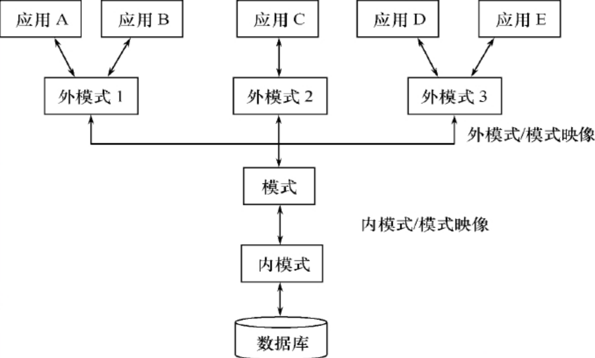

## 数据库的系统结构

### 数据库系统模式的概念

**型和值（type & value）**

- 型 —> 某一表中的所有字段（Type）：对某一类数据的结构和属性的说明。
  - 学生记录：（学号，姓名，性别，系别，年龄，籍贯）
- 值 —> 某一表中的一列（Value）：是型的一个具体赋值。
  - 一个记录值：（201315130，李明，男，计算机系，19，江苏南京）

**模式（Schema）**

1. 数据库逻辑结构和特征的描述。
2. 是型的描述，不涉及具体值。
3. 反映的是数据的结构及其联系。
4. 模式是相对稳定的。

**实例（Instance）**

- 模式的一个具体值
- 反映数据库某一时刻的状态
- 同一个模式可以有很多实例
- 实例随数据库中的数据的更新而变动

#### 数据库系统的三级模式结构

三级模式分别为：模式（Schema），外模式（External Schema），内模式（Internal Schema）。

##### **模式**

模式也称逻辑模式，是数据库中全体数据的逻辑结构和特征的描述，是所有用户的公共数据视图，数据库所有表和他们之间的关系：

- 一个数据库只有一个模式。
- 模式的地位是数据库系统模式结构的中间层。
- 模式与数据的物理存储细节和硬件环境无关。
- 与具体的应用程序、开发工具及高级程序设计语言无关。

模式的定义：

- 数据的逻辑结构（数据项的名字、类型、取值范围等）。
- 数据之间的联系。
- 数据有关的安全性、完整性要求。

##### **外模式**

外模式也称子模式或用户模式，是数据库用户（包括应用程序员和最终用户）使用的局部数据的逻辑结构和特征的描述。数据库用户的数据视图，是与某一应用有关的数据的逻辑表示。

- 外模式的地位：介于模式与应用之间。

- 模式与外模式的关系：一对多
  - 外模式通常是模式的子集。
  - 一个数据库可以有多个外模式。反映了不同的用户的应用需求、看待数据的方式、对数据保密的要求。
  - 对模式中同一数据，在外模式中的结构、类型、长度、保密级别等都可以不同。

- 外模式与应用的关系：一对多
  - 同一外模式也可以为某一用户的多个应用系统所使用。
  - 但一个应用程序只能使用一个外模式。

- 外模式的用途：
  - 保证数据库安全性的一个有力措施。
  - 每个用户只能看见和访问所对应的外模式中的数据。

##### **内模式（Internal Schema）**

内模式（也称存储模式），是数据物理结构和存储方式的描述，是数据在数据库内部的表示方式。

- 记录的存储方式（例如，顺序存储，按照B树结构存储，按hash方法存储等）
- 索引的组织方式
- 数据是否压缩存储
- 数据是否加密
- 数据存储记录结构的规定

一个数据库只有一个内模式

### 数据库的二级映像功能与数据独立性

三级模式是对数据的三个抽象级别，二级映象在数据库管理系统内部实现这三个抽象层次的联系和转换。

- 外模式／模式映像
- 模式／内模式映像

##### **外模式／模式映像**

> **模式：**描述的是数据的全局逻辑结构。
>
> **外模式：**描述的是数据的局部逻辑结构，

同一个模式可以有任意多个外模式，好像外模式指的是所有的表。

- 每一个外模式，数据库系统都有一个外模式／模式映象，定义外模式与模式之间的对应关系。

- 映象定义通常包含在各自外模式的描述中。

**保证数据的逻辑独立性：**

- 当模式改变时，数据库管理员对外模式／模式映象作相应改变，使外模式保持不变

- 应用程序是依据数据的外模式编写的，应用程序不必修改，保证了数据与程序的逻辑独立性，简称数据的逻辑独立性。

##### **模式／内模式映像**

模式／内模式映象定义了数据全局逻辑结构与存储结构之间的对应关系。数据库中模式／内模式映象是唯一的，该映象定义通常包含在模式描述中。

**保证数据的物理独立性：**

- 当数据库的存储结构改变了（例如选用了另一种存储结构），数据库管理员修改模式／内模式映象，使模式保持不变。
- 应用程序不受影响。保证了数据与程序的物理独立性，

### 总结

**数据库模式：**

- 即全局逻辑结构是数据库的中心与关键
- 独立于数据库的其他层次
- 设计数据库模式结构时应首先确定数据库的逻辑模式

**数据库的内模式：**

- 依赖于它的全局逻辑结构
- 独立于数据库的用户视图，即外模式
- 独立于具体的存储设备
- 将全局逻辑结构中所定义的数据结构及其联系按照一定的物理存储策略进行组织，以达到较好的时间与空间效率

**数据库的外模式：**

- 面向具体的应用程序
- 定义在逻辑模式之上
- 独立于存储模式和存储设备
- 当应用需求发生较大变化，相应外模式不能满足其视图要求时，该外模式就得做相应改动
- 设计外模式时应充分考虑到应用的扩充性

数据与程序之间的独立性，使得数据的定义和描述可以从应用程序中分离出去

