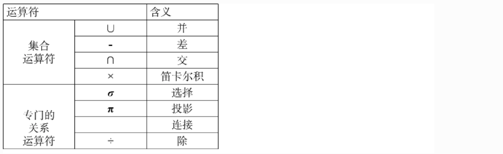
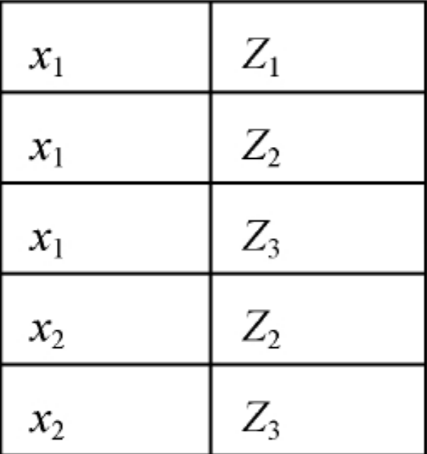

## 概述

**常用的关系操作：**

- 查询操作：选择、投影、连接、除、并、差、交、笛卡尔积
  - 选择、投影、并、差、笛卡尔基是5种基本操作

- 数据更新：插入、删除、修改

**关系操作的特点：**

- 集合操作方式：操作的对象和结果都是集合，一次一集合的方式

## 关系的完整性

#### 实体完整性

实体完整性规则（Entity Integrity）：

若属性A是基本关系R的主属性（主码和候选码），则属性A不能取空值，空值就是“不知道”或“不存在”或“无意义”的值。

#### 参照完整性

**关系间的引用：**

在关系模型中实体及实体间的联系都是用关系来描述的，自然存在着关系与关系间的引用，比如说商品表里引用了商户的id作为关系与关系之间的联系。

###### 外码

 设F是基本关系R的`一个或一组属性`，但不是关系R的码。如果F与基本关系`S`的主码`Ks`相对应，则称`F`是`R`的外码

​	 基本关系`R`称为参照关系（Referencing  Relation）

​	 基本关系`S`称为被参照关系（Referenced Relation）或目标关系（Target Relation）

 关系`R`和`S`不一定是不同的关系

 目标关系`S`的主码`Ks`和参照关系的外码F必须定义在同一个（或一组）域上

 外码并不一定要与相应的主码同名，当外码与相应的主码属于不同关系时，往往取相同的名字，以便于识别

> **Exp-1:**
>
> 学生：（`学 号`，姓名，性别，专业号，年龄）
>
> 课程：（**课 程 号**，课程名，学分）
>
> 选修：（`学 号`，**课 程 号**，成绩）
>
> ：**学号**和**课程号**是**选修关系**的外码。
>
> ：**学生和课程**是**被参照关系**，**选修**是**参照关系**。
>
> **Exp-2:**
>
> 学生（**学号**，姓名，性别，专业号，年龄，**班长**）
>
> | 学号    | 姓名 | 性别 | 专业号 | 年龄   | 班长    |
> | ------- | ---- | ---- | ------ | ------ | ------- |
> | **801** | 张三 | 女   | **01** | **19** | **802** |
> | **802** | 李四 | 男   | **01** | **20** |         |
> | **803** | 王五 | 男   | **01** | **20** | **802** |
> | **804** | 赵六 | 女   | **02** | **20** | **805** |
> | **805** | 钱七 | 男   | **02** | **19** |         |
>
> ：**学号**是**主码**，**班长**是**外码**，它引用了本关系的**学号**
>
> ：**班长**必须是确实存在的学生的学号
>
> ：学生关系既是**参照关系也是被参照关系**

###### 参照完整性规则

若属性F是 基本关系R 的外码，并且它与 基本关系S 的 主码Ks 相对应，则对于R中每个元组在 F 上的值必须为：

- 或者取空值（F的每个属性值均为空值） 

- 或者等于S中某个元组的主码值

###### 用户定义的完整性

 针对某一具体关系数据库的约束条件，反映某一具体应用所涉及的数据必须满足的语义要求。

 关系模型应提供定义和检验这类完整性的机制，以便用统一的系统的方法处理它们，而不需由应用程序承担这一功能。

> 课程（课程号，课程名，学分）
>
>  “课程号”属性必须取唯一值
>
>  非主属性“课程名”也不能取空值
>
>  “学分”属性只能取值{1，2，3，4}

## 关系代数

关系代数是一种抽象的查询语言，它用对关系的运算来表达查询，关系代数的运算对象是关系，运算结果亦为关系。

>**关系代数的运算符有两类：**集合运算符和专门的关系运算符：其中传统的集合运算是从关系的“水平”方向即行的专门的关系运算不仅涉及行而且涉及列。

### 传统的集合运算

接下来的集合运算中我们使用R和S来进行举例。

**R**

| **A**  | **B**  | **C**  |
| ------ | ------ | ------ |
| **a1** | **b1** | **c1** |
| **a1** | **b2** | **c2** |
| **a2** | **b2** | **c1** |

**S**

| A**    | **B**  | **C**  |
| ------ | ------ | ------ |
| **a1** | **b2** | **c2** |
| **a1** | **b3** | **c2** |
| **a2** | **b2** | **c1** |

#### **并（Union）**

对于R和S，具有相同的目n（即两个关系都有n个属性），相应的属性取自同一个域。

**R∪S：**仍为n目关系，由属于R或属于S的元组组成:
$$
R∪S = \{ t~|~t ∈ R ~V~ t ∈S \}
$$

> **RUS**:
>
> | **A**  | **B**  | **C**  |
> | ------ | ------ | ------ |
> | **a1** | **b1** | **c1** |
> | **a1** | **b2** | **c2** |
> | **a2** | **b2** | **c1** |
> | **a1** | **b3** | **c2** |

#### **差（Difference）**

对于R和S，具有相同的目n，相应的属性取自同一个域。

**R - S：**仍为n目关系，由属于R而不属于S的所有元组组成
$$
R -S = \{ t~|~t∈R∧t∉S \}
$$

>**R-S**
>
>| **A**  | **B**  | **C**  |
>| ------ | ------ | ------ |
>| **a1** | **b1** | **c1** |

#### **交（Intersection）**

对于R和S，具有相同的目n（即两个关系都有n个属性），相应的属性取自同一个域。

**R∩S：**仍为n目关系，由既属于R又属于S的元组组成
$$
R∩S = \{ ~t~|~t ∈ R∧t ∈S ~\}= R~ -~(~R-S~)
$$

>**R∩S**
>
>| **A**  | **B**  |  **C** |
>| ------ | ------ | -----: |
>| **a1** | **b2** | **c2** |
>| **a2** | **b2** | **c1** |

#### **笛卡尔积（Cartesian Product）**

严 格 地 讲 应 该 是 广 义 的 笛 卡 尔 积 （ Extended Cartesian Product）

- R: n目关系，k1个元组
- S: m目关系，k2个元组

**R×S**

- 列：（n+m）列元组的集合

  - 元组的前n列是关系R的一个元组
  - 后m列是关系S的一个元组

- 行：k1×k2个元组
  $$
  R×S = \{~tr ~ts ~|~tr ∈R ∧ ts∈S~ \}（t -> turple）
  $$

>**R × S**
>
>| **R.A** | **R.B** | **R.C** | **S.A** | **S.B** | **S.C** |
>| ------- | ------- | ------- | ------- | ------- | ------- |
>| **a1**  | **b1**  | **c1**  | **a1**  | **b2**  | **c2**  |
>| **a1**  | **b1**  | **c1**  | **a1**  | **b3**  | **c2**  |
>| **a1**  | **b1**  | **c1**  | **a2**  | **b2**  | **c1**  |
>| **a1**  | **b2**  | **c2**  | **a1**  | **b2**  | **c2**  |
>| **a1**  | **b2**  | **c2**  | **a1**  | **b3**  | **c2**  |
>| **a1**  | **b2**  | **c2**  | **a2**  | **b2**  | **c1**  |
>| **a2**  | **b2**  | **c1**  | **a1**  | **b2**  | **c2**  |
>| **a2**  | **b2**  | **c1**  | **a1**  | **b3**  | **c2**  |
>| **a2**  | **b2**  | **c1**  | **a2**  | **b2**  | **c1**  |

### 专门的关系运算

设关系模式为`R(A1，A2，…，An)`,先引入几个记号：`R，t∈R，t[Ai]`：

- 它的一个关系设为`R`
- `t∈R`表示t是R的一个元组
- `t[Ai]`则表示元组t中相应于属性Ai的一个分量

以及`A，t[A]，非A`：

- `A`若A={Ai1，Ai2，…，Aik}，其中Ai1，Ai2，…，Aik是A1，A2，…，An中的一部分，则A称为属性列或属性组。
- `t[A]=(t[Ai1]，t[Ai2]，…，t[Aik])`表示元组t在属性列A上诸分量的集合。
- `非A`则表示{A1，A2，…，An}中去掉{Ai1，Ai2，…，Aik}后剩余的属性组。

还有 `tr连接ts`：

- R为n目关系，S为m目关系，tr∈R，ts∈S， tr连接ts称为元组的连接。
- `tr连接ts`是一个n + m列的元组，前n个分量为R中的一个n元组，后m个分量为S中的一个m元组，就是笛卡尔积的一行。

最后`象集Zx`:

- 给定一个关系R（X，Z），X和Z为属性组，当t[X]=x时，x在R中的象集（Images Set）为：

$$
Zx=\{t[Z]~|~t ∈R，t[X]=x\}
$$

- 它表示R中属性组X上值为x的诸元组在Z上分量的集合

> **EXP：**
>
>       x1在R中的象集:Zx1 ={Z1，Z2，Z3}，x2在R中的象集:Zx2 ={Z2，Z3}，

#### **1. 选择（Selection）：**

 选择又称为限制（Restriction），在关系R中选择满足给定条件的诸元组
$$
σF(R) = \{~t~|~t∈R∧F(t)= true~\}
$$
 F：选择条件，是一个逻辑表达式，取值为“真”或“假”

- 基本形式为：`X1θY1`
  - θ表示比较运算符，它可以是`＞，≥，＜，≤，＝或<>`

> **Example**:
>
> 1. σSdept  = 'IS'(Student)  —— 指在 Student 关系中找到 Sdept 属性值为 IS 的学生。
>
>    | **Sno**       | **Sname** | **Ssex** | **Sage** | **Sdept** |
>    | ------------- | --------- | -------- | -------- | --------- |
>    | **201215125** | 张立      | 男       | **19**   | **IS**    |
>
> 2. σSage < 20(Student) —— 指在Student 关系中找到 age 小于 20 的学生。
>
>    | **Sno**       | **Sname** | **Ssex** | **Sage** | **Sdept** |
>    | ------------- | --------- | -------- | -------- | --------- |
>    | **201215122** | 刘晨      | 女       | **19**   | **IS**    |
>    | **201215123** | 王敏      | 女       | **18**   | **MA**    |

#### **2. 投影（Projection）**

 从R中选择出若干属性列组成新的关系
$$
πA(R) = \{ t[A] | t ∈R \}（A：R中的属性列）
$$
 投影之后不仅取消了原关系中的某些列，而且还可能取消某些元组（避免重复行）

> **Example**:
>
> 1. πSname,Sdept(Student)  —— 在 Student 选取所有的 Sname，Sdept
>
>    | **Sname** | **Sdept** |
>    | --------- | --------- |
>    | 李勇      | **CS**    |
>    | 刘晨      | **CS**    |

#### **3. 连接（Join）**

 连接也称为θ连接，通过比较两个笛卡尔积中某个或某几个可比的属性组，返回属性来自两个迪卡集中的几个元组。
$$
R 🔗 S = \{   tr 🔗 ts   | tr ∈ R∧ts∈S∧tr[A]θts[B] \}
$$

- A和B：分别为R和S上度数相等且可比的属性组

- θ：比较运算符

连接运算从R和S的广义笛卡尔积R×S中选取R关系在A属性组上的值与S关系在B属性组上的值满足比较关系θ的元组

##### **两类常用连接运算**

**等值连接（equijoin）**

- θ为“＝”的连接运算称为等值连接
- 从关系R与S的广义笛卡尔积中选取A、B属性值相等的那些元组，即等值连接为：

**自然连接（Natural join）**

自然连接是一种特殊的等值连接：

- 两个关系中进行比较的分量必须是相同的属性组

- 在结果中把重复的属性列去掉

  R和S具有相同的属性组B：

一般的连接操作是从行的角度进行运算。

**悬浮元组（Dangling tuple）**

两个关系R和S在做自然连接时，关系R中某些元组有可能在S中不存在公共属性上值相等的元组，从而造成R中这些元组在操作时被舍弃了，这些被舍弃的元组称为悬浮元组。

**外连接（Outer Join）**

如果把悬浮元组也保存在结果关系中，而在其他属性上填空值(Null)，就叫做外连接

 左外连接(LEFT OUTER JOIN或LEFT JOIN)，只保留左边关系R中的悬浮元组

 右外连接(RIGHT OUTER JOIN或RIGHT JOIN)，只保留右边关系S中的悬浮元组

#### **4. 除运算（Division）**

给定关系R (X，Y) 和S (Y，Z)，其中X，Y，Z为属性组。R中的Y与S中的Y可以有不同的属性名，但必须出自相同的域集。R与S的除运算得到一个新的关系P(X)，P是R中满足下列条件的元组在 X 属性列上的投影：

元组在X上分量值x的象集Yx包含S在Y上投影的集合，记作：
$$
R÷S=\{tr[X]|tr∈R∧πY(S)∈Yx\}(Yx：x在R中的象集，x = tr[X])
$$
 除操作是同时从行和列角度进行运算：

### 小结

引进它们并不增加语言的能力，但可以简化表达。

