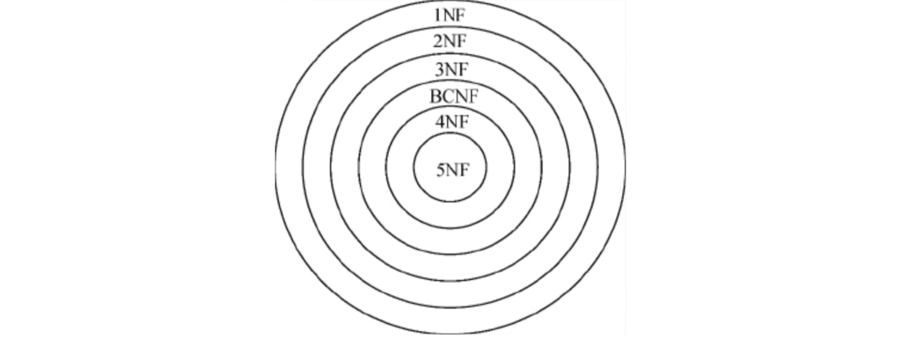
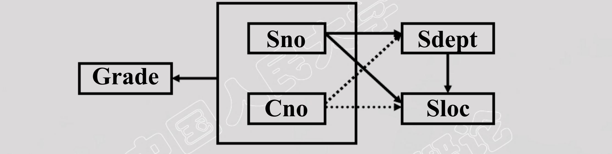
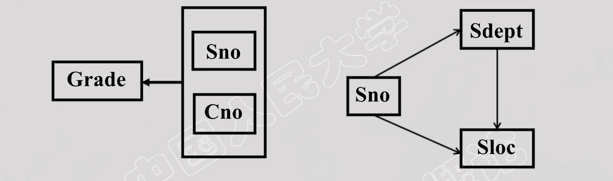
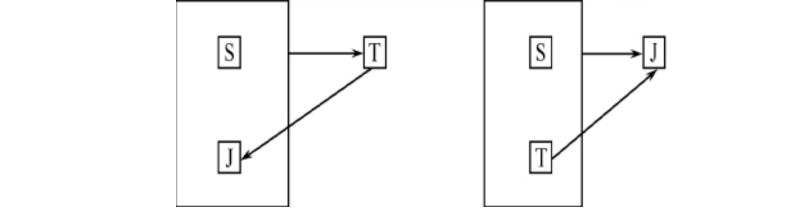

## 函数依赖

#### 函数依赖定义

设R(U)是一个属性集U上的关系模式，X和Y是U的子集。若对于R(U)的任意一个可能的关系r，r 中不可能存在两个元组在X上的属性值相等， 而在Y上的属性值不等， 则称“X函数确定Y”或“Y函数依赖于X”，记作X→Y。

**[例]** Student(Sno, Sname, Ssex, Sage, Sdept)，假设不允许重名，则有:

```c++
Sno → Ssex		Sno → Sdept
Sno → Sage		Sno → Sname
Sname → Ssex	Sname → Sage
Ssex ↛Sage	 	Ssex↛ Sdept
```

若X→Y，并且Y→X, 则记为X←→Y。
若Y不函数依赖于X, 则记为X↛Y。

函数依赖是语义范畴的概念，只能根据数据的语义来确定一个函数依赖。

例如“姓名→年龄”这个函数依赖只有在不允许有同名人的条件下成立

若X→Y，则X称为这个函数依赖的决定因素（Determinant）。

#### 平凡函数依赖和非平凡函数依赖

X→Y，但Y⊈X则称X→Y是非平凡的函数依赖，X→Y，但Y⊆X 则称X→Y是平凡的函数依赖。

> 对于任一关系模式，平凡函数依赖都是必然成立的，它不反映新的语义。若不特别声明， 我们总是讨论非平凡函数依赖。

#### 完全函数依赖与部分函数依赖

完全函数依赖：在R(U)中，如果X→Y，并且对于X的任何一个真子集X’，都有 X’ ↛ Y，则称Y对X完全函数依赖，记作X (F)→ Y。

部分函数依赖：若X→Y，但Y不完全函数依赖于X，则称Y对X部分函数依赖，记作X (P)→ Y

**[例]** 在关系`SC(Sno, Cno, Sdept,sage,Grade)`中，有：

```c++
if (Sno ↛Grade，Cno ↛ Grade) {
	(Sno, Cno) (F)→ Grade;
  (Sno, Cno) (P)→ Sage   Sno → Sage;
	(Sno, Cno) (P)→ Sdept  Sno → Sdept;
}
```

#### 传递函数依赖

在`R(U)`中，如果`X→Y(Y⊈X)，Y↛X，Y→Z，Z⊈Y`, 则称Z对X传递函数依赖`(transitivefunctional dependency)`。记为：`X (tran)→ Z`。

**[例]** 在关系`Std(Sno, Sdept, Mname)`中，有:

```c
Sno → Sdept，Sdept → Mname，
Mname传递函数依赖于Sno
```

> 注: 如果Y→X, 即X←→Y，则Z直接依赖于X，而不是传递函数依赖。

## 码

设`K`为`R<U,F>`中的属性或属性组合。若`K (F)→ U`，则称`K`为`R`的候选码，若关系模式R有多个候选码，则选定其中的一个做为主码`(Primary key)`。

> **全码：**整个属性组是码，称为全码（All-key）

#### 主属性与非主属性

包含在任何一个候选码中的属性 ，称为`主属性（Prime attribute）`

不包含在任何码中的属性称为`非主属性（Nonprimeattribute）`或`非码属性（Non-key attribute）`

**[例]**`S(Sno, Sdept, Sage)`，`SC(Sno, Cno, Grade)`中：

```c
S中单个属性Sno是码，SC中(Sno, Cno)是码。
```

**[例]** `R(P,W,A)`，P：演奏者、W：作品、A：听众：

```c
一个演奏者可以演奏多个作品，某一作品可被多个演奏者演奏，听众可以欣赏不同演奏者的不同作品。
码为(P,W,A)，即All-Key。
```

## 范式

范式是符合某一种级别的关系模式的集合。关系数据库中的关系必须满足一定的要求。满足不同程度要求的为不同范式。

#### **范式的分类**

某一关系模式R为第n范式，可简记为`R∈nNF`，各种范式之间存在联系：`5NF ∈ 4NF ∈ BCNF ∈ 3NF ∈ 2NF ∈ 1NF`。



```sql
-- 第一范式(1NF)
-- 第二范式(2NF)
-- 第三范式(3NF)
-- BC范式(BCNF)
-- 第四范式(4NF)
-- 第五范式(5NF)
```

一个低一级范式的关系模式，通过`模式分解（schema decomposition）`可以转换为若干个高一级范式的关系模式的集合，这种过程就叫`规范化（normalization）`。

#### 2NF

若关系模式`R∈1NF`，并且每一个非主属性，都完全函数依赖于**任何一个候选码**，则`R∈2NF`。

**[例]** `S-L-C(Sno,Sdept,Sloc,Cno,Grade)`，Sloc为学生的住处，并且每个系的学生住在同一个地方。S-L-C的码为(Sno,Cno)，证明此关系模式不属于2NF。

```c
(Sno,Cno)→Grade
Sno→Sdept, (Sno,Cno)→Sdept
Sno→Sloc, (Sno,Cno)→Sloc
Sdept→Sloc
```



非主属性Sdept、Sloc并不完全依赖于码，关系模式S-L-C不属于2NF。

 **不遵循2NF带来的问题     如4一个关系模式不属于2NF，会产生以下问题：

一个关系模式不属于2NF，会产生以下问题：

1.插入异常：

- 如果插入一个新学生，但该生未选课，即该生无Cno，由于插入元组时，必须给定码值，因此插入失败。

2.删除异常：

- 如果S4只选了一门课C3，现在他不再选这门课，则删除C3后，整个元组的其他信息也被删除了。

3.修改复杂：

- 如果一个学生选了多门课，则Sdept，Sloc被存储了多次。如该生转系，则需修改所有相关的Sdept和Sloc，造成修改的复杂。

4.冗余度大

 **解决方案**

用投影分解把关系模式S-L-C分解成两个关系模式：`SC(Sno,Cno,Grade)`，`S-L(Sno,Sdept,Sloc)`，SC的码为(Sno,Cno),SL的码为Sno，这样使得非主属性对码都是完全函数依赖了。



#### 3NF

设关系模式`R<U,F> ∈ 1NF`，若R中不存在这样的码`X`、属性`Y`及非主属性`Z`, 使得`X → Y，Y → Z`成立，`Y ↛ X`不成立，则称`R<U,F> ∈ 3NF`。

> **总结：**SC没有传递依赖，因此SC ∈ 3NF

**[例]** `S-L`中`Sno →Sdept(Sdept ↛ Sno), Sdept→Sloc`，可得`Sno  传 → 递  Sloc`，如何解决。

```C
S-D(Sno,Sdept)∈ 3NF
D-L(Sdept,Sloc)∈ 3NF
```

3NF的`“不彻底”`性表现在可能存在主属性对码的部分依赖和传递依赖。

#### BCNF

BCNF（Boyce Codd Normal Form）由Boyce和Codd提出，比3NF更进了一步。通常认为BCNF是修正的第三范式，有时也称为扩充的第三范式。

**定义：**

设关系模式R<U,F>∈1NF，若X →Y且Y ⊆ X时X必含有码，则R<U,F>∈BCNF。

> **总结：**在关系模式R<U,F>中，如果每一个属性集都包含候选码，则R∈BCNF。

**BCNF的关系模式所具有的性质：**

1.所有非主属性都完全函数依赖于每个候选码。

2.所有主属性都完全函数依赖于每个不包含它的候选码。

3.没有任何属性完全函数依赖于非码的任何一组属性。

**其他判定方式**

主属性不存在部分函数依赖和传递函数依赖。

> **Congratulate：**
>
> 如果一个关系数据库中的所有关系模式都属于BCNF，那么在函数依赖范畴内，它已实现了模式的彻底分解，达到了最高的规范化程度，消除了插入异常和删除异常。

**[例]** 关系模式`S(Sno,Sname,Sdept,Sage)`，是否满足BCNF？

```c
假定Sname也具有唯一性，那么S就有两个码，这两个码都由单个属性组成，彼此不相交。
其他属性不存在对码的传递依赖与部分依赖，所以S∈3NF。
同时S中除Sno，Sname外没有其他决定因素，所以S也属于BCNF。
```

**[例]** 关系模式STJ(S,T,J)中，S表示学生，T表示教师，J表示课程。每一教师只教一门课。每门课有若干教师，某一学生选定某门课，就对应一个固定的教师，是否满足BCNF？



```c
由语义可得到函数依赖：(S,J)→T；(S,T)→J；T→J
这里的 J 存在一个部分函数依赖:
	(S,T) (P)→ J
即主属性存在部分函数依赖，所以不满足BCNF。
```


