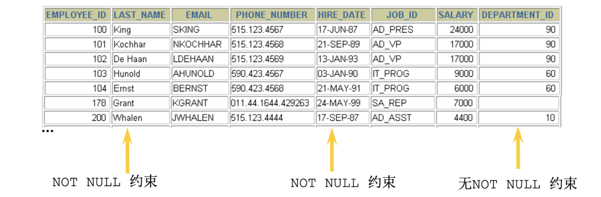
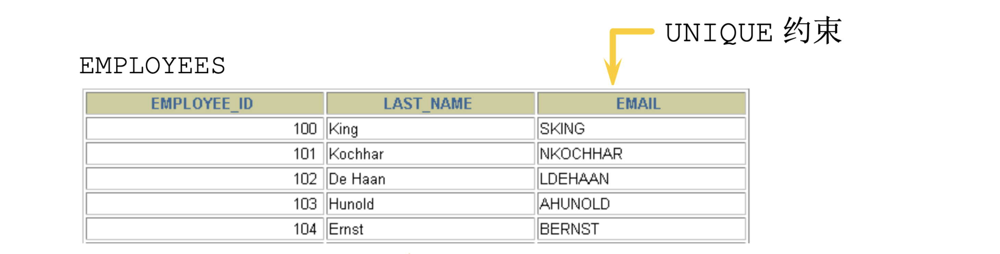
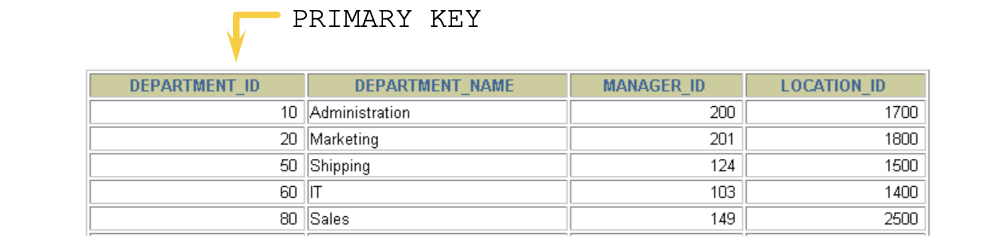

#### 概述

为了保证数据的一致性和完整性，SQL规范以约束的方式对表数据进行额外的条件限制。

- 约束是表级的强制规定

- 可以在创建表时规定约束（通过CREATE  TABLE 语句），或者在表创建之后也可以（通过ALTER TABLE 语句）

有以下六种约束：

- NOT NULL 非空约束，规定某个字段不能为空

- UNIQUE  唯一约束，规定某个字段在整个表中是唯一的
- PRIMARY KEY  主键(非空且唯一)
- FOREIGN KEY  外键
- CHECK  检查约束
- DEFAULT  默认值

> 注意：MySQL不支持check约束，但可以使用check约束，而没有任何效果

#### 列级约束和表级约束

**列级约束：**包含在列定义中，直接跟在该列的其它定义之后 ，用空格分隔；不必指定列名  

**表级约束：**与列定义相互独立，不包含在列定义中；与定义用‘，’分隔；必须指出要约束的列的名称

> **注意：**因为在创建列级约束时，只需将创建列约束的语句添加到该字段（列）的定义子句后面；而在创建表级约束时，需要将创建表级约束的语句添加到各个字段（列）定义语句的后面，因为并不是每个定义的字段都要创建约束，所以必须指明需要创建的约束的列名。

**既可以创建列级约束又可以创建表级约束的：**

 1.主键约束（primary  key  constraint）：

```sql
定义列约束：Primary Key

定义表约束：[Constraint <约束名>] Primary Key( <列名> [{<列名>}])        
```


 2.唯一性约束（unique key constraint）：

    定义列约束：Unique
    
    定义表约束：Constrain <约束名>  Unique  ( <列名> [{<列名>}])        

 **只能创建列级约束的：**

1.缺省约束（default constraint）：

    Default  约束条件


 2.Null 约束：

    [Null | Not Null]

#### NOT NULL 约束

非空约束用于确保当前列的值不为空值，非空约束只能出现在表对象的列上。



> **Null类型特征：**所有的类型的值都可以是null，包括int、float等数据类型空字符串，””不等于null，0也不等于null。

**创建 not null 约束：**

```sql
CREATE TABLE emp(
  id INT(10) NOT NULL,
  NAME VARCHAR(20) NOT NULL DEFAULT 'abc',
  sex CHAR NULL
);
```

**增加 not null 约束:**

```sql
ALTER TABLE emp MODIFY sex VARCHAR(30) NOT NULL;
```

**取消not null 约束：**

```sql
ALTER TABLE emp MODIFY sex VARCHAR(30) NULL;
```

#### UNIQUE 约束

同一个表可以有多个唯一约束，多个列组合的约束。在创建唯一约束的时候，如果不给唯一约束名称，就默认和列名相同。**MySQL会给唯一约束的列上默认创建一个唯一索引。**



> **注意：**唯一约束，允许出现多个空值：NULL

**创建 unique 约束：**

```sql
CREATE TABLE emp(
  id INT(10) NOT NULL UNIQUE,
  NAME VARCHAR(20) NOT NULL DEFAULT 'abc',
  sex CHAR NULL
);
```

表级：

```sql
CREATE TABLE USER(
  id INT NOT NULL,
  NAME VARCHAR(25),
  PASSWORD VARCHAR(16),#使用表级约束语法
  CONSTRAINT uk_name_pwd UNIQUE(NAME,PASSWORD)
);
```

**增加 unique 约束:**

我们可以给这种复合约束起个名字。

```sql
ALTER TABLE USER ADD CONSTRAINT uk_name_pwd UNIQUE(NAME,PASSWORD);
```

**取消 unique 约束：**

```sql
ALTER TABLE USER DROP INDEX uk_name_pwd;
```

#### PRIMARY KEY 约束



- 主键约束相当于唯一约束+非空约束的组合，主键约束列不允许重复，也不允许出现空值
- 如果是多列组合的主键约束，那么这些列都不允许为空值，并且组合的值不允许重复。
- 每个表最多只允许一个主键，建立主键约束可以在列级别创建，也可以在表级别上创建。
- MySQL的主键名总是PRIMARY，当创建主键约束时，系统默认会在所在的列和列组合上建立对应的唯一索引。

**列级约束：**

```sql
CREATE TABLE emp4(
  id INT AUTO_INCREMENT PRIMARY KEY,
  NAME VARCHAR(20)
);
```

**表级约束：**

```sql
CREATE TABLE emp5(
  id INT NOT NULL AUTO_INCREMENT,
  NAME VARCHAR(20),
  pwd VARCHAR(15),
  CONSTRAINT emp5_id_pk PRIMARY KEY(id)
);
```

**组合模式：**

```sql
CREATE TABLE emp6(
  id INT NOT NULL,
  NAME VARCHAR(20),
  pwd VARCHAR(15),
  CONSTRAINT emp7_pk PRIMARY KEY(NAME,pwd)
);
```

**删除主键约束:**

```sql
ALTER TABLE emp5 ADD PRIMARY KEY(NAME,pwd);
```

**添加主键约束:**

```sql
ALTER TABLE emp5 MODIFY id INT PRIMARY KEY;
```

**修改主键约束:**

```sql
ALTER TABLE emp5 MODIFY id INT PRIMARY KEY;
```


