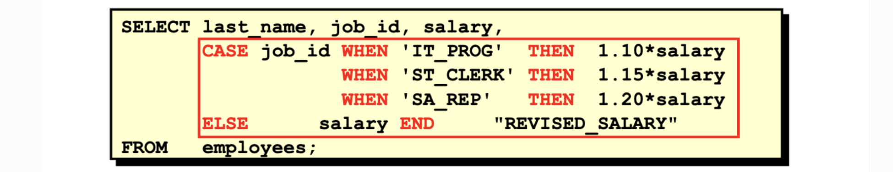

# 字段处理函数

#### 算数计算

mysql 提供基本的算术运算符，**+，-，*，/** ：

```sql
mysql> select e_id+id as two_sum from relation;
+---------+
| two_sum |
+---------+
|       2 |
+---------+
1 row in set (0.01 sec)
```

#### 文本处理函数:

```sql
Upper()		大写
Lower()		小写
Left()		
Right()	
Length()	长度:返回的是字节长。（utf-8默认是一汉字为3，一个英文为1）
Ltrim()		左边空格
Rtrim()		右边空格
trim()		去除左右空格
Concat()	拼接
```

Example:

```sql
select Concat(name1,' (',name2,')') as newTitle from tableName
```

#### 数值处理函数:

```sql
Abs()		绝对值
Cos()		余弦
Exp()		指数值
Mod()		余数
Pi()		返回圆周率
Rand()	随机数
Sin()		正弦值
Sqrt()	平方根
```

#### 字段汇总函数

**AVG** ：平均值

```sql
select AVG(rowname1) as avg_rowname1 from tableName 
```

**COUNT** ：计数

```sql
select COUNT(rowname1) as count_rowname1 from tableName 
```

**SUM**：求和

```sql
select SUM(rowname1) as SUM_rowname1 from tableName 
```

**MAX**：求最大值

```sql
select MAX(rowname1) as max_rowname1 from tableName 
```

**MIN**：求最小值

```sql
select MIN(rowname1) as min_rowname1 from tableName 
```

**DISTINCT**：限制重复字段

```sql
select AVG(DISTINCT rowname1) a dis_avg_rowname1 from tableName 
```

####  字段别名：

查询出来的字段名自动会和函数名拼接，这不是我们想要的结果：

```sql
mysql> select Length(name) from employee where id = 1;
+--------------+
| Length(name) |
+--------------+
|            6 |
+--------------+
1 row in set (0.00 sec)
```

使用 as 可以对字段进行别名处理：

```sql

mysql> select Length(name) as lenName from employee where id = 1;
+---------+
| lenName |
+---------+
|       6 |
+---------+
1 row in set (0.01 sec)
```

#### 条件表达式

在SQL语句中使用IF-THEN-ELSE – CASE 表达。



**语法：**

```sql
CASE expr
 WHEN comparison_expr1 THEN return_expr1
 WHEN comparison_expr2 THEN return_expr2
 WHEN comparison_exprn THEN return_exprn
 ELSE else_expr
END
```

**实例：**

```sql
mysql> select id, uid, role,
    -> case role
    -> when 'visitor' then 'no permission'
    -> when 'leader' then 'all permission'
    -> when 'developer' then 'some permission'
    -> else 'all permission'
    -> end 'permission'
    -> from Kapi_member;
+----+-----+-----------+-----------------+
| id | uid | role      | permission      |
+----+-----+-----------+-----------------+
|  1 |  14 | developer | some permission |
|  2 |  14 | leader    | all permission  |
|  3 |  16 | leader    | all permission  |
|  5 |   1 | leader    | all permission  |
|  7 |  18 | owner     | all permission  |
|  8 |  18 | leader    | all permission  |
|  9 |   1 | visitor   | no permission   |
| 10 |   3 | visitor   | no permission   |
| 11 |  18 | visitor   | no permission   |
| 12 |  18 | visitor   | no permission   |
| 13 | 100 | visitor   | no permission   |
+----+-----+-----------+-----------------+
11 rows in set (0.00 sec)
```