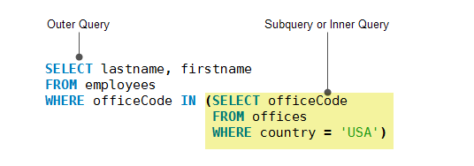

## 子查询

#### 子查询的概念：

就是查询语句里面还有查询语句，另外，MySQL子查询可以嵌套在另一个子查询中，子查询的关键点就是子查询只能查询一个字段！！！



MySQL子查询称为内部查询，而包含子查询的查询称为外部查询。 子查询可以在使用表达式的任何地方使用，并且必须在括号中关闭。

#### 子查询的两种形式

**子查询在查询目标里面：**

子查询在可以作为单独的一列包含在查询目标里面，不过前提是子查询的结果只有必须只能有一列：

```sql
select uid, gid, role, 
(select email from Kapi_user where Kapi_user.id = Kapi_member.uid) 
as email from Kapi_member;
+-----+-----+-----------+-----------------+
| uid | gid | role      | email           |
+-----+-----+-----------+-----------------+
|  14 |   2 | developer | NULL            |
|  14 |   4 | leader    | NULL            |
|  16 |   5 | leader    | inno@admin.com  |
|   1 |   2 | leader    | admin@admin.com |
|  18 |   7 | owner     | email@email.com |
|  18 |   8 | leader    | email@email.com |
+-----+-----+-----------+-----------------+
```

只要子查询的结果只有一列那么对于子查询的的内容没有任何限制：

```sql
select 
*,
(select count(*) from orders where orders.cust_id = customs.cust_id) as orders
from customs order by cust_id DESC
```

> **注意：**要使用别名来标记子查询的字段，不然子查询的整条语句就会作为字段名出现在查询结果里。

**子查询在查询条件里面：**

使用子查询查询出的结果集(同样只能包含一个字段(域)的结果集)，可以作为 in 查询的范围。

```sql
mysql> select 
					id, username, email 
			 from 
			 		Kapi_user 
			 where 
			 		id 
			 in 
			 		(select uid from Kapi_member where gid = 2);
result>:
+----+----------+------------------+
| id | username | email            |
+----+----------+------------------+
|  1 | admin    | admin@admin.com  |
|  3 | inno     | 893930581@qq.com |
| 18 | email    | email@email.com  |
+----+----------+------------------+
```

同时子查询里当然也可以包含子查询:

```sql
select cust_name from customs 
where cust_id IN 
	(select cust_id from orders where order_num IN 
		(select order_num from orderitems where prod_id = "tnt"))
```

> 不过遇到这种情况我们一般使用联结查询。

## 子查询的执行过程

子查询一般分为相关子查询和非相关子查询，了解他们的执行过程对于下面理解小表驱动大表十分的重要。

#### 非相关子查询：

**需求：**查询学生表student中在学生成绩表grade中成绩为70分的学生的基本信息。

```sql
select * from student where id in (select sid from garde where score=70)
```

这个sql语句的执行时是简单的：

1、在grade表中的找出成绩为70的学生学号sid，再将该学号返回到父查询作为where子句的条件。

2、在student表中找到该学号学生的其他基本信息。

#### 相关子查询：

所谓相关子查询，是指求解相关子查询不能像求解普通子查询那样，一次将子查询求解出来，然后求解父查询。相关子查询的内层查询由于与外层查询有关，因此必须反复求值。

**需求：**在学生表student和学生成绩表grade找出参加了“计算机基础”课程并且分数在80分以上的所有学生信息。

```sql
select * from student t where 80 <= (select f.score from grade f where f.id = t.id and f.cname='计算机基础')
```

该子查询的执行流程：

1、 先从父查询的student表中取出第一条记录的id值，进入子查询中，比较其where子句的条件`where f.id=t.id and f.cname=’计算机基础’`，符合则返回score成绩。

2、 返回父查询，判断父查询的where子句条件(80 <= 返回的score),如果条件为true，则返回第1条记录。

3、 从父查询的student表中取出第2条数据，重复上述操作，直到所有父查询中的表中记录取完为止。

**总结：** 

对比这两个查询的sql执行过程可以看出，相关子查询和非相关子查询的不同点在于，相关子查询依赖于父查询，父查询和子查询是有联系的，尤其在子查询的where语句中更是如此。

对于查询顺序来说非相关查询就是外层循环遍历子表，内层循环表里大表。而对于相关子查询来说查询顺序是现在外层循环遍历外表，内层循环遍历子表。

## 小表驱动大表

```java
//假设一个for循环
for($i = 0; $i < 10000; $i++) 
{
     for ($j = 0; $i < 50; $j++)
     {

     }
}

for($i = 0; $i < 50; $i++) 
{
    for ($j = 0; $i < 10000; $j++)
    {

    }
}
```

看以上两个for循环，总共循环的次数是一样的。但是对于mysql数据库而言，并不是这样了，我们尽量选择第二个 for 循环，也就是小表驱动大表。

把这个二层的循环看作是查询和子查询，子查询返回结果集之后，主查询会用子查询的结果集中的每一个结果去对主查询的表进行全表扫描，所以说子查询的结果集数就是外层循环数。数据库最伤神的就是跟程序链接释放，

而上面第一个建立了10000次链接，第二个建立了50次。假设链接了两次，每次做上百万次的数据集查询，查完就走，这样就只做了两次；相反建立了上百万次链接，申请链接释放反复重复，这样系统就受不了了。

> **小表驱动大表：**一般出现在子查询使用 in 的情况中，核心思想即小的数据集驱动大的数据集。

#### 1) in：

**举例：**

对于 in 来说，一个子查询等价于如下的两层循环：

```sql
select * from A where id in (select id from B)
--equal--
for select id from B
		-- 每次从 B 查询出来的结果集取出一个值对 A 进行一次循环来扫描。
		for select * from A where A.id = B.id
```

当B表的数据集必须小于A表的数据集时，用in优于exists。

#### 2) exist：

**语法：**EXISTS

```sql
SELECT ... FROM table WHERE EXISTS (subquery)。
```

**理解：**将主查询的数据放到子查询中做条件验证，根据验证结果(TRUE/FALSE)来决定朱查询的数据结果是否得意保留。相当于从表A和B中取出交集，然后再从A表中取出所在交集的部分数据，当然后面加WHERE条件还可以进一步筛选。

**举例：**

```sqlite
select * from A where exists (select 1 from B where B.id = A.id)
--equal--
for select * from A
		for select t/f from B where B.id = A.id
```

当A表的数据集必须小于B表的数据集时，用exists优于in。

> **注意：**A表和B表的 id 字段应当建立索引。

**补充：**

1：EXISTS(subquery)只返回TRUE或者FALSE，因此子查询中的SELECT * 也可以是SELECT 1或者SELECT 'X'，官方说法是实际执行时会忽略SELECT清单，因此没有区别。

2：EXISTS子查询的实际执行过程可能经过了优化而不是我们理解上的逐条对比，如果担忧效率问题，可进行实际校验。

3：EXISTS子查询往往可以用条件表达式，其他子查询或者JOIN来替代，何种最优需要具体问题具体分析。

#### 其他：

not in 和not exists如果查询语句使用了not in 那么内外表都进行全表扫描，没有用到索引；而not extsts 的子查询依然能用到表上的索引。所以无论那个表大，用not exists都比not in要快。

#### 相关子查询的实践：

对于上面的第二个查询，默认是外层循环遍历父表，我们可以将它改成 in 循环然他外层循环遍历子表。

```sql
select * from student t where 80 <= (select f.score from grade f where f.id = t.id and f.cname='计算机基础')
```

等价于：

```sql
select * from student t where exists (select 1 from grade f where f.id = t.id and f.cname='计算机基础' and f.score >= 80)
```

优化：

```sql
select * from student where id in (select id from grade f where f.cname='计算机基础' )
```

