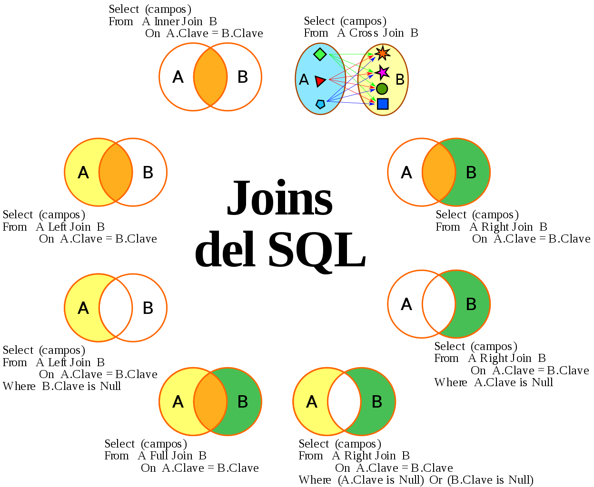
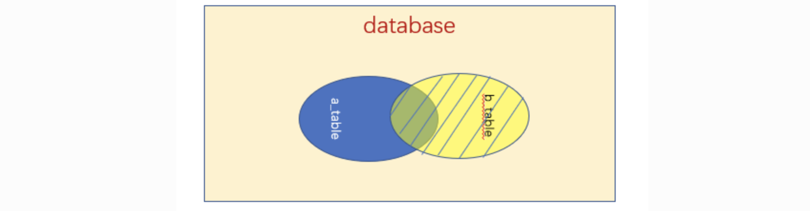

## 引言

连接就是多个表联结成一个小团体，用各有的线索共同去查东西，我们要知道当我们的搜索的内容来自两张表的时候，那么按照sql的机器解释顺序首先会返回一个笛卡尔积，通过join和on来筛选和筛选符合的结果，最后在执行其他子句。



#### 为什么要使用联结？

为了更有效，更方便的储存，达到很大的可伸缩性，我们通常在创建表之前将表一次又一次的细分，那么现在如何是用一条select语句查询出多个表里面的数据呢----联结，联结是一种语法，将多个表中的数据通过关联查询出来。

> **注意**：联结的语法可以是 outer join 也可以是 join。

## 自联结

就是一个表自己和自己联结，一般用来替代子查询。

#### 表别名：

```sql
select cust_name 
from  orders as o,orderitems as oi,customs as c 
where c.cust_id = o.cust_id,
	  	o.order_num = oi.order_num,
	  	oi.prod_id = 'tnt'
```

> 这种好几个联结查询条件合在一起的情况，查询顺序由下到上。

当你发现products表中一个的产品有问题时，你想获取一下该产品供应商的其他产品进行检验时，使用自联结+表别名，可以有效的解决这些问题。

```sql
select prod_id, prod_name 
from 
	products as p1 ,products as p2
where 
		p1.vend_id = p2.vend_id  
and
	  p2.prod_id = "tnt"
```

> 执行顺序：先将第二张表的数据过滤，然后用第二张表中已确定的vend_id去匹配第一张表的所有行。

## 内部联结（等值联结）

组合两个表中的记录，返回关联字段相符的记录，也就是返回两个表的交集（阴影）部分。


```sql
select prod_name,prod_price,vend_name 
	from product,vendors 
	where products.vend_id = vendors.vend_id
```

> **小知识：**
>
> 如果不使用where子句来限定查询条件，查询出的结果就是一个**笛卡尔积**，即第一个表的行数乘以第二表的行数。

**规定推荐的写法：**

这种写法更加的符合逻辑，是sql推荐的写法，同时也会小幅度影响性能。

```sql
select prod_name,prod_price,vend_name 
	from products inner 
	join vendors
	on 	 products.vend_id = vendors.vend_id
```

**多表联结：**

```sql
select cust_name 
from orders, orderitems, customs 
where customs.cust_id = orders.cust_id 
and orders.order_num = orderitems.order_num 
and orderitems.prod_id = 'tnt'
```

> 当我们想用多个表之间的关系来取一个值的时，条件由取值表（customs）到索值表（products）。	

## 外联结（左外联结、右外联结、全外联结）

#### 左外联结：


左(外)连接，左表的记录将会全部表示出来，而右表只会显示符合搜索条件的记录。右表记录不足的地方均为NULL。

```sql
select * from a_table a left join b_table bon a.a_id = b.b_id;
```

**特例：**

查询a表中不满足a.a_id = b.b_id的所有结果：

```sql
mysql> select gid, uid, username, email from Kapi_user left outer join Kapi_member on Kapi_user.id = Kapi_member.uid where Kapi_member.id is null; 
+------+------+-----------+-------------------+
| gid  | uid  | username  | email             |
+------+------+-----------+-------------------+
| NULL | NULL | dickDevil | 3476573831@qq.com |
+------+------+-----------+-------------------+
1 row in set (0.00 sec)
```

#### 右外联结：



right join是right outer join的简写，它的全称是右外连接，是外连接中的一种。与左(外)连接相反，右(外)连接，左表(a_table)只会显示符合搜索条件的记录，而右表(b_table)的记录将会全部表示出来。左表记录不足的地方均为NULL。

```sql
select * from a_table a right outer join b_table b on a.a_id = b.b_id;
```

**特例：**

查询b表中不满足a.a_id = b.b_id的所有结果：

```sql
mysql> select gid, uid, username, email from Kapi_user right outer join Kapi_member on Kapi_user.id = Kapi_member.uid where Kapi_user.id is null; 
+-----+-----+----------+-------+
| gid | uid | username | email |
+-----+-----+----------+-------+
|   2 |  14 | NULL     | NULL  |
|   4 |  14 | NULL     | NULL  |
| 100 | 100 | NULL     | NULL  |
+-----+-----+----------+-------+
3 rows in set (0.00 sec)
```

#### 全外联结（full outer join）

包含两个表的不关联的行，不被mysql支持，但是可以通过union和join实现：

```sql
mysql> select * from Kapi_user left outer join Kapi_member on Kapi_user.id = Kapi_member.uid 
    -> union 
    -> select * from Kapi_user right outer join Kapi_member on Kapi_user.id = Kapi_member.uid;
12 rows in set (0.00 sec)
```

#### 多表联结语法

```sql
SELECT *
FROM test.contract a
RIGHT OUTER JOIN test.customer b ON a.Num = b.Num2
LEFT 	OUTER JOIN test.customer4 d ON b.num2 = d.num4;
```

