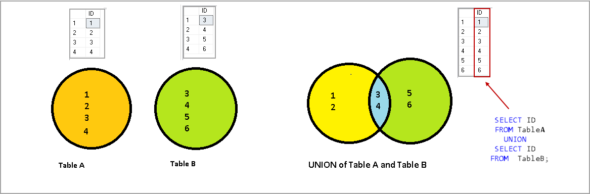
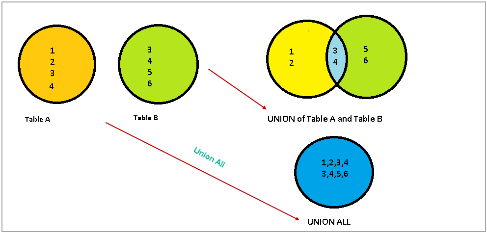

## 前言

当我们查询的结果结构相似的时候就可以使用组合查询：

1. 在单个查询中从不同的表返回结构类似的数据。
2. 对单个表执行多个查询，按单个查询返回数据。

## 应用

#### 对于单个表：

对于一个表的查询结果一般是结构相似的，当我们的查询条件比较复杂的时候使用union代替，效率更高一些：

```sql
select prod_name,prod_id 
from products
where prod_id >= 6 or prod_name = "tnt"
```

使用union代替多条件判断，这里union的执行顺序不是从上到下的，使用explain可以查看mysql的执行计划，同时使用union会产生一个临时表也就是下图的蓝色部分，这会在后面的4-2里详细讨论。



```sql
select prod_name,prod_id
from products
where prod_id >= 6
union
select prod_name,prod_id
from products
where prod_name = "tnt"
```

查询之后，会自动过滤重复数据，当然使用union all可以避免免过滤，同时还可以避免临时表的产生：



```sql
select prod_name,prod_id
from products
where prod_id >= 6
union all
select prod_name,prod_id
from products
where prod_name = "tnt"
```

查询语句中只能在最后进行一次排序，同时如果对union all进行排序会产生临时表，这在后面的4-2中也会被提及。

```sql
select prod_name,prod_id
from products
where prod_id >= 6
union all
select prod_name,prod_id
from products
where prod_name = "tnt"
order by prod_id
```

#### 对于多个表：

要限定查询出来的列名完全一致：

```sql
mysql> select id, add_time from Kapi_user
    -> union all
    -> select id, add_time from Kapi_group
    -> order by add_time;
+----+---------------------+
| id | add_time            |
+----+---------------------+
|  3 | NULL                |
| 15 | NULL                |
| 16 | NULL                |
|  1 | 2020-01-20 16:49:54 |
|  2 | 2020-01-30 02:22:30 |
|  4 | 2020-01-30 02:56:11 |
|  5 | 2020-01-30 03:15:33 |
| 18 | 2020-02-03 09:04:52 |
|  7 | 2020-02-03 09:04:52 |
|  8 | 2020-03-30 23:27:20 |
+----+---------------------+
10 rows in set (0.01 sec)
```

## **优化**

union操作的含义是，取两个子查询结果的并集，重复的数据只保留一行，**通过建立一个带主键的临时表**，就可以解决“去重”问题，通过临时表存储最终的结果集，所以能看到执行计划中Extra这一项里面有“Using temporary”，可以看到下面第三张表就是两个union的临时表。

```sql
mysql> explain select * from Kapi_user union select * from Kapi_user;
+------+--------------+------------+-----------------+
|  id  | select_type  | table      | Extra           |
+------+--------------+------------+-----------------+
|   1  | PRIMARY      | Kapi_user  | NULL            |
|   2  | UNION        | Kapi_user  | NULL            |
| NULL | UNION RESULT | <union1,2> | Using temporary |
+------+--------------+------------+-----------------+
3 rows in set, 1 warning (0.00 sec) 
```

**1).优化**

与`union`相关的一个操作是`union all`，后者也是将两个子查询结果合并，但不解决重复问题。所以对于`union all`，没有“去重”的含义，因此也就不需要临时表了，不过要是对其结果进行排序那么还是会产生临时表。所以我们的策略可以是避免使用`union`组合查询或者是使用`union all`然后在服务器进行逻辑处理。

```sql
mysql> explain select * from Kapi_user union all select * from Kapi_user;
+----+-------------+-----------+-------+
| id | select_type | table     | Extra |
+----+-------------+-----------+-------+
|  1 | PRIMARY     | Kapi_user | NULL  |
|  2 | UNION       | Kapi_user | NULL  |
+----+-------------+-----------+-------+
2 rows in set, 1 warning (0.00 sec)
```

####