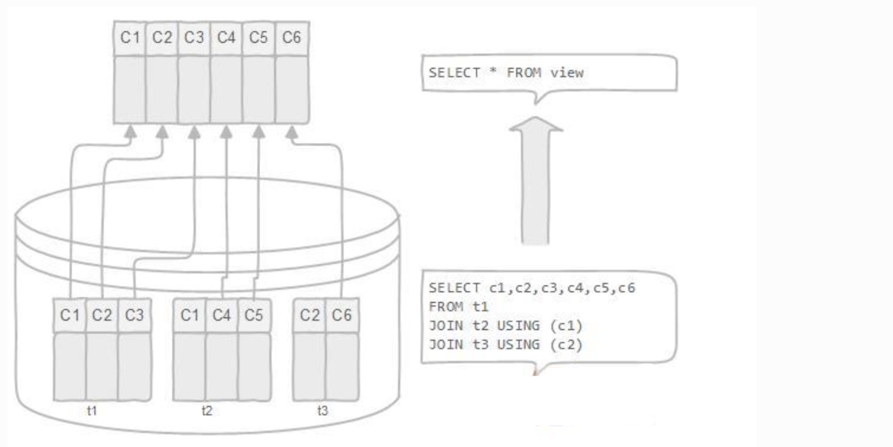

### 简介

MySQL从5.0.1版本开始提供视图功能。一种虚拟存在的表，行和列的数据来自定义视图的查询中使用的表，并且是在使用视图时动态生成的，只保存了sql逻辑，不保存查询结果。

> **应用场景：**多个地方用到**同样的查询结果**，该查询结果**使用的sql语句较复杂**。

```sql
CREATE VIEW my_v1
AS
SELECT studentname,majorname
FROM student s
INNER JOIN major m
ON s.majorid=m.majorid
WHERE s.majorid=1;
```

创建视图，其实是对sql语句的重用，通过保存状态简化复杂的sql操作，不必知道它的查询细节。

### 视图的操作

**创建：**

```sql
create [or replace] view view_name
As select_statement
[with|cascaded|local|check option]
```

**修改：**

```sql
alter view view_name
As select_statement
[with|cascaded|local|check option]
```

**删除：** 用户可以一次删除一个或者多个视图，前提是必须有该视 图的drop权限。

```sql
drop view [if exists] view_name,view_name …[restrict|cascade]
```

**查看：** show tables; 如果需要查询某个视图的定义，可以使用show create view 命令进行查看：

```sql
show create view view_name \G
```

### 视图的特性

**实时性：**

数据库视图是动态的，因为它与物理模式无关。数据库系统将数据库视图存储为具有连接的[SQL SELECT](http://www.yiibai.com/mysql/select-statement-query-data.html)语句。**当表的数据发生变化时，视图也反映了这些数据的变化。**包括对表的插入更新和删除。

```mysql
mysql> update Kapi_user set username = "innnnnnoooooo" where username = "inno";
mysql> select * from Kapi_member_user;
+----+-----+-----+-------+-----------+------------------+---------------+
| id | uid | gid | type  | role      | email            | username      |
+----+-----+-----+-------+-----------+------------------+---------------+
| 10 |   3 |   2 | group | visitor   | 893930581@qq.com | innnnnnoooooo |
+----+-----+-----+-------+-----------+------------------+---------------+
mysql> insert into Kapi_member (uid, gid, role, type) values (18, 2, "visitor", "group");
Query OK, 1 row affected (0.01 sec)
mysql> select * from Kapi_member_user;
+----+-----+-----+-------+-----------+------------------+---------------+
| id | uid | gid | type  | role      | email            | username      |
+----+-----+-----+-------+-----------+------------------+---------------+
| 10 |   3 |   2 | group | visitor   | 893930581@qq.com | innnnnnoooooo |
+----+-----+-----+-------+-----------+------------------+---------------+
10 rows in set (0.00 sec)
```

**可更新性：**

视图的可更新性指的是是否可以对视图进行插入修改或者删除，视图的可更新性和视图中查询的定义有关系，以下类型的视图是不能更新的。

- 包含以下关键字的sql语句：group by 、分组函数、distinct、having、union或者union all 
- 常量视图 
- Select中包含子查询 
- join 
- from一个不能更新的视图 
- where子句的子查询引用了from子句中的表

```mysql
mysql> insert into Kapi_member_user (uid, gid, role, email, username) values (1, 2, "", "");
ERROR 1471 (HY000): The target table Kapi_member_user of the INSERT is not insertable-into

mysql> delete from Kapi_member_user ;
ERROR 1288 (HY000): The target table Kapi_member_user of the DELETE is not updatable
mysql> update Kapi_user set username = "innnnnnoooooo" where username = "inno";
```

### 视图的使用

**创建视图：**

```sql
create VIEW Kapi_member_user  
as 
select Kapi_member.id, uid, gid, type, role, email, username 
from Kapi_member 
left outer join Kapi_user 
on Kapi_member.uid = Kapi_user.id;
```

**使用视图：**

当我们对视图进行查询的时候就将其看作是一张表来编写sql。

```sql
mysql> select * from Kapi_member_user;
+----+-----+-----+-------+-----------+------------------+----------+
| id | uid | gid | type  | role      | email            | username |
+----+-----+-----+-------+-----------+------------------+----------+
|  1 |  14 |   2 |       | developer | NULL             | NULL     |
|  2 |  14 |   4 |       | leader    | NULL             | NULL     |
|  3 |  16 |   5 |       | leader    | inno@admin.com   | admin    |
|  5 |   1 |   2 |       | leader    | admin@admin.com  | admin    |
|  7 |  18 |   7 | group | owner     | email@email.com  | email    |
|  8 |  18 |   8 | group | leader    | email@email.com  | email    |
|  9 |   1 |   2 | group | visitor   | admin@admin.com  | admin    |
| 10 |   3 |   2 | group | visitor   | 893930581@qq.com | inno     |
| 11 |  18 |   2 | group | visitor   | email@email.com  | email    |
+----+-----+-----+-------+-----------+------------------+----------+
```

### 视图的优缺点

**数据库视图的优点**

数据库视图允许简化复杂查询：数据库视图由与许多基础表相关联的SQL语句定义。 您可以使用数据库视图来隐藏最终用户和外部应用程序的基础表的复杂性。 通过数据库视图，您只需使用简单的SQL语句，而不是使用具有多个连接的复杂的SQL语句。

数据库视图有助于限制对特定用户的数据访问。 您可能不希望所有用户都可以查询敏感数据的子集。可以使用数据库视图将非敏感数据仅显示给特定用户组。

数据库视图提供额外的安全层。 安全是任何关系数据库管理系统的重要组成部分。 数据库视图为数据库管理系统提供了额外的安全性。 数据库视图允许您创建只读视图，以将只读数据公开给特定用户。 用户只能以只读视图检索数据，但无法更新。

数据库视图启用计算列。 数据库表不应该具有计算列，但数据库视图可以这样。 假设在`orderDetails`表中有`quantityOrder`(产品的数量)和`priceEach`(产品的价格)列。 但是，`orderDetails`表没有一个列用来存储订单的每个订单项的总销售额。如果有，数据库模式不是一个好的设计。 在这种情况下，您可以创建一个名为`total`的计算列，该列是`quantityOrder`和`priceEach`的乘积，以表示计算结果。当您从数据库视图中查询数据时，计算列的数据将随机计算产生。

数据库视图实现向后兼容。 假设你有一个中央数据库，许多应用程序正在使用它。 有一天，您决定重新设计数据库以适应新的业务需求。删除一些表并创建新的表，并且不希望更改影响其他应用程序。在这种情况下，可以创建与将要删除的旧表相同的模式的数据库视图。

**数据库视图的缺点**

除了上面的优点，使用数据库视图有几个缺点：

1. 性能：从数据库视图查询数据可能会很慢，特别是如果视图是基于其他视图创建的。

2. 表依赖关系：将根据数据库的基础表创建一个视图。每当更改与其相关联的表的结构时，都必须更改视图。

