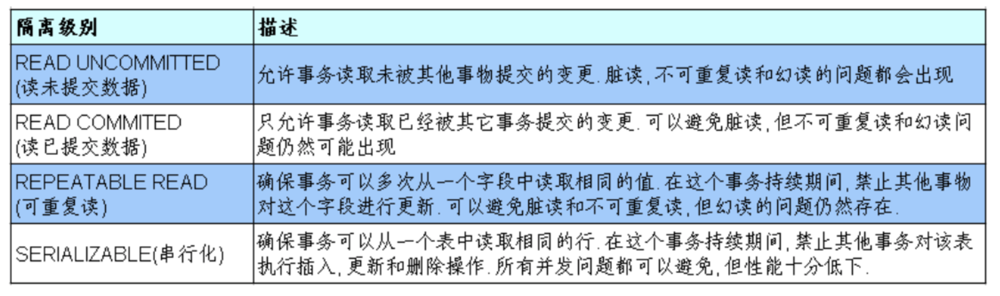

## 简介

事务由单独单元的一个或多个SQL语句组成，在这个单元中，每个MySQL语句是相互依赖的。而整个单独单元作为一个不可分割的整体，如果单元中某条SQL语句一旦执行失败或产生错误，整个单元将会回滚。所有受到影响的数据将返回到事物开始以前的状态；如果单元中的所有SQL语句均执行成功，则事物被顺利执行。

Mysql中有些存储引擎支持事务，有些存储引擎不支持事务，通过`show engines`来查看mysql支持的存储引擎。

在mysql中用的最多的存储引擎有：innodb、myisam、memory 等。其中innodb支持事务，而myisam、memory等不支持事务。

## 为什么要使用事务

事务具有 4 个特性：`原子性(Atomicity)`、`一致性(Consistency)`、`隔离性(Isolation)`和`持续性(Durability)`。这 4 个特性简称为 **ACID** 特性。

#### 1) 原子性

事务必须是原子工作单元，事务中的操作要么全部执行，要么全都不执行，不能只完成部分操作。原子性在数据库系统中，由恢复机制来实现。

#### 2) 一致性

事务开始之前，数据库处于一致性的状态；事务结束后，数据库必须仍处于一致性状态。数据库一致性的定义是由用户负责的。例如，在银行转账中，用户可以定义转账前后两个账户金额之和保持不变。

#### 3) 隔离性

系统必须保证事务不受其他并发执行事务的影响，即当多个事务同时运行时，各事务之间相互隔离，不可互相干扰。事务查看数据时所处的状态，要么是另一个并发事务修改它之前的状态，要么是另一个并发事务修改它之后的状态，事务不会查看中间状态的数据。隔离性通过系统的并发控制机制实现。

#### 4) 持久性

一个已完成的事务对数据所做的任何变动在系统中是永久有效的，即使该事务产生的修改不正确，错误也将一直保持。持久性通过恢复机制实现，发生故障时，可以通过日志等手段恢复数据库信息。

事务的 ACID 原则保证了一个事务或者成功提交，或者失败回滚，二者必居其一。因此，它对事务的修改具有可恢复性。即当事务失败时，它对数据的修改都会恢复到该事务执行前的状态。

## 数据库的隔离级别

对于同时运行的多个事务, 当这些事务访问数据库中相同的数据时, 如果没有采取必要的隔离机制, 就会导致各种并发问题:

1. **脏读:** 对于两个事务`T1, T2`,` T1` 读取了已经被`T2` 更新但还没有被提交的字段. 之后, 若`T2` 回滚,` T1`读取的内容就是临时且无效的.
2. **不可重复读:** 对于两个事务`T1, T2`, `T1` 读取了一个字段, 然后`T2` 更新了该字段. 之后,` T1`再次读取同一个字段, 值就不同了。
3. **幻读:** 对于两个事务`T1, T2`, `T1` 从一个表中读取了一个字段, 然后`T2` 在该表中插入了一些新的行. 之后, 如果`T1`再次读取同一个表, 就会多出几行。

**数据库事务的隔离性:** 数据库系统必须具有隔离并发运行各个事务的能力, 使它们不会相互影响, 避免各种并发问题. 一个事务与其他事务隔离的程度称为隔离级别. 数据库规定了多种事务隔离级别, 不同隔离级别对应不同的干扰程度, 隔离级别越高, 数据一致性就越好, 但并发性越弱.



Mysql 支持 4 种事务隔离级别，Mysql 默认的事务隔离级别为: `REPEATABLE READ`，相当于事务执行期间字段数据锁住。

**设置隔离级别：**

每启动一个mysql 程序, 就会获得一个单独的数据库连接. 每个数据库连接都有一个全局变量`@@tx_isolation`, 表示当前的事务隔离级别。

查看当前的隔离级别: 

```sql
SELECT @@tx_isolation;
```

设置当前mySQL 连接的隔离级别: 

```sql
set transaction isolation level read committed;
```

设置数据库系统的全局的隔离级别:

```sql
set globaltransaction isolation level read committed;
```


## 事务的语法

### 开始事务

事务以 BEGIN TRANSACTION 开始。

**语法格式如下：**

```sql
BEGIN TRANSACTION <事务名称> |@<事务变量名称>
```

**语法说明如下：**

- `@<事务变量名称>`是由用户定义的变量，必须用 char、varchar、nchar 或 nvarchar数据类型来声明该变量。
- `BEGIN TRANSACTION` 语句的执行使全局变量 @@TRANCOUNT 的值加 1。

### 提交事务

COMMIT 表示提交事务，即提交事务的所有操作。具体地说，就是将事务中所有对数据库的更新写回到磁盘上的物理数据库中，事务正常结束。

提交事务，意味着将事务开始以来所执行的所有数据修改成为数据库的永久部分，因此也标志着一个事务的结束。一旦执行了该命令，将不能回滚事务。只有在所有修改都准备好提交给数据库时，才执行这一操作。

**语法格式如下：**

```sql
COMMIT TRANSACTION <事务名称> |@<事务变量名称>
```

**语法说明如下：**

- 其中：`COMMIT TRANSACTION`语句的执行使全局变量 @@TRANCOUNT 的值减 1。

### 撤销事务

ROLLBACK 表示撤销事务，即在事务运行的过程中发生了某种故障，事务不能继续执行，系统将事务中对数据库的所有已完成的操作全部撤销，回滚到事务开始时的状态。这里的操作指对数据库的更新操作。

当事务执行过程中遇到错误时，使用 ROLLBACK TRANSACTION 语句使事务回滚到起点或指定的保持点处。同时，系统将清除自事务起点或到某个保存点所做的所有的数据修改，并且释放由事务控制的资源。因此，这条语句也标志着事务的结束。

**语法格式如下：**

```sql
ROLLBACK [TRANSACTION]
[<事务名称>| @<事务变量名称> | <存储点名称>| @ <含有存储点名称的变量名>
```

**语法说明如下：**

- 当条件回滚只影响事务的一部分时，事务不需要全部撤销已执行的操作。可以让事务回滚到指定位置，此时，需要在事务中设定保存点（SAVEPOINT）。保存点所在位置之前的事务语句不用回滚，即保存点之前的操作被视为有效的。保存点的创建通过“SAVING TRANSACTION<保存点名称>”语句来实现，再执行“ROLLBACK TRANSACTION<保存点名称>”语句回滚到该保存点。
- 若事务回滚到起点，则全局变量 @@TRANCOUNT 的值减 1；若事务回滚到指定的保存点，则全局变量 @@TRANCOUNT 的值不变。

## 事务的使用

在sql中使用事务一般没有什么意义，因为mysql不会因为语句执行失败而回滚，所以事务一般配合语言来进行回滚。

```sql
mysql> use RUNOOB;
Database changed
mysql> CREATE TABLE runoob_transaction_test( id int(5)) engine=innodb;  # 创建数据表
Query OK, 0 rows affected (0.04 sec)
 
mysql> select * from runoob_transaction_test;
Empty set (0.01 sec)
 
mysql> begin;  # 开始事务
Query OK, 0 rows affected (0.00 sec)
 
mysql> insert into runoob_transaction_test value(5);
Query OK, 1 rows affected (0.01 sec)
 
mysql> insert into runoob_transaction_test value(6);
Query OK, 1 rows affected (0.00 sec)
 
mysql> commit; # 提交事务
Query OK, 0 rows affected (0.01 sec)
 
mysql>  select * from runoob_transaction_test;
+------+
| id   |
+------+
| 5    |
| 6    |
+------+
2 rows in set (0.01 sec)
 
mysql> begin;    # 开始事务
Query OK, 0 rows affected (0.00 sec)
 
mysql>  insert into runoob_transaction_test values(7);
Query OK, 1 rows affected (0.00 sec)
 
mysql> rollback;   # 回滚
Query OK, 0 rows affected (0.00 sec)
 
mysql>   select * from runoob_transaction_test;   # 因为回滚所以数据没有插入
+------+
| id   |
+------+
| 5    |
| 6    |
+------+
2 rows in set (0.01 sec)
 
```

**golang实例：**

```go
func (u *UserManager) InsertOne(user *models.User) (uid int64, err error) {
	if err = u.Conn(); err != nil {
		return
	}
	tx, err := u.mysqlCon.Begin()
	if err != nil {
		if tx != nil {
			_ = tx.Rollback()
			return
		}
	}
	sql := fmt.Sprintf("INSERT %v SET username = ?, email = ?, password = ?, pass_salt = ?, ip = ?",u.tableName)
	stxt, err := tx.Prepare(sql)
	if err != nil {
		_ = tx.Rollback()
		return
	}
	result, err := stxt.Exec(user.Username,user.Email,user.Password,user.PassSalt,user.IP)
	if err != nil {
		_ = tx.Rollback()
		return
	}

	uid, err =  result.LastInsertId()

	sql = fmt.Sprintf("INSERT %v SET uid = ?, group_name = ?, group_desc = ?, type = ?","Kapi_group")
	stxt, err = tx.Prepare(sql)
	if err != nil {
		_ = tx.Rollback()
		return
	}
	result, err = stxt.Exec(uid, "user" + strconv.Itoa(int(uid)), "私有个人项目", "private")
	if err != nil {
		_ = tx.Rollback()
		return
	}
	gid, err := result.LastInsertId()
	if err != nil {
		_ = tx.Rollback()
		return
	}

	sql = fmt.Sprintf("INSERT %v SET uid = ?, gid = ?, role = ?, type = ?", "Kapi_member")
	stxt, err = tx.Prepare(sql)
	if err != nil {
		_ = tx.Rollback()
		return
	}
	result, err = stxt.Exec(uid, gid, "owner", "group")
	if err != nil {
		_ = tx.Rollback()
		return
	}
	_, err = result.LastInsertId()
	if err != nil {
		_ = tx.Rollback()
		return
	}
	err = tx.Commit()
	if err != nil {
		_ = tx.Rollback()
	}
	return
}
```

