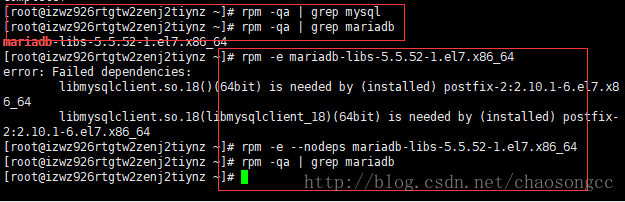
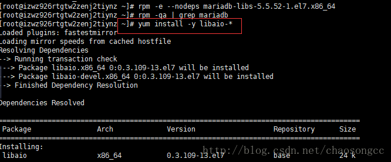
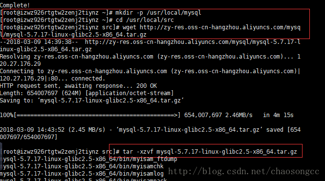
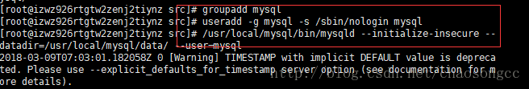
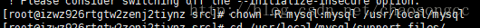
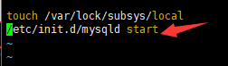
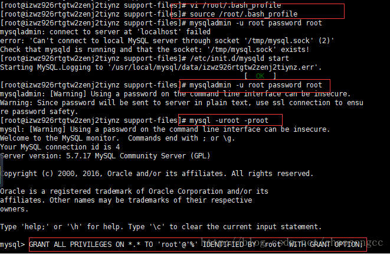

## 启动

> service mysqld start/restart/shut

## linux 下安装数据库

https://blog.csdn.net/chaosongcc/article/details/79498782

### 1.前期准备

**1.1所需软件**

- 登录远程服务器工具：Xshell(http://static.veegn.me/tools/Xshell5.exe)
- 文件传输工具：Xftp(http://static.veegn.me/tools/Xftp5.exe)

**1.2 关闭服务器防火墙**

运行命令关闭防火墙

```bash
1 systemctl stop firewalld.service
```

运行命令关闭防火墙开机自启动

```bash
systemctl disable firewalld.service1
```

**1.3 安装vim 和 unzip**

```bash
yum install -y vim unzip
```

### 2.端口配置

开启 Linux 服务器 的3306端口

### 3.编译安装MySQL

**3.1运行命令检查系统中是否存在MySQL 或者 MariaDB。**

```bash
# 查找
rpm -qa | grep mysql
rpm -qa | grep mariadb
```

如若存在，则执行以下命令删除

```bash
rpm -e 软件名    
#注意：这里的软件名必须包含软件的版本信息，如rpm -e mariadb-libs-5.5.52-1.el7.x86_64。一般使用此命令即可卸载成功。
rpm -e --nodeps 软件名   
#卸载不成功时使用此命令强制卸载
```



**3.2 运行以下命令安装MySQL**

```bash
$ yum install -y libaio-*       #安装依赖
$ mkdir -p /usr/local/mysql     #创建mysql安装目录
$ cd /usr/local/src             #进入软件压缩包管理区域
$ wget http://zy-res.oss-cn-hangzhou.aliyuncs.com/mysql/mysql-5.7.17-linux-glibc2.5-x86_64.tar.gz 
                              #在线下载mysql安装包
$ tar -xzvf mysql-5.7.17-linux-glibc2.5-x86_64.tar.gz
                              #在线解压mysql安装包
$  mv mysql-5.7.17-linux-glibc2.5-x86_64/* /usr/local/mysql/
                              #移动解压文件至mysql目录
```





**3.3 依次运行以下命令建立 MySQL 组和用户，并将用户添加到组中**

```bash
groupadd mysql
useradd -g mysql -s /sbin/nologin mysql
```

运行命令初始化MySQL数据库

```bash
/usr/local/mysql/bin/mysqld --initialize-insecure --datadir=/usr/local/mysql/data/ --user=mysql
```



**3.4更改MySQL安装目录的属性**

```bash
chown -R mysql:mysql /usr/local/mysql
```



**3.5 依次运行以下命令设置开机自启动**

```bash
cd /usr/local/mysql/support-files/
cp mysql.server  /etc/init.d/mysqld
chmod +x /etc/init.d/mysqld             # 添加执行权限
vim /etc/rc.d/rc.local
```

在 rc.local 文件中添加 `/etc/init.d/mysqld start`



**3.6 启动MySQL数据库**

```bash
/etc/init.d/mysqld start
```


**3.7 设置环境变量**

3.7.1:
打开`/root/.bash_profile`，改PATH为`PATH=$PATH:$HOME/bin:/usr/local/mysql/bin:/usr/local/mysql/lib`。

3.7.2
修改 MySQL 的 root 用户密码：初始化后 MySQL 为空密码可直接登录，为了保证安全性需要修改 MySQL 的 root 用户密码。

```bash
mysqladmin -u root password 密码
```

3.7.3
测试登录 MySQL 数据库。

```bash
mysql -uroot -p密码         #-p和密码之间无空格
```

3.7.4
远程数据库授权

```bash
GRANT ALL PRIVILEGES ON *.* TO 'root'@'%' IDENTIFIED BY 'rootroot' WITH GRANT OPTION;
```



## root密码问题

https://cloud.tencent.com/developer/article/1188636

初次安装[mysql](https://cloud.tencent.com/product/cdb?from=10680)，net start mysql,然后输入mysql -u root -p,

出现enter password,我直接点击回车，结果出现如果下错误：

ERROR 1045 (28000): Access denied for user 'root'@'localhost' (using password: NO)。

或者在 my.cnf 配置了密码

提示错误：

ERROR 1045 (28000): Access denied for user 'root'@'localhost' (using password: YES)。

### 解决方案

MySQL安装时默认的用户是root，这里的root是指数据库的用户，root密码一般在初始化MySQL时存放在你的日志文件中，日志文件的存放路径可以通过my.cnf文件进行自定义。

使用如下方法即可解决，本人已验证可行。

#### 1.停止mysql数据库

/etc/init.d/mysqld stop （或者直接 kill -9 [PID]  杀进程！）

#### 2.执行如下命令

mysqld_safe --user=mysql --skip-grant-tables --skip-networking &

#### 3.使用root登录mysql数据库

mysql -u root mysql

#### 4.更新root密码

mysql> UPDATE user SET Password=PASSWORD('newpassword') where USER='root';

#### 最新版MySQL请采用如下SQL：

mysql> UPDATE user SET authentication_string=PASSWORD('newpassword') where USER='root';

#### 5.刷新权限

mysql> FLUSH PRIVILEGES;

#### 6.退出mysql

mysql> quit

#### 7.重启mysql

/etc/init.d/mysqld restart

#### 8.使用root用户重新登录mysql

mysql -uroot -p Enter password: <输入新设的密码newpassword>

```bash
CREATE [UNIQUE|CLUSTERED] INDEX INDEX_NAME ON TABLE_NAME(PROPERTY_NAME)2
```

